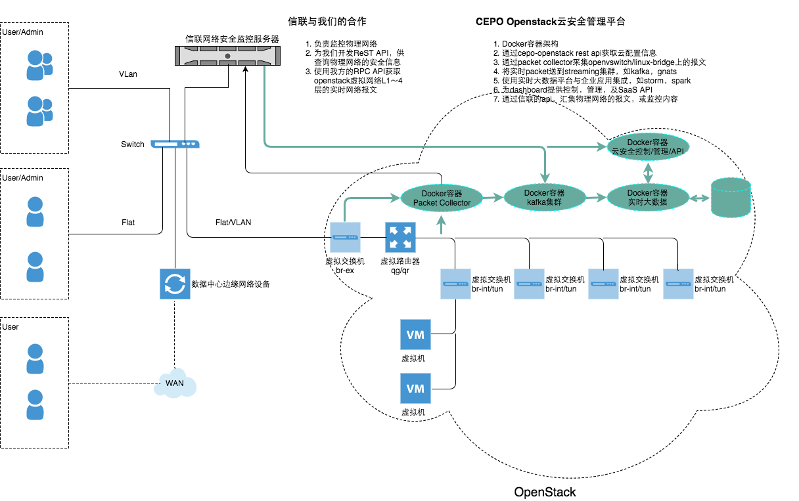

# Architecture of OpenStack Bootcamp

## Table of contents

* OpenAPI
* Technology
* Openstack Provider ReST
* Openstack security management

## OpenAPI

POST /v1/landscape
```
{
  "externs": [
    "string"
  ],
  "interface_info": [
    {
      "id": "string",
      "port_id": "string",
      "subnet_id": "string",
      "tenant_id": "string"
    }
  ],
  "ports": [
    {
      "admin_state_up": true,
      "allowed_address_pairs": [
        {
          "ip_address": "string",
          "mac_address": "string"
        }
      ],
      "device_id": "string",
      "device_owner": "string",
      "fixed_ips": [
        {
          "ip_address": "string",
          "subnet_id": "string"
        }
      ],
      "id": "string",
      "mac_address": "string",
      "name": "string",
      "network_id": "string",
      "security_groups": [
        "string"
      ],
      "status": "string",
      "tenant_id": "string"
    }
  ],
  "state_code": 0,
  "state_message": "string",
  "vnets": [
    {
      "admin_state_up": true,
      "id": "string",
      "name": "string",
      "shared": true,
      "status": "string",
      "subnets": [
        {
          "allocation_pools": [
            {
              "end": "string",
              "start": "string"
            }
          ],
          "cidr": "string",
          "dns_name_servers": [
            "string"
          ],
          "enabledhcp": true,
          "gateway_ip": "string",
          "host_routes": [
            {
              "destination_cidr": "string",
              "next_hop": "string"
            }
          ],
          "id": "string",
          "ipversion": 0,
          "name": "string",
          "network_id": "string",
          "tenant_id": "string"
        }
      ],
      "tenant_id": "string"
    }
  ],
  "vrouter": {
    "admin_state_up": true,
    "distributed": true,
    "gateway_info": {
      "network_id": "string"
    },
    "id": "string",
    "name": "string",
    "routes": [
      {
        "destination_cidr": "string",
        "next_hop": "string"
      }
    ],
    "status": "string",
    "tenant_id": "string"
  }
}
```

## Technology

Core Technology: *Kubernetes* [ThirdPartyResource](http://kubernetes.io/docs/user-guide/thirdpartyresources/)

See also: *CoreOS* [Introducing Operators](https://coreos.com/blog/introducing-operators.html)

Prior Art: 

* Kuberntes Openstack Operators - [sapcc/kubernetes-operators](https://github.com/sapcc/kubernetes-operators)
* CoreOS Etcd Operators - [coros/etcd-operators](https://github.com/sapcc/kubernetes-operators)
* CoreOS Prometheus Operators - [coreos/prometheus-operators](https://github.com/coreos/prometheus-operator)
* kelseyhightower kubernetes certificate manager - [kelseyhightower/kubernetes-certificate-manager](https://github.com/kelseyhightower/kube-cert-manager)

Essential Technology: [gRPC serviing multiplexly for Protobuf and Http1]

* [gRPC](https://github.com/grpc/grpc-go)
* [protobuf](https://github.com/google/protobuf)
* [orotobuf for Go](https://github.com/golang/protobuf)
* [gRPC gateway](https://github.com/grpc-ecosystem/grpc-gateway)

Prior Art:

* [philips/grpc-gateway-example](https://github.com/philips/grpc-gateway-example)
* [soheilhy/cmux](https://github.com/soheilhy/cmux)

Required Technology: [Openstack SDK for Go](https://github.com/gophercloud/gophercloud)

* Identity/keystone
* Image/glance
* Networking/neutron
* Compute/nova

## OpenStack Provider ReST

### Features

**Create and Inspect private network for each project**

Powering up earch new *Project(or Tenant)* to provisioning internal L2 network of privacy

**Create and Inspect OpenStack available to hava a configured shared network after starting**

Powering up each new *Project(or Tenant)* and its joining *users* to provisioning VM in one L2 networking

### Proof of Concepts

**Battlefield** is defined as a shared networking created by admin

**Combatroom** is defined as a Console VM which is created in tenant network for personality 

## OpenStack Security management

Architecture


