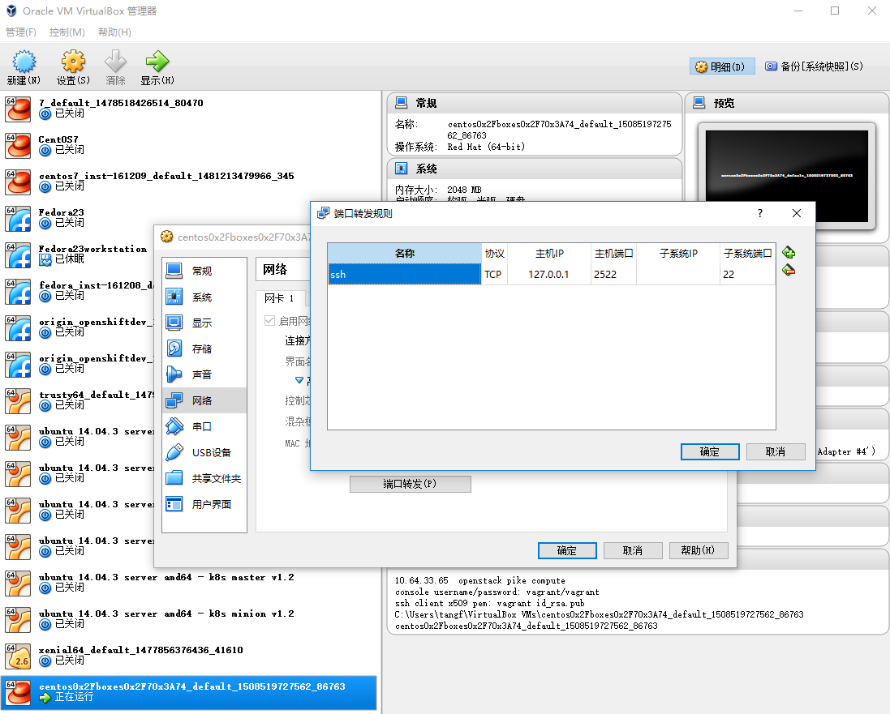

# OpenStack Pike Installation

## Table of content

计算节点
* [网络配置](#network)
* [SSH客户端排错](#ssh-trouble-shooting)
* [防火墙](#firewall)
* [NTP服务](#chrony)
* [Openstack Pike版本YUM仓库](#openstack-Repository)
* [Openstack 命令工具包](#openstack-client)
* [MariaDB数据库](#database)
* [RabbitMQ消息队列](#queue)
* [Memcached缓存](#cache)

## Compute Node

### Network

Note, it is in VirtualBox, the eth0 is served with NAT mode, port forward: HOST:2522 -> BOX:22


Via DNAT
```
tangf@DESKTOP-H68OQDV ~
$ ssh -i vagrant -p 2522 vagrant@127.0.0.1
The authenticity of host '[127.0.0.1]:2522 ([127.0.0.1]:2522)' can't be established.
ECDSA key fingerprint is SHA256:QHu4nikMXWyDoyZ8w9mlyJqjAB5u4JJW0tSnJlbPUYg.
Are you sure you want to continue connecting (yes/no)? yes
Warning: Permanently added '[127.0.0.1]:2522' (ECDSA) to the list of known hosts.
Last login: Sat Oct 21 12:34:03 2017
```

```
tangf@DESKTOP-H68OQDV ~
$ ssh -i vagrant -p 2522 vagrant@127.0.0.1
The authenticity of host '[127.0.0.1]:2522 ([127.0.0.1]:2522)' can't be established.
ECDSA key fingerprint is SHA256:QHu4nikMXWyDoyZ8w9mlyJqjAB5u4JJW0tSnJlbPUYg.
Are you sure you want to continue connecting (yes/no)? yes
Warning: Permanently added '[127.0.0.1]:2522' (ECDSA) to the list of known hosts.
Last login: Sat Oct 21 12:34:03 2017
[vagrant@localhost ~]$ ip a
1: lo: <LOOPBACK,UP,LOWER_UP> mtu 65536 qdisc noqueue state UNKNOWN qlen 1
    link/loopback 00:00:00:00:00:00 brd 00:00:00:00:00:00
    inet 127.0.0.1/8 scope host lo
       valid_lft forever preferred_lft forever
    inet6 ::1/128 scope host 
       valid_lft forever preferred_lft forever
2: eth0: <BROADCAST,MULTICAST,UP,LOWER_UP> mtu 1500 qdisc pfifo_fast state UP qlen 1000
    link/ether 08:00:27:65:31:84 brd ff:ff:ff:ff:ff:ff
    inet 10.0.2.15/24 brd 10.0.2.255 scope global dynamic eth0
       valid_lft 86358sec preferred_lft 86358sec
    inet6 fe80::a00:27ff:fe65:3184/64 scope link 
       valid_lft forever preferred_lft forever
3: eth1: <BROADCAST,MULTICAST,UP,LOWER_UP> mtu 1500 qdisc pfifo_fast state UP qlen 1000
    link/ether 08:00:27:b4:e4:88 brd ff:ff:ff:ff:ff:ff
    inet6 fe80::5be4:b637:b03:2e08/64 scope link 
       valid_lft forever preferred_lft forever
[vagrant@localhost ~]$ cat /etc/centos-release
CentOS Linux release 7.4.1708 (Core) 
```

Before
```
[vagrant@localhost ~]$ ip a
1: lo: <LOOPBACK,UP,LOWER_UP> mtu 65536 qdisc noqueue state UNKNOWN qlen 1
    link/loopback 00:00:00:00:00:00 brd 00:00:00:00:00:00
    inet 127.0.0.1/8 scope host lo
       valid_lft forever preferred_lft forever
    inet6 ::1/128 scope host 
       valid_lft forever preferred_lft forever
2: eth0: <BROADCAST,MULTICAST,UP,LOWER_UP> mtu 1500 qdisc pfifo_fast state UP qlen 1000
    link/ether 08:00:27:65:31:84 brd ff:ff:ff:ff:ff:ff
    inet 10.0.2.15/24 brd 10.0.2.255 scope global dynamic eth0
       valid_lft 86358sec preferred_lft 86358sec
    inet6 fe80::a00:27ff:fe65:3184/64 scope link 
       valid_lft forever preferred_lft forever
3: eth1: <BROADCAST,MULTICAST,UP,LOWER_UP> mtu 1500 qdisc pfifo_fast state UP qlen 1000
    link/ether 08:00:27:b4:e4:88 brd ff:ff:ff:ff:ff:ff
    inet6 fe80::5be4:b637:b03:2e08/64 scope link 
       valid_lft forever preferred_lft forever
```

```
[vagrant@localhost ~]$ ls /etc/sysconfig/network-scripts/ifcfg*
/etc/sysconfig/network-scripts/ifcfg-eth0  /etc/sysconfig/network-scripts/ifcfg-lo
```

Using `nmcli`

```
[vagrant@localhost ~]$ systemctl -l status NetworkManager.service
● NetworkManager.service - Network Manager
   Loaded: loaded (/usr/lib/systemd/system/NetworkManager.service; enabled; vendor preset: enabled)
   Active: active (running) since Sat 2017-10-21 12:47:02 UTC; 41min ago
     Docs: man:NetworkManager(8)
 Main PID: 572 (NetworkManager)
   CGroup: /system.slice/NetworkManager.service
           ├─572 /usr/sbin/NetworkManager --no-daemon
           └─621 /sbin/dhclient -d -q -sf /usr/libexec/nm-dhcp-helper -pf /var/run/dhclient-eth0.pid -lf /var/lib/NetworkManager/dhclient-5fb06bd0-0bb0-7ffb-45f1-d6edd65f3e03-eth0.lease -cf /var/lib/NetworkManager/dhclient-eth0.conf eth0
```

```
[vagrant@localhost ~]$ nmcli d
DEVICE  TYPE      STATE         CONNECTION  
eth0    ethernet  connected     System eth0 
eth1    ethernet  disconnected  --          
lo      loopback  unmanaged     --          
[vagrant@localhost ~]$ nmcli c
NAME                UUID                                  TYPE            DEVICE 
System eth0         5fb06bd0-0bb0-7ffb-45f1-d6edd65f3e03  802-3-ethernet  eth0   
Wired connection 1  0ab4e0ff-f77e-3886-9ba9-1838e4120850  802-3-ethernet  --     
```

```
[vagrant@localhost ~]$ nmcli dev
DEVICE  TYPE      STATE                                  CONNECTION         
eth0    ethernet  connected                              System eth0        
eth1    ethernet  connecting (getting IP configuration)  Wired connection 1 
lo      loopback  unmanaged                              --                 
```

```
NAME                UUID                                  TYPE            DEVICE 
System eth0         5fb06bd0-0bb0-7ffb-45f1-d6edd65f3e03  802-3-ethernet  eth0   
Wired connection 1  0ab4e0ff-f77e-3886-9ba9-1838e4120850  802-3-ethernet  eth1   
```

```
[vagrant@localhost ~]$ sudo nmcli con mod "Wired connection 1" ipv4.method manual ipv4.addr "10.64.33.65/24" ipv4.dns 8.8.4.4
```

```
[vagrant@localhost ~]$ sudo nmcli con mod "Wired connection 1" ipv4.method manual ipv4.addr "10.64.33.65/24" ipv4.dns 8.8.4.4
```

```
[vagrant@localhost ~]$ ip a show eth1
3: eth1: <BROADCAST,MULTICAST,UP,LOWER_UP> mtu 1500 qdisc pfifo_fast state UP qlen 1000
    link/ether 08:00:27:b4:e4:88 brd ff:ff:ff:ff:ff:ff
    inet 10.64.33.65/24 brd 10.64.33.255 scope global eth1
       valid_lft forever preferred_lft forever
    inet6 fe80::5be4:b637:b03:2e08/64 scope link 
       valid_lft forever preferred_lft forever
```

```
[vagrant@localhost ~]$ ping -c3 10.64.33.64
PING 10.64.33.64 (10.64.33.64) 56(84) bytes of data.
64 bytes from 10.64.33.64: icmp_seq=1 ttl=64 time=1.12 ms
64 bytes from 10.64.33.64: icmp_seq=2 ttl=64 time=0.579 ms
64 bytes from 10.64.33.64: icmp_seq=3 ttl=64 time=0.586 ms

--- 10.64.33.64 ping statistics ---
3 packets transmitted, 3 received, 0% packet loss, time 2001ms
rtt min/avg/max/mdev = 0.579/0.762/1.122/0.255 ms
```

```
[vagrant@localhost ~]$ nmcli dev show eth1
GENERAL.DEVICE:                         eth1
GENERAL.TYPE:                           ethernet
GENERAL.HWADDR:                         08:00:27:B4:E4:88
GENERAL.MTU:                            1500
GENERAL.STATE:                          100 (connected)
GENERAL.CONNECTION:                     Wired connection 1
GENERAL.CON-PATH:                       /org/freedesktop/NetworkManager/ActiveConnection/22
WIRED-PROPERTIES.CARRIER:               on
IP4.ADDRESS[1]:                         10.64.33.65/24
IP4.GATEWAY:                            --
IP4.DNS[1]:                             8.8.4.4
IP6.ADDRESS[1]:                         fe80::5be4:b637:b03:2e08/64
IP6.GATEWAY:                            --
```

```
[vagrant@localhost ~]$ nmcli con show "Wired connection 1"
connection.id:                          Wired connection 1
connection.uuid:                        0ab4e0ff-f77e-3886-9ba9-1838e4120850
connection.stable-id:                   --
connection.interface-name:              --
connection.type:                        802-3-ethernet
connection.autoconnect:                 yes
connection.autoconnect-priority:        -999
connection.autoconnect-retries:         -1 (default)
connection.timestamp:                   1508592425
connection.read-only:                   no
connection.permissions:                 --
connection.zone:                        --
connection.master:                      --
connection.slave-type:                  --
connection.autoconnect-slaves:          -1 (default)
connection.secondaries:                 --
connection.gateway-ping-timeout:        0
connection.metered:                     unknown
connection.lldp:                        -1 (default)
802-3-ethernet.port:                    --
802-3-ethernet.speed:                   0
802-3-ethernet.duplex:                  --
802-3-ethernet.auto-negotiate:          no
802-3-ethernet.mac-address:             08:00:27:B4:E4:88
802-3-ethernet.cloned-mac-address:      --
802-3-ethernet.generate-mac-address-mask:--
802-3-ethernet.mac-address-blacklist:   --
802-3-ethernet.mtu:                     auto
802-3-ethernet.s390-subchannels:        --
802-3-ethernet.s390-nettype:            --
802-3-ethernet.s390-options:            --
802-3-ethernet.wake-on-lan:             1 (default)
802-3-ethernet.wake-on-lan-password:    --
ipv4.method:                            manual
ipv4.dns:                               8.8.4.4
ipv4.dns-search:                        --
ipv4.dns-options:                       (default)
ipv4.dns-priority:                      0
ipv4.addresses:                         10.64.33.65/24
ipv4.gateway:                           --
ipv4.routes:                            --
ipv4.route-metric:                      -1
ipv4.ignore-auto-routes:                no
ipv4.ignore-auto-dns:                   no
ipv4.dhcp-client-id:                    --
ipv4.dhcp-timeout:                      0
ipv4.dhcp-send-hostname:                yes
ipv4.dhcp-hostname:                     --
ipv4.dhcp-fqdn:                         --
ipv4.never-default:                     no
ipv4.may-fail:                          yes
ipv4.dad-timeout:                       -1 (default)
ipv6.method:                            auto
ipv6.dns:                               --
ipv6.dns-search:                        --
ipv6.dns-options:                       (default)
ipv6.dns-priority:                      0
ipv6.addresses:                         --
ipv6.gateway:                           --
ipv6.routes:                            --
ipv6.route-metric:                      -1
ipv6.ignore-auto-routes:                no
ipv6.ignore-auto-dns:                   no
ipv6.never-default:                     no
ipv6.may-fail:                          yes
ipv6.ip6-privacy:                       -1 (unknown)
ipv6.addr-gen-mode:                     stable-privacy
ipv6.dhcp-send-hostname:                yes
ipv6.dhcp-hostname:                     --
ipv6.token:                             --
proxy.method:                           none
proxy.browser-only:                     no
proxy.pac-url:                          --
proxy.pac-script:                       --
GENERAL.NAME:                           Wired connection 1
GENERAL.UUID:                           0ab4e0ff-f77e-3886-9ba9-1838e4120850
GENERAL.DEVICES:                        eth1
GENERAL.STATE:                          activated
GENERAL.DEFAULT:                        no
GENERAL.DEFAULT6:                       no
GENERAL.VPN:                            no
GENERAL.ZONE:                           --
GENERAL.DBUS-PATH:                      /org/freedesktop/NetworkManager/ActiveConnection/22
GENERAL.CON-PATH:                       /org/freedesktop/NetworkManager/Settings/2
GENERAL.SPEC-OBJECT:                    --
GENERAL.MASTER-PATH:                    --
IP4.ADDRESS[1]:                         10.64.33.65/24
IP4.GATEWAY:                            --
IP4.DNS[1]:                             8.8.4.4
IP6.ADDRESS[1]:                         fe80::5be4:b637:b03:2e08/64
IP6.GATEWAY:                            --
```

```
[vagrant@localhost ~]$ cat /etc/sysconfig/network-scripts/ifcfg-Wired_connection_1 
HWADDR=08:00:27:B4:E4:88
TYPE=Ethernet
PROXY_METHOD=none
BROWSER_ONLY=no
BOOTPROTO=none
IPADDR=10.64.33.65
PREFIX=24
DNS1=8.8.4.4
DEFROUTE=yes
IPV4_FAILURE_FATAL=no
IPV6INIT=yes
IPV6_AUTOCONF=yes
IPV6_DEFROUTE=yes
IPV6_FAILURE_FATAL=no
IPV6_ADDR_GEN_MODE=stable-privacy
NAME="Wired connection 1"
UUID=0ab4e0ff-f77e-3886-9ba9-1838e4120850
ONBOOT=yes
AUTOCONNECT_PRIORITY=-999
```

X509 pub
```
[vagrant@localhost ~]$ cat .ssh/authorized_keys 
ssh-rsa AAAAB3NzaC1yc2EAAAABIwAAAQEA6NF8iallvQVp22WDkTkyrtvp9eWW6A8YVr+kz4TjGYe7gHzIw+niNltGEFHzD8+v1I2YJ6oXevct1YeS0o9HZyN1Q9qgCgzUFtdOKLv6IedplqoPkcmF0aYet2PkEDo3MlTBckFXPITAMzF8dJSIFo9D8HfdOV0IAdx4O7PtixWKn5y2hMNG0zQPyUecp4pzC6kivAIhyfHilFR61RGL+GPXQ2MWZWFYbAGjyiYJnAmCP3NOTd0jMZEnDkbUvxhMmBYSdETk1rRgm+R4LOzFUGaHqHDLKLX+FIPKcF96hrucXzcWyLbIbEgE98OHlnVYCzRdK8jlqm8tehUc9c9WhQ== vagrant insecure public key
```

```
[vagrant@localhost ~]$ echo "ssh-rsa AAAAB3NzaC1yc2EAAAADAQABAAABAQCvfIdGduA81WVgf1F5DikDG+1qJEPk0FBYtMPk7WTEkb4p8KkqMKKdrt7Sy7Ig4ZIBwFCCU4rtHiaLeslNxwdjT1l1sH18uiNxjDtP/8RyDrGeED5id84RvIdcqZlS17mtxXg1KcALUOBm8EeRqT5yT1q6/DQWN0Q8aHP5XbVYZ9yotzoU0+uaHqjkf7lwATES/+4NpC/BlRF6uNd2oFC7pymhOhb/FbeJWJpLTHRFtdHVPQm/2VY6UH4auCaz3rDZP5Zd1sT1nsUnExII2y5NIMi7N/PNbU2vPPnXYwOrZiY7I/pGmu95r6oo3DkTyE3VdOaiXX6El6DAeNL1DRo5 tangf@DESKTOP-H68OQDV" >> .ssh/authorized_keys
```

```
[vagrant@localhost ~]$ cat .ssh/authorized_keys 
ssh-rsa AAAAB3NzaC1yc2EAAAABIwAAAQEA6NF8iallvQVp22WDkTkyrtvp9eWW6A8YVr+kz4TjGYe7gHzIw+niNltGEFHzD8+v1I2YJ6oXevct1YeS0o9HZyN1Q9qgCgzUFtdOKLv6IedplqoPkcmF0aYet2PkEDo3MlTBckFXPITAMzF8dJSIFo9D8HfdOV0IAdx4O7PtixWKn5y2hMNG0zQPyUecp4pzC6kivAIhyfHilFR61RGL+GPXQ2MWZWFYbAGjyiYJnAmCP3NOTd0jMZEnDkbUvxhMmBYSdETk1rRgm+R4LOzFUGaHqHDLKLX+FIPKcF96hrucXzcWyLbIbEgE98OHlnVYCzRdK8jlqm8tehUc9c9WhQ== vagrant insecure public key
ssh-rsa AAAAB3NzaC1yc2EAAAADAQABAAABAQCvfIdGduA81WVgf1F5DikDG+1qJEPk0FBYtMPk7WTEkb4p8KkqMKKdrt7Sy7Ig4ZIBwFCCU4rtHiaLeslNxwdjT1l1sH18uiNxjDtP/8RyDrGeED5id84RvIdcqZlS17mtxXg1KcALUOBm8EeRqT5yT1q6/DQWN0Q8aHP5XbVYZ9yotzoU0+uaHqjkf7lwATES/+4NpC/BlRF6uNd2oFC7pymhOhb/FbeJWJpLTHRFtdHVPQm/2VY6UH4auCaz3rDZP5Zd1sT1nsUnExII2y5NIMi7N/PNbU2vPPnXYwOrZiY7I/pGmu95r6oo3DkTyE3VdOaiXX6El6DAeNL1DRo5 tangf@DESKTOP-H68OQDV
```

Firewall
```
[vagrant@localhost ~]$ systemctl is-active firewalld.service
unknown
```

NTP服务
```
[vagrant@localhost ~]$ systemctl is-active chronyd.service
active
```

```
[vagrant@localhost ~]$ sudo sed -i 's/^server 3.* iburst$/&\nserver 10\.64\.33\.64 iburst\n/' /etc/chrony.conf
```

```
[vagrant@localhost ~]$ cat /etc/chrony.conf | egrep '^server.*$'
server 0.centos.pool.ntp.org iburst
server 1.centos.pool.ntp.org iburst
server 2.centos.pool.ntp.org iburst
server 3.centos.pool.ntp.org iburst
server 10.64.33.64 iburst
```

```
[vagrant@localhost ~]$ sudo systemctl restart chronyd.service
```

```
[vagrant@localhost ~]$ chronyc sources
210 Number of sources = 5
MS Name/IP address         Stratum Poll Reach LastRx Last sample               
===============================================================================
^? 10.64.33.64                   0   7     0     -     +0ns[   +0ns] +/-    0ns
^+ 202.118.176.2                 4   6    17     6  +4625us[+4973us] +/-  331ms
^- 101.6.6.172                   2   6    51     1   -128ms[ -128ms] +/-  490ms
^* ntp7.flashdance.cx            2   6    17     5  -4484us[-4136us] +/-  181ms
^- ntp2.itcompliance.dk          3   6    17     5    -11ms[  -11ms] +/-  203ms
```

SELinux
```
[vagrant@localhost ~]$ getenforce 
Enforcing
```

```
[vagrant@localhost ~]$ setenforce 
usage:  setenforce [ Enforcing | Permissive | 1 | 0 ]
```

```
[vagrant@localhost ~]$ sudo setenforce Permissive
```

```
[vagrant@localhost ~]$ sudo sed -i 's/\(^SELINUX=enforcing$\)/#\1\nSELINUX=permissive/' /etc/selinux/config
```

Openstack Pike Repository
```
[vagrant@localhost ~]$ ls /etc/yum.repos.d/
CentOS-Base.repo  CentOS-CR.repo  CentOS-Debuginfo.repo  CentOS-fasttrack.repo  CentOS-Media.repo  CentOS-Sources.repo  CentOS-Vault.repo
```

```
[vagrant@localhost ~]$ yum search openstack
Loaded plugins: fastestmirror
base                                                                                                                       | 3.6 kB  00:00:00     
extras                                                                                                                     | 3.4 kB  00:00:00     
updates                                                                                                                    | 3.4 kB  00:00:00     
(1/4): extras/7/x86_64/primary_db                                                                                          | 110 kB  00:00:00     
(2/4): base/7/x86_64/group_gz                                                                                              | 156 kB  00:00:00     
(3/4): base/7/x86_64/primary_db                                                                                            | 5.7 MB  00:00:02     
(4/4): updates/7/x86_64/primary_db                                                                                         | 2.9 MB  00:00:02     
Determining fastest mirrors
 * base: mirrors.btte.net
 * extras: mirrors.sohu.com
 * updates: mirrors.sohu.com
============================================================= N/S matched: openstack =============================================================
centos-release-openstack-newton.noarch : OpenStack from the CentOS Cloud SIG repo configs
centos-release-openstack-ocata.noarch : OpenStack from the CentOS Cloud SIG repo configs
centos-release-openstack-pike.x86_64 : OpenStack from the CentOS Cloud SIG repo configs

  Name and summary matches only, use "search all" for everything.
```

```
[vagrant@localhost ~]$ sudo yum install -y centos-release-openstack-pike
Loaded plugins: fastestmirror
base                                                                                                                       | 3.6 kB  00:00:00     
extras                                                                                                                     | 3.4 kB  00:00:00     
updates                                                                                                                    | 3.4 kB  00:00:00     
(1/4): base/7/x86_64/group_gz                                                                                              | 156 kB  00:00:00     
(2/4): extras/7/x86_64/primary_db                                                                                          | 110 kB  00:00:00     
(3/4): base/7/x86_64/primary_db                                                                                            | 5.7 MB  00:00:01     
(4/4): updates/7/x86_64/primary_db                                                                                         | 2.9 MB  00:00:04     
Determining fastest mirrors
 * base: mirrors.btte.net
 * extras: mirrors.sohu.com
 * updates: mirrors.sohu.com
Resolving Dependencies
--> Running transaction check
---> Package centos-release-openstack-pike.x86_64 0:1-1.el7 will be installed
--> Processing Dependency: centos-release-qemu-ev for package: centos-release-openstack-pike-1-1.el7.x86_64
--> Processing Dependency: centos-release-ceph-jewel for package: centos-release-openstack-pike-1-1.el7.x86_64
--> Running transaction check
---> Package centos-release-ceph-jewel.noarch 0:1.0-1.el7.centos will be installed
--> Processing Dependency: centos-release-storage-common for package: centos-release-ceph-jewel-1.0-1.el7.centos.noarch
---> Package centos-release-qemu-ev.noarch 0:1.0-2.el7 will be installed
--> Processing Dependency: centos-release-virt-common for package: centos-release-qemu-ev-1.0-2.el7.noarch
--> Running transaction check
---> Package centos-release-storage-common.noarch 0:1-2.el7.centos will be installed
---> Package centos-release-virt-common.noarch 0:1-1.el7.centos will be installed
--> Finished Dependency Resolution

Dependencies Resolved

==================================================================================================================================================
 Package                                          Arch                      Version                               Repository                 Size
==================================================================================================================================================
Installing:
 centos-release-openstack-pike                    x86_64                    1-1.el7                               extras                    5.3 k
Installing for dependencies:
 centos-release-ceph-jewel                        noarch                    1.0-1.el7.centos                      extras                    4.1 k
 centos-release-qemu-ev                           noarch                    1.0-2.el7                             extras                     11 k
 centos-release-storage-common                    noarch                    1-2.el7.centos                        extras                    4.5 k
 centos-release-virt-common                       noarch                    1-1.el7.centos                        extras                    4.5 k

Transaction Summary
==================================================================================================================================================
Install  1 Package (+4 Dependent packages)

Total download size: 29 k
Installed size: 23 k
Downloading packages:
warning: /var/cache/yum/x86_64/7/extras/packages/centos-release-ceph-jewel-1.0-1.el7.centos.noarch.rpm: Header V3 RSA/SHA256 Signature, key ID f4a80eb5: NOKEY
Public key for centos-release-ceph-jewel-1.0-1.el7.centos.noarch.rpm is not installed
(1/5): centos-release-ceph-jewel-1.0-1.el7.centos.noarch.rpm                                                               | 4.1 kB  00:00:00     
(2/5): centos-release-openstack-pike-1-1.el7.x86_64.rpm                                                                    | 5.3 kB  00:00:00     
(3/5): centos-release-qemu-ev-1.0-2.el7.noarch.rpm                                                                         |  11 kB  00:00:00     
(4/5): centos-release-virt-common-1-1.el7.centos.noarch.rpm                                                                | 4.5 kB  00:00:00     
(5/5): centos-release-storage-common-1-2.el7.centos.noarch.rpm                                                             | 4.5 kB  00:00:00     
--------------------------------------------------------------------------------------------------------------------------------------------------
Total                                                                                                              72 kB/s |  29 kB  00:00:00     
Retrieving key from file:///etc/pki/rpm-gpg/RPM-GPG-KEY-CentOS-7
Importing GPG key 0xF4A80EB5:
 Userid     : "CentOS-7 Key (CentOS 7 Official Signing Key) <security@centos.org>"
 Fingerprint: 6341 ab27 53d7 8a78 a7c2 7bb1 24c6 a8a7 f4a8 0eb5
 Package    : centos-release-7-4.1708.el7.centos.x86_64 (@anaconda)
 From       : /etc/pki/rpm-gpg/RPM-GPG-KEY-CentOS-7
Running transaction check
Running transaction test
Transaction test succeeded
Running transaction
  Installing : centos-release-virt-common-1-1.el7.centos.noarch                                                                               1/5 
  Installing : centos-release-qemu-ev-1.0-2.el7.noarch                                                                                        2/5 
  Installing : centos-release-storage-common-1-2.el7.centos.noarch                                                                            3/5 
  Installing : centos-release-ceph-jewel-1.0-1.el7.centos.noarch                                                                              4/5 
  Installing : centos-release-openstack-pike-1-1.el7.x86_64                                                                                   5/5 
  Verifying  : centos-release-storage-common-1-2.el7.centos.noarch                                                                            1/5 
  Verifying  : centos-release-openstack-pike-1-1.el7.x86_64                                                                                   2/5 
  Verifying  : centos-release-ceph-jewel-1.0-1.el7.centos.noarch                                                                              3/5 
  Verifying  : centos-release-virt-common-1-1.el7.centos.noarch                                                                               4/5 
  Verifying  : centos-release-qemu-ev-1.0-2.el7.noarch                                                                                        5/5 

Installed:
  centos-release-openstack-pike.x86_64 0:1-1.el7                                                                                                  

Dependency Installed:
  centos-release-ceph-jewel.noarch 0:1.0-1.el7.centos                       centos-release-qemu-ev.noarch 0:1.0-2.el7                             
  centos-release-storage-common.noarch 0:1-2.el7.centos                     centos-release-virt-common.noarch 0:1-1.el7.centos                    

Complete!
```

### compute

[Nova](https://docs.openstack.org/nova/pike/install/compute-install-rdo.html)
```
[vagrant@localhost ~]$ sudo yum install -y openstack-nova-compute
Loaded plugins: fastestmirror
centos-ceph-jewel                                                                                                          | 2.9 kB  00:00:00     
centos-openstack-pike                                                                                                      | 2.9 kB  00:00:00     
centos-qemu-ev                                                                                                             | 2.9 kB  00:00:00     
(1/3): centos-qemu-ev/7/x86_64/primary_db                                                                                  |  23 kB  00:00:01     
(2/3): centos-ceph-jewel/7/x86_64/primary_db                                                                               |  42 kB  00:00:01     
(3/3): centos-openstack-pike/x86_64/primary_db                                                                             | 758 kB  00:00:03     
Loading mirror speeds from cached hostfile
 * base: mirrors.btte.net
 * extras: mirrors.sohu.com
 * updates: mirrors.sohu.com
Resolving Dependencies
--> Running transaction check
---> Package openstack-nova-compute.noarch 1:16.0.1-1.el7 will be installed
--> Processing Dependency: openstack-nova-common = 1:16.0.1-1.el7 for package: 1:openstack-nova-compute-16.0.1-1.el7.noarch
--> Processing Dependency: qemu-kvm >= 2.3.0 for package: 1:openstack-nova-compute-16.0.1-1.el7.noarch
--> Processing Dependency: python-cinderclient >= 3.1.0 for package: 1:openstack-nova-compute-16.0.1-1.el7.noarch
--> Processing Dependency: sysfsutils for package: 1:openstack-nova-compute-16.0.1-1.el7.noarch
--> Processing Dependency: sg3_utils for package: 1:openstack-nova-compute-16.0.1-1.el7.noarch
--> Processing Dependency: python-libguestfs for package: 1:openstack-nova-compute-16.0.1-1.el7.noarch
--> Processing Dependency: libvirt-python for package: 1:openstack-nova-compute-16.0.1-1.el7.noarch
--> Processing Dependency: libvirt-daemon-kvm for package: 1:openstack-nova-compute-16.0.1-1.el7.noarch
--> Processing Dependency: libosinfo for package: 1:openstack-nova-compute-16.0.1-1.el7.noarch
--> Processing Dependency: iscsi-initiator-utils for package: 1:openstack-nova-compute-16.0.1-1.el7.noarch
--> Processing Dependency: iptables-ipv6 for package: 1:openstack-nova-compute-16.0.1-1.el7.noarch
--> Processing Dependency: ipmitool for package: 1:openstack-nova-compute-16.0.1-1.el7.noarch
--> Processing Dependency: genisoimage for package: 1:openstack-nova-compute-16.0.1-1.el7.noarch
--> Processing Dependency: bridge-utils for package: 1:openstack-nova-compute-16.0.1-1.el7.noarch
--> Processing Dependency: /usr/bin/virsh for package: 1:openstack-nova-compute-16.0.1-1.el7.noarch
--> Running transaction check
---> Package bridge-utils.x86_64 0:1.5-9.el7 will be installed
---> Package genisoimage.x86_64 0:1.1.11-23.el7 will be installed
--> Processing Dependency: libusal = 1.1.11-23.el7 for package: genisoimage-1.1.11-23.el7.x86_64
--> Processing Dependency: libusal.so.0()(64bit) for package: genisoimage-1.1.11-23.el7.x86_64
--> Processing Dependency: librols.so.0()(64bit) for package: genisoimage-1.1.11-23.el7.x86_64
---> Package ipmitool.x86_64 0:1.8.18-5.el7 will be installed
--> Processing Dependency: OpenIPMI-modalias for package: ipmitool-1.8.18-5.el7.x86_64
---> Package iptables-services.x86_64 0:1.4.21-18.2.el7_4 will be installed
--> Processing Dependency: iptables = 1.4.21-18.2.el7_4 for package: iptables-services-1.4.21-18.2.el7_4.x86_64
---> Package iscsi-initiator-utils.x86_64 0:6.2.0.874-4.el7 will be installed
--> Processing Dependency: iscsi-initiator-utils-iscsiuio >= 6.2.0.874-4.el7 for package: iscsi-initiator-utils-6.2.0.874-4.el7.x86_64
---> Package libosinfo.x86_64 0:1.0.0-1.el7 will be installed
--> Processing Dependency: osinfo-db-tools for package: libosinfo-1.0.0-1.el7.x86_64
--> Processing Dependency: osinfo-db for package: libosinfo-1.0.0-1.el7.x86_64
--> Processing Dependency: libxslt.so.1(LIBXML2_1.0.18)(64bit) for package: libosinfo-1.0.0-1.el7.x86_64
--> Processing Dependency: libxslt.so.1(LIBXML2_1.0.11)(64bit) for package: libosinfo-1.0.0-1.el7.x86_64
--> Processing Dependency: libxslt.so.1()(64bit) for package: libosinfo-1.0.0-1.el7.x86_64
---> Package libvirt-client.x86_64 0:3.2.0-14.el7_4.3 will be installed
--> Processing Dependency: libvirt-libs = 3.2.0-14.el7_4.3 for package: libvirt-client-3.2.0-14.el7_4.3.x86_64
--> Processing Dependency: libvirt.so.0(LIBVIRT_PRIVATE_3.2.0)(64bit) for package: libvirt-client-3.2.0-14.el7_4.3.x86_64
--> Processing Dependency: libvirt.so.0(LIBVIRT_3.1.0)(64bit) for package: libvirt-client-3.2.0-14.el7_4.3.x86_64
--> Processing Dependency: libvirt.so.0(LIBVIRT_3.0.0)(64bit) for package: libvirt-client-3.2.0-14.el7_4.3.x86_64
--> Processing Dependency: libvirt.so.0(LIBVIRT_2.2.0)(64bit) for package: libvirt-client-3.2.0-14.el7_4.3.x86_64
--> Processing Dependency: libvirt.so.0(LIBVIRT_2.0.0)(64bit) for package: libvirt-client-3.2.0-14.el7_4.3.x86_64
--> Processing Dependency: libvirt.so.0(LIBVIRT_1.3.3)(64bit) for package: libvirt-client-3.2.0-14.el7_4.3.x86_64
--> Processing Dependency: libvirt.so.0(LIBVIRT_1.2.9)(64bit) for package: libvirt-client-3.2.0-14.el7_4.3.x86_64
--> Processing Dependency: libvirt.so.0(LIBVIRT_1.2.8)(64bit) for package: libvirt-client-3.2.0-14.el7_4.3.x86_64
--> Processing Dependency: libvirt.so.0(LIBVIRT_1.2.7)(64bit) for package: libvirt-client-3.2.0-14.el7_4.3.x86_64
--> Processing Dependency: libvirt.so.0(LIBVIRT_1.2.6)(64bit) for package: libvirt-client-3.2.0-14.el7_4.3.x86_64
--> Processing Dependency: libvirt.so.0(LIBVIRT_1.2.5)(64bit) for package: libvirt-client-3.2.0-14.el7_4.3.x86_64
--> Processing Dependency: libvirt.so.0(LIBVIRT_1.2.3)(64bit) for package: libvirt-client-3.2.0-14.el7_4.3.x86_64
--> Processing Dependency: libvirt.so.0(LIBVIRT_1.2.19)(64bit) for package: libvirt-client-3.2.0-14.el7_4.3.x86_64
--> Processing Dependency: libvirt.so.0(LIBVIRT_1.2.17)(64bit) for package: libvirt-client-3.2.0-14.el7_4.3.x86_64
--> Processing Dependency: libvirt.so.0(LIBVIRT_1.2.16)(64bit) for package: libvirt-client-3.2.0-14.el7_4.3.x86_64
--> Processing Dependency: libvirt.so.0(LIBVIRT_1.2.15)(64bit) for package: libvirt-client-3.2.0-14.el7_4.3.x86_64
--> Processing Dependency: libvirt.so.0(LIBVIRT_1.2.14)(64bit) for package: libvirt-client-3.2.0-14.el7_4.3.x86_64
--> Processing Dependency: libvirt.so.0(LIBVIRT_1.2.12)(64bit) for package: libvirt-client-3.2.0-14.el7_4.3.x86_64
--> Processing Dependency: libvirt.so.0(LIBVIRT_1.2.11)(64bit) for package: libvirt-client-3.2.0-14.el7_4.3.x86_64
--> Processing Dependency: libvirt.so.0(LIBVIRT_1.2.1)(64bit) for package: libvirt-client-3.2.0-14.el7_4.3.x86_64
--> Processing Dependency: libvirt.so.0(LIBVIRT_1.1.3)(64bit) for package: libvirt-client-3.2.0-14.el7_4.3.x86_64
--> Processing Dependency: libvirt.so.0(LIBVIRT_1.1.1)(64bit) for package: libvirt-client-3.2.0-14.el7_4.3.x86_64
--> Processing Dependency: libvirt.so.0(LIBVIRT_1.1.0)(64bit) for package: libvirt-client-3.2.0-14.el7_4.3.x86_64
--> Processing Dependency: libvirt.so.0(LIBVIRT_1.0.5)(64bit) for package: libvirt-client-3.2.0-14.el7_4.3.x86_64
--> Processing Dependency: libvirt.so.0(LIBVIRT_1.0.3)(64bit) for package: libvirt-client-3.2.0-14.el7_4.3.x86_64
--> Processing Dependency: libvirt.so.0(LIBVIRT_1.0.2)(64bit) for package: libvirt-client-3.2.0-14.el7_4.3.x86_64
--> Processing Dependency: libvirt.so.0(LIBVIRT_1.0.1)(64bit) for package: libvirt-client-3.2.0-14.el7_4.3.x86_64
--> Processing Dependency: libvirt.so.0(LIBVIRT_1.0.0)(64bit) for package: libvirt-client-3.2.0-14.el7_4.3.x86_64
--> Processing Dependency: libvirt.so.0(LIBVIRT_0.9.9)(64bit) for package: libvirt-client-3.2.0-14.el7_4.3.x86_64
--> Processing Dependency: libvirt.so.0(LIBVIRT_0.9.8)(64bit) for package: libvirt-client-3.2.0-14.el7_4.3.x86_64
--> Processing Dependency: libvirt.so.0(LIBVIRT_0.9.7)(64bit) for package: libvirt-client-3.2.0-14.el7_4.3.x86_64
--> Processing Dependency: libvirt.so.0(LIBVIRT_0.9.5)(64bit) for package: libvirt-client-3.2.0-14.el7_4.3.x86_64
--> Processing Dependency: libvirt.so.0(LIBVIRT_0.9.4)(64bit) for package: libvirt-client-3.2.0-14.el7_4.3.x86_64
--> Processing Dependency: libvirt.so.0(LIBVIRT_0.9.3)(64bit) for package: libvirt-client-3.2.0-14.el7_4.3.x86_64
--> Processing Dependency: libvirt.so.0(LIBVIRT_0.9.2)(64bit) for package: libvirt-client-3.2.0-14.el7_4.3.x86_64
--> Processing Dependency: libvirt.so.0(LIBVIRT_0.9.13)(64bit) for package: libvirt-client-3.2.0-14.el7_4.3.x86_64
--> Processing Dependency: libvirt.so.0(LIBVIRT_0.9.11)(64bit) for package: libvirt-client-3.2.0-14.el7_4.3.x86_64
--> Processing Dependency: libvirt.so.0(LIBVIRT_0.9.10)(64bit) for package: libvirt-client-3.2.0-14.el7_4.3.x86_64
--> Processing Dependency: libvirt.so.0(LIBVIRT_0.9.0)(64bit) for package: libvirt-client-3.2.0-14.el7_4.3.x86_64
--> Processing Dependency: libvirt.so.0(LIBVIRT_0.8.8)(64bit) for package: libvirt-client-3.2.0-14.el7_4.3.x86_64
--> Processing Dependency: libvirt.so.0(LIBVIRT_0.8.6)(64bit) for package: libvirt-client-3.2.0-14.el7_4.3.x86_64
--> Processing Dependency: libvirt.so.0(LIBVIRT_0.8.5)(64bit) for package: libvirt-client-3.2.0-14.el7_4.3.x86_64
--> Processing Dependency: libvirt.so.0(LIBVIRT_0.8.2)(64bit) for package: libvirt-client-3.2.0-14.el7_4.3.x86_64
--> Processing Dependency: libvirt.so.0(LIBVIRT_0.8.1)(64bit) for package: libvirt-client-3.2.0-14.el7_4.3.x86_64
--> Processing Dependency: libvirt.so.0(LIBVIRT_0.8.0)(64bit) for package: libvirt-client-3.2.0-14.el7_4.3.x86_64
--> Processing Dependency: libvirt.so.0(LIBVIRT_0.7.7)(64bit) for package: libvirt-client-3.2.0-14.el7_4.3.x86_64
--> Processing Dependency: libvirt.so.0(LIBVIRT_0.7.5)(64bit) for package: libvirt-client-3.2.0-14.el7_4.3.x86_64
--> Processing Dependency: libvirt.so.0(LIBVIRT_0.7.3)(64bit) for package: libvirt-client-3.2.0-14.el7_4.3.x86_64
--> Processing Dependency: libvirt.so.0(LIBVIRT_0.7.2)(64bit) for package: libvirt-client-3.2.0-14.el7_4.3.x86_64
--> Processing Dependency: libvirt.so.0(LIBVIRT_0.7.1)(64bit) for package: libvirt-client-3.2.0-14.el7_4.3.x86_64
--> Processing Dependency: libvirt.so.0(LIBVIRT_0.7.0)(64bit) for package: libvirt-client-3.2.0-14.el7_4.3.x86_64
--> Processing Dependency: libvirt.so.0(LIBVIRT_0.6.4)(64bit) for package: libvirt-client-3.2.0-14.el7_4.3.x86_64
--> Processing Dependency: libvirt.so.0(LIBVIRT_0.6.3)(64bit) for package: libvirt-client-3.2.0-14.el7_4.3.x86_64
--> Processing Dependency: libvirt.so.0(LIBVIRT_0.6.1)(64bit) for package: libvirt-client-3.2.0-14.el7_4.3.x86_64
--> Processing Dependency: libvirt.so.0(LIBVIRT_0.5.0)(64bit) for package: libvirt-client-3.2.0-14.el7_4.3.x86_64
--> Processing Dependency: libvirt.so.0(LIBVIRT_0.4.5)(64bit) for package: libvirt-client-3.2.0-14.el7_4.3.x86_64
--> Processing Dependency: libvirt.so.0(LIBVIRT_0.4.1)(64bit) for package: libvirt-client-3.2.0-14.el7_4.3.x86_64
--> Processing Dependency: libvirt.so.0(LIBVIRT_0.4.0)(64bit) for package: libvirt-client-3.2.0-14.el7_4.3.x86_64
--> Processing Dependency: libvirt.so.0(LIBVIRT_0.3.3)(64bit) for package: libvirt-client-3.2.0-14.el7_4.3.x86_64
--> Processing Dependency: libvirt.so.0(LIBVIRT_0.3.2)(64bit) for package: libvirt-client-3.2.0-14.el7_4.3.x86_64
--> Processing Dependency: libvirt.so.0(LIBVIRT_0.3.0)(64bit) for package: libvirt-client-3.2.0-14.el7_4.3.x86_64
--> Processing Dependency: libvirt.so.0(LIBVIRT_0.2.3)(64bit) for package: libvirt-client-3.2.0-14.el7_4.3.x86_64
--> Processing Dependency: libvirt.so.0(LIBVIRT_0.2.1)(64bit) for package: libvirt-client-3.2.0-14.el7_4.3.x86_64
--> Processing Dependency: libvirt.so.0(LIBVIRT_0.2.0)(64bit) for package: libvirt-client-3.2.0-14.el7_4.3.x86_64
--> Processing Dependency: libvirt.so.0(LIBVIRT_0.10.2)(64bit) for package: libvirt-client-3.2.0-14.el7_4.3.x86_64
--> Processing Dependency: libvirt.so.0(LIBVIRT_0.10.0)(64bit) for package: libvirt-client-3.2.0-14.el7_4.3.x86_64
--> Processing Dependency: libvirt.so.0(LIBVIRT_0.1.9)(64bit) for package: libvirt-client-3.2.0-14.el7_4.3.x86_64
--> Processing Dependency: libvirt.so.0(LIBVIRT_0.1.5)(64bit) for package: libvirt-client-3.2.0-14.el7_4.3.x86_64
--> Processing Dependency: libvirt.so.0(LIBVIRT_0.1.4)(64bit) for package: libvirt-client-3.2.0-14.el7_4.3.x86_64
--> Processing Dependency: libvirt.so.0(LIBVIRT_0.1.1)(64bit) for package: libvirt-client-3.2.0-14.el7_4.3.x86_64
--> Processing Dependency: libvirt.so.0(LIBVIRT_0.1.0)(64bit) for package: libvirt-client-3.2.0-14.el7_4.3.x86_64
--> Processing Dependency: libvirt.so.0(LIBVIRT_0.0.3)(64bit) for package: libvirt-client-3.2.0-14.el7_4.3.x86_64
--> Processing Dependency: libvirt-qemu.so.0(LIBVIRT_QEMU_1.2.3)(64bit) for package: libvirt-client-3.2.0-14.el7_4.3.x86_64
--> Processing Dependency: libvirt-qemu.so.0(LIBVIRT_QEMU_0.9.4)(64bit) for package: libvirt-client-3.2.0-14.el7_4.3.x86_64
--> Processing Dependency: libvirt-qemu.so.0(LIBVIRT_QEMU_0.8.3)(64bit) for package: libvirt-client-3.2.0-14.el7_4.3.x86_64
--> Processing Dependency: libvirt-qemu.so.0(LIBVIRT_QEMU_0.10.0)(64bit) for package: libvirt-client-3.2.0-14.el7_4.3.x86_64
--> Processing Dependency: libvirt-lxc.so.0(LIBVIRT_LXC_2.0.0)(64bit) for package: libvirt-client-3.2.0-14.el7_4.3.x86_64
--> Processing Dependency: libvirt-lxc.so.0(LIBVIRT_LXC_1.0.4)(64bit) for package: libvirt-client-3.2.0-14.el7_4.3.x86_64
--> Processing Dependency: libvirt-lxc.so.0(LIBVIRT_LXC_1.0.2)(64bit) for package: libvirt-client-3.2.0-14.el7_4.3.x86_64
--> Processing Dependency: gnutls-utils for package: libvirt-client-3.2.0-14.el7_4.3.x86_64
--> Processing Dependency: libyajl.so.2()(64bit) for package: libvirt-client-3.2.0-14.el7_4.3.x86_64
--> Processing Dependency: libvirt.so.0()(64bit) for package: libvirt-client-3.2.0-14.el7_4.3.x86_64
--> Processing Dependency: libvirt-qemu.so.0()(64bit) for package: libvirt-client-3.2.0-14.el7_4.3.x86_64
--> Processing Dependency: libvirt-lxc.so.0()(64bit) for package: libvirt-client-3.2.0-14.el7_4.3.x86_64
--> Processing Dependency: libgnutls.so.28()(64bit) for package: libvirt-client-3.2.0-14.el7_4.3.x86_64
--> Processing Dependency: libavahi-common.so.3()(64bit) for package: libvirt-client-3.2.0-14.el7_4.3.x86_64
--> Processing Dependency: libavahi-client.so.3()(64bit) for package: libvirt-client-3.2.0-14.el7_4.3.x86_64
---> Package libvirt-daemon-kvm.x86_64 0:3.2.0-14.el7_4.3 will be installed
--> Processing Dependency: libvirt-daemon-driver-storage = 3.2.0-14.el7_4.3 for package: libvirt-daemon-kvm-3.2.0-14.el7_4.3.x86_64
--> Processing Dependency: libvirt-daemon-driver-secret = 3.2.0-14.el7_4.3 for package: libvirt-daemon-kvm-3.2.0-14.el7_4.3.x86_64
--> Processing Dependency: libvirt-daemon-driver-qemu = 3.2.0-14.el7_4.3 for package: libvirt-daemon-kvm-3.2.0-14.el7_4.3.x86_64
--> Processing Dependency: libvirt-daemon-driver-nwfilter = 3.2.0-14.el7_4.3 for package: libvirt-daemon-kvm-3.2.0-14.el7_4.3.x86_64
--> Processing Dependency: libvirt-daemon-driver-nodedev = 3.2.0-14.el7_4.3 for package: libvirt-daemon-kvm-3.2.0-14.el7_4.3.x86_64
--> Processing Dependency: libvirt-daemon-driver-network = 3.2.0-14.el7_4.3 for package: libvirt-daemon-kvm-3.2.0-14.el7_4.3.x86_64
--> Processing Dependency: libvirt-daemon-driver-interface = 3.2.0-14.el7_4.3 for package: libvirt-daemon-kvm-3.2.0-14.el7_4.3.x86_64
--> Processing Dependency: libvirt-daemon = 3.2.0-14.el7_4.3 for package: libvirt-daemon-kvm-3.2.0-14.el7_4.3.x86_64
---> Package libvirt-python.x86_64 0:3.2.0-3.el7_4.1 will be installed
---> Package openstack-nova-common.noarch 1:16.0.1-1.el7 will be installed
--> Processing Dependency: python-nova = 1:16.0.1-1.el7 for package: 1:openstack-nova-common-16.0.1-1.el7.noarch
---> Package python-libguestfs.x86_64 1:1.36.3-6.el7_4.3 will be installed
--> Processing Dependency: libguestfs = 1:1.36.3-6.el7_4.3 for package: 1:python-libguestfs-1.36.3-6.el7_4.3.x86_64
--> Processing Dependency: libguestfs.so.0()(64bit) for package: 1:python-libguestfs-1.36.3-6.el7_4.3.x86_64
---> Package python2-cinderclient.noarch 0:3.1.0-1.el7 will be installed
--> Processing Dependency: python-oslo-utils >= 3.20.0 for package: python2-cinderclient-3.1.0-1.el7.noarch
--> Processing Dependency: python-oslo-i18n >= 3.9.0 for package: python2-cinderclient-3.1.0-1.el7.noarch
--> Processing Dependency: python-keystoneauth1 >= 2.21.0 for package: python2-cinderclient-3.1.0-1.el7.noarch
--> Processing Dependency: python-six for package: python2-cinderclient-3.1.0-1.el7.noarch
--> Processing Dependency: python-simplejson for package: python2-cinderclient-3.1.0-1.el7.noarch
--> Processing Dependency: python-setuptools for package: python2-cinderclient-3.1.0-1.el7.noarch
--> Processing Dependency: python-requests for package: python2-cinderclient-3.1.0-1.el7.noarch
--> Processing Dependency: python-prettytable for package: python2-cinderclient-3.1.0-1.el7.noarch
--> Processing Dependency: python-pbr for package: python2-cinderclient-3.1.0-1.el7.noarch
--> Processing Dependency: python-babel for package: python2-cinderclient-3.1.0-1.el7.noarch
---> Package qemu-kvm-ev.x86_64 10:2.9.0-16.el7_4.5.1 will be installed
--> Processing Dependency: qemu-kvm-common-ev = 10:2.9.0-16.el7_4.5.1 for package: 10:qemu-kvm-ev-2.9.0-16.el7_4.5.1.x86_64
--> Processing Dependency: qemu-img-ev = 10:2.9.0-16.el7_4.5.1 for package: 10:qemu-kvm-ev-2.9.0-16.el7_4.5.1.x86_64
--> Processing Dependency: usbredir >= 0.7.1 for package: 10:qemu-kvm-ev-2.9.0-16.el7_4.5.1.x86_64
--> Processing Dependency: seavgabios-bin >= 1.10.2-3.el7_4.1 for package: 10:qemu-kvm-ev-2.9.0-16.el7_4.5.1.x86_64
--> Processing Dependency: seabios-bin >= 1.10.2-3.el7_4.1 for package: 10:qemu-kvm-ev-2.9.0-16.el7_4.5.1.x86_64
--> Processing Dependency: libusbx >= 1.0.19 for package: 10:qemu-kvm-ev-2.9.0-16.el7_4.5.1.x86_64
--> Processing Dependency: ipxe-roms-qemu >= 20170123-1.git4e85b27.el7_4.1 for package: 10:qemu-kvm-ev-2.9.0-16.el7_4.5.1.x86_64
--> Processing Dependency: glusterfs-api >= 3.6.0 for package: 10:qemu-kvm-ev-2.9.0-16.el7_4.5.1.x86_64
--> Processing Dependency: snappy for package: 10:qemu-kvm-ev-2.9.0-16.el7_4.5.1.x86_64
--> Processing Dependency: sgabios-bin for package: 10:qemu-kvm-ev-2.9.0-16.el7_4.5.1.x86_64
--> Processing Dependency: libspice-server.so.1(SPICE_SERVER_0.8.3)(64bit) for package: 10:qemu-kvm-ev-2.9.0-16.el7_4.5.1.x86_64
--> Processing Dependency: libspice-server.so.1(SPICE_SERVER_0.8.2)(64bit) for package: 10:qemu-kvm-ev-2.9.0-16.el7_4.5.1.x86_64
--> Processing Dependency: libspice-server.so.1(SPICE_SERVER_0.8.1)(64bit) for package: 10:qemu-kvm-ev-2.9.0-16.el7_4.5.1.x86_64
--> Processing Dependency: libspice-server.so.1(SPICE_SERVER_0.6.0)(64bit) for package: 10:qemu-kvm-ev-2.9.0-16.el7_4.5.1.x86_64
--> Processing Dependency: libspice-server.so.1(SPICE_SERVER_0.12.6)(64bit) for package: 10:qemu-kvm-ev-2.9.0-16.el7_4.5.1.x86_64
--> Processing Dependency: libspice-server.so.1(SPICE_SERVER_0.12.5)(64bit) for package: 10:qemu-kvm-ev-2.9.0-16.el7_4.5.1.x86_64
--> Processing Dependency: libspice-server.so.1(SPICE_SERVER_0.12.4)(64bit) for package: 10:qemu-kvm-ev-2.9.0-16.el7_4.5.1.x86_64
--> Processing Dependency: libspice-server.so.1(SPICE_SERVER_0.12.3)(64bit) for package: 10:qemu-kvm-ev-2.9.0-16.el7_4.5.1.x86_64
--> Processing Dependency: libspice-server.so.1(SPICE_SERVER_0.12.2)(64bit) for package: 10:qemu-kvm-ev-2.9.0-16.el7_4.5.1.x86_64
--> Processing Dependency: libspice-server.so.1(SPICE_SERVER_0.11.2)(64bit) for package: 10:qemu-kvm-ev-2.9.0-16.el7_4.5.1.x86_64
--> Processing Dependency: libspice-server.so.1(SPICE_SERVER_0.10.4)(64bit) for package: 10:qemu-kvm-ev-2.9.0-16.el7_4.5.1.x86_64
--> Processing Dependency: libspice-server.so.1(SPICE_SERVER_0.10.3)(64bit) for package: 10:qemu-kvm-ev-2.9.0-16.el7_4.5.1.x86_64
--> Processing Dependency: libspice-server.so.1(SPICE_SERVER_0.10.2)(64bit) for package: 10:qemu-kvm-ev-2.9.0-16.el7_4.5.1.x86_64
--> Processing Dependency: libspice-server.so.1(SPICE_SERVER_0.10.1)(64bit) for package: 10:qemu-kvm-ev-2.9.0-16.el7_4.5.1.x86_64
--> Processing Dependency: libspice-server.so.1(SPICE_SERVER_0.10.0)(64bit) for package: 10:qemu-kvm-ev-2.9.0-16.el7_4.5.1.x86_64
--> Processing Dependency: librdmacm.so.1(RDMACM_1.0)(64bit) for package: 10:qemu-kvm-ev-2.9.0-16.el7_4.5.1.x86_64
--> Processing Dependency: libpng15.so.15(PNG15_0)(64bit) for package: 10:qemu-kvm-ev-2.9.0-16.el7_4.5.1.x86_64
--> Processing Dependency: libibverbs.so.1(IBVERBS_1.1)(64bit) for package: 10:qemu-kvm-ev-2.9.0-16.el7_4.5.1.x86_64
--> Processing Dependency: libibverbs.so.1(IBVERBS_1.0)(64bit) for package: 10:qemu-kvm-ev-2.9.0-16.el7_4.5.1.x86_64
--> Processing Dependency: libgfapi.so.0(GFAPI_3.5.0)(64bit) for package: 10:qemu-kvm-ev-2.9.0-16.el7_4.5.1.x86_64
--> Processing Dependency: libgfapi.so.0(GFAPI_3.4.0)(64bit) for package: 10:qemu-kvm-ev-2.9.0-16.el7_4.5.1.x86_64
--> Processing Dependency: libusbredirparser.so.1()(64bit) for package: 10:qemu-kvm-ev-2.9.0-16.el7_4.5.1.x86_64
--> Processing Dependency: libusb-1.0.so.0()(64bit) for package: 10:qemu-kvm-ev-2.9.0-16.el7_4.5.1.x86_64
--> Processing Dependency: libtcmalloc.so.4()(64bit) for package: 10:qemu-kvm-ev-2.9.0-16.el7_4.5.1.x86_64
--> Processing Dependency: libspice-server.so.1()(64bit) for package: 10:qemu-kvm-ev-2.9.0-16.el7_4.5.1.x86_64
--> Processing Dependency: libsnappy.so.1()(64bit) for package: 10:qemu-kvm-ev-2.9.0-16.el7_4.5.1.x86_64
--> Processing Dependency: librdmacm.so.1()(64bit) for package: 10:qemu-kvm-ev-2.9.0-16.el7_4.5.1.x86_64
--> Processing Dependency: librbd.so.1()(64bit) for package: 10:qemu-kvm-ev-2.9.0-16.el7_4.5.1.x86_64
--> Processing Dependency: librados.so.2()(64bit) for package: 10:qemu-kvm-ev-2.9.0-16.el7_4.5.1.x86_64
--> Processing Dependency: libpng15.so.15()(64bit) for package: 10:qemu-kvm-ev-2.9.0-16.el7_4.5.1.x86_64
--> Processing Dependency: libpixman-1.so.0()(64bit) for package: 10:qemu-kvm-ev-2.9.0-16.el7_4.5.1.x86_64
--> Processing Dependency: libnettle.so.4()(64bit) for package: 10:qemu-kvm-ev-2.9.0-16.el7_4.5.1.x86_64
--> Processing Dependency: libiscsi.so.2()(64bit) for package: 10:qemu-kvm-ev-2.9.0-16.el7_4.5.1.x86_64
--> Processing Dependency: libibverbs.so.1()(64bit) for package: 10:qemu-kvm-ev-2.9.0-16.el7_4.5.1.x86_64
--> Processing Dependency: libglusterfs.so.0()(64bit) for package: 10:qemu-kvm-ev-2.9.0-16.el7_4.5.1.x86_64
--> Processing Dependency: libgfxdr.so.0()(64bit) for package: 10:qemu-kvm-ev-2.9.0-16.el7_4.5.1.x86_64
--> Processing Dependency: libgfrpc.so.0()(64bit) for package: 10:qemu-kvm-ev-2.9.0-16.el7_4.5.1.x86_64
--> Processing Dependency: libgfapi.so.0()(64bit) for package: 10:qemu-kvm-ev-2.9.0-16.el7_4.5.1.x86_64
--> Processing Dependency: libcacard.so.0()(64bit) for package: 10:qemu-kvm-ev-2.9.0-16.el7_4.5.1.x86_64
---> Package sg3_utils.x86_64 0:1.37-12.el7 will be installed
--> Processing Dependency: sg3_utils-libs = 1.37-12.el7 for package: sg3_utils-1.37-12.el7.x86_64
--> Processing Dependency: libsgutils2.so.2()(64bit) for package: sg3_utils-1.37-12.el7.x86_64
---> Package sysfsutils.x86_64 0:2.1.0-16.el7 will be installed
--> Running transaction check
---> Package OpenIPMI-modalias.x86_64 0:2.0.19-15.el7 will be installed
---> Package avahi-libs.x86_64 0:0.6.31-17.el7 will be installed
---> Package glusterfs-api.x86_64 0:3.8.4-18.4.el7.centos will be installed
--> Processing Dependency: glusterfs-client-xlators(x86-64) = 3.8.4-18.4.el7.centos for package: glusterfs-api-3.8.4-18.4.el7.centos.x86_64
--> Processing Dependency: glusterfs(x86-64) = 3.8.4-18.4.el7.centos for package: glusterfs-api-3.8.4-18.4.el7.centos.x86_64
---> Package glusterfs-libs.x86_64 0:3.8.4-18.4.el7.centos will be installed
---> Package gnutls.x86_64 0:3.3.26-9.el7 will be installed
--> Processing Dependency: trousers >= 0.3.11.2 for package: gnutls-3.3.26-9.el7.x86_64
---> Package gnutls-utils.x86_64 0:3.3.26-9.el7 will be installed
--> Processing Dependency: gnutls-dane(x86-64) = 3.3.26-9.el7 for package: gnutls-utils-3.3.26-9.el7.x86_64
--> Processing Dependency: libgnutls-dane.so.0(DANE_0_0)(64bit) for package: gnutls-utils-3.3.26-9.el7.x86_64
--> Processing Dependency: libunbound.so.2()(64bit) for package: gnutls-utils-3.3.26-9.el7.x86_64
--> Processing Dependency: libopts.so.25()(64bit) for package: gnutls-utils-3.3.26-9.el7.x86_64
--> Processing Dependency: libgnutls-dane.so.0()(64bit) for package: gnutls-utils-3.3.26-9.el7.x86_64
---> Package gperftools-libs.x86_64 0:2.4.91-1.el7 will be installed
--> Processing Dependency: libunwind.so.8()(64bit) for package: gperftools-libs-2.4.91-1.el7.x86_64
---> Package iptables.x86_64 0:1.4.21-18.0.1.el7.centos will be updated
---> Package iptables.x86_64 0:1.4.21-18.2.el7_4 will be an update
---> Package ipxe-roms-qemu.noarch 0:20170123-1.git4e85b27.el7_4.1 will be installed
---> Package iscsi-initiator-utils-iscsiuio.x86_64 0:6.2.0.874-4.el7 will be installed
---> Package libcacard.x86_64 40:2.5.2-2.1.el7 will be installed
---> Package libguestfs.x86_64 1:1.36.3-6.el7_4.3 will be installed
--> Processing Dependency: supermin5 >= 5.1.16-2 for package: 1:libguestfs-1.36.3-6.el7_4.3.x86_64
--> Processing Dependency: hivex >= 1.3.10-5.8.el7 for package: 1:libguestfs-1.36.3-6.el7_4.3.x86_64
--> Processing Dependency: syslinux-extlinux for package: 1:libguestfs-1.36.3-6.el7_4.3.x86_64
--> Processing Dependency: syslinux for package: 1:libguestfs-1.36.3-6.el7_4.3.x86_64
--> Processing Dependency: squashfs-tools for package: 1:libguestfs-1.36.3-6.el7_4.3.x86_64
--> Processing Dependency: scrub for package: 1:libguestfs-1.36.3-6.el7_4.3.x86_64
--> Processing Dependency: psmisc for package: 1:libguestfs-1.36.3-6.el7_4.3.x86_64
--> Processing Dependency: mdadm for package: 1:libguestfs-1.36.3-6.el7_4.3.x86_64
--> Processing Dependency: lzop for package: 1:libguestfs-1.36.3-6.el7_4.3.x86_64
--> Processing Dependency: lsof for package: 1:libguestfs-1.36.3-6.el7_4.3.x86_64
--> Processing Dependency: libfuse.so.2(FUSE_2.8)(64bit) for package: 1:libguestfs-1.36.3-6.el7_4.3.x86_64
--> Processing Dependency: libfuse.so.2(FUSE_2.6)(64bit) for package: 1:libguestfs-1.36.3-6.el7_4.3.x86_64
--> Processing Dependency: libfuse.so.2(FUSE_2.5)(64bit) for package: 1:libguestfs-1.36.3-6.el7_4.3.x86_64
--> Processing Dependency: libfuse.so.2(FUSE_2.4)(64bit) for package: 1:libguestfs-1.36.3-6.el7_4.3.x86_64
--> Processing Dependency: libfuse.so.2(FUSE_2.2)(64bit) for package: 1:libguestfs-1.36.3-6.el7_4.3.x86_64
--> Processing Dependency: hivex for package: 1:libguestfs-1.36.3-6.el7_4.3.x86_64
--> Processing Dependency: gdisk for package: 1:libguestfs-1.36.3-6.el7_4.3.x86_64
--> Processing Dependency: fuse for package: 1:libguestfs-1.36.3-6.el7_4.3.x86_64
--> Processing Dependency: dosfstools for package: 1:libguestfs-1.36.3-6.el7_4.3.x86_64
--> Processing Dependency: cryptsetup for package: 1:libguestfs-1.36.3-6.el7_4.3.x86_64
--> Processing Dependency: augeas-libs for package: 1:libguestfs-1.36.3-6.el7_4.3.x86_64
--> Processing Dependency: attr for package: 1:libguestfs-1.36.3-6.el7_4.3.x86_64
--> Processing Dependency: libfuse.so.2()(64bit) for package: 1:libguestfs-1.36.3-6.el7_4.3.x86_64
---> Package libibverbs.x86_64 0:13-7.el7 will be installed
--> Processing Dependency: rdma-core(x86-64) = 13-7.el7 for package: libibverbs-13-7.el7.x86_64
--> Processing Dependency: perl(warnings) for package: libibverbs-13-7.el7.x86_64
--> Processing Dependency: perl(strict) for package: libibverbs-13-7.el7.x86_64
--> Processing Dependency: perl(Getopt::Long) for package: libibverbs-13-7.el7.x86_64
--> Processing Dependency: perl(File::Basename) for package: libibverbs-13-7.el7.x86_64
--> Processing Dependency: /usr/bin/perl for package: libibverbs-13-7.el7.x86_64
---> Package libiscsi.x86_64 0:1.9.0-7.el7 will be installed
---> Package libpng.x86_64 2:1.5.13-7.el7_2 will be installed
---> Package librados2.x86_64 1:10.2.7-0.el7 will be installed
--> Processing Dependency: liblttng-ust.so.0()(64bit) for package: 1:librados2-10.2.7-0.el7.x86_64
--> Processing Dependency: libboost_thread-mt.so.1.53.0()(64bit) for package: 1:librados2-10.2.7-0.el7.x86_64
--> Processing Dependency: libboost_system-mt.so.1.53.0()(64bit) for package: 1:librados2-10.2.7-0.el7.x86_64
--> Processing Dependency: libboost_random-mt.so.1.53.0()(64bit) for package: 1:librados2-10.2.7-0.el7.x86_64
--> Processing Dependency: libboost_iostreams-mt.so.1.53.0()(64bit) for package: 1:librados2-10.2.7-0.el7.x86_64
---> Package librbd1.x86_64 1:10.2.7-0.el7 will be installed
---> Package librdmacm.x86_64 0:13-7.el7 will be installed
---> Package libusal.x86_64 0:1.1.11-23.el7 will be installed
---> Package libusbx.x86_64 0:1.0.20-1.el7 will be installed
---> Package libvirt-daemon.x86_64 0:3.2.0-14.el7_4.3 will be installed
--> Processing Dependency: numad for package: libvirt-daemon-3.2.0-14.el7_4.3.x86_64
--> Processing Dependency: libcgroup for package: libvirt-daemon-3.2.0-14.el7_4.3.x86_64
---> Package libvirt-daemon-driver-interface.x86_64 0:3.2.0-14.el7_4.3 will be installed
--> Processing Dependency: netcf-libs >= 0.2.2 for package: libvirt-daemon-driver-interface-3.2.0-14.el7_4.3.x86_64
--> Processing Dependency: libnetcf.so.1(NETCF_1.4.0)(64bit) for package: libvirt-daemon-driver-interface-3.2.0-14.el7_4.3.x86_64
--> Processing Dependency: libnetcf.so.1(NETCF_1.3.0)(64bit) for package: libvirt-daemon-driver-interface-3.2.0-14.el7_4.3.x86_64
--> Processing Dependency: libnetcf.so.1(NETCF_1.2.0)(64bit) for package: libvirt-daemon-driver-interface-3.2.0-14.el7_4.3.x86_64
--> Processing Dependency: libnetcf.so.1(NETCF_1.0.0)(64bit) for package: libvirt-daemon-driver-interface-3.2.0-14.el7_4.3.x86_64
--> Processing Dependency: libnetcf.so.1()(64bit) for package: libvirt-daemon-driver-interface-3.2.0-14.el7_4.3.x86_64
---> Package libvirt-daemon-driver-network.x86_64 0:3.2.0-14.el7_4.3 will be installed
--> Processing Dependency: dnsmasq >= 2.41 for package: libvirt-daemon-driver-network-3.2.0-14.el7_4.3.x86_64
--> Processing Dependency: radvd for package: libvirt-daemon-driver-network-3.2.0-14.el7_4.3.x86_64
---> Package libvirt-daemon-driver-nodedev.x86_64 0:3.2.0-14.el7_4.3 will be installed
---> Package libvirt-daemon-driver-nwfilter.x86_64 0:3.2.0-14.el7_4.3 will be installed
--> Processing Dependency: libpcap.so.1()(64bit) for package: libvirt-daemon-driver-nwfilter-3.2.0-14.el7_4.3.x86_64
---> Package libvirt-daemon-driver-qemu.x86_64 0:3.2.0-14.el7_4.3 will be installed
--> Processing Dependency: libvirt-daemon-driver-storage-core = 3.2.0-14.el7_4.3 for package: libvirt-daemon-driver-qemu-3.2.0-14.el7_4.3.x86_64
---> Package libvirt-daemon-driver-secret.x86_64 0:3.2.0-14.el7_4.3 will be installed
---> Package libvirt-daemon-driver-storage.x86_64 0:3.2.0-14.el7_4.3 will be installed
--> Processing Dependency: libvirt-daemon-driver-storage-scsi = 3.2.0-14.el7_4.3 for package: libvirt-daemon-driver-storage-3.2.0-14.el7_4.3.x86_64
--> Processing Dependency: libvirt-daemon-driver-storage-rbd = 3.2.0-14.el7_4.3 for package: libvirt-daemon-driver-storage-3.2.0-14.el7_4.3.x86_64
--> Processing Dependency: libvirt-daemon-driver-storage-mpath = 3.2.0-14.el7_4.3 for package: libvirt-daemon-driver-storage-3.2.0-14.el7_4.3.x86_64
--> Processing Dependency: libvirt-daemon-driver-storage-logical = 3.2.0-14.el7_4.3 for package: libvirt-daemon-driver-storage-3.2.0-14.el7_4.3.x86_64
--> Processing Dependency: libvirt-daemon-driver-storage-iscsi = 3.2.0-14.el7_4.3 for package: libvirt-daemon-driver-storage-3.2.0-14.el7_4.3.x86_64
--> Processing Dependency: libvirt-daemon-driver-storage-gluster = 3.2.0-14.el7_4.3 for package: libvirt-daemon-driver-storage-3.2.0-14.el7_4.3.x86_64
--> Processing Dependency: libvirt-daemon-driver-storage-disk = 3.2.0-14.el7_4.3 for package: libvirt-daemon-driver-storage-3.2.0-14.el7_4.3.x86_64
---> Package libvirt-libs.x86_64 0:3.2.0-14.el7_4.3 will be installed
--> Processing Dependency: nc for package: libvirt-libs-3.2.0-14.el7_4.3.x86_64
--> Processing Dependency: cyrus-sasl-gssapi for package: libvirt-libs-3.2.0-14.el7_4.3.x86_64
--> Processing Dependency: cyrus-sasl for package: libvirt-libs-3.2.0-14.el7_4.3.x86_64
---> Package libxslt.x86_64 0:1.1.28-5.el7 will be installed
---> Package nettle.x86_64 0:2.7.1-8.el7 will be installed
---> Package osinfo-db.noarch 0:20170423-2.el7 will be installed
---> Package osinfo-db-tools.x86_64 0:1.1.0-1.el7 will be installed
--> Processing Dependency: libarchive.so.13()(64bit) for package: osinfo-db-tools-1.1.0-1.el7.x86_64
---> Package pixman.x86_64 0:0.34.0-1.el7 will be installed
---> Package python-nova.noarch 1:16.0.1-1.el7 will be installed
--> Processing Dependency: python-webob >= 1.7.1 for package: 1:python-nova-16.0.1-1.el7.noarch
--> Processing Dependency: python-stevedore >= 1.20.0 for package: 1:python-nova-16.0.1-1.el7.noarch
--> Processing Dependency: python-sqlalchemy >= 1.0.10 for package: 1:python-nova-16.0.1-1.el7.noarch
--> Processing Dependency: python-routes >= 2.3.1 for package: 1:python-nova-16.0.1-1.el7.noarch
--> Processing Dependency: python-rfc3986 >= 0.3.1 for package: 1:python-nova-16.0.1-1.el7.noarch
--> Processing Dependency: python-paste-deploy >= 1.5.0 for package: 1:python-nova-16.0.1-1.el7.noarch
--> Processing Dependency: python-paramiko >= 2.0 for package: 1:python-nova-16.0.1-1.el7.noarch
--> Processing Dependency: python-oslo-vmware >= 1.16.0 for package: 1:python-nova-16.0.1-1.el7.noarch
--> Processing Dependency: python-oslo-versionedobjects >= 1.17.0 for package: 1:python-nova-16.0.1-1.el7.noarch
--> Processing Dependency: python-oslo-service >= 1.10.0 for package: 1:python-nova-16.0.1-1.el7.noarch
--> Processing Dependency: python-oslo-serialization >= 1.10.0 for package: 1:python-nova-16.0.1-1.el7.noarch
--> Processing Dependency: python-oslo-rootwrap >= 5.0.0 for package: 1:python-nova-16.0.1-1.el7.noarch
--> Processing Dependency: python-oslo-reports >= 0.6.0 for package: 1:python-nova-16.0.1-1.el7.noarch
--> Processing Dependency: python-oslo-privsep >= 1.9.0 for package: 1:python-nova-16.0.1-1.el7.noarch
--> Processing Dependency: python-oslo-policy >= 1.23.0 for package: 1:python-nova-16.0.1-1.el7.noarch
--> Processing Dependency: python-oslo-middleware >= 3.27.0 for package: 1:python-nova-16.0.1-1.el7.noarch
--> Processing Dependency: python-oslo-messaging >= 5.24.2 for package: 1:python-nova-16.0.1-1.el7.noarch
--> Processing Dependency: python-oslo-log >= 3.22.0 for package: 1:python-nova-16.0.1-1.el7.noarch
--> Processing Dependency: python-oslo-db >= 4.24.0 for package: 1:python-nova-16.0.1-1.el7.noarch
--> Processing Dependency: python-oslo-context >= 2.14.0 for package: 1:python-nova-16.0.1-1.el7.noarch
--> Processing Dependency: python-oslo-config >= 2:4.0.0 for package: 1:python-nova-16.0.1-1.el7.noarch
--> Processing Dependency: python-oslo-concurrency >= 3.8.0 for package: 1:python-nova-16.0.1-1.el7.noarch
--> Processing Dependency: python-oslo-cache >= 1.5.0 for package: 1:python-nova-16.0.1-1.el7.noarch
--> Processing Dependency: python-os-vif >= 1.7.0 for package: 1:python-nova-16.0.1-1.el7.noarch
--> Processing Dependency: python-os-brick >= 1.15.2 for package: 1:python-nova-16.0.1-1.el7.noarch
--> Processing Dependency: python-novaclient >= 2.30.1 for package: 1:python-nova-16.0.1-1.el7.noarch
--> Processing Dependency: python-neutronclient >= 6.3.0 for package: 1:python-nova-16.0.1-1.el7.noarch
--> Processing Dependency: python-netifaces >= 0.10.4 for package: 1:python-nova-16.0.1-1.el7.noarch
--> Processing Dependency: python-netaddr >= 0.7.13 for package: 1:python-nova-16.0.1-1.el7.noarch
--> Processing Dependency: python-migrate >= 0.11.0 for package: 1:python-nova-16.0.1-1.el7.noarch
--> Processing Dependency: python-microversion-parse >= 0.1.2 for package: 1:python-nova-16.0.1-1.el7.noarch
--> Processing Dependency: python-lxml >= 2.3 for package: 1:python-nova-16.0.1-1.el7.noarch
--> Processing Dependency: python-keystonemiddleware >= 4.12.0 for package: 1:python-nova-16.0.1-1.el7.noarch
--> Processing Dependency: python-jsonschema >= 2.0.0 for package: 1:python-nova-16.0.1-1.el7.noarch
--> Processing Dependency: python-iso8601 >= 0.1.11 for package: 1:python-nova-16.0.1-1.el7.noarch
--> Processing Dependency: python-greenlet >= 0.3.2 for package: 1:python-nova-16.0.1-1.el7.noarch
--> Processing Dependency: python-glanceclient >= 1:2.8.0 for package: 1:python-nova-16.0.1-1.el7.noarch
--> Processing Dependency: python-eventlet >= 0.18.2 for package: 1:python-nova-16.0.1-1.el7.noarch
--> Processing Dependency: python-cursive >= 0.1.2 for package: 1:python-nova-16.0.1-1.el7.noarch
--> Processing Dependency: python-cryptography >= 1.6 for package: 1:python-nova-16.0.1-1.el7.noarch
--> Processing Dependency: python-castellan >= 0.7.0 for package: 1:python-nova-16.0.1-1.el7.noarch
--> Processing Dependency: python-alembic >= 0.8.0 for package: 1:python-nova-16.0.1-1.el7.noarch
--> Processing Dependency: python-tooz for package: 1:python-nova-16.0.1-1.el7.noarch
--> Processing Dependency: python-psutil for package: 1:python-nova-16.0.1-1.el7.noarch
--> Processing Dependency: python-paste for package: 1:python-nova-16.0.1-1.el7.noarch
--> Processing Dependency: python-os-traits for package: 1:python-nova-16.0.1-1.el7.noarch
--> Processing Dependency: python-memcached for package: 1:python-nova-16.0.1-1.el7.noarch
--> Processing Dependency: python-ldap for package: 1:python-nova-16.0.1-1.el7.noarch
--> Processing Dependency: python-jinja2 for package: 1:python-nova-16.0.1-1.el7.noarch
--> Processing Dependency: python-enum34 for package: 1:python-nova-16.0.1-1.el7.noarch
--> Processing Dependency: python-boto for package: 1:python-nova-16.0.1-1.el7.noarch
---> Package python-prettytable.noarch 0:0.7.2-3.el7 will be installed
---> Package python-simplejson.x86_64 0:3.5.3-5.el7 will be installed
---> Package python2-babel.noarch 0:2.3.4-1.el7 will be installed
--> Processing Dependency: pytz for package: python2-babel-2.3.4-1.el7.noarch
---> Package python2-keystoneauth1.noarch 0:3.1.0-1.el7 will be installed
--> Processing Dependency: python-positional >= 1.1.1 for package: python2-keystoneauth1-3.1.0-1.el7.noarch
---> Package python2-oslo-i18n.noarch 0:3.17.0-1.el7 will be installed
--> Processing Dependency: python-oslo-i18n-lang = 3.17.0-1.el7 for package: python2-oslo-i18n-3.17.0-1.el7.noarch
--> Processing Dependency: python-fixtures for package: python2-oslo-i18n-3.17.0-1.el7.noarch
---> Package python2-oslo-utils.noarch 0:3.28.0-1.el7 will be installed
--> Processing Dependency: python-oslo-utils-lang = 3.28.0-1.el7 for package: python2-oslo-utils-3.28.0-1.el7.noarch
--> Processing Dependency: python-debtcollector >= 1.2.0 for package: python2-oslo-utils-3.28.0-1.el7.noarch
--> Processing Dependency: python-monotonic for package: python2-oslo-utils-3.28.0-1.el7.noarch
--> Processing Dependency: python-funcsigs for package: python2-oslo-utils-3.28.0-1.el7.noarch
--> Processing Dependency: pyparsing for package: python2-oslo-utils-3.28.0-1.el7.noarch
---> Package python2-pbr.noarch 0:3.1.1-1.el7 will be installed
---> Package python2-requests.noarch 0:2.11.1-1.el7 will be installed
--> Processing Dependency: python2-urllib3 = 1.16 for package: python2-requests-2.11.1-1.el7.noarch
---> Package python2-setuptools.noarch 0:22.0.5-1.el7 will be installed
---> Package python2-six.noarch 0:1.10.0-9.el7 will be installed
---> Package qemu-img-ev.x86_64 10:2.9.0-16.el7_4.5.1 will be installed
---> Package qemu-kvm-common-ev.x86_64 10:2.9.0-16.el7_4.5.1 will be installed
---> Package seabios-bin.noarch 0:1.10.2-3.el7_4.1 will be installed
---> Package seavgabios-bin.noarch 0:1.10.2-3.el7_4.1 will be installed
---> Package sg3_utils-libs.x86_64 0:1.37-12.el7 will be installed
---> Package sgabios-bin.noarch 1:0.20110622svn-4.el7 will be installed
---> Package snappy.x86_64 0:1.1.0-3.el7 will be installed
---> Package spice-server.x86_64 0:0.12.8-2.el7.1 will be installed
--> Processing Dependency: libjpeg.so.62(LIBJPEG_6.2)(64bit) for package: spice-server-0.12.8-2.el7.1.x86_64
--> Processing Dependency: libjpeg.so.62()(64bit) for package: spice-server-0.12.8-2.el7.1.x86_64
--> Processing Dependency: libcelt051.so.0()(64bit) for package: spice-server-0.12.8-2.el7.1.x86_64
---> Package usbredir.x86_64 0:0.7.1-2.el7 will be installed
---> Package yajl.x86_64 0:2.0.4-4.el7 will be installed
--> Running transaction check
---> Package attr.x86_64 0:2.4.46-12.el7 will be installed
---> Package augeas-libs.x86_64 0:1.4.0-2.el7_4.2 will be installed
---> Package autogen-libopts.x86_64 0:5.18-5.el7 will be installed
---> Package boost-iostreams.x86_64 0:1.53.0-27.el7 will be installed
---> Package boost-random.x86_64 0:1.53.0-27.el7 will be installed
---> Package boost-system.x86_64 0:1.53.0-27.el7 will be installed
---> Package boost-thread.x86_64 0:1.53.0-27.el7 will be installed
---> Package celt051.x86_64 0:0.5.1.3-8.el7 will be installed
--> Processing Dependency: libogg.so.0()(64bit) for package: celt051-0.5.1.3-8.el7.x86_64
---> Package cryptsetup.x86_64 0:1.7.4-3.el7 will be installed
---> Package cyrus-sasl.x86_64 0:2.1.26-21.el7 will be installed
---> Package cyrus-sasl-gssapi.x86_64 0:2.1.26-21.el7 will be installed
---> Package dnsmasq.x86_64 0:2.76-2.el7_4.2 will be installed
---> Package dosfstools.x86_64 0:3.0.20-9.el7 will be installed
---> Package fuse.x86_64 0:2.9.2-8.el7 will be installed
---> Package fuse-libs.x86_64 0:2.9.2-8.el7 will be installed
---> Package gdisk.x86_64 0:0.8.6-5.el7 will be installed
--> Processing Dependency: libicuuc.so.50()(64bit) for package: gdisk-0.8.6-5.el7.x86_64
--> Processing Dependency: libicuio.so.50()(64bit) for package: gdisk-0.8.6-5.el7.x86_64
---> Package glusterfs.x86_64 0:3.8.4-18.4.el7.centos will be installed
---> Package glusterfs-client-xlators.x86_64 0:3.8.4-18.4.el7.centos will be installed
---> Package gnutls-dane.x86_64 0:3.3.26-9.el7 will be installed
---> Package hivex.x86_64 0:1.3.10-5.8.el7 will be installed
--> Processing Dependency: perl(Win::Hivex::Regedit) for package: hivex-1.3.10-5.8.el7.x86_64
--> Processing Dependency: perl(Win::Hivex) for package: hivex-1.3.10-5.8.el7.x86_64
--> Processing Dependency: perl(Pod::Usage) for package: hivex-1.3.10-5.8.el7.x86_64
---> Package libarchive.x86_64 0:3.1.2-10.el7_2 will be installed
---> Package libcgroup.x86_64 0:0.41-13.el7 will be installed
---> Package libjpeg-turbo.x86_64 0:1.2.90-5.el7 will be installed
---> Package libpcap.x86_64 14:1.5.3-9.el7 will be installed
---> Package libunwind.x86_64 2:1.2-2.el7 will be installed
---> Package libvirt-daemon-driver-storage-core.x86_64 0:3.2.0-14.el7_4.3 will be installed
---> Package libvirt-daemon-driver-storage-disk.x86_64 0:3.2.0-14.el7_4.3 will be installed
---> Package libvirt-daemon-driver-storage-gluster.x86_64 0:3.2.0-14.el7_4.3 will be installed
--> Processing Dependency: /usr/sbin/gluster for package: libvirt-daemon-driver-storage-gluster-3.2.0-14.el7_4.3.x86_64
---> Package libvirt-daemon-driver-storage-iscsi.x86_64 0:3.2.0-14.el7_4.3 will be installed
---> Package libvirt-daemon-driver-storage-logical.x86_64 0:3.2.0-14.el7_4.3 will be installed
---> Package libvirt-daemon-driver-storage-mpath.x86_64 0:3.2.0-14.el7_4.3 will be installed
---> Package libvirt-daemon-driver-storage-rbd.x86_64 0:3.2.0-14.el7_4.3 will be installed
---> Package libvirt-daemon-driver-storage-scsi.x86_64 0:3.2.0-14.el7_4.3 will be installed
---> Package lsof.x86_64 0:4.87-4.el7 will be installed
---> Package lttng-ust.x86_64 0:2.4.1-1.el7.1 will be installed
--> Processing Dependency: liburcu-cds.so.1()(64bit) for package: lttng-ust-2.4.1-1.el7.1.x86_64
--> Processing Dependency: liburcu-bp.so.1()(64bit) for package: lttng-ust-2.4.1-1.el7.1.x86_64
---> Package lzop.x86_64 0:1.03-10.el7 will be installed
---> Package mdadm.x86_64 0:4.0-5.el7 will be installed
--> Processing Dependency: libreport-filesystem for package: mdadm-4.0-5.el7.x86_64
---> Package netcf-libs.x86_64 0:0.2.8-4.el7 will be installed
---> Package nmap-ncat.x86_64 2:6.40-7.el7 will be installed
---> Package numad.x86_64 0:0.5-17.20150602git.el7 will be installed
---> Package perl.x86_64 4:5.16.3-292.el7 will be installed
--> Processing Dependency: perl-libs = 4:5.16.3-292.el7 for package: 4:perl-5.16.3-292.el7.x86_64
--> Processing Dependency: perl(Socket) >= 1.3 for package: 4:perl-5.16.3-292.el7.x86_64
--> Processing Dependency: perl(Scalar::Util) >= 1.10 for package: 4:perl-5.16.3-292.el7.x86_64
--> Processing Dependency: perl-macros for package: 4:perl-5.16.3-292.el7.x86_64
--> Processing Dependency: perl-libs for package: 4:perl-5.16.3-292.el7.x86_64
--> Processing Dependency: perl(threads::shared) for package: 4:perl-5.16.3-292.el7.x86_64
--> Processing Dependency: perl(threads) for package: 4:perl-5.16.3-292.el7.x86_64
--> Processing Dependency: perl(constant) for package: 4:perl-5.16.3-292.el7.x86_64
--> Processing Dependency: perl(Time::Local) for package: 4:perl-5.16.3-292.el7.x86_64
--> Processing Dependency: perl(Time::HiRes) for package: 4:perl-5.16.3-292.el7.x86_64
--> Processing Dependency: perl(Storable) for package: 4:perl-5.16.3-292.el7.x86_64
--> Processing Dependency: perl(Socket) for package: 4:perl-5.16.3-292.el7.x86_64
--> Processing Dependency: perl(Scalar::Util) for package: 4:perl-5.16.3-292.el7.x86_64
--> Processing Dependency: perl(Pod::Simple::XHTML) for package: 4:perl-5.16.3-292.el7.x86_64
--> Processing Dependency: perl(Pod::Simple::Search) for package: 4:perl-5.16.3-292.el7.x86_64
--> Processing Dependency: perl(Filter::Util::Call) for package: 4:perl-5.16.3-292.el7.x86_64
--> Processing Dependency: perl(File::Temp) for package: 4:perl-5.16.3-292.el7.x86_64
--> Processing Dependency: perl(File::Spec::Unix) for package: 4:perl-5.16.3-292.el7.x86_64
--> Processing Dependency: perl(File::Spec::Functions) for package: 4:perl-5.16.3-292.el7.x86_64
--> Processing Dependency: perl(File::Spec) for package: 4:perl-5.16.3-292.el7.x86_64
--> Processing Dependency: perl(File::Path) for package: 4:perl-5.16.3-292.el7.x86_64
--> Processing Dependency: perl(Exporter) for package: 4:perl-5.16.3-292.el7.x86_64
--> Processing Dependency: perl(Cwd) for package: 4:perl-5.16.3-292.el7.x86_64
--> Processing Dependency: perl(Carp) for package: 4:perl-5.16.3-292.el7.x86_64
--> Processing Dependency: libperl.so()(64bit) for package: 4:perl-5.16.3-292.el7.x86_64
---> Package perl-Getopt-Long.noarch 0:2.40-2.el7 will be installed
--> Processing Dependency: perl(Text::ParseWords) for package: perl-Getopt-Long-2.40-2.el7.noarch
---> Package psmisc.x86_64 0:22.20-15.el7 will be installed
---> Package pyparsing.noarch 0:2.1.10-3.el7 will be installed
--> Processing Dependency: python-pyparsing = 2.1.10-3.el7 for package: pyparsing-2.1.10-3.el7.noarch
---> Package python-alembic.noarch 0:0.8.10-1.el7 will be installed
--> Processing Dependency: python-mako for package: python-alembic-0.8.10-1.el7.noarch
--> Processing Dependency: python-editor for package: python-alembic-0.8.10-1.el7.noarch
---> Package python-boto.noarch 0:2.34.0-4.el7 will be installed
--> Processing Dependency: python-rsa for package: python-boto-2.34.0-4.el7.noarch
---> Package python-enum34.noarch 0:1.0.4-1.el7 will be installed
---> Package python-fixtures.noarch 0:3.0.0-2.el7 will be installed
--> Processing Dependency: python-testtools >= 0.9.22 for package: python-fixtures-3.0.0-2.el7.noarch
---> Package python-jsonschema.noarch 0:2.3.0-1.el7 will be installed
---> Package python-ldap.x86_64 0:2.4.15-2.el7 will be installed
---> Package python-lxml.x86_64 0:3.2.1-4.el7 will be installed
---> Package python-memcached.noarch 0:1.58-1.el7 will be installed
---> Package python-migrate.noarch 0:0.11.0-1.el7 will be installed
--> Processing Dependency: python-tempita >= 0.4 for package: python-migrate-0.11.0-1.el7.noarch
--> Processing Dependency: python-sqlparse for package: python-migrate-0.11.0-1.el7.noarch
---> Package python-monotonic.noarch 0:0.6-1.el7 will be installed
---> Package python-netaddr.noarch 0:0.7.18-1.el7 will be installed
---> Package python-netifaces.x86_64 0:0.10.4-3.el7 will be installed
---> Package python-oslo-i18n-lang.noarch 0:3.17.0-1.el7 will be installed
---> Package python-oslo-utils-lang.noarch 0:3.28.0-1.el7 will be installed
---> Package python-paramiko.noarch 0:2.1.1-2.el7 will be installed
---> Package python-paste.noarch 0:1.7.5.1-9.20111221hg1498.el7 will be installed
--> Processing Dependency: pyOpenSSL for package: python-paste-1.7.5.1-9.20111221hg1498.el7.noarch
---> Package python-paste-deploy.noarch 0:1.5.2-6.el7 will be installed
---> Package python-routes.noarch 0:2.4.1-1.el7 will be installed
--> Processing Dependency: python-repoze-lru for package: python-routes-2.4.1-1.el7.noarch
---> Package python-tooz.noarch 0:1.58.0-1.el7 will be installed
--> Processing Dependency: python-voluptuous >= 0.8.9 for package: python-tooz-1.58.0-1.el7.noarch
--> Processing Dependency: python-tenacity >= 3.2.1 for package: python-tooz-1.58.0-1.el7.noarch
--> Processing Dependency: python-zake for package: python-tooz-1.58.0-1.el7.noarch
--> Processing Dependency: python-retrying for package: python-tooz-1.58.0-1.el7.noarch
--> Processing Dependency: python-redis for package: python-tooz-1.58.0-1.el7.noarch
--> Processing Dependency: python-msgpack for package: python-tooz-1.58.0-1.el7.noarch
--> Processing Dependency: python-futurist for package: python-tooz-1.58.0-1.el7.noarch
--> Processing Dependency: python-futures for package: python-tooz-1.58.0-1.el7.noarch
--> Processing Dependency: python-fasteners for package: python-tooz-1.58.0-1.el7.noarch
---> Package python-webob.noarch 0:1.7.2-1.el7 will be installed
---> Package python2-castellan.noarch 0:0.12.0-1.el7 will be installed
---> Package python2-cryptography.x86_64 0:1.7.2-1.el7_4.1 will be installed
--> Processing Dependency: python-pyasn1 >= 0.1.8 for package: python2-cryptography-1.7.2-1.el7_4.1.x86_64
--> Processing Dependency: python-idna >= 2.0 for package: python2-cryptography-1.7.2-1.el7_4.1.x86_64
--> Processing Dependency: python-cffi >= 1.4.1 for package: python2-cryptography-1.7.2-1.el7_4.1.x86_64
--> Processing Dependency: python-ipaddress for package: python2-cryptography-1.7.2-1.el7_4.1.x86_64
---> Package python2-cursive.noarch 0:0.1.2-1.el7 will be installed
---> Package python2-debtcollector.noarch 0:1.17.1-1.el7 will be installed
--> Processing Dependency: python-wrapt for package: python2-debtcollector-1.17.1-1.el7.noarch
---> Package python2-eventlet.noarch 0:0.20.1-2.el7 will be installed
---> Package python2-funcsigs.noarch 0:1.0.2-1.el7 will be installed
---> Package python2-glanceclient.noarch 1:2.8.0-1.el7 will be installed
--> Processing Dependency: python-warlock for package: 1:python2-glanceclient-2.8.0-1.el7.noarch
---> Package python2-greenlet.x86_64 0:0.4.9-1.el7 will be installed
---> Package python2-iso8601.noarch 0:0.1.11-1.el7 will be installed
---> Package python2-jinja2.noarch 0:2.8.1-1.el7 will be installed
--> Processing Dependency: python-markupsafe for package: python2-jinja2-2.8.1-1.el7.noarch
---> Package python2-keystonemiddleware.noarch 0:4.17.0-1.el7 will be installed
--> Processing Dependency: python-pycadf >= 1.1.0 for package: python2-keystonemiddleware-4.17.0-1.el7.noarch
--> Processing Dependency: python-keystoneclient >= 1:3.8.0 for package: python2-keystonemiddleware-4.17.0-1.el7.noarch
---> Package python2-microversion-parse.noarch 0:0.1.4-1.el7 will be installed
---> Package python2-neutronclient.noarch 0:6.5.0-1.el7 will be installed
--> Processing Dependency: python-osc-lib >= 1.7.0 for package: python2-neutronclient-6.5.0-1.el7.noarch
--> Processing Dependency: python-os-client-config >= 1.28.0 for package: python2-neutronclient-6.5.0-1.el7.noarch
--> Processing Dependency: python-cliff >= 2.8.0 for package: python2-neutronclient-6.5.0-1.el7.noarch
---> Package python2-novaclient.noarch 1:9.1.1-1.el7 will be installed
---> Package python2-os-brick.noarch 0:1.15.3-1.el7 will be installed
--> Processing Dependency: python-os-win >= 2.0.0 for package: python2-os-brick-1.15.3-1.el7.noarch
---> Package python2-os-traits.noarch 0:0.3.3-1.el7 will be installed
---> Package python2-os-vif.noarch 0:1.7.0-1.el7 will be installed
---> Package python2-oslo-cache.noarch 0:1.25.0-1.el7 will be installed
--> Processing Dependency: python-oslo-cache-lang = 1.25.0-1.el7 for package: python2-oslo-cache-1.25.0-1.el7.noarch
--> Processing Dependency: python-dogpile-cache >= 0.6.2 for package: python2-oslo-cache-1.25.0-1.el7.noarch
---> Package python2-oslo-concurrency.noarch 0:3.21.1-1.el7 will be installed
--> Processing Dependency: python-oslo-concurrency-lang = 3.21.1-1.el7 for package: python2-oslo-concurrency-3.21.1-1.el7.noarch
---> Package python2-oslo-config.noarch 2:4.11.1-1.el7 will be installed
--> Processing Dependency: PyYAML >= 3.10 for package: 2:python2-oslo-config-4.11.1-1.el7.noarch
---> Package python2-oslo-context.noarch 0:2.17.0-1.el7 will be installed
---> Package python2-oslo-db.noarch 0:4.25.0-1.el7 will be installed
--> Processing Dependency: python-oslo-db-lang = 4.25.0-1.el7 for package: python2-oslo-db-4.25.0-1.el7.noarch
--> Processing Dependency: python-PyMySQL for package: python2-oslo-db-4.25.0-1.el7.noarch
--> Processing Dependency: MySQL-python for package: python2-oslo-db-4.25.0-1.el7.noarch
---> Package python2-oslo-log.noarch 0:3.30.0-1.el7 will be installed
--> Processing Dependency: python-oslo-log-lang = 3.30.0-1.el7 for package: python2-oslo-log-3.30.0-1.el7.noarch
--> Processing Dependency: python-inotify for package: python2-oslo-log-3.30.0-1.el7.noarch
--> Processing Dependency: python-dateutil for package: python2-oslo-log-3.30.0-1.el7.noarch
---> Package python2-oslo-messaging.noarch 0:5.30.1-1.el7 will be installed
--> Processing Dependency: python-pika >= 0.10.0 for package: python2-oslo-messaging-5.30.1-1.el7.noarch
--> Processing Dependency: python-kombu >= 1:4.0.0 for package: python2-oslo-messaging-5.30.1-1.el7.noarch
--> Processing Dependency: python-amqp >= 2.1.0 for package: python2-oslo-messaging-5.30.1-1.el7.noarch
--> Processing Dependency: python-pyngus for package: python2-oslo-messaging-5.30.1-1.el7.noarch
--> Processing Dependency: python-pika_pool for package: python2-oslo-messaging-5.30.1-1.el7.noarch
--> Processing Dependency: python-cachetools for package: python2-oslo-messaging-5.30.1-1.el7.noarch
---> Package python2-oslo-middleware.noarch 0:3.30.1-1.el7 will be installed
--> Processing Dependency: python-oslo-middleware-lang = 3.30.1-1.el7 for package: python2-oslo-middleware-3.30.1-1.el7.noarch
--> Processing Dependency: python-statsd for package: python2-oslo-middleware-3.30.1-1.el7.noarch
---> Package python2-oslo-policy.noarch 0:1.25.1-1.el7 will be installed
--> Processing Dependency: python-oslo-policy-lang = 1.25.1-1.el7 for package: python2-oslo-policy-1.25.1-1.el7.noarch
---> Package python2-oslo-privsep.noarch 0:1.22.0-1.el7 will be installed
--> Processing Dependency: python-oslo-privsep-lang = 1.22.0-1.el7 for package: python2-oslo-privsep-1.22.0-1.el7.noarch
---> Package python2-oslo-reports.noarch 0:1.22.0-1.el7 will be installed
---> Package python2-oslo-rootwrap.noarch 0:5.9.0-1.el7 will be installed
---> Package python2-oslo-serialization.noarch 0:2.20.0-1.el7 will be installed
---> Package python2-oslo-service.noarch 0:1.25.0-1.el7 will be installed
---> Package python2-oslo-versionedobjects.noarch 0:1.26.0-1.el7 will be installed
--> Processing Dependency: python-oslo-versionedobjects-lang = 1.26.0-1.el7 for package: python2-oslo-versionedobjects-1.26.0-1.el7.noarch
--> Processing Dependency: python-mock for package: python2-oslo-versionedobjects-1.26.0-1.el7.noarch
---> Package python2-oslo-vmware.noarch 0:2.23.0-1.el7 will be installed
--> Processing Dependency: python-oslo-vmware-lang = 2.23.0-1.el7 for package: python2-oslo-vmware-2.23.0-1.el7.noarch
--> Processing Dependency: python-suds >= 0.6 for package: python2-oslo-vmware-2.23.0-1.el7.noarch
---> Package python2-positional.noarch 0:1.1.1-2.el7 will be installed
---> Package python2-psutil.x86_64 0:5.2.2-2.el7 will be installed
---> Package python2-rfc3986.noarch 0:0.3.1-1.el7 will be installed
---> Package python2-sqlalchemy.x86_64 0:1.1.11-1.el7 will be installed
---> Package python2-stevedore.noarch 0:1.25.0-1.el7 will be installed
---> Package python2-urllib3.noarch 0:1.16-1.el7 will be installed
--> Processing Dependency: python-pysocks for package: python2-urllib3-1.16-1.el7.noarch
--> Processing Dependency: python-backports-ssl_match_hostname for package: python2-urllib3-1.16-1.el7.noarch
---> Package pytz.noarch 0:2016.10-2.el7 will be installed
---> Package radvd.x86_64 0:1.9.2-9.el7 will be installed
---> Package rdma-core.x86_64 0:13-7.el7 will be installed
--> Processing Dependency: pciutils for package: rdma-core-13-7.el7.x86_64
---> Package scrub.x86_64 0:2.5.2-7.el7 will be installed
---> Package squashfs-tools.x86_64 0:4.3-0.21.gitaae0aff4.el7 will be installed
---> Package supermin5.x86_64 0:5.1.16-4.el7 will be installed
---> Package syslinux.x86_64 0:4.05-13.el7 will be installed
--> Processing Dependency: mtools for package: syslinux-4.05-13.el7.x86_64
---> Package syslinux-extlinux.x86_64 0:4.05-13.el7 will be installed
---> Package trousers.x86_64 0:0.3.14-2.el7 will be installed
---> Package unbound-libs.x86_64 0:1.4.20-34.el7 will be installed
--> Processing Dependency: libldns.so.1()(64bit) for package: unbound-libs-1.4.20-34.el7.x86_64
--> Running transaction check
---> Package MySQL-python.x86_64 0:1.2.5-1.el7 will be installed
---> Package PyYAML.x86_64 0:3.10-11.el7 will be installed
--> Processing Dependency: libyaml-0.so.2()(64bit) for package: PyYAML-3.10-11.el7.x86_64
---> Package glusterfs-cli.x86_64 0:3.8.4-18.4.el7.centos will be installed
---> Package ldns.x86_64 0:1.6.16-10.el7 will be installed
---> Package libicu.x86_64 0:50.1.2-15.el7 will be installed
---> Package libogg.x86_64 2:1.3.0-7.el7 will be installed
---> Package libreport-filesystem.x86_64 0:2.1.11-38.el7.centos will be installed
---> Package mtools.x86_64 0:4.0.18-5.el7 will be installed
---> Package pciutils.x86_64 0:3.5.1-2.el7 will be installed
---> Package perl-Carp.noarch 0:1.26-244.el7 will be installed
---> Package perl-Exporter.noarch 0:5.68-3.el7 will be installed
---> Package perl-File-Path.noarch 0:2.09-2.el7 will be installed
---> Package perl-File-Temp.noarch 0:0.23.01-3.el7 will be installed
---> Package perl-Filter.x86_64 0:1.49-3.el7 will be installed
---> Package perl-PathTools.x86_64 0:3.40-5.el7 will be installed
---> Package perl-Pod-Simple.noarch 1:3.28-4.el7 will be installed
--> Processing Dependency: perl(Pod::Escapes) >= 1.04 for package: 1:perl-Pod-Simple-3.28-4.el7.noarch
--> Processing Dependency: perl(Encode) for package: 1:perl-Pod-Simple-3.28-4.el7.noarch
---> Package perl-Pod-Usage.noarch 0:1.63-3.el7 will be installed
--> Processing Dependency: perl(Pod::Text) >= 3.15 for package: perl-Pod-Usage-1.63-3.el7.noarch
--> Processing Dependency: perl-Pod-Perldoc for package: perl-Pod-Usage-1.63-3.el7.noarch
---> Package perl-Scalar-List-Utils.x86_64 0:1.27-248.el7 will be installed
---> Package perl-Socket.x86_64 0:2.010-4.el7 will be installed
---> Package perl-Storable.x86_64 0:2.45-3.el7 will be installed
---> Package perl-Text-ParseWords.noarch 0:3.29-4.el7 will be installed
---> Package perl-Time-HiRes.x86_64 4:1.9725-3.el7 will be installed
---> Package perl-Time-Local.noarch 0:1.2300-2.el7 will be installed
---> Package perl-constant.noarch 0:1.27-2.el7 will be installed
---> Package perl-hivex.x86_64 0:1.3.10-5.8.el7 will be installed
---> Package perl-libs.x86_64 4:5.16.3-292.el7 will be installed
---> Package perl-macros.x86_64 4:5.16.3-292.el7 will be installed
---> Package perl-threads.x86_64 0:1.87-4.el7 will be installed
---> Package perl-threads-shared.x86_64 0:1.43-6.el7 will be installed
---> Package python-backports-ssl_match_hostname.noarch 0:3.4.0.2-4.el7 will be installed
--> Processing Dependency: python-backports for package: python-backports-ssl_match_hostname-3.4.0.2-4.el7.noarch
---> Package python-cachetools.noarch 0:1.1.6-2.el7 will be installed
---> Package python-cliff.noarch 0:2.8.0-1.el7 will be installed
--> Processing Dependency: python-cmd2 >= 0.6.7 for package: python-cliff-2.8.0-1.el7.noarch
--> Processing Dependency: python-unicodecsv for package: python-cliff-2.8.0-1.el7.noarch
---> Package python-dateutil.noarch 1:2.4.2-1.el7 will be installed
---> Package python-dogpile-cache.noarch 0:0.6.2-1.el7 will be installed
--> Processing Dependency: python-dogpile-core >= 0.4.1 for package: python-dogpile-cache-0.6.2-1.el7.noarch
---> Package python-editor.noarch 0:0.4-4.el7 will be installed
---> Package python-futures.noarch 0:3.0.3-1.el7 will be installed
---> Package python-inotify.noarch 0:0.9.4-4.el7 will be installed
---> Package python-ipaddress.noarch 0:1.0.16-3.el7 will be installed
---> Package python-mako.noarch 0:0.8.1-2.el7 will be installed
--> Processing Dependency: python-beaker for package: python-mako-0.8.1-2.el7.noarch
---> Package python-msgpack.x86_64 0:0.4.6-3.el7 will be installed
---> Package python-oslo-cache-lang.noarch 0:1.25.0-1.el7 will be installed
---> Package python-oslo-concurrency-lang.noarch 0:3.21.1-1.el7 will be installed
---> Package python-oslo-db-lang.noarch 0:4.25.0-1.el7 will be installed
---> Package python-oslo-log-lang.noarch 0:3.30.0-1.el7 will be installed
---> Package python-oslo-middleware-lang.noarch 0:3.30.1-1.el7 will be installed
---> Package python-oslo-policy-lang.noarch 0:1.25.1-1.el7 will be installed
---> Package python-oslo-privsep-lang.noarch 0:1.22.0-1.el7 will be installed
---> Package python-oslo-versionedobjects-lang.noarch 0:1.26.0-1.el7 will be installed
---> Package python-oslo-vmware-lang.noarch 0:2.23.0-1.el7 will be installed
---> Package python-pyngus.noarch 0:2.0.3-3.el7 will be installed
--> Processing Dependency: qpid-proton-c >= 0.13.0 for package: python-pyngus-2.0.3-3.el7.noarch
--> Processing Dependency: python-qpid-proton >= 0.13.0 for package: python-pyngus-2.0.3-3.el7.noarch
---> Package python-redis.noarch 0:2.10.3-1.el7 will be installed
---> Package python-repoze-lru.noarch 0:0.4-3.el7 will be installed
---> Package python-retrying.noarch 0:1.2.3-4.el7 will be installed
---> Package python-sqlparse.noarch 0:0.1.18-5.el7 will be installed
---> Package python-tempita.noarch 0:0.5.1-8.el7 will be installed
---> Package python-testtools.noarch 0:1.8.0-2.el7 will be installed
--> Processing Dependency: python-unittest2 >= 0.8.0 for package: python-testtools-1.8.0-2.el7.noarch
--> Processing Dependency: python-mimeparse for package: python-testtools-1.8.0-2.el7.noarch
--> Processing Dependency: python-extras for package: python-testtools-1.8.0-2.el7.noarch
---> Package python-voluptuous.noarch 0:0.8.9-1.el7 will be installed
---> Package python-warlock.noarch 0:1.0.1-1.el7 will be installed
--> Processing Dependency: python-jsonpatch for package: python-warlock-1.0.1-1.el7.noarch
---> Package python-wrapt.x86_64 0:1.10.8-2.el7 will be installed
---> Package python2-PyMySQL.noarch 0:0.7.11-1.el7 will be installed
---> Package python2-amqp.noarch 0:2.1.4-1.el7 will be installed
--> Processing Dependency: python2-vine for package: python2-amqp-2.1.4-1.el7.noarch
---> Package python2-cffi.x86_64 0:1.5.2-1.el7 will be installed
--> Processing Dependency: python-pycparser for package: python2-cffi-1.5.2-1.el7.x86_64
---> Package python2-fasteners.noarch 0:0.14.1-6.el7 will be installed
---> Package python2-futurist.noarch 0:1.3.0-1.el7 will be installed
--> Processing Dependency: python-contextlib2 >= 0.4.0 for package: python2-futurist-1.3.0-1.el7.noarch
---> Package python2-idna.noarch 0:2.5-1.el7 will be installed
---> Package python2-keystoneclient.noarch 1:3.13.0-1.el7 will be installed
--> Processing Dependency: python-keyring >= 5.5.1 for package: 1:python2-keystoneclient-3.13.0-1.el7.noarch
---> Package python2-kombu.noarch 1:4.0.2-5.el7 will be installed
--> Processing Dependency: python-anyjson >= 0.3.3 for package: 1:python2-kombu-4.0.2-5.el7.noarch
---> Package python2-markupsafe.x86_64 0:0.23-16.el7 will be installed
---> Package python2-mock.noarch 0:2.0.0-1.el7 will be installed
---> Package python2-os-client-config.noarch 0:1.28.0-1.el7 will be installed
--> Processing Dependency: python-requestsexceptions >= 1.2.0 for package: python2-os-client-config-1.28.0-1.el7.noarch
--> Processing Dependency: python-appdirs >= 1.3.0 for package: python2-os-client-config-1.28.0-1.el7.noarch
---> Package python2-os-win.noarch 0:2.2.0-1.el7 will be installed
---> Package python2-osc-lib.noarch 0:1.7.0-1.el7 will be installed
---> Package python2-pika.noarch 0:0.10.0-3.el7 will be installed
---> Package python2-pika_pool.noarch 0:0.1.3-3.el7 will be installed
---> Package python2-pyOpenSSL.noarch 0:16.2.0-3.el7 will be installed
---> Package python2-pyasn1.noarch 0:0.1.9-7.el7 will be installed
---> Package python2-pycadf.noarch 0:2.6.0-1.el7 will be installed
--> Processing Dependency: python-pycadf-common = 2.6.0-1.el7 for package: python2-pycadf-2.6.0-1.el7.noarch
---> Package python2-pyparsing.noarch 0:2.1.10-3.el7 will be installed
---> Package python2-pysocks.noarch 0:1.5.6-3.el7 will be installed
---> Package python2-rsa.noarch 0:3.3-2.el7 will be installed
---> Package python2-statsd.noarch 0:3.2.1-5.el7 will be installed
---> Package python2-suds.noarch 0:0.7-0.4.94664ddd46a6.el7 will be installed
---> Package python2-tenacity.noarch 0:4.4.0-1.el7 will be installed
---> Package python2-zake.noarch 0:0.2.2-2.el7 will be installed
--> Processing Dependency: python-kazoo for package: python2-zake-0.2.2-2.el7.noarch
---> Package userspace-rcu.x86_64 0:0.7.16-1.el7 will be installed
--> Running transaction check
---> Package libyaml.x86_64 0:0.1.4-11.el7_0 will be installed
---> Package perl-Encode.x86_64 0:2.51-7.el7 will be installed
---> Package perl-Pod-Escapes.noarch 1:1.04-292.el7 will be installed
---> Package perl-Pod-Perldoc.noarch 0:3.20-4.el7 will be installed
--> Processing Dependency: perl(parent) for package: perl-Pod-Perldoc-3.20-4.el7.noarch
--> Processing Dependency: perl(HTTP::Tiny) for package: perl-Pod-Perldoc-3.20-4.el7.noarch
---> Package perl-podlators.noarch 0:2.5.1-3.el7 will be installed
---> Package python-anyjson.noarch 0:0.3.3-3.el7 will be installed
---> Package python-backports.x86_64 0:1.0-8.el7 will be installed
---> Package python-beaker.noarch 0:1.5.4-10.el7 will be installed
---> Package python-cmd2.noarch 0:0.6.8-8.el7 will be installed
---> Package python-contextlib2.noarch 0:0.4.0-1.el7 will be installed
---> Package python-dogpile-core.noarch 0:0.4.1-2.el7 will be installed
---> Package python-extras.noarch 0:0.0.3-2.el7 will be installed
---> Package python-kazoo.noarch 0:2.2.1-1.el7 will be installed
---> Package python-keyring.noarch 0:5.7.1-1.el7 will be installed
---> Package python-mimeparse.noarch 0:0.1.4-1.el7 will be installed
---> Package python-pycadf-common.noarch 0:2.6.0-1.el7 will be installed
---> Package python-pycparser.noarch 0:2.14-1.el7 will be installed
--> Processing Dependency: python-ply for package: python-pycparser-2.14-1.el7.noarch
---> Package python-qpid-proton.x86_64 0:0.14.0-2.el7 will be installed
---> Package python-unicodecsv.noarch 0:0.14.1-1.el7 will be installed
---> Package python-unittest2.noarch 0:1.0.1-1.el7 will be installed
--> Processing Dependency: python-traceback2 for package: python-unittest2-1.0.1-1.el7.noarch
---> Package python2-appdirs.noarch 0:1.4.0-4.el7 will be installed
---> Package python2-jsonpatch.noarch 0:1.14-1.el7 will be installed
--> Processing Dependency: python-jsonpointer for package: python2-jsonpatch-1.14-1.el7.noarch
---> Package python2-requestsexceptions.noarch 0:1.3.0-1.el7 will be installed
---> Package python2-vine.noarch 0:1.1.3-2.el7 will be installed
---> Package qpid-proton-c.x86_64 0:0.14.0-2.el7 will be installed
--> Running transaction check
---> Package perl-HTTP-Tiny.noarch 0:0.033-3.el7 will be installed
---> Package perl-parent.noarch 1:0.225-244.el7 will be installed
---> Package python-ply.noarch 0:3.4-11.el7 will be installed
---> Package python-traceback2.noarch 0:1.4.0-2.el7 will be installed
--> Processing Dependency: python-linecache2 for package: python-traceback2-1.4.0-2.el7.noarch
---> Package python2-jsonpointer.noarch 0:1.10-4.el7 will be installed
--> Running transaction check
---> Package python-linecache2.noarch 0:1.0.0-1.el7 will be installed
--> Finished Dependency Resolution

Dependencies Resolved

==================================================================================================================================================
 Package                                         Arch             Version                                   Repository                       Size
==================================================================================================================================================
Installing:
 openstack-nova-compute                          noarch           1:16.0.1-1.el7                            centos-openstack-pike           8.3 k
Installing for dependencies:
 MySQL-python                                    x86_64           1.2.5-1.el7                               base                             90 k
 OpenIPMI-modalias                               x86_64           2.0.19-15.el7                             base                             15 k
 PyYAML                                          x86_64           3.10-11.el7                               base                            153 k
 attr                                            x86_64           2.4.46-12.el7                             base                             66 k
 augeas-libs                                     x86_64           1.4.0-2.el7_4.2                           updates                         355 k
 autogen-libopts                                 x86_64           5.18-5.el7                                base                             66 k
 avahi-libs                                      x86_64           0.6.31-17.el7                             base                             61 k
 boost-iostreams                                 x86_64           1.53.0-27.el7                             base                             61 k
 boost-random                                    x86_64           1.53.0-27.el7                             base                             39 k
 boost-system                                    x86_64           1.53.0-27.el7                             base                             40 k
 boost-thread                                    x86_64           1.53.0-27.el7                             base                             57 k
 bridge-utils                                    x86_64           1.5-9.el7                                 base                             32 k
 celt051                                         x86_64           0.5.1.3-8.el7                             base                             53 k
 cryptsetup                                      x86_64           1.7.4-3.el7                               base                            128 k
 cyrus-sasl                                      x86_64           2.1.26-21.el7                             base                             88 k
 cyrus-sasl-gssapi                               x86_64           2.1.26-21.el7                             base                             41 k
 dnsmasq                                         x86_64           2.76-2.el7_4.2                            updates                         277 k
 dosfstools                                      x86_64           3.0.20-9.el7                              base                            101 k
 fuse                                            x86_64           2.9.2-8.el7                               base                             85 k
 fuse-libs                                       x86_64           2.9.2-8.el7                               base                             93 k
 gdisk                                           x86_64           0.8.6-5.el7                               base                            187 k
 genisoimage                                     x86_64           1.1.11-23.el7                             base                            298 k
 glusterfs                                       x86_64           3.8.4-18.4.el7.centos                     base                            496 k
 glusterfs-api                                   x86_64           3.8.4-18.4.el7.centos                     base                             69 k
 glusterfs-cli                                   x86_64           3.8.4-18.4.el7.centos                     base                            170 k
 glusterfs-client-xlators                        x86_64           3.8.4-18.4.el7.centos                     base                            774 k
 glusterfs-libs                                  x86_64           3.8.4-18.4.el7.centos                     base                            361 k
 gnutls                                          x86_64           3.3.26-9.el7                              base                            677 k
 gnutls-dane                                     x86_64           3.3.26-9.el7                              base                             34 k
 gnutls-utils                                    x86_64           3.3.26-9.el7                              base                            237 k
 gperftools-libs                                 x86_64           2.4.91-1.el7                              centos-openstack-pike           273 k
 hivex                                           x86_64           1.3.10-5.8.el7                            base                            101 k
 ipmitool                                        x86_64           1.8.18-5.el7                              base                            441 k
 iptables-services                               x86_64           1.4.21-18.2.el7_4                         updates                          51 k
 ipxe-roms-qemu                                  noarch           20170123-1.git4e85b27.el7_4.1             updates                         759 k
 iscsi-initiator-utils                           x86_64           6.2.0.874-4.el7                           base                            420 k
 iscsi-initiator-utils-iscsiuio                  x86_64           6.2.0.874-4.el7                           base                             90 k
 ldns                                            x86_64           1.6.16-10.el7                             base                            476 k
 libarchive                                      x86_64           3.1.2-10.el7_2                            base                            318 k
 libcacard                                       x86_64           40:2.5.2-2.1.el7                          centos-qemu-ev                   22 k
 libcgroup                                       x86_64           0.41-13.el7                               base                             65 k
 libguestfs                                      x86_64           1:1.36.3-6.el7_4.3                        updates                         1.9 M
 libibverbs                                      x86_64           13-7.el7                                  base                            194 k
 libicu                                          x86_64           50.1.2-15.el7                             base                            6.9 M
 libiscsi                                        x86_64           1.9.0-7.el7                               base                             60 k
 libjpeg-turbo                                   x86_64           1.2.90-5.el7                              base                            134 k
 libogg                                          x86_64           2:1.3.0-7.el7                             base                             24 k
 libosinfo                                       x86_64           1.0.0-1.el7                               base                            225 k
 libpcap                                         x86_64           14:1.5.3-9.el7                            base                            138 k
 libpng                                          x86_64           2:1.5.13-7.el7_2                          base                            213 k
 librados2                                       x86_64           1:10.2.7-0.el7                            centos-ceph-jewel               1.9 M
 librbd1                                         x86_64           1:10.2.7-0.el7                            centos-ceph-jewel               2.5 M
 librdmacm                                       x86_64           13-7.el7                                  base                             59 k
 libreport-filesystem                            x86_64           2.1.11-38.el7.centos                      base                             39 k
 libunwind                                       x86_64           2:1.2-2.el7                               base                             57 k
 libusal                                         x86_64           1.1.11-23.el7                             base                            135 k
 libusbx                                         x86_64           1.0.20-1.el7                              base                             61 k
 libvirt-client                                  x86_64           3.2.0-14.el7_4.3                          updates                         439 k
 libvirt-daemon                                  x86_64           3.2.0-14.el7_4.3                          updates                         764 k
 libvirt-daemon-driver-interface                 x86_64           3.2.0-14.el7_4.3                          updates                         204 k
 libvirt-daemon-driver-network                   x86_64           3.2.0-14.el7_4.3                          updates                         367 k
 libvirt-daemon-driver-nodedev                   x86_64           3.2.0-14.el7_4.3                          updates                         204 k
 libvirt-daemon-driver-nwfilter                  x86_64           3.2.0-14.el7_4.3                          updates                         227 k
 libvirt-daemon-driver-qemu                      x86_64           3.2.0-14.el7_4.3                          updates                         682 k
 libvirt-daemon-driver-secret                    x86_64           3.2.0-14.el7_4.3                          updates                         194 k
 libvirt-daemon-driver-storage                   x86_64           3.2.0-14.el7_4.3                          updates                         156 k
 libvirt-daemon-driver-storage-core              x86_64           3.2.0-14.el7_4.3                          updates                         383 k
 libvirt-daemon-driver-storage-disk              x86_64           3.2.0-14.el7_4.3                          updates                         165 k
 libvirt-daemon-driver-storage-gluster           x86_64           3.2.0-14.el7_4.3                          updates                         166 k
 libvirt-daemon-driver-storage-iscsi             x86_64           3.2.0-14.el7_4.3                          updates                         162 k
 libvirt-daemon-driver-storage-logical           x86_64           3.2.0-14.el7_4.3                          updates                         166 k
 libvirt-daemon-driver-storage-mpath             x86_64           3.2.0-14.el7_4.3                          updates                         161 k
 libvirt-daemon-driver-storage-rbd               x86_64           3.2.0-14.el7_4.3                          updates                         168 k
 libvirt-daemon-driver-storage-scsi              x86_64           3.2.0-14.el7_4.3                          updates                         162 k
 libvirt-daemon-kvm                              x86_64           3.2.0-14.el7_4.3                          updates                         156 k
 libvirt-libs                                    x86_64           3.2.0-14.el7_4.3                          updates                         4.1 M
 libvirt-python                                  x86_64           3.2.0-3.el7_4.1                           updates                         327 k
 libxslt                                         x86_64           1.1.28-5.el7                              base                            242 k
 libyaml                                         x86_64           0.1.4-11.el7_0                            base                             55 k
 lsof                                            x86_64           4.87-4.el7                                base                            331 k
 lttng-ust                                       x86_64           2.4.1-1.el7.1                             centos-ceph-jewel               176 k
 lzop                                            x86_64           1.03-10.el7                               base                             54 k
 mdadm                                           x86_64           4.0-5.el7                                 base                            428 k
 mtools                                          x86_64           4.0.18-5.el7                              base                            203 k
 netcf-libs                                      x86_64           0.2.8-4.el7                               base                             70 k
 nettle                                          x86_64           2.7.1-8.el7                               base                            327 k
 nmap-ncat                                       x86_64           2:6.40-7.el7                              base                            201 k
 numad                                           x86_64           0.5-17.20150602git.el7                    base                             35 k
 openstack-nova-common                           noarch           1:16.0.1-1.el7                            centos-openstack-pike           367 k
 osinfo-db                                       noarch           20170423-2.el7                            base                            139 k
 osinfo-db-tools                                 x86_64           1.1.0-1.el7                               base                             79 k
 pciutils                                        x86_64           3.5.1-2.el7                               base                             93 k
 perl                                            x86_64           4:5.16.3-292.el7                          base                            8.0 M
 perl-Carp                                       noarch           1.26-244.el7                              base                             19 k
 perl-Encode                                     x86_64           2.51-7.el7                                base                            1.5 M
 perl-Exporter                                   noarch           5.68-3.el7                                base                             28 k
 perl-File-Path                                  noarch           2.09-2.el7                                base                             26 k
 perl-File-Temp                                  noarch           0.23.01-3.el7                             base                             56 k
 perl-Filter                                     x86_64           1.49-3.el7                                base                             76 k
 perl-Getopt-Long                                noarch           2.40-2.el7                                base                             56 k
 perl-HTTP-Tiny                                  noarch           0.033-3.el7                               base                             38 k
 perl-PathTools                                  x86_64           3.40-5.el7                                base                             82 k
 perl-Pod-Escapes                                noarch           1:1.04-292.el7                            base                             51 k
 perl-Pod-Perldoc                                noarch           3.20-4.el7                                base                             87 k
 perl-Pod-Simple                                 noarch           1:3.28-4.el7                              base                            216 k
 perl-Pod-Usage                                  noarch           1.63-3.el7                                base                             27 k
 perl-Scalar-List-Utils                          x86_64           1.27-248.el7                              base                             36 k
 perl-Socket                                     x86_64           2.010-4.el7                               base                             49 k
 perl-Storable                                   x86_64           2.45-3.el7                                base                             77 k
 perl-Text-ParseWords                            noarch           3.29-4.el7                                base                             14 k
 perl-Time-HiRes                                 x86_64           4:1.9725-3.el7                            base                             45 k
 perl-Time-Local                                 noarch           1.2300-2.el7                              base                             24 k
 perl-constant                                   noarch           1.27-2.el7                                base                             19 k
 perl-hivex                                      x86_64           1.3.10-5.8.el7                            base                             41 k
 perl-libs                                       x86_64           4:5.16.3-292.el7                          base                            688 k
 perl-macros                                     x86_64           4:5.16.3-292.el7                          base                             43 k
 perl-parent                                     noarch           1:0.225-244.el7                           base                             12 k
 perl-podlators                                  noarch           2.5.1-3.el7                               base                            112 k
 perl-threads                                    x86_64           1.87-4.el7                                base                             49 k
 perl-threads-shared                             x86_64           1.43-6.el7                                base                             39 k
 pixman                                          x86_64           0.34.0-1.el7                              base                            248 k
 psmisc                                          x86_64           22.20-15.el7                              base                            141 k
 pyparsing                                       noarch           2.1.10-3.el7                              centos-openstack-pike           6.8 k
 python-alembic                                  noarch           0.8.10-1.el7                              centos-openstack-pike           738 k
 python-anyjson                                  noarch           0.3.3-3.el7                               centos-openstack-pike            12 k
 python-backports                                x86_64           1.0-8.el7                                 base                            5.8 k
 python-backports-ssl_match_hostname             noarch           3.4.0.2-4.el7                             base                             12 k
 python-beaker                                   noarch           1.5.4-10.el7                              base                             80 k
 python-boto                                     noarch           2.34.0-4.el7                              centos-openstack-pike           1.6 M
 python-cachetools                               noarch           1.1.6-2.el7                               centos-openstack-pike            26 k
 python-cliff                                    noarch           2.8.0-1.el7                               centos-openstack-pike            81 k
 python-cmd2                                     noarch           0.6.8-8.el7                               centos-openstack-pike            41 k
 python-contextlib2                              noarch           0.4.0-1.el7                               centos-openstack-pike            12 k
 python-dateutil                                 noarch           1:2.4.2-1.el7                             centos-openstack-pike            83 k
 python-dogpile-cache                            noarch           0.6.2-1.el7                               centos-openstack-pike            69 k
 python-dogpile-core                             noarch           0.4.1-2.el7                               centos-openstack-pike            19 k
 python-editor                                   noarch           0.4-4.el7                                 centos-openstack-pike            12 k
 python-enum34                                   noarch           1.0.4-1.el7                               base                             52 k
 python-extras                                   noarch           0.0.3-2.el7                               centos-openstack-pike            13 k
 python-fixtures                                 noarch           3.0.0-2.el7                               centos-openstack-pike            88 k
 python-futures                                  noarch           3.0.3-1.el7                               centos-openstack-pike            26 k
 python-inotify                                  noarch           0.9.4-4.el7                               base                             49 k
 python-ipaddress                                noarch           1.0.16-3.el7                              centos-openstack-pike            34 k
 python-jsonschema                               noarch           2.3.0-1.el7                               centos-openstack-pike            60 k
 python-kazoo                                    noarch           2.2.1-1.el7                               centos-openstack-pike           130 k
 python-keyring                                  noarch           5.7.1-1.el7                               centos-openstack-pike           116 k
 python-ldap                                     x86_64           2.4.15-2.el7                              base                            159 k
 python-libguestfs                               x86_64           1:1.36.3-6.el7_4.3                        updates                         202 k
 python-linecache2                               noarch           1.0.0-1.el7                               centos-openstack-pike            11 k
 python-lxml                                     x86_64           3.2.1-4.el7                               base                            758 k
 python-mako                                     noarch           0.8.1-2.el7                               base                            307 k
 python-memcached                                noarch           1.58-1.el7                                centos-openstack-pike            38 k
 python-migrate                                  noarch           0.11.0-1.el7                              centos-openstack-pike           228 k
 python-mimeparse                                noarch           0.1.4-1.el7                               centos-openstack-pike           8.6 k
 python-monotonic                                noarch           0.6-1.el7                                 centos-openstack-pike           8.9 k
 python-msgpack                                  x86_64           0.4.6-3.el7                               centos-openstack-pike            73 k
 python-netaddr                                  noarch           0.7.18-1.el7                              centos-openstack-pike           1.3 M
 python-netifaces                                x86_64           0.10.4-3.el7                              base                             17 k
 python-nova                                     noarch           1:16.0.1-1.el7                            centos-openstack-pike           3.3 M
 python-oslo-cache-lang                          noarch           1.25.0-1.el7                              centos-openstack-pike            12 k
 python-oslo-concurrency-lang                    noarch           3.21.1-1.el7                              centos-openstack-pike           9.4 k
 python-oslo-db-lang                             noarch           4.25.0-1.el7                              centos-openstack-pike           8.8 k
 python-oslo-i18n-lang                           noarch           3.17.0-1.el7                              centos-openstack-pike           9.6 k
 python-oslo-log-lang                            noarch           3.30.0-1.el7                              centos-openstack-pike           8.7 k
 python-oslo-middleware-lang                     noarch           3.30.1-1.el7                              centos-openstack-pike           7.7 k
 python-oslo-policy-lang                         noarch           1.25.1-1.el7                              centos-openstack-pike            13 k
 python-oslo-privsep-lang                        noarch           1.22.0-1.el7                              centos-openstack-pike           8.0 k
 python-oslo-utils-lang                          noarch           3.28.0-1.el7                              centos-openstack-pike           8.5 k
 python-oslo-versionedobjects-lang               noarch           1.26.0-1.el7                              centos-openstack-pike           7.8 k
 python-oslo-vmware-lang                         noarch           2.23.0-1.el7                              centos-openstack-pike           9.2 k
 python-paramiko                                 noarch           2.1.1-2.el7                               extras                          267 k
 python-paste                                    noarch           1.7.5.1-9.20111221hg1498.el7              base                            866 k
 python-paste-deploy                             noarch           1.5.2-6.el7                               centos-openstack-pike            46 k
 python-ply                                      noarch           3.4-11.el7                                base                            123 k
 python-prettytable                              noarch           0.7.2-3.el7                               base                             37 k
 python-pycadf-common                            noarch           2.6.0-1.el7                               centos-openstack-pike            10 k
 python-pycparser                                noarch           2.14-1.el7                                base                            104 k
 python-pyngus                                   noarch           2.0.3-3.el7                               centos-openstack-pike            41 k
 python-qpid-proton                              x86_64           0.14.0-2.el7                              centos-openstack-pike           212 k
 python-redis                                    noarch           2.10.3-1.el7                              centos-openstack-pike            94 k
 python-repoze-lru                               noarch           0.4-3.el7                                 centos-openstack-pike            12 k
 python-retrying                                 noarch           1.2.3-4.el7                               centos-openstack-pike            16 k
 python-routes                                   noarch           2.4.1-1.el7                               centos-openstack-pike           191 k
 python-simplejson                               x86_64           3.5.3-5.el7                               centos-openstack-pike           185 k
 python-sqlparse                                 noarch           0.1.18-5.el7                              centos-openstack-pike            74 k
 python-tempita                                  noarch           0.5.1-8.el7                               centos-openstack-pike            32 k
 python-testtools                                noarch           1.8.0-2.el7                               centos-openstack-pike           301 k
 python-tooz                                     noarch           1.58.0-1.el7                              centos-openstack-pike            94 k
 python-traceback2                               noarch           1.4.0-2.el7                               centos-openstack-pike            18 k
 python-unicodecsv                               noarch           0.14.1-1.el7                              centos-openstack-pike            25 k
 python-unittest2                                noarch           1.0.1-1.el7                               centos-openstack-pike           171 k
 python-voluptuous                               noarch           0.8.9-1.el7                               centos-openstack-pike            36 k
 python-warlock                                  noarch           1.0.1-1.el7                               centos-openstack-pike            14 k
 python-webob                                    noarch           1.7.2-1.el7                               centos-openstack-pike           207 k
 python-wrapt                                    x86_64           1.10.8-2.el7                              centos-openstack-pike            46 k
 python2-PyMySQL                                 noarch           0.7.11-1.el7                              centos-openstack-pike           150 k
 python2-amqp                                    noarch           2.1.4-1.el7                               centos-openstack-pike            79 k
 python2-appdirs                                 noarch           1.4.0-4.el7                               centos-openstack-pike            16 k
 python2-babel                                   noarch           2.3.4-1.el7                               centos-openstack-pike           4.8 M
 python2-castellan                               noarch           0.12.0-1.el7                              centos-openstack-pike            93 k
 python2-cffi                                    x86_64           1.5.2-1.el7                               centos-openstack-pike           214 k
 python2-cinderclient                            noarch           3.1.0-1.el7                               centos-openstack-pike           238 k
 python2-cryptography                            x86_64           1.7.2-1.el7_4.1                           updates                         502 k
 python2-cursive                                 noarch           0.1.2-1.el7                               centos-openstack-pike            26 k
 python2-debtcollector                           noarch           1.17.1-1.el7                              centos-openstack-pike            28 k
 python2-eventlet                                noarch           0.20.1-2.el7                              centos-openstack-pike           512 k
 python2-fasteners                               noarch           0.14.1-6.el7                              centos-openstack-pike            38 k
 python2-funcsigs                                noarch           1.0.2-1.el7                               centos-openstack-pike            24 k
 python2-futurist                                noarch           1.3.0-1.el7                               centos-openstack-pike            58 k
 python2-glanceclient                            noarch           1:2.8.0-1.el7                             centos-openstack-pike           134 k
 python2-greenlet                                x86_64           0.4.9-1.el7                               centos-openstack-pike            30 k
 python2-idna                                    noarch           2.5-1.el7                                 centos-openstack-pike            94 k
 python2-iso8601                                 noarch           0.1.11-1.el7                              centos-openstack-pike            19 k
 python2-jinja2                                  noarch           2.8.1-1.el7                               centos-openstack-pike           463 k
 python2-jsonpatch                               noarch           1.14-1.el7                                centos-openstack-pike            22 k
 python2-jsonpointer                             noarch           1.10-4.el7                                centos-openstack-pike            14 k
 python2-keystoneauth1                           noarch           3.1.0-1.el7                               centos-openstack-pike           369 k
 python2-keystoneclient                          noarch           1:3.13.0-1.el7                            centos-openstack-pike           233 k
 python2-keystonemiddleware                      noarch           4.17.0-1.el7                              centos-openstack-pike            96 k
 python2-kombu                                   noarch           1:4.0.2-5.el7                             centos-openstack-pike           341 k
 python2-markupsafe                              x86_64           0.23-16.el7                               centos-openstack-pike            32 k
 python2-microversion-parse                      noarch           0.1.4-1.el7                               centos-openstack-pike            16 k
 python2-mock                                    noarch           2.0.0-1.el7                               centos-openstack-pike           120 k
 python2-neutronclient                           noarch           6.5.0-1.el7                               centos-openstack-pike           269 k
 python2-novaclient                              noarch           1:9.1.1-1.el7                             centos-openstack-pike           211 k
 python2-os-brick                                noarch           1.15.3-1.el7                              centos-openstack-pike           331 k
 python2-os-client-config                        noarch           1.28.0-1.el7                              centos-openstack-pike            79 k
 python2-os-traits                               noarch           0.3.3-1.el7                               centos-openstack-pike            22 k
 python2-os-vif                                  noarch           1.7.0-1.el7                               centos-openstack-pike            59 k
 python2-os-win                                  noarch           2.2.0-1.el7                               centos-openstack-pike           396 k
 python2-osc-lib                                 noarch           1.7.0-1.el7                               centos-openstack-pike            65 k
 python2-oslo-cache                              noarch           1.25.0-1.el7                              centos-openstack-pike            45 k
 python2-oslo-concurrency                        noarch           3.21.1-1.el7                              centos-openstack-pike            35 k
 python2-oslo-config                             noarch           2:4.11.1-1.el7                            centos-openstack-pike           197 k
 python2-oslo-context                            noarch           2.17.0-1.el7                              centos-openstack-pike            20 k
 python2-oslo-db                                 noarch           4.25.0-1.el7                              centos-openstack-pike           145 k
 python2-oslo-i18n                               noarch           3.17.0-1.el7                              centos-openstack-pike            52 k
 python2-oslo-log                                noarch           3.30.0-1.el7                              centos-openstack-pike            55 k
 python2-oslo-messaging                          noarch           5.30.1-1.el7                              centos-openstack-pike           356 k
 python2-oslo-middleware                         noarch           3.30.1-1.el7                              centos-openstack-pike            49 k
 python2-oslo-policy                             noarch           1.25.1-1.el7                              centos-openstack-pike            50 k
 python2-oslo-privsep                            noarch           1.22.0-1.el7                              centos-openstack-pike            30 k
 python2-oslo-reports                            noarch           1.22.0-1.el7                              centos-openstack-pike            52 k
 python2-oslo-rootwrap                           noarch           5.9.0-1.el7                               centos-openstack-pike            38 k
 python2-oslo-serialization                      noarch           2.20.0-1.el7                              centos-openstack-pike            27 k
 python2-oslo-service                            noarch           1.25.0-1.el7                              centos-openstack-pike            60 k
 python2-oslo-utils                              noarch           3.28.0-1.el7                              centos-openstack-pike            69 k
 python2-oslo-versionedobjects                   noarch           1.26.0-1.el7                              centos-openstack-pike            72 k
 python2-oslo-vmware                             noarch           2.23.0-1.el7                              centos-openstack-pike           188 k
 python2-pbr                                     noarch           3.1.1-1.el7                               centos-openstack-pike           263 k
 python2-pika                                    noarch           0.10.0-3.el7                              centos-openstack-pike           195 k
 python2-pika_pool                               noarch           0.1.3-3.el7                               centos-openstack-pike            12 k
 python2-positional                              noarch           1.1.1-2.el7                               centos-openstack-pike            16 k
 python2-psutil                                  x86_64           5.2.2-2.el7                               centos-openstack-pike           310 k
 python2-pyOpenSSL                               noarch           16.2.0-3.el7                              centos-openstack-pike            88 k
 python2-pyasn1                                  noarch           0.1.9-7.el7                               base                            100 k
 python2-pycadf                                  noarch           2.6.0-1.el7                               centos-openstack-pike            46 k
 python2-pyparsing                               noarch           2.1.10-3.el7                              centos-openstack-pike           135 k
 python2-pysocks                                 noarch           1.5.6-3.el7                               centos-openstack-pike            20 k
 python2-requests                                noarch           2.11.1-1.el7                              centos-openstack-pike           105 k
 python2-requestsexceptions                      noarch           1.3.0-1.el7                               centos-openstack-pike            11 k
 python2-rfc3986                                 noarch           0.3.1-1.el7                               centos-openstack-pike            28 k
 python2-rsa                                     noarch           3.3-2.el7                                 centos-openstack-pike            63 k
 python2-setuptools                              noarch           22.0.5-1.el7                              centos-openstack-pike           485 k
 python2-six                                     noarch           1.10.0-9.el7                              centos-openstack-pike            31 k
 python2-sqlalchemy                              x86_64           1.1.11-1.el7                              centos-openstack-pike           1.7 M
 python2-statsd                                  noarch           3.2.1-5.el7                               centos-openstack-pike            28 k
 python2-stevedore                               noarch           1.25.0-1.el7                              centos-openstack-pike            56 k
 python2-suds                                    noarch           0.7-0.4.94664ddd46a6.el7                  centos-openstack-pike           234 k
 python2-tenacity                                noarch           4.4.0-1.el7                               centos-openstack-pike            39 k
 python2-urllib3                                 noarch           1.16-1.el7                                centos-openstack-pike           126 k
 python2-vine                                    noarch           1.1.3-2.el7                               centos-openstack-pike            26 k
 python2-zake                                    noarch           0.2.2-2.el7                               centos-openstack-pike            39 k
 pytz                                            noarch           2016.10-2.el7                             base                             46 k
 qemu-img-ev                                     x86_64           10:2.9.0-16.el7_4.5.1                     centos-qemu-ev                  2.2 M
 qemu-kvm-common-ev                              x86_64           10:2.9.0-16.el7_4.5.1                     centos-qemu-ev                  911 k
 qemu-kvm-ev                                     x86_64           10:2.9.0-16.el7_4.5.1                     centos-qemu-ev                  2.8 M
 qpid-proton-c                                   x86_64           0.14.0-2.el7                              centos-openstack-pike           129 k
 radvd                                           x86_64           1.9.2-9.el7                               base                             85 k
 rdma-core                                       x86_64           13-7.el7                                  base                             43 k
 scrub                                           x86_64           2.5.2-7.el7                               base                             41 k
 seabios-bin                                     noarch           1.10.2-3.el7_4.1                          updates                         104 k
 seavgabios-bin                                  noarch           1.10.2-3.el7_4.1                          updates                          37 k
 sg3_utils                                       x86_64           1.37-12.el7                               base                            644 k
 sg3_utils-libs                                  x86_64           1.37-12.el7                               base                             64 k
 sgabios-bin                                     noarch           1:0.20110622svn-4.el7                     base                            7.1 k
 snappy                                          x86_64           1.1.0-3.el7                               base                             40 k
 spice-server                                    x86_64           0.12.8-2.el7.1                            updates                         398 k
 squashfs-tools                                  x86_64           4.3-0.21.gitaae0aff4.el7                  base                            101 k
 supermin5                                       x86_64           5.1.16-4.el7                              base                            550 k
 sysfsutils                                      x86_64           2.1.0-16.el7                              base                             41 k
 syslinux                                        x86_64           4.05-13.el7                               base                            989 k
 syslinux-extlinux                               x86_64           4.05-13.el7                               base                            363 k
 trousers                                        x86_64           0.3.14-2.el7                              base                            289 k
 unbound-libs                                    x86_64           1.4.20-34.el7                             base                            299 k
 usbredir                                        x86_64           0.7.1-2.el7                               base                             47 k
 userspace-rcu                                   x86_64           0.7.16-1.el7                              centos-ceph-jewel                72 k
 yajl                                            x86_64           2.0.4-4.el7                               base                             39 k
Updating for dependencies:
 iptables                                        x86_64           1.4.21-18.2.el7_4                         updates                         428 k

Transaction Summary
==================================================================================================================================================
Install  1 Package  (+298 Dependent packages)
Upgrade             (   1 Dependent package)

Total download size: 86 M
Downloading packages:
updates/7/x86_64/prestodelta                                                                                               | 384 kB  00:00:01     
Delta RPMs reduced 428 k of updates to 124 k (71% saved)
(1/300): OpenIPMI-modalias-2.0.19-15.el7.x86_64.rpm                                                                        |  15 kB  00:00:00     
(2/300): MySQL-python-1.2.5-1.el7.x86_64.rpm                                                                               |  90 kB  00:00:00     
(3/300): PyYAML-3.10-11.el7.x86_64.rpm                                                                                     | 153 kB  00:00:00     
(4/300): autogen-libopts-5.18-5.el7.x86_64.rpm                                                                             |  66 kB  00:00:00     
(5/300): avahi-libs-0.6.31-17.el7.x86_64.rpm                                                                               |  61 kB  00:00:00     
(6/300): boost-iostreams-1.53.0-27.el7.x86_64.rpm                                                                          |  61 kB  00:00:00     
(7/300): attr-2.4.46-12.el7.x86_64.rpm                                                                                     |  66 kB  00:00:00     
(8/300): augeas-libs-1.4.0-2.el7_4.2.x86_64.rpm                                                                            | 355 kB  00:00:00     
(9/300): boost-random-1.53.0-27.el7.x86_64.rpm                                                                             |  39 kB  00:00:00     
(10/300): iptables-1.4.21-18.0.1.el7.centos_1.4.21-18.2.el7_4.x86_64.drpm                                                  | 124 kB  00:00:01     
(11/300): boost-thread-1.53.0-27.el7.x86_64.rpm                                                                            |  57 kB  00:00:00     
(12/300): boost-system-1.53.0-27.el7.x86_64.rpm                                                                            |  40 kB  00:00:00     
(13/300): bridge-utils-1.5-9.el7.x86_64.rpm                                                                                |  32 kB  00:00:00     
(14/300): celt051-0.5.1.3-8.el7.x86_64.rpm                                                                                 |  53 kB  00:00:00     
(15/300): cryptsetup-1.7.4-3.el7.x86_64.rpm                                                                                | 128 kB  00:00:00     
(16/300): cyrus-sasl-gssapi-2.1.26-21.el7.x86_64.rpm                                                                       |  41 kB  00:00:00     
(17/300): cyrus-sasl-2.1.26-21.el7.x86_64.rpm                                                                              |  88 kB  00:00:00     
(18/300): fuse-libs-2.9.2-8.el7.x86_64.rpm                                                                                 |  93 kB  00:00:00     
(19/300): fuse-2.9.2-8.el7.x86_64.rpm                                                                                      |  85 kB  00:00:00     
(20/300): gdisk-0.8.6-5.el7.x86_64.rpm                                                                                     | 187 kB  00:00:00     
(21/300): glusterfs-api-3.8.4-18.4.el7.centos.x86_64.rpm                                                                   |  69 kB  00:00:00     
(22/300): dosfstools-3.0.20-9.el7.x86_64.rpm                                                                               | 101 kB  00:00:00     
(23/300): genisoimage-1.1.11-23.el7.x86_64.rpm                                                                             | 298 kB  00:00:00     
(24/300): glusterfs-cli-3.8.4-18.4.el7.centos.x86_64.rpm                                                                   | 170 kB  00:00:00     
(25/300): glusterfs-3.8.4-18.4.el7.centos.x86_64.rpm                                                                       | 496 kB  00:00:00     
(26/300): gnutls-3.3.26-9.el7.x86_64.rpm                                                                                   | 677 kB  00:00:00     
(27/300): glusterfs-libs-3.8.4-18.4.el7.centos.x86_64.rpm                                                                  | 361 kB  00:00:00     
(28/300): gnutls-utils-3.3.26-9.el7.x86_64.rpm                                                                             | 237 kB  00:00:00     
(29/300): gnutls-dane-3.3.26-9.el7.x86_64.rpm                                                                              |  34 kB  00:00:00     
(30/300): hivex-1.3.10-5.8.el7.x86_64.rpm                                                                                  | 101 kB  00:00:00     
(31/300): iptables-services-1.4.21-18.2.el7_4.x86_64.rpm                                                                   |  51 kB  00:00:00     
(32/300): ipmitool-1.8.18-5.el7.x86_64.rpm                                                                                 | 441 kB  00:00:00     
(33/300): dnsmasq-2.76-2.el7_4.2.x86_64.rpm                                                                                | 277 kB  00:00:01     
(34/300): iscsi-initiator-utils-6.2.0.874-4.el7.x86_64.rpm                                                                 | 420 kB  00:00:00     
(35/300): iscsi-initiator-utils-iscsiuio-6.2.0.874-4.el7.x86_64.rpm                                                        |  90 kB  00:00:00     
(36/300): ldns-1.6.16-10.el7.x86_64.rpm                                                                                    | 476 kB  00:00:00     
(37/300): libarchive-3.1.2-10.el7_2.x86_64.rpm                                                                             | 318 kB  00:00:00     
(38/300): libcgroup-0.41-13.el7.x86_64.rpm                                                                                 |  65 kB  00:00:00     
(39/300): glusterfs-client-xlators-3.8.4-18.4.el7.centos.x86_64.rpm                                                        | 774 kB  00:00:02     
(40/300): libibverbs-13-7.el7.x86_64.rpm                                                                                   | 194 kB  00:00:00     
warning: /var/cache/yum/x86_64/7/centos-qemu-ev/packages/libcacard-2.5.2-2.1.el7.x86_64.rpm: Header V4 RSA/SHA1 Signature, key ID 61e8806c: NOKEY 
Public key for libcacard-2.5.2-2.1.el7.x86_64.rpm is not installed
(41/300): libcacard-2.5.2-2.1.el7.x86_64.rpm                                                                               |  22 kB  00:00:01     
warning: /var/cache/yum/x86_64/7/centos-openstack-pike/packages/gperftools-libs-2.4.91-1.el7.x86_64.rpm: Header V4 RSA/SHA1 Signature, key ID 764429e6: NOKEY
Public key for gperftools-libs-2.4.91-1.el7.x86_64.rpm is not installed
(42/300): gperftools-libs-2.4.91-1.el7.x86_64.rpm                                                                          | 273 kB  00:00:02     
(43/300): libiscsi-1.9.0-7.el7.x86_64.rpm                                                                                  |  60 kB  00:00:00     
(44/300): libogg-1.3.0-7.el7.x86_64.rpm                                                                                    |  24 kB  00:00:00     
(45/300): libosinfo-1.0.0-1.el7.x86_64.rpm                                                                                 | 225 kB  00:00:00     
(46/300): libpcap-1.5.3-9.el7.x86_64.rpm                                                                                   | 138 kB  00:00:00     
(47/300): libpng-1.5.13-7.el7_2.x86_64.rpm                                                                                 | 213 kB  00:00:00     
(48/300): libjpeg-turbo-1.2.90-5.el7.x86_64.rpm                                                                            | 134 kB  00:00:00     
(49/300): libicu-50.1.2-15.el7.x86_64.rpm                                                                                  | 6.9 MB  00:00:01     
(50/300): librdmacm-13-7.el7.x86_64.rpm                                                                                    |  59 kB  00:00:00     
(51/300): libreport-filesystem-2.1.11-38.el7.centos.x86_64.rpm                                                             |  39 kB  00:00:00     
(52/300): libunwind-1.2-2.el7.x86_64.rpm                                                                                   |  57 kB  00:00:00     
(53/300): libusal-1.1.11-23.el7.x86_64.rpm                                                                                 | 135 kB  00:00:00     
(54/300): libusbx-1.0.20-1.el7.x86_64.rpm                                                                                  |  61 kB  00:00:00     
(55/300): ipxe-roms-qemu-20170123-1.git4e85b27.el7_4.1.noarch.rpm                                                          | 759 kB  00:00:04     
(56/300): libvirt-client-3.2.0-14.el7_4.3.x86_64.rpm                                                                       | 439 kB  00:00:02     
(57/300): libvirt-daemon-3.2.0-14.el7_4.3.x86_64.rpm                                                                       | 764 kB  00:00:02     
warning: /var/cache/yum/x86_64/7/centos-ceph-jewel/packages/librados2-10.2.7-0.el7.x86_64.rpm: Header V4 RSA/SHA1 Signature, key ID e451e5b5: NOKEY
Public key for librados2-10.2.7-0.el7.x86_64.rpm is not installed
(58/300): librados2-10.2.7-0.el7.x86_64.rpm                                                                                | 1.9 MB  00:00:03     
(59/300): libvirt-daemon-driver-interface-3.2.0-14.el7_4.3.x86_64.rpm                                                      | 204 kB  00:00:01     
(60/300): libvirt-daemon-driver-nodedev-3.2.0-14.el7_4.3.x86_64.rpm                                                        | 204 kB  00:00:01     
(61/300): libvirt-daemon-driver-nwfilter-3.2.0-14.el7_4.3.x86_64.rpm                                                       | 227 kB  00:00:00     
(62/300): librbd1-10.2.7-0.el7.x86_64.rpm                                                                                  | 2.5 MB  00:00:04     
(63/300): libvirt-daemon-driver-network-3.2.0-14.el7_4.3.x86_64.rpm                                                        | 367 kB  00:00:01     
(64/300): libvirt-daemon-driver-secret-3.2.0-14.el7_4.3.x86_64.rpm                                                         | 194 kB  00:00:00     
(65/300): libvirt-daemon-driver-storage-disk-3.2.0-14.el7_4.3.x86_64.rpm                                                   | 165 kB  00:00:00     
(66/300): libvirt-daemon-driver-storage-core-3.2.0-14.el7_4.3.x86_64.rpm                                                   | 383 kB  00:00:01     
(67/300): libvirt-daemon-driver-qemu-3.2.0-14.el7_4.3.x86_64.rpm                                                           | 682 kB  00:00:02     
(68/300): libvirt-daemon-driver-storage-gluster-3.2.0-14.el7_4.3.x86_64.rpm                                                | 166 kB  00:00:00     
(69/300): libvirt-daemon-driver-storage-iscsi-3.2.0-14.el7_4.3.x86_64.rpm                                                  | 162 kB  00:00:00     
(70/300): libvirt-daemon-driver-storage-logical-3.2.0-14.el7_4.3.x86_64.rpm                                                | 166 kB  00:00:00     
(71/300): libvirt-daemon-driver-storage-3.2.0-14.el7_4.3.x86_64.rpm                                                        | 156 kB  00:00:02     
(72/300): libvirt-daemon-driver-storage-mpath-3.2.0-14.el7_4.3.x86_64.rpm                                                  | 161 kB  00:00:00     
(73/300): libvirt-daemon-driver-storage-scsi-3.2.0-14.el7_4.3.x86_64.rpm                                                   | 162 kB  00:00:00     
(74/300): libguestfs-1.36.3-6.el7_4.3.x86_64.rpm                                                                           | 1.9 MB  00:00:10     
(75/300): libvirt-daemon-driver-storage-rbd-3.2.0-14.el7_4.3.x86_64.rpm                                                    | 168 kB  00:00:00     
(76/300): libxslt-1.1.28-5.el7.x86_64.rpm                                                                                  | 242 kB  00:00:00     
(77/300): lsof-4.87-4.el7.x86_64.rpm                                                                                       | 331 kB  00:00:00     
(78/300): libyaml-0.1.4-11.el7_0.x86_64.rpm                                                                                |  55 kB  00:00:00     
(79/300): lzop-1.03-10.el7.x86_64.rpm                                                                                      |  54 kB  00:00:00     
(80/300): mdadm-4.0-5.el7.x86_64.rpm                                                                                       | 428 kB  00:00:00     
(81/300): mtools-4.0.18-5.el7.x86_64.rpm                                                                                   | 203 kB  00:00:00     
(82/300): libvirt-python-3.2.0-3.el7_4.1.x86_64.rpm                                                                        | 327 kB  00:00:01     
(83/300): netcf-libs-0.2.8-4.el7.x86_64.rpm                                                                                |  70 kB  00:00:00     
(84/300): nmap-ncat-6.40-7.el7.x86_64.rpm                                                                                  | 201 kB  00:00:00     
(85/300): numad-0.5-17.20150602git.el7.x86_64.rpm                                                                          |  35 kB  00:00:00     
(86/300): nettle-2.7.1-8.el7.x86_64.rpm                                                                                    | 327 kB  00:00:00     
(87/300): lttng-ust-2.4.1-1.el7.1.x86_64.rpm                                                                               | 176 kB  00:00:01     
(88/300): osinfo-db-20170423-2.el7.noarch.rpm                                                                              | 139 kB  00:00:00     
(89/300): openstack-nova-compute-16.0.1-1.el7.noarch.rpm                                                                   | 8.3 kB  00:00:00     
(90/300): osinfo-db-tools-1.1.0-1.el7.x86_64.rpm                                                                           |  79 kB  00:00:00     
(91/300): pciutils-3.5.1-2.el7.x86_64.rpm                                                                                  |  93 kB  00:00:00     
(92/300): perl-Carp-1.26-244.el7.noarch.rpm                                                                                |  19 kB  00:00:00     
(93/300): libvirt-daemon-kvm-3.2.0-14.el7_4.3.x86_64.rpm                                                                   | 156 kB  00:00:02     
(94/300): perl-Exporter-5.68-3.el7.noarch.rpm                                                                              |  28 kB  00:00:00     
(95/300): perl-File-Path-2.09-2.el7.noarch.rpm                                                                             |  26 kB  00:00:00     
(96/300): perl-Encode-2.51-7.el7.x86_64.rpm                                                                                | 1.5 MB  00:00:01     
(97/300): perl-Filter-1.49-3.el7.x86_64.rpm                                                                                |  76 kB  00:00:00     
(98/300): perl-File-Temp-0.23.01-3.el7.noarch.rpm                                                                          |  56 kB  00:00:00     
(99/300): perl-Getopt-Long-2.40-2.el7.noarch.rpm                                                                           |  56 kB  00:00:00     
(100/300): perl-HTTP-Tiny-0.033-3.el7.noarch.rpm                                                                           |  38 kB  00:00:00     
(101/300): perl-PathTools-3.40-5.el7.x86_64.rpm                                                                            |  82 kB  00:00:00     
(102/300): perl-Pod-Perldoc-3.20-4.el7.noarch.rpm                                                                          |  87 kB  00:00:00     
(103/300): perl-Pod-Escapes-1.04-292.el7.noarch.rpm                                                                        |  51 kB  00:00:00     
(104/300): perl-Pod-Usage-1.63-3.el7.noarch.rpm                                                                            |  27 kB  00:00:00     
(105/300): perl-Pod-Simple-3.28-4.el7.noarch.rpm                                                                           | 216 kB  00:00:00     
(106/300): perl-5.16.3-292.el7.x86_64.rpm                                                                                  | 8.0 MB  00:00:02     
(107/300): openstack-nova-common-16.0.1-1.el7.noarch.rpm                                                                   | 367 kB  00:00:03     
(108/300): perl-Scalar-List-Utils-1.27-248.el7.x86_64.rpm                                                                  |  36 kB  00:00:00     
(109/300): perl-Socket-2.010-4.el7.x86_64.rpm                                                                              |  49 kB  00:00:00     
(110/300): perl-Storable-2.45-3.el7.x86_64.rpm                                                                             |  77 kB  00:00:00     
(111/300): perl-constant-1.27-2.el7.noarch.rpm                                                                             |  19 kB  00:00:00     
(112/300): perl-Time-HiRes-1.9725-3.el7.x86_64.rpm                                                                         |  45 kB  00:00:00     
(113/300): perl-Time-Local-1.2300-2.el7.noarch.rpm                                                                         |  24 kB  00:00:00     
(114/300): perl-hivex-1.3.10-5.8.el7.x86_64.rpm                                                                            |  41 kB  00:00:00     
(115/300): perl-macros-5.16.3-292.el7.x86_64.rpm                                                                           |  43 kB  00:00:00     
(116/300): perl-parent-0.225-244.el7.noarch.rpm                                                                            |  12 kB  00:00:00     
(117/300): perl-Text-ParseWords-3.29-4.el7.noarch.rpm                                                                      |  14 kB  00:00:00     
(118/300): perl-podlators-2.5.1-3.el7.noarch.rpm                                                                           | 112 kB  00:00:00     
(119/300): perl-threads-1.87-4.el7.x86_64.rpm                                                                              |  49 kB  00:00:00     
(120/300): pixman-0.34.0-1.el7.x86_64.rpm                                                                                  | 248 kB  00:00:00     
(121/300): perl-threads-shared-1.43-6.el7.x86_64.rpm                                                                       |  39 kB  00:00:00     
(122/300): pyparsing-2.1.10-3.el7.noarch.rpm                                                                               | 6.8 kB  00:00:00     
(123/300): python-anyjson-0.3.3-3.el7.noarch.rpm                                                                           |  12 kB  00:00:00     
(124/300): psmisc-22.20-15.el7.x86_64.rpm                                                                                  | 141 kB  00:00:00     
(125/300): python-backports-1.0-8.el7.x86_64.rpm                                                                           | 5.8 kB  00:00:00     
(126/300): python-backports-ssl_match_hostname-3.4.0.2-4.el7.noarch.rpm                                                    |  12 kB  00:00:00     
(127/300): python-beaker-1.5.4-10.el7.noarch.rpm                                                                           |  80 kB  00:00:00     
(128/300): perl-libs-5.16.3-292.el7.x86_64.rpm                                                                             | 688 kB  00:00:01     
(129/300): python-alembic-0.8.10-1.el7.noarch.rpm                                                                          | 738 kB  00:00:03     
(130/300): python-cachetools-1.1.6-2.el7.noarch.rpm                                                                        |  26 kB  00:00:00     
(131/300): python-cliff-2.8.0-1.el7.noarch.rpm                                                                             |  81 kB  00:00:00     
(132/300): libvirt-libs-3.2.0-14.el7_4.3.x86_64.rpm                                                                        | 4.1 MB  00:00:10     
(133/300): python-cmd2-0.6.8-8.el7.noarch.rpm                                                                              |  41 kB  00:00:00     
(134/300): python-contextlib2-0.4.0-1.el7.noarch.rpm                                                                       |  12 kB  00:00:00     
(135/300): python-dateutil-2.4.2-1.el7.noarch.rpm                                                                          |  83 kB  00:00:00     
(136/300): python-dogpile-cache-0.6.2-1.el7.noarch.rpm                                                                     |  69 kB  00:00:00     
(137/300): python-dogpile-core-0.4.1-2.el7.noarch.rpm                                                                      |  19 kB  00:00:00     
(138/300): python-enum34-1.0.4-1.el7.noarch.rpm                                                                            |  52 kB  00:00:00     
(139/300): python-editor-0.4-4.el7.noarch.rpm                                                                              |  12 kB  00:00:00     
(140/300): python-extras-0.0.3-2.el7.noarch.rpm                                                                            |  13 kB  00:00:00     
(141/300): python-fixtures-3.0.0-2.el7.noarch.rpm                                                                          |  88 kB  00:00:00     
(142/300): python-inotify-0.9.4-4.el7.noarch.rpm                                                                           |  49 kB  00:00:00     
(143/300): python-futures-3.0.3-1.el7.noarch.rpm                                                                           |  26 kB  00:00:00     
(144/300): python-ipaddress-1.0.16-3.el7.noarch.rpm                                                                        |  34 kB  00:00:00     
(145/300): python-jsonschema-2.3.0-1.el7.noarch.rpm                                                                        |  60 kB  00:00:00     
(146/300): python-kazoo-2.2.1-1.el7.noarch.rpm                                                                             | 130 kB  00:00:00     
(147/300): python-ldap-2.4.15-2.el7.x86_64.rpm                                                                             | 159 kB  00:00:00     
(148/300): python-keyring-5.7.1-1.el7.noarch.rpm                                                                           | 116 kB  00:00:00     
(149/300): python-lxml-3.2.1-4.el7.x86_64.rpm                                                                              | 758 kB  00:00:00     
(150/300): python-boto-2.34.0-4.el7.noarch.rpm                                                                             | 1.6 MB  00:00:07     
(151/300): python-linecache2-1.0.0-1.el7.noarch.rpm                                                                        |  11 kB  00:00:00     
(152/300): python-libguestfs-1.36.3-6.el7_4.3.x86_64.rpm                                                                   | 202 kB  00:00:00     
(153/300): python-memcached-1.58-1.el7.noarch.rpm                                                                          |  38 kB  00:00:00     
(154/300): python-mimeparse-0.1.4-1.el7.noarch.rpm                                                                         | 8.6 kB  00:00:00     
(155/300): python-mako-0.8.1-2.el7.noarch.rpm                                                                              | 307 kB  00:00:01     
(156/300): python-monotonic-0.6-1.el7.noarch.rpm                                                                           | 8.9 kB  00:00:00     
(157/300): python-msgpack-0.4.6-3.el7.x86_64.rpm                                                                           |  73 kB  00:00:00     
(158/300): python-netifaces-0.10.4-3.el7.x86_64.rpm                                                                        |  17 kB  00:00:00     
(159/300): python-migrate-0.11.0-1.el7.noarch.rpm                                                                          | 228 kB  00:00:02     
(160/300): python-netaddr-0.7.18-1.el7.noarch.rpm                                                                          | 1.3 MB  00:00:01     
(161/300): python-oslo-cache-lang-1.25.0-1.el7.noarch.rpm                                                                  |  12 kB  00:00:00     
(162/300): python-oslo-concurrency-lang-3.21.1-1.el7.noarch.rpm                                                            | 9.4 kB  00:00:00     
(163/300): python-oslo-db-lang-4.25.0-1.el7.noarch.rpm                                                                     | 8.8 kB  00:00:00     
(164/300): python-oslo-i18n-lang-3.17.0-1.el7.noarch.rpm                                                                   | 9.6 kB  00:00:00     
(165/300): python-oslo-log-lang-3.30.0-1.el7.noarch.rpm                                                                    | 8.7 kB  00:00:00     
(166/300): python-oslo-middleware-lang-3.30.1-1.el7.noarch.rpm                                                             | 7.7 kB  00:00:00     
(167/300): python-oslo-policy-lang-1.25.1-1.el7.noarch.rpm                                                                 |  13 kB  00:00:00     
(168/300): python-oslo-privsep-lang-1.22.0-1.el7.noarch.rpm                                                                | 8.0 kB  00:00:00     
(169/300): python-oslo-utils-lang-3.28.0-1.el7.noarch.rpm                                                                  | 8.5 kB  00:00:00     
(170/300): python-oslo-versionedobjects-lang-1.26.0-1.el7.noarch.rpm                                                       | 7.8 kB  00:00:00     
(171/300): python-oslo-vmware-lang-2.23.0-1.el7.noarch.rpm                                                                 | 9.2 kB  00:00:00     
(172/300): python-paramiko-2.1.1-2.el7.noarch.rpm                                                                          | 267 kB  00:00:00     
(173/300): python-paste-deploy-1.5.2-6.el7.noarch.rpm                                                                      |  46 kB  00:00:00     
(174/300): python-paste-1.7.5.1-9.20111221hg1498.el7.noarch.rpm                                                            | 866 kB  00:00:00     
(175/300): python-prettytable-0.7.2-3.el7.noarch.rpm                                                                       |  37 kB  00:00:00     
(176/300): python-ply-3.4-11.el7.noarch.rpm                                                                                | 123 kB  00:00:00     
(177/300): python-pycadf-common-2.6.0-1.el7.noarch.rpm                                                                     |  10 kB  00:00:00     
(178/300): python-pycparser-2.14-1.el7.noarch.rpm                                                                          | 104 kB  00:00:00     
(179/300): python-pyngus-2.0.3-3.el7.noarch.rpm                                                                            |  41 kB  00:00:00     
(180/300): python-qpid-proton-0.14.0-2.el7.x86_64.rpm                                                                      | 212 kB  00:00:02     
(181/300): python-redis-2.10.3-1.el7.noarch.rpm                                                                            |  94 kB  00:00:01     
(182/300): python-repoze-lru-0.4-3.el7.noarch.rpm                                                                          |  12 kB  00:00:00     
(183/300): python-retrying-1.2.3-4.el7.noarch.rpm                                                                          |  16 kB  00:00:00     
(184/300): python-routes-2.4.1-1.el7.noarch.rpm                                                                            | 191 kB  00:00:00     
(185/300): python-simplejson-3.5.3-5.el7.x86_64.rpm                                                                        | 185 kB  00:00:00     
(186/300): python-nova-16.0.1-1.el7.noarch.rpm                                                                             | 3.3 MB  00:00:11     
(187/300): python-sqlparse-0.1.18-5.el7.noarch.rpm                                                                         |  74 kB  00:00:00     
(188/300): python-tempita-0.5.1-8.el7.noarch.rpm                                                                           |  32 kB  00:00:00     
(189/300): python-tooz-1.58.0-1.el7.noarch.rpm                                                                             |  94 kB  00:00:00     
(190/300): python-traceback2-1.4.0-2.el7.noarch.rpm                                                                        |  18 kB  00:00:00     
(191/300): python-testtools-1.8.0-2.el7.noarch.rpm                                                                         | 301 kB  00:00:00     
(192/300): python-unicodecsv-0.14.1-1.el7.noarch.rpm                                                                       |  25 kB  00:00:00     
(193/300): python-voluptuous-0.8.9-1.el7.noarch.rpm                                                                        |  36 kB  00:00:00     
(194/300): python-unittest2-1.0.1-1.el7.noarch.rpm                                                                         | 171 kB  00:00:00     
(195/300): python-warlock-1.0.1-1.el7.noarch.rpm                                                                           |  14 kB  00:00:00     
(196/300): python-wrapt-1.10.8-2.el7.x86_64.rpm                                                                            |  46 kB  00:00:00     
(197/300): python-webob-1.7.2-1.el7.noarch.rpm                                                                             | 207 kB  00:00:00     
(198/300): python2-PyMySQL-0.7.11-1.el7.noarch.rpm                                                                         | 150 kB  00:00:00     
(199/300): python2-amqp-2.1.4-1.el7.noarch.rpm                                                                             |  79 kB  00:00:00     
(200/300): python2-appdirs-1.4.0-4.el7.noarch.rpm                                                                          |  16 kB  00:00:00     
(201/300): python2-castellan-0.12.0-1.el7.noarch.rpm                                                                       |  93 kB  00:00:00     
(202/300): python2-cffi-1.5.2-1.el7.x86_64.rpm                                                                             | 214 kB  00:00:00     
(203/300): python2-cinderclient-3.1.0-1.el7.noarch.rpm                                                                     | 238 kB  00:00:00     
(204/300): python2-cursive-0.1.2-1.el7.noarch.rpm                                                                          |  26 kB  00:00:00     
(205/300): python2-cryptography-1.7.2-1.el7_4.1.x86_64.rpm                                                                 | 502 kB  00:00:01     
(206/300): python2-debtcollector-1.17.1-1.el7.noarch.rpm                                                                   |  28 kB  00:00:00     
(207/300): python2-eventlet-0.20.1-2.el7.noarch.rpm                                                                        | 512 kB  00:00:01     
(208/300): python2-fasteners-0.14.1-6.el7.noarch.rpm                                                                       |  38 kB  00:00:00     
(209/300): python2-funcsigs-1.0.2-1.el7.noarch.rpm                                                                         |  24 kB  00:00:00     
(210/300): python2-futurist-1.3.0-1.el7.noarch.rpm                                                                         |  58 kB  00:00:00     
(211/300): python2-glanceclient-2.8.0-1.el7.noarch.rpm                                                                     | 134 kB  00:00:02     
(212/300): python2-greenlet-0.4.9-1.el7.x86_64.rpm                                                                         |  30 kB  00:00:00     
(213/300): python2-idna-2.5-1.el7.noarch.rpm                                                                               |  94 kB  00:00:00     
(214/300): python2-iso8601-0.1.11-1.el7.noarch.rpm                                                                         |  19 kB  00:00:00     
(215/300): python2-jinja2-2.8.1-1.el7.noarch.rpm                                                                           | 463 kB  00:00:01     
(216/300): python2-jsonpatch-1.14-1.el7.noarch.rpm                                                                         |  22 kB  00:00:00     
(217/300): python2-jsonpointer-1.10-4.el7.noarch.rpm                                                                       |  14 kB  00:00:00     
(218/300): python2-keystoneauth1-3.1.0-1.el7.noarch.rpm                                                                    | 369 kB  00:00:01     
(219/300): python2-babel-2.3.4-1.el7.noarch.rpm                                                                            | 4.8 MB  00:00:12     
(220/300): python2-keystonemiddleware-4.17.0-1.el7.noarch.rpm                                                              |  96 kB  00:00:00     
(221/300): python2-keystoneclient-3.13.0-1.el7.noarch.rpm                                                                  | 233 kB  00:00:00     
(222/300): python2-markupsafe-0.23-16.el7.x86_64.rpm                                                                       |  32 kB  00:00:00     
(223/300): python2-microversion-parse-0.1.4-1.el7.noarch.rpm                                                               |  16 kB  00:00:00     
(224/300): python2-kombu-4.0.2-5.el7.noarch.rpm                                                                            | 341 kB  00:00:01     
(225/300): python2-mock-2.0.0-1.el7.noarch.rpm                                                                             | 120 kB  00:00:00     
(226/300): python2-novaclient-9.1.1-1.el7.noarch.rpm                                                                       | 211 kB  00:00:00     
(227/300): python2-neutronclient-6.5.0-1.el7.noarch.rpm                                                                    | 269 kB  00:00:00     
(228/300): python2-os-client-config-1.28.0-1.el7.noarch.rpm                                                                |  79 kB  00:00:00     
(229/300): python2-os-traits-0.3.3-1.el7.noarch.rpm                                                                        |  22 kB  00:00:00     
(230/300): python2-os-brick-1.15.3-1.el7.noarch.rpm                                                                        | 331 kB  00:00:00     
(231/300): python2-os-vif-1.7.0-1.el7.noarch.rpm                                                                           |  59 kB  00:00:00     
(232/300): python2-osc-lib-1.7.0-1.el7.noarch.rpm                                                                          |  65 kB  00:00:00     
(233/300): python2-oslo-cache-1.25.0-1.el7.noarch.rpm                                                                      |  45 kB  00:00:00     
(234/300): python2-os-win-2.2.0-1.el7.noarch.rpm                                                                           | 396 kB  00:00:00     
(235/300): python2-oslo-concurrency-3.21.1-1.el7.noarch.rpm                                                                |  35 kB  00:00:00     
(236/300): python2-oslo-context-2.17.0-1.el7.noarch.rpm                                                                    |  20 kB  00:00:00     
(237/300): python2-oslo-config-4.11.1-1.el7.noarch.rpm                                                                     | 197 kB  00:00:00     
(238/300): python2-oslo-db-4.25.0-1.el7.noarch.rpm                                                                         | 145 kB  00:00:00     
(239/300): python2-oslo-i18n-3.17.0-1.el7.noarch.rpm                                                                       |  52 kB  00:00:00     
(240/300): python2-oslo-log-3.30.0-1.el7.noarch.rpm                                                                        |  55 kB  00:00:00     
(241/300): python2-oslo-middleware-3.30.1-1.el7.noarch.rpm                                                                 |  49 kB  00:00:00     
(242/300): python2-oslo-policy-1.25.1-1.el7.noarch.rpm                                                                     |  50 kB  00:00:00     
(243/300): python2-oslo-messaging-5.30.1-1.el7.noarch.rpm                                                                  | 356 kB  00:00:00     
(244/300): python2-oslo-privsep-1.22.0-1.el7.noarch.rpm                                                                    |  30 kB  00:00:00     
(245/300): python2-oslo-reports-1.22.0-1.el7.noarch.rpm                                                                    |  52 kB  00:00:00     
(246/300): python2-oslo-rootwrap-5.9.0-1.el7.noarch.rpm                                                                    |  38 kB  00:00:00     
(247/300): python2-oslo-serialization-2.20.0-1.el7.noarch.rpm                                                              |  27 kB  00:00:00     
(248/300): python2-oslo-service-1.25.0-1.el7.noarch.rpm                                                                    |  60 kB  00:00:00     
(249/300): python2-oslo-utils-3.28.0-1.el7.noarch.rpm                                                                      |  69 kB  00:00:00     
(250/300): python2-oslo-versionedobjects-1.26.0-1.el7.noarch.rpm                                                           |  72 kB  00:00:00     
(251/300): python2-pbr-3.1.1-1.el7.noarch.rpm                                                                              | 263 kB  00:00:00     
(252/300): python2-oslo-vmware-2.23.0-1.el7.noarch.rpm                                                                     | 188 kB  00:00:00     
(253/300): python2-pika_pool-0.1.3-3.el7.noarch.rpm                                                                        |  12 kB  00:00:00     
(254/300): python2-pika-0.10.0-3.el7.noarch.rpm                                                                            | 195 kB  00:00:00     
(255/300): python2-positional-1.1.1-2.el7.noarch.rpm                                                                       |  16 kB  00:00:00     
(256/300): python2-pyasn1-0.1.9-7.el7.noarch.rpm                                                                           | 100 kB  00:00:00     
(257/300): python2-pyOpenSSL-16.2.0-3.el7.noarch.rpm                                                                       |  88 kB  00:00:00     
(258/300): python2-pycadf-2.6.0-1.el7.noarch.rpm                                                                           |  46 kB  00:00:00     
(259/300): python2-psutil-5.2.2-2.el7.x86_64.rpm                                                                           | 310 kB  00:00:00     
(260/300): python2-pysocks-1.5.6-3.el7.noarch.rpm                                                                          |  20 kB  00:00:00     
(261/300): python2-pyparsing-2.1.10-3.el7.noarch.rpm                                                                       | 135 kB  00:00:00     
(262/300): python2-requests-2.11.1-1.el7.noarch.rpm                                                                        | 105 kB  00:00:00     
(263/300): python2-requestsexceptions-1.3.0-1.el7.noarch.rpm                                                               |  11 kB  00:00:00     
(264/300): python2-rfc3986-0.3.1-1.el7.noarch.rpm                                                                          |  28 kB  00:00:00     
(265/300): python2-rsa-3.3-2.el7.noarch.rpm                                                                                |  63 kB  00:00:00     
(266/300): python2-six-1.10.0-9.el7.noarch.rpm                                                                             |  31 kB  00:00:00     
(267/300): python2-setuptools-22.0.5-1.el7.noarch.rpm                                                                      | 485 kB  00:00:01     
(268/300): python2-statsd-3.2.1-5.el7.noarch.rpm                                                                           |  28 kB  00:00:00     
(269/300): python2-stevedore-1.25.0-1.el7.noarch.rpm                                                                       |  56 kB  00:00:00     
(270/300): python2-suds-0.7-0.4.94664ddd46a6.el7.noarch.rpm                                                                | 234 kB  00:00:00     
(271/300): python2-tenacity-4.4.0-1.el7.noarch.rpm                                                                         |  39 kB  00:00:00     
(272/300): python2-urllib3-1.16-1.el7.noarch.rpm                                                                           | 126 kB  00:00:00     
(273/300): python2-vine-1.1.3-2.el7.noarch.rpm                                                                             |  26 kB  00:00:00     
(274/300): pytz-2016.10-2.el7.noarch.rpm                                                                                   |  46 kB  00:00:00     
(275/300): python2-zake-0.2.2-2.el7.noarch.rpm                                                                             |  39 kB  00:00:00     
(276/300): python2-sqlalchemy-1.1.11-1.el7.x86_64.rpm                                                                      | 1.7 MB  00:00:04     
(277/300): qemu-kvm-common-ev-2.9.0-16.el7_4.5.1.x86_64.rpm                                                                | 911 kB  00:00:03     
(278/300): rdma-core-13-7.el7.x86_64.rpm                                                                                   |  43 kB  00:00:00     
(279/300): scrub-2.5.2-7.el7.x86_64.rpm                                                                                    |  41 kB  00:00:00     
(280/300): radvd-1.9.2-9.el7.x86_64.rpm                                                                                    |  85 kB  00:00:00     
(281/300): seabios-bin-1.10.2-3.el7_4.1.noarch.rpm                                                                         | 104 kB  00:00:00     
(282/300): seavgabios-bin-1.10.2-3.el7_4.1.noarch.rpm                                                                      |  37 kB  00:00:00     
(283/300): sg3_utils-libs-1.37-12.el7.x86_64.rpm                                                                           |  64 kB  00:00:00     
(284/300): sgabios-bin-0.20110622svn-4.el7.noarch.rpm                                                                      | 7.1 kB  00:00:00     
(285/300): snappy-1.1.0-3.el7.x86_64.rpm                                                                                   |  40 kB  00:00:00     
(286/300): sg3_utils-1.37-12.el7.x86_64.rpm                                                                                | 644 kB  00:00:00     
(287/300): squashfs-tools-4.3-0.21.gitaae0aff4.el7.x86_64.rpm                                                              | 101 kB  00:00:00     
(288/300): supermin5-5.1.16-4.el7.x86_64.rpm                                                                               | 550 kB  00:00:00     
(289/300): sysfsutils-2.1.0-16.el7.x86_64.rpm                                                                              |  41 kB  00:00:00     
(290/300): spice-server-0.12.8-2.el7.1.x86_64.rpm                                                                          | 398 kB  00:00:01     
(291/300): syslinux-4.05-13.el7.x86_64.rpm                                                                                 | 989 kB  00:00:00     
(292/300): trousers-0.3.14-2.el7.x86_64.rpm                                                                                | 289 kB  00:00:00     
(293/300): unbound-libs-1.4.20-34.el7.x86_64.rpm                                                                           | 299 kB  00:00:00     
(294/300): syslinux-extlinux-4.05-13.el7.x86_64.rpm                                                                        | 363 kB  00:00:00     
(295/300): usbredir-0.7.1-2.el7.x86_64.rpm                                                                                 |  47 kB  00:00:00     
(296/300): yajl-2.0.4-4.el7.x86_64.rpm                                                                                     |  39 kB  00:00:00     
(297/300): qpid-proton-c-0.14.0-2.el7.x86_64.rpm                                                                           | 129 kB  00:00:04     
(298/300): userspace-rcu-0.7.16-1.el7.x86_64.rpm                                                                           |  72 kB  00:00:01     
(299/300): qemu-img-ev-2.9.0-16.el7_4.5.1.x86_64.rpm                                                                       | 2.2 MB  00:00:08     
(300/300): qemu-kvm-ev-2.9.0-16.el7_4.5.1.x86_64.rpm                                                                       | 2.8 MB  00:00:07     
--------------------------------------------------------------------------------------------------------------------------------------------------
Total                                                                                                             1.0 MB/s |  85 MB  00:01:23     
Retrieving key from file:///etc/pki/rpm-gpg/RPM-GPG-KEY-CentOS-SIG-Cloud
Importing GPG key 0x764429E6:
 Userid     : "CentOS Cloud SIG (http://wiki.centos.org/SpecialInterestGroup/Cloud) <security@centos.org>"
 Fingerprint: 736a f511 6d9c 40e2 af6b 074b f9b9 fee7 7644 29e6
 Package    : centos-release-openstack-pike-1-1.el7.x86_64 (@extras)
 From       : /etc/pki/rpm-gpg/RPM-GPG-KEY-CentOS-SIG-Cloud
Retrieving key from file:///etc/pki/rpm-gpg/RPM-GPG-KEY-CentOS-SIG-Storage
Importing GPG key 0xE451E5B5:
 Userid     : "CentOS Storage SIG (http://wiki.centos.org/SpecialInterestGroup/Storage) <security@centos.org>"
 Fingerprint: 7412 9c0b 173b 071a 3775 951a d4a2 e50b e451 e5b5
 Package    : centos-release-storage-common-1-2.el7.centos.noarch (@extras)
 From       : /etc/pki/rpm-gpg/RPM-GPG-KEY-CentOS-SIG-Storage
Retrieving key from file:///etc/pki/rpm-gpg/RPM-GPG-KEY-CentOS-SIG-Virtualization
Importing GPG key 0x61E8806C:
 Userid     : "CentOS Virtualization SIG (http://wiki.centos.org/SpecialInterestGroup/Virtualization) <security@centos.org>"
 Fingerprint: a7c8 e761 309d 2f1c 92c5 0b62 7aeb be82 61e8 806c
 Package    : centos-release-virt-common-1-1.el7.centos.noarch (@extras)
 From       : /etc/pki/rpm-gpg/RPM-GPG-KEY-CentOS-SIG-Virtualization
Running transaction check
Running transaction test
Transaction test succeeded
Running transaction
  Installing : python2-six-1.10.0-9.el7.noarch                                                                                              1/301 
  Installing : python2-pbr-3.1.1-1.el7.noarch                                                                                               2/301 
  Installing : python2-stevedore-1.25.0-1.el7.noarch                                                                                        3/301 
  Installing : python2-iso8601-0.1.11-1.el7.noarch                                                                                          4/301 
  Installing : python2-setuptools-22.0.5-1.el7.noarch                                                                                       5/301 
  Installing : python-netaddr-0.7.18-1.el7.noarch                                                                                           6/301 
  Installing : glusterfs-libs-3.8.4-18.4.el7.centos.x86_64                                                                                  7/301 
  Installing : python-webob-1.7.2-1.el7.noarch                                                                                              8/301 
  Installing : python-monotonic-0.6-1.el7.noarch                                                                                            9/301 
  Installing : python-prettytable-0.7.2-3.el7.noarch                                                                                       10/301 
  Installing : nettle-2.7.1-8.el7.x86_64                                                                                                   11/301 
  Installing : yajl-2.0.4-4.el7.x86_64                                                                                                     12/301 
  Installing : python-enum34-1.0.4-1.el7.noarch                                                                                            13/301 
  Updating   : iptables-1.4.21-18.2.el7_4.x86_64                                                                                           14/301 
  Installing : python-futures-3.0.3-1.el7.noarch                                                                                           15/301 
  Installing : python-simplejson-3.5.3-5.el7.x86_64                                                                                        16/301 
  Installing : python2-greenlet-0.4.9-1.el7.x86_64                                                                                         17/301 
  Installing : python2-eventlet-0.20.1-2.el7.noarch                                                                                        18/301 
  Installing : python2-sqlalchemy-1.1.11-1.el7.x86_64                                                                                      19/301 
  Installing : iscsi-initiator-utils-iscsiuio-6.2.0.874-4.el7.x86_64                                                                       20/301 
  Installing : iscsi-initiator-utils-6.2.0.874-4.el7.x86_64                                                                                21/301 
  Installing : python2-funcsigs-1.0.2-1.el7.noarch                                                                                         22/301 
  Installing : python-msgpack-0.4.6-3.el7.x86_64                                                                                           23/301 
  Installing : python-netifaces-0.10.4-3.el7.x86_64                                                                                        24/301 
  Installing : libxslt-1.1.28-5.el7.x86_64                                                                                                 25/301 
  Installing : python-lxml-3.2.1-4.el7.x86_64                                                                                              26/301 
  Installing : 14:libpcap-1.5.3-9.el7.x86_64                                                                                               27/301 
  Installing : pytz-2016.10-2.el7.noarch                                                                                                   28/301 
  Installing : python2-babel-2.3.4-1.el7.noarch                                                                                            29/301 
  Installing : avahi-libs-0.6.31-17.el7.x86_64                                                                                             30/301 
  Installing : python-wrapt-1.10.8-2.el7.x86_64                                                                                            31/301 
  Installing : python2-debtcollector-1.17.1-1.el7.noarch                                                                                   32/301 
  Installing : python2-positional-1.1.1-2.el7.noarch                                                                                       33/301 
  Installing : python2-oslo-context-2.17.0-1.el7.noarch                                                                                    34/301 
  Installing : boost-system-1.53.0-27.el7.x86_64                                                                                           35/301 
  Installing : boost-thread-1.53.0-27.el7.x86_64                                                                                           36/301 
  Installing : python2-tenacity-4.4.0-1.el7.noarch                                                                                         37/301 
  Installing : python2-fasteners-0.14.1-6.el7.noarch                                                                                       38/301 
  Installing : python-retrying-1.2.3-4.el7.noarch                                                                                          39/301 
  Installing : boost-random-1.53.0-27.el7.x86_64                                                                                           40/301 
  Installing : python-memcached-1.58-1.el7.noarch                                                                                          41/301 
  Installing : osinfo-db-20170423-2.el7.noarch                                                                                             42/301 
  Installing : libiscsi-1.9.0-7.el7.x86_64                                                                                                 43/301 
  Installing : python2-castellan-0.12.0-1.el7.noarch                                                                                       44/301 
  Installing : qpid-proton-c-0.14.0-2.el7.x86_64                                                                                           45/301 
  Installing : augeas-libs-1.4.0-2.el7_4.2.x86_64                                                                                          46/301 
  Installing : python-tempita-0.5.1-8.el7.noarch                                                                                           47/301 
  Installing : bridge-utils-1.5-9.el7.x86_64                                                                                               48/301 
  Installing : pixman-0.34.0-1.el7.x86_64                                                                                                  49/301 
  Installing : lzop-1.03-10.el7.x86_64                                                                                                     50/301 
  Installing : libusbx-1.0.20-1.el7.x86_64                                                                                                 51/301 
  Installing : boost-iostreams-1.53.0-27.el7.x86_64                                                                                        52/301 
  Installing : python2-pyasn1-0.1.9-7.el7.noarch                                                                                           53/301 
  Installing : python2-rfc3986-0.3.1-1.el7.noarch                                                                                          54/301 
  Installing : python2-pika-0.10.0-3.el7.noarch                                                                                            55/301 
  Installing : python-ipaddress-1.0.16-3.el7.noarch                                                                                        56/301 
  Installing : python2-psutil-5.2.2-2.el7.x86_64                                                                                           57/301 
  Installing : python2-vine-1.1.3-2.el7.noarch                                                                                             58/301 
  Installing : python2-amqp-2.1.4-1.el7.noarch                                                                                             59/301 
  Installing : python2-markupsafe-0.23-16.el7.x86_64                                                                                       60/301 
  Installing : python2-jinja2-2.8.1-1.el7.noarch                                                                                           61/301 
  Installing : python-jsonschema-2.3.0-1.el7.noarch                                                                                        62/301 
  Installing : python2-pika_pool-0.1.3-3.el7.noarch                                                                                        63/301 
  Installing : python2-rsa-3.3-2.el7.noarch                                                                                                64/301 
  Installing : usbredir-0.7.1-2.el7.x86_64                                                                                                 65/301 
  Installing : netcf-libs-0.2.8-4.el7.x86_64                                                                                               66/301 
  Installing : python-qpid-proton-0.14.0-2.el7.x86_64                                                                                      67/301 
  Installing : python-pyngus-2.0.3-3.el7.noarch                                                                                            68/301 
  Installing : 2:nmap-ncat-6.40-7.el7.x86_64                                                                                               69/301 
  Installing : ldns-1.6.16-10.el7.x86_64                                                                                                   70/301 
  Installing : unbound-libs-1.4.20-34.el7.x86_64                                                                                           71/301 
  Installing : python2-mock-2.0.0-1.el7.noarch                                                                                             72/301 
  Installing : iptables-services-1.4.21-18.2.el7_4.x86_64                                                                                  73/301 
  Installing : glusterfs-3.8.4-18.4.el7.centos.x86_64                                                                                      74/301 
  Installing : glusterfs-client-xlators-3.8.4-18.4.el7.centos.x86_64                                                                       75/301 
  Installing : glusterfs-api-3.8.4-18.4.el7.centos.x86_64                                                                                  76/301 
  Installing : glusterfs-cli-3.8.4-18.4.el7.centos.x86_64                                                                                  77/301 
  Installing : python2-os-traits-0.3.3-1.el7.noarch                                                                                        78/301 
  Installing : python2-oslo-rootwrap-5.9.0-1.el7.noarch                                                                                    79/301 
  Installing : 1:python-dateutil-2.4.2-1.el7.noarch                                                                                        80/301 
  Installing : 1:perl-parent-0.225-244.el7.noarch                                                                                          81/301 
  Installing : perl-HTTP-Tiny-0.033-3.el7.noarch                                                                                           82/301 
  Installing : perl-podlators-2.5.1-3.el7.noarch                                                                                           83/301 
  Installing : perl-Pod-Perldoc-3.20-4.el7.noarch                                                                                          84/301 
  Installing : 1:perl-Pod-Escapes-1.04-292.el7.noarch                                                                                      85/301 
  Installing : perl-Text-ParseWords-3.29-4.el7.noarch                                                                                      86/301 
  Installing : perl-Encode-2.51-7.el7.x86_64                                                                                               87/301 
  Installing : perl-Pod-Usage-1.63-3.el7.noarch                                                                                            88/301 
  Installing : 4:perl-macros-5.16.3-292.el7.x86_64                                                                                         89/301 
  Installing : 4:perl-libs-5.16.3-292.el7.x86_64                                                                                           90/301 
  Installing : perl-threads-1.87-4.el7.x86_64                                                                                              91/301 
  Installing : perl-Storable-2.45-3.el7.x86_64                                                                                             92/301 
  Installing : perl-Socket-2.010-4.el7.x86_64                                                                                              93/301 
  Installing : 4:perl-Time-HiRes-1.9725-3.el7.x86_64                                                                                       94/301 
  Installing : perl-Filter-1.49-3.el7.x86_64                                                                                               95/301 
  Installing : perl-Exporter-5.68-3.el7.noarch                                                                                             96/301 
  Installing : perl-constant-1.27-2.el7.noarch                                                                                             97/301 
  Installing : perl-Carp-1.26-244.el7.noarch                                                                                               98/301 
  Installing : perl-Time-Local-1.2300-2.el7.noarch                                                                                         99/301 
  Installing : perl-threads-shared-1.43-6.el7.x86_64                                                                                      100/301 
  Installing : perl-File-Temp-0.23.01-3.el7.noarch                                                                                        101/301 
  Installing : perl-File-Path-2.09-2.el7.noarch                                                                                           102/301 
  Installing : perl-PathTools-3.40-5.el7.x86_64                                                                                           103/301 
  Installing : perl-Scalar-List-Utils-1.27-248.el7.x86_64                                                                                 104/301 
  Installing : 1:perl-Pod-Simple-3.28-4.el7.noarch                                                                                        105/301 
  Installing : perl-Getopt-Long-2.40-2.el7.noarch                                                                                         106/301 
  Installing : 4:perl-5.16.3-292.el7.x86_64                                                                                               107/301 
  Installing : hivex-1.3.10-5.8.el7.x86_64                                                                                                108/301 
  Installing : perl-hivex-1.3.10-5.8.el7.x86_64                                                                                           109/301 
  Installing : cyrus-sasl-2.1.26-21.el7.x86_64                                                                                            110/301 
  Installing : seabios-bin-1.10.2-3.el7_4.1.noarch                                                                                        111/301 
  Installing : python-oslo-utils-lang-3.28.0-1.el7.noarch                                                                                 112/301 
  Installing : python2-idna-2.5-1.el7.noarch                                                                                              113/301 
  Installing : libreport-filesystem-2.1.11-38.el7.centos.x86_64                                                                           114/301 
  Installing : mdadm-4.0-5.el7.x86_64                                                                                                     115/301 
  Installing : python-repoze-lru-0.4-3.el7.noarch                                                                                         116/301 
  Installing : python-routes-2.4.1-1.el7.noarch                                                                                           117/301 
  Installing : dosfstools-3.0.20-9.el7.x86_64                                                                                             118/301 
  Installing : python-oslo-privsep-lang-1.22.0-1.el7.noarch                                                                               119/301 
  Installing : python-keyring-5.7.1-1.el7.noarch                                                                                          120/301 
  Installing : dnsmasq-2.76-2.el7_4.2.x86_64                                                                                              121/301 
  Installing : fuse-2.9.2-8.el7.x86_64                                                                                                    122/301 
  Installing : fuse-libs-2.9.2-8.el7.x86_64                                                                                               123/301 
  Installing : python2-pyparsing-2.1.10-3.el7.noarch                                                                                      124/301 
  Installing : pyparsing-2.1.10-3.el7.noarch                                                                                              125/301 
  Installing : python-cmd2-0.6.8-8.el7.noarch                                                                                             126/301 
  Installing : python-oslo-log-lang-3.30.0-1.el7.noarch                                                                                   127/301 
  Installing : python-oslo-i18n-lang-3.17.0-1.el7.noarch                                                                                  128/301 
  Installing : python-redis-2.10.3-1.el7.noarch                                                                                           129/301 
  Installing : python2-pysocks-1.5.6-3.el7.noarch                                                                                         130/301 
  Installing : 40:libcacard-2.5.2-2.1.el7.x86_64                                                                                          131/301 
  Installing : scrub-2.5.2-7.el7.x86_64                                                                                                   132/301 
  Installing : seavgabios-bin-1.10.2-3.el7_4.1.noarch                                                                                     133/301 
  Installing : python-contextlib2-0.4.0-1.el7.noarch                                                                                      134/301 
  Installing : python2-futurist-1.3.0-1.el7.noarch                                                                                        135/301 
  Installing : OpenIPMI-modalias-2.0.19-15.el7.x86_64                                                                                     136/301 
  Installing : ipmitool-1.8.18-5.el7.x86_64                                                                                               137/301 
  Installing : pciutils-3.5.1-2.el7.x86_64                                                                                                138/301 
  Installing : rdma-core-13-7.el7.x86_64                                                                                                  139/301 
  Installing : libibverbs-13-7.el7.x86_64                                                                                                 140/301 
  Installing : librdmacm-13-7.el7.x86_64                                                                                                  141/301 
  Installing : python-oslo-middleware-lang-3.30.1-1.el7.noarch                                                                            142/301 
  Installing : python2-microversion-parse-0.1.4-1.el7.noarch                                                                              143/301 
  Installing : python-inotify-0.9.4-4.el7.noarch                                                                                          144/301 
  Installing : numad-0.5-17.20150602git.el7.x86_64                                                                                        145/301 
  Installing : supermin5-5.1.16-4.el7.x86_64                                                                                              146/301 
  Installing : libjpeg-turbo-1.2.90-5.el7.x86_64                                                                                          147/301 
  Installing : radvd-1.9.2-9.el7.x86_64                                                                                                   148/301 
  Installing : python-editor-0.4-4.el7.noarch                                                                                             149/301 
  Installing : mtools-4.0.18-5.el7.x86_64                                                                                                 150/301 
  Installing : syslinux-4.05-13.el7.x86_64                                                                                                151/301 
  Installing : syslinux-extlinux-4.05-13.el7.x86_64                                                                                       152/301 
  Installing : python2-PyMySQL-0.7.11-1.el7.noarch                                                                                        153/301 
  Installing : python-pycadf-common-2.6.0-1.el7.noarch                                                                                    154/301 
  Installing : python-oslo-vmware-lang-2.23.0-1.el7.noarch                                                                                155/301 
  Installing : userspace-rcu-0.7.16-1.el7.x86_64                                                                                          156/301 
  Installing : lttng-ust-2.4.1-1.el7.1.x86_64                                                                                             157/301 
  Installing : 1:librados2-10.2.7-0.el7.x86_64                                                                                            158/301 
  Installing : 1:librbd1-10.2.7-0.el7.x86_64                                                                                              159/301 
  Installing : snappy-1.1.0-3.el7.x86_64                                                                                                  160/301 
  Installing : ipxe-roms-qemu-20170123-1.git4e85b27.el7_4.1.noarch                                                                        161/301 
  Installing : 1:sgabios-bin-0.20110622svn-4.el7.noarch                                                                                   162/301 
  Installing : python-oslo-db-lang-4.25.0-1.el7.noarch                                                                                    163/301 
  Installing : python-unicodecsv-0.14.1-1.el7.noarch                                                                                      164/301 
  Installing : attr-2.4.46-12.el7.x86_64                                                                                                  165/301 
  Installing : python-oslo-cache-lang-1.25.0-1.el7.noarch                                                                                 166/301 
  Installing : python2-suds-0.7-0.4.94664ddd46a6.el7.noarch                                                                               167/301 
  Installing : 2:libunwind-1.2-2.el7.x86_64                                                                                               168/301 
  Installing : gperftools-libs-2.4.91-1.el7.x86_64                                                                                        169/301 
  Installing : python-ldap-2.4.15-2.el7.x86_64                                                                                            170/301 
  Installing : 2:libogg-1.3.0-7.el7.x86_64                                                                                                171/301 
  Installing : celt051-0.5.1.3-8.el7.x86_64                                                                                               172/301 
  Installing : spice-server-0.12.8-2.el7.1.x86_64                                                                                         173/301 
  Installing : python-voluptuous-0.8.9-1.el7.noarch                                                                                       174/301 
  Installing : python-cachetools-1.1.6-2.el7.noarch                                                                                       175/301 
  Installing : cyrus-sasl-gssapi-2.1.26-21.el7.x86_64                                                                                     176/301 
  Installing : python-dogpile-core-0.4.1-2.el7.noarch                                                                                     177/301 
  Installing : python-dogpile-cache-0.6.2-1.el7.noarch                                                                                    178/301 
  Installing : psmisc-22.20-15.el7.x86_64                                                                                                 179/301 
  Installing : python-extras-0.0.3-2.el7.noarch                                                                                           180/301 
  Installing : python2-appdirs-1.4.0-4.el7.noarch                                                                                         181/301 
  Installing : libarchive-3.1.2-10.el7_2.x86_64                                                                                           182/301 
  Installing : osinfo-db-tools-1.1.0-1.el7.x86_64                                                                                         183/301 
  Installing : libosinfo-1.0.0-1.el7.x86_64                                                                                               184/301 
  Installing : python2-requestsexceptions-1.3.0-1.el7.noarch                                                                              185/301 
  Installing : sysfsutils-2.1.0-16.el7.x86_64                                                                                             186/301 
  Installing : sg3_utils-libs-1.37-12.el7.x86_64                                                                                          187/301 
  Installing : sg3_utils-1.37-12.el7.x86_64                                                                                               188/301 
  Installing : cryptsetup-1.7.4-3.el7.x86_64                                                                                              189/301 
  Installing : python-ply-3.4-11.el7.noarch                                                                                               190/301 
  Installing : python-pycparser-2.14-1.el7.noarch                                                                                         191/301 
  Installing : python2-cffi-1.5.2-1.el7.x86_64                                                                                            192/301 
  Installing : python2-cryptography-1.7.2-1.el7_4.1.x86_64                                                                                193/301 
  Installing : python2-pyOpenSSL-16.2.0-3.el7.noarch                                                                                      194/301 
  Installing : python-paste-1.7.5.1-9.20111221hg1498.el7.noarch                                                                           195/301 
  Installing : python-paste-deploy-1.5.2-6.el7.noarch                                                                                     196/301 
  Installing : python-beaker-1.5.4-10.el7.noarch                                                                                          197/301 
  Installing : python-mako-0.8.1-2.el7.noarch                                                                                             198/301 
  Installing : python-alembic-0.8.10-1.el7.noarch                                                                                         199/301 
  Installing : python-paramiko-2.1.1-2.el7.noarch                                                                                         200/301 
  Installing : python-sqlparse-0.1.18-5.el7.noarch                                                                                        201/301 
  Installing : python-migrate-0.11.0-1.el7.noarch                                                                                         202/301 
  Installing : autogen-libopts-5.18-5.el7.x86_64                                                                                          203/301 
  Installing : squashfs-tools-4.3-0.21.gitaae0aff4.el7.x86_64                                                                             204/301 
  Installing : trousers-0.3.14-2.el7.x86_64                                                                                               205/301 
  Installing : gnutls-3.3.26-9.el7.x86_64                                                                                                 206/301 
  Installing : libvirt-libs-3.2.0-14.el7_4.3.x86_64                                                                                       207/301 
  Installing : 10:qemu-img-ev-2.9.0-16.el7_4.5.1.x86_64                                                                                   208/301 
  Installing : libvirt-python-3.2.0-3.el7_4.1.x86_64                                                                                      209/301 
  Installing : gnutls-dane-3.3.26-9.el7.x86_64                                                                                            210/301 
  Installing : gnutls-utils-3.3.26-9.el7.x86_64                                                                                           211/301 
  Installing : libvirt-client-3.2.0-14.el7_4.3.x86_64                                                                                     212/301 
  Installing : 10:qemu-kvm-common-ev-2.9.0-16.el7_4.5.1.x86_64                                                                            213/301 
  Installing : python2-statsd-3.2.1-5.el7.noarch                                                                                          214/301 
  Installing : python-oslo-concurrency-lang-3.21.1-1.el7.noarch                                                                           215/301 
  Installing : lsof-4.87-4.el7.x86_64                                                                                                     216/301 
  Installing : python-linecache2-1.0.0-1.el7.noarch                                                                                       217/301 
  Installing : python-traceback2-1.4.0-2.el7.noarch                                                                                       218/301 
  Installing : python-unittest2-1.0.1-1.el7.noarch                                                                                        219/301 
  Installing : libicu-50.1.2-15.el7.x86_64                                                                                                220/301 
  Installing : gdisk-0.8.6-5.el7.x86_64                                                                                                   221/301 
  Installing : python-kazoo-2.2.1-1.el7.noarch                                                                                            222/301 
  Installing : python2-zake-0.2.2-2.el7.noarch                                                                                            223/301 
  Installing : libusal-1.1.11-23.el7.x86_64                                                                                               224/301 
  Installing : genisoimage-1.1.11-23.el7.x86_64                                                                                           225/301 
  Installing : python-backports-1.0-8.el7.x86_64                                                                                          226/301 
  Installing : python-backports-ssl_match_hostname-3.4.0.2-4.el7.noarch                                                                   227/301 
  Installing : python2-urllib3-1.16-1.el7.noarch                                                                                          228/301 
  Installing : python2-requests-2.11.1-1.el7.noarch                                                                                       229/301 
  Installing : python2-keystoneauth1-3.1.0-1.el7.noarch                                                                                   230/301 
  Installing : python-boto-2.34.0-4.el7.noarch                                                                                            231/301 
  Installing : python-anyjson-0.3.3-3.el7.noarch                                                                                          232/301 
  Installing : 1:python2-kombu-4.0.2-5.el7.noarch                                                                                         233/301 
  Installing : libyaml-0.1.4-11.el7_0.x86_64                                                                                              234/301 
  Installing : PyYAML-3.10-11.el7.x86_64                                                                                                  235/301 
  Installing : python-cliff-2.8.0-1.el7.noarch                                                                                            236/301 
  Installing : python2-os-client-config-1.28.0-1.el7.noarch                                                                               237/301 
  Installing : python-oslo-policy-lang-1.25.1-1.el7.noarch                                                                                238/301 
  Installing : python2-jsonpointer-1.10-4.el7.noarch                                                                                      239/301 
  Installing : python2-jsonpatch-1.14-1.el7.noarch                                                                                        240/301 
  Installing : python-warlock-1.0.1-1.el7.noarch                                                                                          241/301 
  Installing : libcgroup-0.41-13.el7.x86_64                                                                                               242/301 
  Installing : libvirt-daemon-3.2.0-14.el7_4.3.x86_64                                                                                     243/301 
  Installing : libvirt-daemon-driver-storage-core-3.2.0-14.el7_4.3.x86_64                                                                 244/301 
  Installing : libvirt-daemon-driver-network-3.2.0-14.el7_4.3.x86_64                                                                      245/301 
  Installing : libvirt-daemon-driver-qemu-3.2.0-14.el7_4.3.x86_64                                                                         246/301 
  Installing : libvirt-daemon-driver-storage-gluster-3.2.0-14.el7_4.3.x86_64                                                              247/301 
  Installing : libvirt-daemon-driver-storage-iscsi-3.2.0-14.el7_4.3.x86_64                                                                248/301 
  Installing : libvirt-daemon-driver-storage-scsi-3.2.0-14.el7_4.3.x86_64                                                                 249/301 
  Installing : libvirt-daemon-driver-storage-disk-3.2.0-14.el7_4.3.x86_64                                                                 250/301 
  Installing : libvirt-daemon-driver-storage-logical-3.2.0-14.el7_4.3.x86_64                                                              251/301 
  Installing : libvirt-daemon-driver-storage-rbd-3.2.0-14.el7_4.3.x86_64                                                                  252/301 
  Installing : libvirt-daemon-driver-storage-mpath-3.2.0-14.el7_4.3.x86_64                                                                253/301 
  Installing : libvirt-daemon-driver-storage-3.2.0-14.el7_4.3.x86_64                                                                      254/301 
  Installing : libvirt-daemon-driver-interface-3.2.0-14.el7_4.3.x86_64                                                                    255/301 
  Installing : libvirt-daemon-driver-secret-3.2.0-14.el7_4.3.x86_64                                                                       256/301 
  Installing : libvirt-daemon-driver-nwfilter-3.2.0-14.el7_4.3.x86_64                                                                     257/301 
  Installing : libvirt-daemon-driver-nodedev-3.2.0-14.el7_4.3.x86_64                                                                      258/301 
  Installing : 2:libpng-1.5.13-7.el7_2.x86_64                                                                                             259/301 
  Installing : 10:qemu-kvm-ev-2.9.0-16.el7_4.5.1.x86_64                                                                                   260/301 
  Installing : libvirt-daemon-kvm-3.2.0-14.el7_4.3.x86_64                                                                                 261/301 
  Installing : 1:libguestfs-1.36.3-6.el7_4.3.x86_64                                                                                       262/301 
  Installing : 1:python-libguestfs-1.36.3-6.el7_4.3.x86_64                                                                                263/301 
  Installing : python-oslo-versionedobjects-lang-1.26.0-1.el7.noarch                                                                      264/301 
  Installing : MySQL-python-1.2.5-1.el7.x86_64                                                                                            265/301 
  Installing : python-mimeparse-0.1.4-1.el7.noarch                                                                                        266/301 
  Installing : python-testtools-1.8.0-2.el7.noarch                                                                                        267/301 
  Installing : python-fixtures-3.0.0-2.el7.noarch                                                                                         268/301 
  Installing : python2-oslo-i18n-3.17.0-1.el7.noarch                                                                                      269/301 
  Installing : python2-oslo-utils-3.28.0-1.el7.noarch                                                                                     270/301 
  Installing : 2:python2-oslo-config-4.11.1-1.el7.noarch                                                                                  271/301 
  Installing : python2-oslo-serialization-2.20.0-1.el7.noarch                                                                             272/301 
  Installing : python2-oslo-log-3.30.0-1.el7.noarch                                                                                       273/301 
  Installing : python2-oslo-concurrency-3.21.1-1.el7.noarch                                                                               274/301 
  Installing : python2-oslo-service-1.25.0-1.el7.noarch                                                                                   275/301 
  Installing : python2-oslo-privsep-1.22.0-1.el7.noarch                                                                                   276/301 
  Installing : 1:python2-keystoneclient-3.13.0-1.el7.noarch                                                                               277/301 
  Installing : python2-oslo-middleware-3.30.1-1.el7.noarch                                                                                278/301 
  Installing : python2-oslo-messaging-5.30.1-1.el7.noarch                                                                                 279/301 
  Installing : python2-oslo-versionedobjects-1.26.0-1.el7.noarch                                                                          280/301 
  Installing : python2-os-vif-1.7.0-1.el7.noarch                                                                                          281/301 
  Installing : python2-pycadf-2.6.0-1.el7.noarch                                                                                          282/301 
  Installing : python2-keystonemiddleware-4.17.0-1.el7.noarch                                                                             283/301 
  Installing : python2-os-win-2.2.0-1.el7.noarch                                                                                          284/301 
  Installing : python2-os-brick-1.15.3-1.el7.noarch                                                                                       285/301 
  Installing : python2-oslo-vmware-2.23.0-1.el7.noarch                                                                                    286/301 
  Installing : python2-cursive-0.1.2-1.el7.noarch                                                                                         287/301 
  Installing : python2-oslo-cache-1.25.0-1.el7.noarch                                                                                     288/301 
  Installing : python2-oslo-reports-1.22.0-1.el7.noarch                                                                                   289/301 
  Installing : 1:python2-novaclient-9.1.1-1.el7.noarch                                                                                    290/301 
  Installing : python2-oslo-policy-1.25.1-1.el7.noarch                                                                                    291/301 
  Installing : python-tooz-1.58.0-1.el7.noarch                                                                                            292/301 
  Installing : python2-oslo-db-4.25.0-1.el7.noarch                                                                                        293/301 
  Installing : python2-osc-lib-1.7.0-1.el7.noarch                                                                                         294/301 
  Installing : python2-neutronclient-6.5.0-1.el7.noarch                                                                                   295/301 
  Installing : python2-cinderclient-3.1.0-1.el7.noarch                                                                                    296/301 
  Installing : 1:python2-glanceclient-2.8.0-1.el7.noarch                                                                                  297/301 
  Installing : 1:python-nova-16.0.1-1.el7.noarch                                                                                          298/301 
  Installing : 1:openstack-nova-common-16.0.1-1.el7.noarch                                                                                299/301 
  Installing : 1:openstack-nova-compute-16.0.1-1.el7.noarch                                                                               300/301 
  Cleanup    : iptables-1.4.21-18.0.1.el7.centos.x86_64                                                                                   301/301 
  Verifying  : python2-oslo-reports-1.22.0-1.el7.noarch                                                                                     1/301 
  Verifying  : perl-HTTP-Tiny-0.033-3.el7.noarch                                                                                            2/301 
  Verifying  : python-mimeparse-0.1.4-1.el7.noarch                                                                                          3/301 
  Verifying  : libvirt-daemon-driver-storage-gluster-3.2.0-14.el7_4.3.x86_64                                                                4/301 
  Verifying  : hivex-1.3.10-5.8.el7.x86_64                                                                                                  5/301 
  Verifying  : 1:python2-novaclient-9.1.1-1.el7.noarch                                                                                      6/301 
  Verifying  : libosinfo-1.0.0-1.el7.x86_64                                                                                                 7/301 
  Verifying  : python-dogpile-cache-0.6.2-1.el7.noarch                                                                                      8/301 
  Verifying  : python-jsonschema-2.3.0-1.el7.noarch                                                                                         9/301 
  Verifying  : python2-pika_pool-0.1.3-3.el7.noarch                                                                                        10/301 
  Verifying  : MySQL-python-1.2.5-1.el7.x86_64                                                                                             11/301 
  Verifying  : python2-oslo-concurrency-3.21.1-1.el7.noarch                                                                                12/301 
  Verifying  : python-oslo-versionedobjects-lang-1.26.0-1.el7.noarch                                                                       13/301 
  Verifying  : python-lxml-3.2.1-4.el7.x86_64                                                                                              14/301 
  Verifying  : python2-jinja2-2.8.1-1.el7.noarch                                                                                           15/301 
  Verifying  : 2:libpng-1.5.13-7.el7_2.x86_64                                                                                              16/301 
  Verifying  : libvirt-daemon-driver-interface-3.2.0-14.el7_4.3.x86_64                                                                     17/301 
  Verifying  : iscsi-initiator-utils-6.2.0.874-4.el7.x86_64                                                                                18/301 
  Verifying  : python2-cryptography-1.7.2-1.el7_4.1.x86_64                                                                                 19/301 
  Verifying  : python2-stevedore-1.25.0-1.el7.noarch                                                                                       20/301 
  Verifying  : libvirt-daemon-driver-storage-core-3.2.0-14.el7_4.3.x86_64                                                                  21/301 
  Verifying  : python-migrate-0.11.0-1.el7.noarch                                                                                          22/301 
  Verifying  : python-mako-0.8.1-2.el7.noarch                                                                                              23/301 
  Verifying  : 4:perl-5.16.3-292.el7.x86_64                                                                                                24/301 
  Verifying  : 1:python-nova-16.0.1-1.el7.noarch                                                                                           25/301 
  Verifying  : python-beaker-1.5.4-10.el7.noarch                                                                                           26/301 
  Verifying  : perl-File-Temp-0.23.01-3.el7.noarch                                                                                         27/301 
  Verifying  : python2-oslo-policy-1.25.1-1.el7.noarch                                                                                     28/301 
  Verifying  : python2-sqlalchemy-1.1.11-1.el7.x86_64                                                                                      29/301 
  Verifying  : libcgroup-0.41-13.el7.x86_64                                                                                                30/301 
  Verifying  : libvirt-daemon-driver-secret-3.2.0-14.el7_4.3.x86_64                                                                        31/301 
  Verifying  : python2-jsonpointer-1.10-4.el7.noarch                                                                                       32/301 
  Verifying  : python2-oslo-rootwrap-5.9.0-1.el7.noarch                                                                                    33/301 
  Verifying  : python-oslo-policy-lang-1.25.1-1.el7.noarch                                                                                 34/301 
  Verifying  : python2-cursive-0.1.2-1.el7.noarch                                                                                          35/301 
  Verifying  : 1:python2-keystoneclient-3.13.0-1.el7.noarch                                                                                36/301 
  Verifying  : python2-pbr-3.1.1-1.el7.noarch                                                                                              37/301 
  Verifying  : libyaml-0.1.4-11.el7_0.x86_64                                                                                               38/301 
  Verifying  : python-anyjson-0.3.3-3.el7.noarch                                                                                           39/301 
  Verifying  : sg3_utils-1.37-12.el7.x86_64                                                                                                40/301 
  Verifying  : python-backports-1.0-8.el7.x86_64                                                                                           41/301 
  Verifying  : python2-babel-2.3.4-1.el7.noarch                                                                                            42/301 
  Verifying  : python2-markupsafe-0.23-16.el7.x86_64                                                                                       43/301 
  Verifying  : python-routes-2.4.1-1.el7.noarch                                                                                            44/301 
  Verifying  : libusal-1.1.11-23.el7.x86_64                                                                                                45/301 
  Verifying  : 1:perl-Pod-Escapes-1.04-292.el7.noarch                                                                                      46/301 
  Verifying  : yajl-2.0.4-4.el7.x86_64                                                                                                     47/301 
  Verifying  : python-kazoo-2.2.1-1.el7.noarch                                                                                             48/301 
  Verifying  : 1:openstack-nova-compute-16.0.1-1.el7.noarch                                                                                49/301 
  Verifying  : 1:librbd1-10.2.7-0.el7.x86_64                                                                                               50/301 
  Verifying  : python-pycparser-2.14-1.el7.noarch                                                                                          51/301 
  Verifying  : python2-vine-1.1.3-2.el7.noarch                                                                                             52/301 
  Verifying  : python2-oslo-log-3.30.0-1.el7.noarch                                                                                        53/301 
  Verifying  : mdadm-4.0-5.el7.x86_64                                                                                                      54/301 
  Verifying  : perl-File-Path-2.09-2.el7.noarch                                                                                            55/301 
  Verifying  : libicu-50.1.2-15.el7.x86_64                                                                                                 56/301 
  Verifying  : python-linecache2-1.0.0-1.el7.noarch                                                                                        57/301 
  Verifying  : lsof-4.87-4.el7.x86_64                                                                                                      58/301 
  Verifying  : python2-psutil-5.2.2-2.el7.x86_64                                                                                           59/301 
  Verifying  : python-oslo-concurrency-lang-3.21.1-1.el7.noarch                                                                            60/301 
  Verifying  : python2-os-vif-1.7.0-1.el7.noarch                                                                                           61/301 
  Verifying  : python2-statsd-3.2.1-5.el7.noarch                                                                                           62/301 
  Verifying  : perl-Text-ParseWords-3.29-4.el7.noarch                                                                                      63/301 
  Verifying  : python-ipaddress-1.0.16-3.el7.noarch                                                                                        64/301 
  Verifying  : python2-pika-0.10.0-3.el7.noarch                                                                                            65/301 
  Verifying  : PyYAML-3.10-11.el7.x86_64                                                                                                   66/301 
  Verifying  : python2-oslo-cache-1.25.0-1.el7.noarch                                                                                      67/301 
  Verifying  : 1:perl-parent-0.225-244.el7.noarch                                                                                          68/301 
  Verifying  : perl-hivex-1.3.10-5.8.el7.x86_64                                                                                            69/301 
  Verifying  : trousers-0.3.14-2.el7.x86_64                                                                                                70/301 
  Verifying  : boost-system-1.53.0-27.el7.x86_64                                                                                           71/301 
  Verifying  : 1:python2-kombu-4.0.2-5.el7.noarch                                                                                          72/301 
  Verifying  : python2-oslo-utils-3.28.0-1.el7.noarch                                                                                      73/301 
  Verifying  : 4:perl-macros-5.16.3-292.el7.x86_64                                                                                         74/301 
  Verifying  : libvirt-daemon-driver-network-3.2.0-14.el7_4.3.x86_64                                                                       75/301 
  Verifying  : python-wrapt-1.10.8-2.el7.x86_64                                                                                            76/301 
  Verifying  : squashfs-tools-4.3-0.21.gitaae0aff4.el7.x86_64                                                                              77/301 
  Verifying  : python2-rfc3986-0.3.1-1.el7.noarch                                                                                          78/301 
  Verifying  : autogen-libopts-5.18-5.el7.x86_64                                                                                           79/301 
  Verifying  : python-sqlparse-0.1.18-5.el7.noarch                                                                                         80/301 
  Verifying  : 1:libguestfs-1.36.3-6.el7_4.3.x86_64                                                                                        81/301 
  Verifying  : python-ply-3.4-11.el7.noarch                                                                                                82/301 
  Verifying  : python2-debtcollector-1.17.1-1.el7.noarch                                                                                   83/301 
  Verifying  : nettle-2.7.1-8.el7.x86_64                                                                                                   84/301 
  Verifying  : cryptsetup-1.7.4-3.el7.x86_64                                                                                               85/301 
  Verifying  : 2:nmap-ncat-6.40-7.el7.x86_64                                                                                               86/301 
  Verifying  : python2-oslo-serialization-2.20.0-1.el7.noarch                                                                              87/301 
  Verifying  : avahi-libs-0.6.31-17.el7.x86_64                                                                                             88/301 
  Verifying  : sg3_utils-libs-1.37-12.el7.x86_64                                                                                           89/301 
  Verifying  : 10:qemu-kvm-ev-2.9.0-16.el7_4.5.1.x86_64                                                                                    90/301 
  Verifying  : sysfsutils-2.1.0-16.el7.x86_64                                                                                              91/301 
  Verifying  : python2-osc-lib-1.7.0-1.el7.noarch                                                                                          92/301 
  Verifying  : python2-pycadf-2.6.0-1.el7.noarch                                                                                           93/301 
  Verifying  : python2-requestsexceptions-1.3.0-1.el7.noarch                                                                               94/301 
  Verifying  : libarchive-3.1.2-10.el7_2.x86_64                                                                                            95/301 
  Verifying  : python2-pyasn1-0.1.9-7.el7.noarch                                                                                           96/301 
  Verifying  : pytz-2016.10-2.el7.noarch                                                                                                   97/301 
  Verifying  : python2-appdirs-1.4.0-4.el7.noarch                                                                                          98/301 
  Verifying  : libvirt-daemon-driver-storage-iscsi-3.2.0-14.el7_4.3.x86_64                                                                 99/301 
  Verifying  : unbound-libs-1.4.20-34.el7.x86_64                                                                                          100/301 
  Verifying  : syslinux-4.05-13.el7.x86_64                                                                                                101/301 
  Verifying  : python-extras-0.0.3-2.el7.noarch                                                                                           102/301 
  Verifying  : boost-iostreams-1.53.0-27.el7.x86_64                                                                                       103/301 
  Verifying  : libusbx-1.0.20-1.el7.x86_64                                                                                                104/301 
  Verifying  : 4:perl-libs-5.16.3-292.el7.x86_64                                                                                          105/301 
  Verifying  : libvirt-daemon-driver-nwfilter-3.2.0-14.el7_4.3.x86_64                                                                     106/301 
  Verifying  : psmisc-22.20-15.el7.x86_64                                                                                                 107/301 
  Verifying  : gnutls-dane-3.3.26-9.el7.x86_64                                                                                            108/301 
  Verifying  : python2-os-win-2.2.0-1.el7.noarch                                                                                          109/301 
  Verifying  : python2-oslo-messaging-5.30.1-1.el7.noarch                                                                                 110/301 
  Verifying  : python-dogpile-core-0.4.1-2.el7.noarch                                                                                     111/301 
  Verifying  : python2-setuptools-22.0.5-1.el7.noarch                                                                                     112/301 
  Verifying  : iscsi-initiator-utils-iscsiuio-6.2.0.874-4.el7.x86_64                                                                      113/301 
  Verifying  : cyrus-sasl-gssapi-2.1.26-21.el7.x86_64                                                                                     114/301 
  Verifying  : lzop-1.03-10.el7.x86_64                                                                                                    115/301 
  Verifying  : python2-positional-1.1.1-2.el7.noarch                                                                                      116/301 
  Verifying  : python2-futurist-1.3.0-1.el7.noarch                                                                                        117/301 
  Verifying  : iptables-services-1.4.21-18.2.el7_4.x86_64                                                                                 118/301 
  Verifying  : python-paste-1.7.5.1-9.20111221hg1498.el7.noarch                                                                           119/301 
  Verifying  : python-cachetools-1.1.6-2.el7.noarch                                                                                       120/301 
  Verifying  : python-voluptuous-0.8.9-1.el7.noarch                                                                                       121/301 
  Verifying  : python2-cinderclient-3.1.0-1.el7.noarch                                                                                    122/301 
  Verifying  : python-paramiko-2.1.1-2.el7.noarch                                                                                         123/301 
  Verifying  : 2:libogg-1.3.0-7.el7.x86_64                                                                                                124/301 
  Verifying  : glusterfs-3.8.4-18.4.el7.centos.x86_64                                                                                     125/301 
  Verifying  : pixman-0.34.0-1.el7.x86_64                                                                                                 126/301 
  Verifying  : python-ldap-2.4.15-2.el7.x86_64                                                                                            127/301 
  Verifying  : python2-greenlet-0.4.9-1.el7.x86_64                                                                                        128/301 
  Verifying  : 2:libunwind-1.2-2.el7.x86_64                                                                                               129/301 
  Verifying  : python-warlock-1.0.1-1.el7.noarch                                                                                          130/301 
  Verifying  : bridge-utils-1.5-9.el7.x86_64                                                                                              131/301 
  Verifying  : perl-Pod-Usage-1.63-3.el7.noarch                                                                                           132/301 
  Verifying  : genisoimage-1.1.11-23.el7.x86_64                                                                                           133/301 
  Verifying  : 1:openstack-nova-common-16.0.1-1.el7.noarch                                                                                134/301 
  Verifying  : perl-Encode-2.51-7.el7.x86_64                                                                                              135/301 
  Verifying  : python-monotonic-0.6-1.el7.noarch                                                                                          136/301 
  Verifying  : python-prettytable-0.7.2-3.el7.noarch                                                                                      137/301 
  Verifying  : python-tempita-0.5.1-8.el7.noarch                                                                                          138/301 
  Verifying  : python2-suds-0.7-0.4.94664ddd46a6.el7.noarch                                                                               139/301 
  Verifying  : python-oslo-cache-lang-1.25.0-1.el7.noarch                                                                                 140/301 
  Verifying  : python2-oslo-privsep-1.22.0-1.el7.noarch                                                                                   141/301 
  Verifying  : perl-threads-1.87-4.el7.x86_64                                                                                             142/301 
  Verifying  : augeas-libs-1.4.0-2.el7_4.2.x86_64                                                                                         143/301 
  Verifying  : qpid-proton-c-0.14.0-2.el7.x86_64                                                                                          144/301 
  Verifying  : python2-os-traits-0.3.3-1.el7.noarch                                                                                       145/301 
  Verifying  : python2-eventlet-0.20.1-2.el7.noarch                                                                                       146/301 
  Verifying  : gperftools-libs-2.4.91-1.el7.x86_64                                                                                        147/301 
  Verifying  : attr-2.4.46-12.el7.x86_64                                                                                                  148/301 
  Verifying  : python-fixtures-3.0.0-2.el7.noarch                                                                                         149/301 
  Verifying  : libvirt-daemon-driver-storage-scsi-3.2.0-14.el7_4.3.x86_64                                                                 150/301 
  Verifying  : libvirt-python-3.2.0-3.el7_4.1.x86_64                                                                                      151/301 
  Verifying  : python-backports-ssl_match_hostname-3.4.0.2-4.el7.noarch                                                                   152/301 
  Verifying  : syslinux-extlinux-4.05-13.el7.x86_64                                                                                       153/301 
  Verifying  : python2-zake-0.2.2-2.el7.noarch                                                                                            154/301 
  Verifying  : perl-threads-shared-1.43-6.el7.x86_64                                                                                      155/301 
  Verifying  : perl-Storable-2.45-3.el7.x86_64                                                                                            156/301 
  Verifying  : libvirt-daemon-driver-qemu-3.2.0-14.el7_4.3.x86_64                                                                         157/301 
  Verifying  : python-unicodecsv-0.14.1-1.el7.noarch                                                                                      158/301 
  Verifying  : python-oslo-db-lang-4.25.0-1.el7.noarch                                                                                    159/301 
  Verifying  : 14:libpcap-1.5.3-9.el7.x86_64                                                                                              160/301 
  Verifying  : spice-server-0.12.8-2.el7.1.x86_64                                                                                         161/301 
  Verifying  : python-cmd2-0.6.8-8.el7.noarch                                                                                             162/301 
  Verifying  : 2:python2-oslo-config-4.11.1-1.el7.noarch                                                                                  163/301 
  Verifying  : python2-oslo-service-1.25.0-1.el7.noarch                                                                                   164/301 
  Verifying  : 1:sgabios-bin-0.20110622svn-4.el7.noarch                                                                                   165/301 
  Verifying  : python2-castellan-0.12.0-1.el7.noarch                                                                                      166/301 
  Verifying  : python-webob-1.7.2-1.el7.noarch                                                                                            167/301 
  Verifying  : python2-rsa-3.3-2.el7.noarch                                                                                               168/301 
  Verifying  : osinfo-db-tools-1.1.0-1.el7.x86_64                                                                                         169/301 
  Verifying  : python2-keystoneauth1-3.1.0-1.el7.noarch                                                                                   170/301 
  Verifying  : python2-mock-2.0.0-1.el7.noarch                                                                                            171/301 
  Verifying  : ldns-1.6.16-10.el7.x86_64                                                                                                  172/301 
  Verifying  : ipxe-roms-qemu-20170123-1.git4e85b27.el7_4.1.noarch                                                                        173/301 
  Verifying  : snappy-1.1.0-3.el7.x86_64                                                                                                  174/301 
  Verifying  : gdisk-0.8.6-5.el7.x86_64                                                                                                   175/301 
  Verifying  : libvirt-daemon-driver-storage-disk-3.2.0-14.el7_4.3.x86_64                                                                 176/301 
  Verifying  : python2-requests-2.11.1-1.el7.noarch                                                                                       177/301 
  Verifying  : glusterfs-client-xlators-3.8.4-18.4.el7.centos.x86_64                                                                      178/301 
  Verifying  : userspace-rcu-0.7.16-1.el7.x86_64                                                                                          179/301 
  Verifying  : python-oslo-vmware-lang-2.23.0-1.el7.noarch                                                                                180/301 
  Verifying  : libvirt-daemon-driver-storage-logical-3.2.0-14.el7_4.3.x86_64                                                              181/301 
  Verifying  : python-pycadf-common-2.6.0-1.el7.noarch                                                                                    182/301 
  Verifying  : libvirt-client-3.2.0-14.el7_4.3.x86_64                                                                                     183/301 
  Verifying  : python2-PyMySQL-0.7.11-1.el7.noarch                                                                                        184/301 
  Verifying  : python2-neutronclient-6.5.0-1.el7.noarch                                                                                   185/301 
  Verifying  : mtools-4.0.18-5.el7.x86_64                                                                                                 186/301 
  Verifying  : python2-six-1.10.0-9.el7.noarch                                                                                            187/301 
  Verifying  : python-editor-0.4-4.el7.noarch                                                                                             188/301 
  Verifying  : perl-Socket-2.010-4.el7.x86_64                                                                                             189/301 
  Verifying  : libvirt-libs-3.2.0-14.el7_4.3.x86_64                                                                                       190/301 
  Verifying  : gnutls-3.3.26-9.el7.x86_64                                                                                                 191/301 
  Verifying  : boost-thread-1.53.0-27.el7.x86_64                                                                                          192/301 
  Verifying  : radvd-1.9.2-9.el7.x86_64                                                                                                   193/301 
  Verifying  : libvirt-daemon-driver-storage-rbd-3.2.0-14.el7_4.3.x86_64                                                                  194/301 
  Verifying  : glusterfs-api-3.8.4-18.4.el7.centos.x86_64                                                                                 195/301 
  Verifying  : libiscsi-1.9.0-7.el7.x86_64                                                                                                196/301 
  Verifying  : python-cliff-2.8.0-1.el7.noarch                                                                                            197/301 
  Verifying  : perl-podlators-2.5.1-3.el7.noarch                                                                                          198/301 
  Verifying  : libxslt-1.1.28-5.el7.x86_64                                                                                                199/301 
  Verifying  : libjpeg-turbo-1.2.90-5.el7.x86_64                                                                                          200/301 
  Verifying  : python-netifaces-0.10.4-3.el7.x86_64                                                                                       201/301 
  Verifying  : python-tooz-1.58.0-1.el7.noarch                                                                                            202/301 
  Verifying  : python2-fasteners-0.14.1-6.el7.noarch                                                                                      203/301 
  Verifying  : python-unittest2-1.0.1-1.el7.noarch                                                                                        204/301 
  Verifying  : supermin5-5.1.16-4.el7.x86_64                                                                                              205/301 
  Verifying  : numad-0.5-17.20150602git.el7.x86_64                                                                                        206/301 
  Verifying  : python-inotify-0.9.4-4.el7.noarch                                                                                          207/301 
  Verifying  : python2-jsonpatch-1.14-1.el7.noarch                                                                                        208/301 
  Verifying  : osinfo-db-20170423-2.el7.noarch                                                                                            209/301 
  Verifying  : ipmitool-1.8.18-5.el7.x86_64                                                                                               210/301 
  Verifying  : python2-oslo-context-2.17.0-1.el7.noarch                                                                                   211/301 
  Verifying  : 10:qemu-img-ev-2.9.0-16.el7_4.5.1.x86_64                                                                                   212/301 
  Verifying  : 1:python-dateutil-2.4.2-1.el7.noarch                                                                                       213/301 
  Verifying  : libibverbs-13-7.el7.x86_64                                                                                                 214/301 
  Verifying  : python2-oslo-middleware-3.30.1-1.el7.noarch                                                                                215/301 
  Verifying  : celt051-0.5.1.3-8.el7.x86_64                                                                                               216/301 
  Verifying  : python2-microversion-parse-0.1.4-1.el7.noarch                                                                              217/301 
  Verifying  : 4:perl-Time-HiRes-1.9725-3.el7.x86_64                                                                                      218/301 
  Verifying  : perl-Filter-1.49-3.el7.x86_64                                                                                              219/301 
  Verifying  : python2-pyOpenSSL-16.2.0-3.el7.noarch                                                                                      220/301 
  Verifying  : python-traceback2-1.4.0-2.el7.noarch                                                                                       221/301 
  Verifying  : usbredir-0.7.1-2.el7.x86_64                                                                                                222/301 
  Verifying  : python-oslo-middleware-lang-3.30.1-1.el7.noarch                                                                            223/301 
  Verifying  : python-memcached-1.58-1.el7.noarch                                                                                         224/301 
  Verifying  : python2-oslo-db-4.25.0-1.el7.noarch                                                                                        225/301 
  Verifying  : pciutils-3.5.1-2.el7.x86_64                                                                                                226/301 
  Verifying  : OpenIPMI-modalias-2.0.19-15.el7.x86_64                                                                                     227/301 
  Verifying  : glusterfs-libs-3.8.4-18.4.el7.centos.x86_64                                                                                228/301 
  Verifying  : python2-cffi-1.5.2-1.el7.x86_64                                                                                            229/301 
  Verifying  : pyparsing-2.1.10-3.el7.noarch                                                                                              230/301 
  Verifying  : python2-os-client-config-1.28.0-1.el7.noarch                                                                               231/301 
  Verifying  : python-qpid-proton-0.14.0-2.el7.x86_64                                                                                     232/301 
  Verifying  : python-contextlib2-0.4.0-1.el7.noarch                                                                                      233/301 
  Verifying  : libvirt-daemon-3.2.0-14.el7_4.3.x86_64                                                                                     234/301 
  Verifying  : rdma-core-13-7.el7.x86_64                                                                                                  235/301 
  Verifying  : perl-Exporter-5.68-3.el7.noarch                                                                                            236/301 
  Verifying  : perl-constant-1.27-2.el7.noarch                                                                                            237/301 
  Verifying  : perl-PathTools-3.40-5.el7.x86_64                                                                                           238/301 
  Verifying  : python-enum34-1.0.4-1.el7.noarch                                                                                           239/301 
  Verifying  : python-testtools-1.8.0-2.el7.noarch                                                                                        240/301 
  Verifying  : seavgabios-bin-1.10.2-3.el7_4.1.noarch                                                                                     241/301 
  Verifying  : python2-tenacity-4.4.0-1.el7.noarch                                                                                        242/301 
  Verifying  : perl-Carp-1.26-244.el7.noarch                                                                                              243/301 
  Verifying  : python2-os-brick-1.15.3-1.el7.noarch                                                                                       244/301 
  Verifying  : python-paste-deploy-1.5.2-6.el7.noarch                                                                                     245/301 
  Verifying  : python2-oslo-i18n-3.17.0-1.el7.noarch                                                                                      246/301 
  Verifying  : scrub-2.5.2-7.el7.x86_64                                                                                                   247/301 
  Verifying  : python-msgpack-0.4.6-3.el7.x86_64                                                                                          248/301 
  Verifying  : glusterfs-cli-3.8.4-18.4.el7.centos.x86_64                                                                                 249/301 
  Verifying  : 40:libcacard-2.5.2-2.1.el7.x86_64                                                                                          250/301 
  Verifying  : libvirt-daemon-driver-nodedev-3.2.0-14.el7_4.3.x86_64                                                                      251/301 
  Verifying  : librdmacm-13-7.el7.x86_64                                                                                                  252/301 
  Verifying  : 1:python-libguestfs-1.36.3-6.el7_4.3.x86_64                                                                                253/301 
  Verifying  : python-pyngus-2.0.3-3.el7.noarch                                                                                           254/301 
  Verifying  : python-netaddr-0.7.18-1.el7.noarch                                                                                         255/301 
  Verifying  : python2-amqp-2.1.4-1.el7.noarch                                                                                            256/301 
  Verifying  : python2-pysocks-1.5.6-3.el7.noarch                                                                                         257/301 
  Verifying  : python2-iso8601-0.1.11-1.el7.noarch                                                                                        258/301 
  Verifying  : 1:perl-Pod-Simple-3.28-4.el7.noarch                                                                                        259/301 
  Verifying  : perl-Time-Local-1.2300-2.el7.noarch                                                                                        260/301 
  Verifying  : boost-random-1.53.0-27.el7.x86_64                                                                                          261/301 
  Verifying  : perl-Pod-Perldoc-3.20-4.el7.noarch                                                                                         262/301 
  Verifying  : python-redis-2.10.3-1.el7.noarch                                                                                           263/301 
  Verifying  : python-oslo-i18n-lang-3.17.0-1.el7.noarch                                                                                  264/301 
  Verifying  : python-simplejson-3.5.3-5.el7.x86_64                                                                                       265/301 
  Verifying  : libvirt-daemon-kvm-3.2.0-14.el7_4.3.x86_64                                                                                 266/301 
  Verifying  : lttng-ust-2.4.1-1.el7.1.x86_64                                                                                             267/301 
  Verifying  : netcf-libs-0.2.8-4.el7.x86_64                                                                                              268/301 
  Verifying  : 10:qemu-kvm-common-ev-2.9.0-16.el7_4.5.1.x86_64                                                                            269/301 
  Verifying  : python2-funcsigs-1.0.2-1.el7.noarch                                                                                        270/301 
  Verifying  : python-oslo-log-lang-3.30.0-1.el7.noarch                                                                                   271/301 
  Verifying  : python2-pyparsing-2.1.10-3.el7.noarch                                                                                      272/301 
  Verifying  : python-futures-3.0.3-1.el7.noarch                                                                                          273/301 
  Verifying  : gnutls-utils-3.3.26-9.el7.x86_64                                                                                           274/301 
  Verifying  : perl-Scalar-List-Utils-1.27-248.el7.x86_64                                                                                 275/301 
  Verifying  : python-alembic-0.8.10-1.el7.noarch                                                                                         276/301 
  Verifying  : fuse-libs-2.9.2-8.el7.x86_64                                                                                               277/301 
  Verifying  : fuse-2.9.2-8.el7.x86_64                                                                                                    278/301 
  Verifying  : python2-urllib3-1.16-1.el7.noarch                                                                                          279/301 
  Verifying  : 1:python2-glanceclient-2.8.0-1.el7.noarch                                                                                  280/301 
  Verifying  : python2-oslo-versionedobjects-1.26.0-1.el7.noarch                                                                          281/301 
  Verifying  : libvirt-daemon-driver-storage-mpath-3.2.0-14.el7_4.3.x86_64                                                                282/301 
  Verifying  : python-retrying-1.2.3-4.el7.noarch                                                                                         283/301 
  Verifying  : dnsmasq-2.76-2.el7_4.2.x86_64                                                                                              284/301 
  Verifying  : python-keyring-5.7.1-1.el7.noarch                                                                                          285/301 
  Verifying  : python-oslo-privsep-lang-1.22.0-1.el7.noarch                                                                               286/301 
  Verifying  : dosfstools-3.0.20-9.el7.x86_64                                                                                             287/301 
  Verifying  : perl-Getopt-Long-2.40-2.el7.noarch                                                                                         288/301 
  Verifying  : python-repoze-lru-0.4-3.el7.noarch                                                                                         289/301 
  Verifying  : python2-oslo-vmware-2.23.0-1.el7.noarch                                                                                    290/301 
  Verifying  : libreport-filesystem-2.1.11-38.el7.centos.x86_64                                                                           291/301 
  Verifying  : iptables-1.4.21-18.2.el7_4.x86_64                                                                                          292/301 
  Verifying  : 1:librados2-10.2.7-0.el7.x86_64                                                                                            293/301 
  Verifying  : python2-idna-2.5-1.el7.noarch                                                                                              294/301 
  Verifying  : libvirt-daemon-driver-storage-3.2.0-14.el7_4.3.x86_64                                                                      295/301 
  Verifying  : python2-keystonemiddleware-4.17.0-1.el7.noarch                                                                             296/301 
  Verifying  : python-oslo-utils-lang-3.28.0-1.el7.noarch                                                                                 297/301 
  Verifying  : seabios-bin-1.10.2-3.el7_4.1.noarch                                                                                        298/301 
  Verifying  : python-boto-2.34.0-4.el7.noarch                                                                                            299/301 
  Verifying  : cyrus-sasl-2.1.26-21.el7.x86_64                                                                                            300/301 
  Verifying  : iptables-1.4.21-18.0.1.el7.centos.x86_64                                                                                   301/301 

Installed:
  openstack-nova-compute.noarch 1:16.0.1-1.el7                                                                                                    

Dependency Installed:
  MySQL-python.x86_64 0:1.2.5-1.el7                                        OpenIPMI-modalias.x86_64 0:2.0.19-15.el7                              
  PyYAML.x86_64 0:3.10-11.el7                                              attr.x86_64 0:2.4.46-12.el7                                           
  augeas-libs.x86_64 0:1.4.0-2.el7_4.2                                     autogen-libopts.x86_64 0:5.18-5.el7                                   
  avahi-libs.x86_64 0:0.6.31-17.el7                                        boost-iostreams.x86_64 0:1.53.0-27.el7                                
  boost-random.x86_64 0:1.53.0-27.el7                                      boost-system.x86_64 0:1.53.0-27.el7                                   
  boost-thread.x86_64 0:1.53.0-27.el7                                      bridge-utils.x86_64 0:1.5-9.el7                                       
  celt051.x86_64 0:0.5.1.3-8.el7                                           cryptsetup.x86_64 0:1.7.4-3.el7                                       
  cyrus-sasl.x86_64 0:2.1.26-21.el7                                        cyrus-sasl-gssapi.x86_64 0:2.1.26-21.el7                              
  dnsmasq.x86_64 0:2.76-2.el7_4.2                                          dosfstools.x86_64 0:3.0.20-9.el7                                      
  fuse.x86_64 0:2.9.2-8.el7                                                fuse-libs.x86_64 0:2.9.2-8.el7                                        
  gdisk.x86_64 0:0.8.6-5.el7                                               genisoimage.x86_64 0:1.1.11-23.el7                                    
  glusterfs.x86_64 0:3.8.4-18.4.el7.centos                                 glusterfs-api.x86_64 0:3.8.4-18.4.el7.centos                          
  glusterfs-cli.x86_64 0:3.8.4-18.4.el7.centos                             glusterfs-client-xlators.x86_64 0:3.8.4-18.4.el7.centos               
  glusterfs-libs.x86_64 0:3.8.4-18.4.el7.centos                            gnutls.x86_64 0:3.3.26-9.el7                                          
  gnutls-dane.x86_64 0:3.3.26-9.el7                                        gnutls-utils.x86_64 0:3.3.26-9.el7                                    
  gperftools-libs.x86_64 0:2.4.91-1.el7                                    hivex.x86_64 0:1.3.10-5.8.el7                                         
  ipmitool.x86_64 0:1.8.18-5.el7                                           iptables-services.x86_64 0:1.4.21-18.2.el7_4                          
  ipxe-roms-qemu.noarch 0:20170123-1.git4e85b27.el7_4.1                    iscsi-initiator-utils.x86_64 0:6.2.0.874-4.el7                        
  iscsi-initiator-utils-iscsiuio.x86_64 0:6.2.0.874-4.el7                  ldns.x86_64 0:1.6.16-10.el7                                           
  libarchive.x86_64 0:3.1.2-10.el7_2                                       libcacard.x86_64 40:2.5.2-2.1.el7                                     
  libcgroup.x86_64 0:0.41-13.el7                                           libguestfs.x86_64 1:1.36.3-6.el7_4.3                                  
  libibverbs.x86_64 0:13-7.el7                                             libicu.x86_64 0:50.1.2-15.el7                                         
  libiscsi.x86_64 0:1.9.0-7.el7                                            libjpeg-turbo.x86_64 0:1.2.90-5.el7                                   
  libogg.x86_64 2:1.3.0-7.el7                                              libosinfo.x86_64 0:1.0.0-1.el7                                        
  libpcap.x86_64 14:1.5.3-9.el7                                            libpng.x86_64 2:1.5.13-7.el7_2                                        
  librados2.x86_64 1:10.2.7-0.el7                                          librbd1.x86_64 1:10.2.7-0.el7                                         
  librdmacm.x86_64 0:13-7.el7                                              libreport-filesystem.x86_64 0:2.1.11-38.el7.centos                    
  libunwind.x86_64 2:1.2-2.el7                                             libusal.x86_64 0:1.1.11-23.el7                                        
  libusbx.x86_64 0:1.0.20-1.el7                                            libvirt-client.x86_64 0:3.2.0-14.el7_4.3                              
  libvirt-daemon.x86_64 0:3.2.0-14.el7_4.3                                 libvirt-daemon-driver-interface.x86_64 0:3.2.0-14.el7_4.3             
  libvirt-daemon-driver-network.x86_64 0:3.2.0-14.el7_4.3                  libvirt-daemon-driver-nodedev.x86_64 0:3.2.0-14.el7_4.3               
  libvirt-daemon-driver-nwfilter.x86_64 0:3.2.0-14.el7_4.3                 libvirt-daemon-driver-qemu.x86_64 0:3.2.0-14.el7_4.3                  
  libvirt-daemon-driver-secret.x86_64 0:3.2.0-14.el7_4.3                   libvirt-daemon-driver-storage.x86_64 0:3.2.0-14.el7_4.3               
  libvirt-daemon-driver-storage-core.x86_64 0:3.2.0-14.el7_4.3             libvirt-daemon-driver-storage-disk.x86_64 0:3.2.0-14.el7_4.3          
  libvirt-daemon-driver-storage-gluster.x86_64 0:3.2.0-14.el7_4.3          libvirt-daemon-driver-storage-iscsi.x86_64 0:3.2.0-14.el7_4.3         
  libvirt-daemon-driver-storage-logical.x86_64 0:3.2.0-14.el7_4.3          libvirt-daemon-driver-storage-mpath.x86_64 0:3.2.0-14.el7_4.3         
  libvirt-daemon-driver-storage-rbd.x86_64 0:3.2.0-14.el7_4.3              libvirt-daemon-driver-storage-scsi.x86_64 0:3.2.0-14.el7_4.3          
  libvirt-daemon-kvm.x86_64 0:3.2.0-14.el7_4.3                             libvirt-libs.x86_64 0:3.2.0-14.el7_4.3                                
  libvirt-python.x86_64 0:3.2.0-3.el7_4.1                                  libxslt.x86_64 0:1.1.28-5.el7                                         
  libyaml.x86_64 0:0.1.4-11.el7_0                                          lsof.x86_64 0:4.87-4.el7                                              
  lttng-ust.x86_64 0:2.4.1-1.el7.1                                         lzop.x86_64 0:1.03-10.el7                                             
  mdadm.x86_64 0:4.0-5.el7                                                 mtools.x86_64 0:4.0.18-5.el7                                          
  netcf-libs.x86_64 0:0.2.8-4.el7                                          nettle.x86_64 0:2.7.1-8.el7                                           
  nmap-ncat.x86_64 2:6.40-7.el7                                            numad.x86_64 0:0.5-17.20150602git.el7                                 
  openstack-nova-common.noarch 1:16.0.1-1.el7                              osinfo-db.noarch 0:20170423-2.el7                                     
  osinfo-db-tools.x86_64 0:1.1.0-1.el7                                     pciutils.x86_64 0:3.5.1-2.el7                                         
  perl.x86_64 4:5.16.3-292.el7                                             perl-Carp.noarch 0:1.26-244.el7                                       
  perl-Encode.x86_64 0:2.51-7.el7                                          perl-Exporter.noarch 0:5.68-3.el7                                     
  perl-File-Path.noarch 0:2.09-2.el7                                       perl-File-Temp.noarch 0:0.23.01-3.el7                                 
  perl-Filter.x86_64 0:1.49-3.el7                                          perl-Getopt-Long.noarch 0:2.40-2.el7                                  
  perl-HTTP-Tiny.noarch 0:0.033-3.el7                                      perl-PathTools.x86_64 0:3.40-5.el7                                    
  perl-Pod-Escapes.noarch 1:1.04-292.el7                                   perl-Pod-Perldoc.noarch 0:3.20-4.el7                                  
  perl-Pod-Simple.noarch 1:3.28-4.el7                                      perl-Pod-Usage.noarch 0:1.63-3.el7                                    
  perl-Scalar-List-Utils.x86_64 0:1.27-248.el7                             perl-Socket.x86_64 0:2.010-4.el7                                      
  perl-Storable.x86_64 0:2.45-3.el7                                        perl-Text-ParseWords.noarch 0:3.29-4.el7                              
  perl-Time-HiRes.x86_64 4:1.9725-3.el7                                    perl-Time-Local.noarch 0:1.2300-2.el7                                 
  perl-constant.noarch 0:1.27-2.el7                                        perl-hivex.x86_64 0:1.3.10-5.8.el7                                    
  perl-libs.x86_64 4:5.16.3-292.el7                                        perl-macros.x86_64 4:5.16.3-292.el7                                   
  perl-parent.noarch 1:0.225-244.el7                                       perl-podlators.noarch 0:2.5.1-3.el7                                   
  perl-threads.x86_64 0:1.87-4.el7                                         perl-threads-shared.x86_64 0:1.43-6.el7                               
  pixman.x86_64 0:0.34.0-1.el7                                             psmisc.x86_64 0:22.20-15.el7                                          
  pyparsing.noarch 0:2.1.10-3.el7                                          python-alembic.noarch 0:0.8.10-1.el7                                  
  python-anyjson.noarch 0:0.3.3-3.el7                                      python-backports.x86_64 0:1.0-8.el7                                   
  python-backports-ssl_match_hostname.noarch 0:3.4.0.2-4.el7               python-beaker.noarch 0:1.5.4-10.el7                                   
  python-boto.noarch 0:2.34.0-4.el7                                        python-cachetools.noarch 0:1.1.6-2.el7                                
  python-cliff.noarch 0:2.8.0-1.el7                                        python-cmd2.noarch 0:0.6.8-8.el7                                      
  python-contextlib2.noarch 0:0.4.0-1.el7                                  python-dateutil.noarch 1:2.4.2-1.el7                                  
  python-dogpile-cache.noarch 0:0.6.2-1.el7                                python-dogpile-core.noarch 0:0.4.1-2.el7                              
  python-editor.noarch 0:0.4-4.el7                                         python-enum34.noarch 0:1.0.4-1.el7                                    
  python-extras.noarch 0:0.0.3-2.el7                                       python-fixtures.noarch 0:3.0.0-2.el7                                  
  python-futures.noarch 0:3.0.3-1.el7                                      python-inotify.noarch 0:0.9.4-4.el7                                   
  python-ipaddress.noarch 0:1.0.16-3.el7                                   python-jsonschema.noarch 0:2.3.0-1.el7                                
  python-kazoo.noarch 0:2.2.1-1.el7                                        python-keyring.noarch 0:5.7.1-1.el7                                   
  python-ldap.x86_64 0:2.4.15-2.el7                                        python-libguestfs.x86_64 1:1.36.3-6.el7_4.3                           
  python-linecache2.noarch 0:1.0.0-1.el7                                   python-lxml.x86_64 0:3.2.1-4.el7                                      
  python-mako.noarch 0:0.8.1-2.el7                                         python-memcached.noarch 0:1.58-1.el7                                  
  python-migrate.noarch 0:0.11.0-1.el7                                     python-mimeparse.noarch 0:0.1.4-1.el7                                 
  python-monotonic.noarch 0:0.6-1.el7                                      python-msgpack.x86_64 0:0.4.6-3.el7                                   
  python-netaddr.noarch 0:0.7.18-1.el7                                     python-netifaces.x86_64 0:0.10.4-3.el7                                
  python-nova.noarch 1:16.0.1-1.el7                                        python-oslo-cache-lang.noarch 0:1.25.0-1.el7                          
  python-oslo-concurrency-lang.noarch 0:3.21.1-1.el7                       python-oslo-db-lang.noarch 0:4.25.0-1.el7                             
  python-oslo-i18n-lang.noarch 0:3.17.0-1.el7                              python-oslo-log-lang.noarch 0:3.30.0-1.el7                            
  python-oslo-middleware-lang.noarch 0:3.30.1-1.el7                        python-oslo-policy-lang.noarch 0:1.25.1-1.el7                         
  python-oslo-privsep-lang.noarch 0:1.22.0-1.el7                           python-oslo-utils-lang.noarch 0:3.28.0-1.el7                          
  python-oslo-versionedobjects-lang.noarch 0:1.26.0-1.el7                  python-oslo-vmware-lang.noarch 0:2.23.0-1.el7                         
  python-paramiko.noarch 0:2.1.1-2.el7                                     python-paste.noarch 0:1.7.5.1-9.20111221hg1498.el7                    
  python-paste-deploy.noarch 0:1.5.2-6.el7                                 python-ply.noarch 0:3.4-11.el7                                        
  python-prettytable.noarch 0:0.7.2-3.el7                                  python-pycadf-common.noarch 0:2.6.0-1.el7                             
  python-pycparser.noarch 0:2.14-1.el7                                     python-pyngus.noarch 0:2.0.3-3.el7                                    
  python-qpid-proton.x86_64 0:0.14.0-2.el7                                 python-redis.noarch 0:2.10.3-1.el7                                    
  python-repoze-lru.noarch 0:0.4-3.el7                                     python-retrying.noarch 0:1.2.3-4.el7                                  
  python-routes.noarch 0:2.4.1-1.el7                                       python-simplejson.x86_64 0:3.5.3-5.el7                                
  python-sqlparse.noarch 0:0.1.18-5.el7                                    python-tempita.noarch 0:0.5.1-8.el7                                   
  python-testtools.noarch 0:1.8.0-2.el7                                    python-tooz.noarch 0:1.58.0-1.el7                                     
  python-traceback2.noarch 0:1.4.0-2.el7                                   python-unicodecsv.noarch 0:0.14.1-1.el7                               
  python-unittest2.noarch 0:1.0.1-1.el7                                    python-voluptuous.noarch 0:0.8.9-1.el7                                
  python-warlock.noarch 0:1.0.1-1.el7                                      python-webob.noarch 0:1.7.2-1.el7                                     
  python-wrapt.x86_64 0:1.10.8-2.el7                                       python2-PyMySQL.noarch 0:0.7.11-1.el7                                 
  python2-amqp.noarch 0:2.1.4-1.el7                                        python2-appdirs.noarch 0:1.4.0-4.el7                                  
  python2-babel.noarch 0:2.3.4-1.el7                                       python2-castellan.noarch 0:0.12.0-1.el7                               
  python2-cffi.x86_64 0:1.5.2-1.el7                                        python2-cinderclient.noarch 0:3.1.0-1.el7                             
  python2-cryptography.x86_64 0:1.7.2-1.el7_4.1                            python2-cursive.noarch 0:0.1.2-1.el7                                  
  python2-debtcollector.noarch 0:1.17.1-1.el7                              python2-eventlet.noarch 0:0.20.1-2.el7                                
  python2-fasteners.noarch 0:0.14.1-6.el7                                  python2-funcsigs.noarch 0:1.0.2-1.el7                                 
  python2-futurist.noarch 0:1.3.0-1.el7                                    python2-glanceclient.noarch 1:2.8.0-1.el7                             
  python2-greenlet.x86_64 0:0.4.9-1.el7                                    python2-idna.noarch 0:2.5-1.el7                                       
  python2-iso8601.noarch 0:0.1.11-1.el7                                    python2-jinja2.noarch 0:2.8.1-1.el7                                   
  python2-jsonpatch.noarch 0:1.14-1.el7                                    python2-jsonpointer.noarch 0:1.10-4.el7                               
  python2-keystoneauth1.noarch 0:3.1.0-1.el7                               python2-keystoneclient.noarch 1:3.13.0-1.el7                          
  python2-keystonemiddleware.noarch 0:4.17.0-1.el7                         python2-kombu.noarch 1:4.0.2-5.el7                                    
  python2-markupsafe.x86_64 0:0.23-16.el7                                  python2-microversion-parse.noarch 0:0.1.4-1.el7                       
  python2-mock.noarch 0:2.0.0-1.el7                                        python2-neutronclient.noarch 0:6.5.0-1.el7                            
  python2-novaclient.noarch 1:9.1.1-1.el7                                  python2-os-brick.noarch 0:1.15.3-1.el7                                
  python2-os-client-config.noarch 0:1.28.0-1.el7                           python2-os-traits.noarch 0:0.3.3-1.el7                                
  python2-os-vif.noarch 0:1.7.0-1.el7                                      python2-os-win.noarch 0:2.2.0-1.el7                                   
  python2-osc-lib.noarch 0:1.7.0-1.el7                                     python2-oslo-cache.noarch 0:1.25.0-1.el7                              
  python2-oslo-concurrency.noarch 0:3.21.1-1.el7                           python2-oslo-config.noarch 2:4.11.1-1.el7                             
  python2-oslo-context.noarch 0:2.17.0-1.el7                               python2-oslo-db.noarch 0:4.25.0-1.el7                                 
  python2-oslo-i18n.noarch 0:3.17.0-1.el7                                  python2-oslo-log.noarch 0:3.30.0-1.el7                                
  python2-oslo-messaging.noarch 0:5.30.1-1.el7                             python2-oslo-middleware.noarch 0:3.30.1-1.el7                         
  python2-oslo-policy.noarch 0:1.25.1-1.el7                                python2-oslo-privsep.noarch 0:1.22.0-1.el7                            
  python2-oslo-reports.noarch 0:1.22.0-1.el7                               python2-oslo-rootwrap.noarch 0:5.9.0-1.el7                            
  python2-oslo-serialization.noarch 0:2.20.0-1.el7                         python2-oslo-service.noarch 0:1.25.0-1.el7                            
  python2-oslo-utils.noarch 0:3.28.0-1.el7                                 python2-oslo-versionedobjects.noarch 0:1.26.0-1.el7                   
  python2-oslo-vmware.noarch 0:2.23.0-1.el7                                python2-pbr.noarch 0:3.1.1-1.el7                                      
  python2-pika.noarch 0:0.10.0-3.el7                                       python2-pika_pool.noarch 0:0.1.3-3.el7                                
  python2-positional.noarch 0:1.1.1-2.el7                                  python2-psutil.x86_64 0:5.2.2-2.el7                                   
  python2-pyOpenSSL.noarch 0:16.2.0-3.el7                                  python2-pyasn1.noarch 0:0.1.9-7.el7                                   
  python2-pycadf.noarch 0:2.6.0-1.el7                                      python2-pyparsing.noarch 0:2.1.10-3.el7                               
  python2-pysocks.noarch 0:1.5.6-3.el7                                     python2-requests.noarch 0:2.11.1-1.el7                                
  python2-requestsexceptions.noarch 0:1.3.0-1.el7                          python2-rfc3986.noarch 0:0.3.1-1.el7                                  
  python2-rsa.noarch 0:3.3-2.el7                                           python2-setuptools.noarch 0:22.0.5-1.el7                              
  python2-six.noarch 0:1.10.0-9.el7                                        python2-sqlalchemy.x86_64 0:1.1.11-1.el7                              
  python2-statsd.noarch 0:3.2.1-5.el7                                      python2-stevedore.noarch 0:1.25.0-1.el7                               
  python2-suds.noarch 0:0.7-0.4.94664ddd46a6.el7                           python2-tenacity.noarch 0:4.4.0-1.el7                                 
  python2-urllib3.noarch 0:1.16-1.el7                                      python2-vine.noarch 0:1.1.3-2.el7                                     
  python2-zake.noarch 0:0.2.2-2.el7                                        pytz.noarch 0:2016.10-2.el7                                           
  qemu-img-ev.x86_64 10:2.9.0-16.el7_4.5.1                                 qemu-kvm-common-ev.x86_64 10:2.9.0-16.el7_4.5.1                       
  qemu-kvm-ev.x86_64 10:2.9.0-16.el7_4.5.1                                 qpid-proton-c.x86_64 0:0.14.0-2.el7                                   
  radvd.x86_64 0:1.9.2-9.el7                                               rdma-core.x86_64 0:13-7.el7                                           
  scrub.x86_64 0:2.5.2-7.el7                                               seabios-bin.noarch 0:1.10.2-3.el7_4.1                                 
  seavgabios-bin.noarch 0:1.10.2-3.el7_4.1                                 sg3_utils.x86_64 0:1.37-12.el7                                        
  sg3_utils-libs.x86_64 0:1.37-12.el7                                      sgabios-bin.noarch 1:0.20110622svn-4.el7                              
  snappy.x86_64 0:1.1.0-3.el7                                              spice-server.x86_64 0:0.12.8-2.el7.1                                  
  squashfs-tools.x86_64 0:4.3-0.21.gitaae0aff4.el7                         supermin5.x86_64 0:5.1.16-4.el7                                       
  sysfsutils.x86_64 0:2.1.0-16.el7                                         syslinux.x86_64 0:4.05-13.el7                                         
  syslinux-extlinux.x86_64 0:4.05-13.el7                                   trousers.x86_64 0:0.3.14-2.el7                                        
  unbound-libs.x86_64 0:1.4.20-34.el7                                      usbredir.x86_64 0:0.7.1-2.el7                                         
  userspace-rcu.x86_64 0:0.7.16-1.el7                                      yajl.x86_64 0:2.0.4-4.el7                                             

Dependency Updated:
  iptables.x86_64 0:1.4.21-18.2.el7_4                                                                                                             

Complete!
```

Virtualization
```
[vagrant@localhost ~]$ egrep -c '(vmx|svm)' /proc/cpuinfo 
0
```

Configure
```
[vagrant@localhost ~]$ sudo sed   's%^\[DEFAULT\]$%&\ndebug=true\nverbose=true\nenabled_apis=osapi_compute,metadata\ntransport_url=rabbit://openstack:RABBIT_PASS@${controller}\nmy_ip=${my_ip}\nuser_neutron=True\nfirewall_driver=nova.virt.firewall.NoopFirewallDriver\n%;s/^\[api\]$/&\nauth_strategy=keystone\n/;s%^\[keystone_authtoken\]$%&\nauth_uri=http://${controller}:5000\nauth_url=http://${controller}:35357\nmemcached_servers=${controller}:11211\nauth_type=password\nproject_domain_name=default\nuser_domain_name=default\nproject_name=service\nusername=nova\npassword=SERVICE_PASS\n%;s%^\[vnc\]$%&\nenabled=True\nvncserver_listen=0.0.0.0\nvncserver_proxyclient_address=$my_ip\nnovncproxy_base_url=http://${controller}:6080/vnc_auto.html\n%;s%^\[glance\]$%&\napi_servers=http://${controller}:9292\n%;s%^\[oslo_concurrency\]$%&\nlock_path=/var/lib/nova/tmp\n%;s%^\[placement\]$%&\nos_region_name=RegionOne\nproject_domain_name=Default\nproject_name=service\nauth_type=password\nuser_domain_name=Default\nauth_url=http://${controller}:35357/v3\nusername=placement\npassword=SERVICE_PASS\n%;s/^\[libvirt\]$/&\nvirt_type=${virt_type}\n/' /etc/nova/nova.conf | env controller=10.64.33.64 my_ip=10.64.33.65 virt_type=qemu envsubst > nova.conf
```

```
[vagrant@localhost ~]$ sudo cp nova.conf /etc/nova/nova.conf 
```

Start
```
[vagrant@localhost ~]$ sudo systemctl start libvirtd.service 
```

```
[vagrant@localhost ~]$ systemctl -l status libvirtd.service 
● libvirtd.service - Virtualization daemon
   Loaded: loaded (/usr/lib/systemd/system/libvirtd.service; enabled; vendor preset: enabled)
   Active: active (running) since Sat 2017-10-21 14:49:54 UTC; 41min ago
     Docs: man:libvirtd(8)
           http://libvirt.org
 Main PID: 2363 (libvirtd)
   CGroup: /system.slice/libvirtd.service
           └─2363 /usr/sbin/libvirtd
```

```
[vagrant@localhost ~]$ sudo systemctl enable libvirtd.service
```

Trouble shooting
```
[vagrant@localhost ~]$ sudo systemctl start openstack-nova-compute.service 
Job for openstack-nova-compute.service failed because the control process exited with error code. See "systemctl status openstack-nova-compute.service" and "journalctl -xe" for details.
[vagrant@localhost ~]$ systemctl -l status openstack-nova-compute.service
● openstack-nova-compute.service - OpenStack Nova Compute Server
   Loaded: loaded (/usr/lib/systemd/system/openstack-nova-compute.service; disabled; vendor preset: disabled)
   Active: activating (start) since Sat 2017-10-21 14:51:05 UTC; 477ms ago
 Main PID: 2612 (nova-compute)
   CGroup: /system.slice/openstack-nova-compute.service
           └─2612 /usr/bin/python2 /usr/bin/nova-compute
[vagrant@localhost ~]$ sudo tail /var/log/nova/nova-compute.log
2017-10-21 14:52:59.383 3107 ERROR nova.virt.driver   File "/usr/lib/python2.7/site-packages/oslo_utils/importutils.py", line 44, in import_object
2017-10-21 14:52:59.383 3107 ERROR nova.virt.driver     return import_class(import_str)(*args, **kwargs)
2017-10-21 14:52:59.383 3107 ERROR nova.virt.driver   File "/usr/lib/python2.7/site-packages/nova/virt/libvirt/driver.py", line 325, in __init__
2017-10-21 14:52:59.383 3107 ERROR nova.virt.driver     host=self._host)
2017-10-21 14:52:59.383 3107 ERROR nova.virt.driver   File "/usr/lib/python2.7/site-packages/nova/virt/firewall.py", line 34, in load_driver
2017-10-21 14:52:59.383 3107 ERROR nova.virt.driver     fw_class = importutils.import_class(CONF.firewall_driver or default)
2017-10-21 14:52:59.383 3107 ERROR nova.virt.driver   File "/usr/lib/python2.7/site-packages/oslo_utils/importutils.py", line 36, in import_class
2017-10-21 14:52:59.383 3107 ERROR nova.virt.driver     traceback.format_exception(*sys.exc_info())))
2017-10-21 14:52:59.383 3107 ERROR nova.virt.driver ImportError: Class firewall_NoopFirewallDriver cannot be found (['Traceback (most recent call last):\n', '  File "/usr/lib/python2.7/site-packages/oslo_utils/importutils.py", line 32, in import_class\n    return getattr(sys.modules[mod_str], class_str)\n', "AttributeError: 'module' object has no attribute 'firewall_NoopFirewallDriver'\n"])
2017-10-21 14:52:59.383 3107 ERROR nova.virt.driver 
```

In _nova.conf_  "firewall_driver=nova.virt.firewall.NoopFirewallDriver" not "nova.virt.firewall.firewall_NoopFirewallDriver"
```
[vagrant@localhost ~]$ sudo sed -i 's/firewall_driver=nova.virt.firewall_NoopFirewallDriver/firewall_driver=nova.virt.firewall.NoopFirewallDriver/' /etc/nova/nova.conf 
```

Start
```
[vagrant@localhost ~]$ sudo systemctl start openstack-nova-compute.service 
```

```
[vagrant@localhost ~]$ systemctl -l status openstack-nova-compute.service 
● openstack-nova-compute.service - OpenStack Nova Compute Server
   Loaded: loaded (/usr/lib/systemd/system/openstack-nova-compute.service; disabled; vendor preset: disabled)
   Active: active (running) since Sat 2017-10-21 15:16:46 UTC; 3min 15s ago
 Main PID: 5281 (nova-compute)
   CGroup: /system.slice/openstack-nova-compute.service
           └─5281 /usr/bin/python2 /usr/bin/nova-compute
```

Verifying (note: in controller node)
```
[vagrant@localhost ~]$ openstack compute service list
+----+------------------+-----------------------+----------+---------+-------+----------------------------+
| ID | Binary           | Host                  | Zone     | Status  | State | Updated At                 |
+----+------------------+-----------------------+----------+---------+-------+----------------------------+
|  3 | nova-consoleauth | localhost.localdomain | internal | enabled | up    | 2017-10-21T15:18:23.000000 |
|  4 | nova-scheduler   | localhost.localdomain | internal | enabled | up    | 2017-10-21T15:18:22.000000 |
|  5 | nova-conductor   | localhost.localdomain | internal | enabled | up    | 2017-10-21T15:18:21.000000 |
|  6 | nova-compute     | localhost.localdomain | nova     | enabled | up    | 2017-10-21T15:18:26.000000 |
+----+------------------+-----------------------+----------+---------+-------+----------------------------+
[vagrant@localhost ~]$ openstack host list
+-----------------------+-------------+----------+
| Host Name             | Service     | Zone     |
+-----------------------+-------------+----------+
| localhost.localdomain | consoleauth | internal |
| localhost.localdomain | scheduler   | internal |
| localhost.localdomain | conductor   | internal |
| localhost.localdomain | compute     | nova     |
+-----------------------+-------------+----------+
```

Log
```
[vagrant@localhost ~]$ sudo tail /var/log/nova/nova-compute.log
2017-10-21 15:27:15.354 5281 DEBUG oslo_service.periodic_task [req-12469637-7fda-42c1-a612-8f2f0ae7d4e5 - - - - -] Running periodic task ComputeManager._poll_rescued_instances run_periodic_tasks /usr/lib/python2.7/site-packages/oslo_service/periodic_task.py:215
2017-10-21 15:27:16.437 5281 DEBUG oslo_service.periodic_task [req-12469637-7fda-42c1-a612-8f2f0ae7d4e5 - - - - -] Running periodic task ComputeManager._sync_power_states run_periodic_tasks /usr/lib/python2.7/site-packages/oslo_service/periodic_task.py:215
2017-10-21 15:27:17.185 5281 DEBUG oslo_service.periodic_task [req-12469637-7fda-42c1-a612-8f2f0ae7d4e5 - - - - -] Running periodic task ComputeManager._instance_usage_audit run_periodic_tasks /usr/lib/python2.7/site-packages/oslo_service/periodic_task.py:215
2017-10-21 15:27:17.187 5281 DEBUG oslo_service.periodic_task [req-12469637-7fda-42c1-a612-8f2f0ae7d4e5 - - - - -] Running periodic task ComputeManager._poll_volume_usage run_periodic_tasks /usr/lib/python2.7/site-packages/oslo_service/periodic_task.py:215
2017-10-21 15:27:17.188 5281 DEBUG oslo_service.periodic_task [req-12469637-7fda-42c1-a612-8f2f0ae7d4e5 - - - - -] Running periodic task ComputeManager._poll_unconfirmed_resizes run_periodic_tasks /usr/lib/python2.7/site-packages/oslo_service/periodic_task.py:215
2017-10-21 15:27:17.190 5281 DEBUG oslo_service.periodic_task [req-12469637-7fda-42c1-a612-8f2f0ae7d4e5 - - - - -] Running periodic task ComputeManager._heal_instance_info_cache run_periodic_tasks /usr/lib/python2.7/site-packages/oslo_service/periodic_task.py:215
2017-10-21 15:27:17.191 5281 DEBUG nova.compute.manager [req-12469637-7fda-42c1-a612-8f2f0ae7d4e5 - - - - -] Starting heal instance info cache _heal_instance_info_cache /usr/lib/python2.7/site-packages/nova/compute/manager.py:5956
2017-10-21 15:27:17.192 5281 DEBUG nova.compute.manager [req-12469637-7fda-42c1-a612-8f2f0ae7d4e5 - - - - -] Rebuilding the list of instances to heal _heal_instance_info_cache /usr/lib/python2.7/site-packages/nova/compute/manager.py:5960
2017-10-21 15:27:17.239 5281 DEBUG nova.compute.manager [req-12469637-7fda-42c1-a612-8f2f0ae7d4e5 - - - - -] Didn't find any instances for network info cache update. _heal_instance_info_cache /usr/lib/python2.7/site-packages/nova/compute/manager.py:6032
2017-10-21 15:27:19.236 5281 DEBUG oslo_service.periodic_task [req-12469637-7fda-42c1-a612-8f2f0ae7d4e5 - - - - -] Running periodic task ComputeManager._check_instance_build_time run_periodic_tasks /usr/lib/python2.7/site-packages/oslo_service/periodic_task.py:215
```

Enable auto-staring
```
[vagrant@localhost ~]$ sudo systemctl enable openstack-nova-compute.service 
Created symlink from /etc/systemd/system/multi-user.target.wants/openstack-nova-compute.service to /usr/lib/systemd/system/openstack-nova-compute.service.
```


### Cell

From controller node
```
[vagrant@localhost ~]$ openstack compute service list --service nova-compute
+----+--------------+-----------------------+------+---------+-------+----------------------------+
| ID | Binary       | Host                  | Zone | Status  | State | Updated At                 |
+----+--------------+-----------------------+------+---------+-------+----------------------------+
|  6 | nova-compute | localhost.localdomain | nova | enabled | up    | 2017-10-21T15:34:56.000000 |
+----+--------------+-----------------------+------+---------+-------+----------------------------+
```

But
```
[vagrant@localhost ~]$ openstack hypervisor list
```

Then
```
[vagrant@localhost ~]$ sudo su -s /bin/sh -c "nova-manage cell_v2 discover_hosts --verbose" nova
Found 2 cell mappings.
Skipping cell0 since it does not contain hosts.
Getting compute nodes from cell 'cell1': e85d2a01-4637-4b5c-abad-3345435fdcbd
Found 1 unmapped computes in cell: e85d2a01-4637-4b5c-abad-3345435fdcbd
Checking host mapping for compute host 'localhost.localdomain': 61a37417-a33f-4512-ad04-1c218db039e6
Creating host mapping for compute host 'localhost.localdomain': 61a37417-a33f-4512-ad04-1c218db039e6
```

Now
```
[vagrant@localhost ~]$ openstack hypervisor list
+----+-----------------------+-----------------+-------------+-------+
| ID | Hypervisor Hostname   | Hypervisor Type | Host IP     | State |
+----+-----------------------+-----------------+-------------+-------+
|  1 | localhost.localdomain | QEMU            | 10.64.33.65 | up    |
+----+-----------------------+-----------------+-------------+-------+
```

Alternatively, need to auto schedule newly added node
```
sed -i 's/#discover_hosts_in_cells_interval=-1/discover_hosts_in_cells_interval=300/' /etc/nova/nova.conf
```

### Verifying

From controller node
```
[vagrant@localhost ~]$ openstack catalog list
+-----------+-----------+------------------------------------------+
| Name      | Type      | Endpoints                                |
+-----------+-----------+------------------------------------------+
| nova      | compute   | RegionOne                                |
|           |           |   internal: http://10.64.33.64:8774/v2.1 |
|           |           | RegionOne                                |
|           |           |   admin: http://10.64.33.64:8774/v2.1    |
|           |           | RegionOne                                |
|           |           |   public: http://10.64.33.64:8774/v2.1   |
|           |           |                                          |
| placement | placement | RegionOne                                |
|           |           |   admin: http://10.64.33.64:8778         |
|           |           | RegionOne                                |
|           |           |   internal: http://10.64.33.64:8778      |
|           |           | RegionOne                                |
|           |           |   public: http://10.64.33.64:8778        |
|           |           |                                          |
| glance    | image     | RegionOne                                |
|           |           |   internal: http://10.64.33.64:9292      |
|           |           | RegionOne                                |
|           |           |   admin: http://10.64.33.64:9292         |
|           |           | RegionOne                                |
|           |           |   public: http://10.64.33.64:9292        |
|           |           |                                          |
| keystone  | identity  | RegionOne                                |
|           |           |   internal: http://10.64.33.64:5000/v3/  |
|           |           | RegionOne                                |
|           |           |   admin: http://10.64.33.64:35357/v3/    |
|           |           | RegionOne                                |
|           |           |   public: http://10.64.33.64:5000/v3/    |
|           |           |                                          |
+-----------+-----------+------------------------------------------+
[vagrant@localhost ~]$ openstack image list
+--------------------------------------+--------+--------+
| ID                                   | Name   | Status |
+--------------------------------------+--------+--------+
| 40d37d6a-2dba-4323-b648-e806f3acb857 | cirros | active |
+--------------------------------------+--------+--------+
```

Trouble shooting
```
[vagrant@localhost ~]$ sudo nova-status upgrade check
Error:
Traceback (most recent call last):
  File "/usr/lib/python2.7/site-packages/nova/cmd/status.py", line 459, in main
    ret = fn(*fn_args, **fn_kwargs)
  File "/usr/lib/python2.7/site-packages/nova/cmd/status.py", line 389, in check
    result = func(self)
  File "/usr/lib/python2.7/site-packages/nova/cmd/status.py", line 203, in _check_placement
    versions = self._placement_get("/")
  File "/usr/lib/python2.7/site-packages/nova/cmd/status.py", line 191, in _placement_get
    return client.get(path, endpoint_filter=ks_filter).json()
  File "/usr/lib/python2.7/site-packages/keystoneauth1/session.py", line 845, in get
    return self.request(url, 'GET', **kwargs)
  File "/usr/lib/python2.7/site-packages/positional/__init__.py", line 101, in inner
    return wrapped(*args, **kwargs)
  File "/usr/lib/python2.7/site-packages/keystoneauth1/session.py", line 703, in request
    resp = send(**kwargs)
  File "/usr/lib/python2.7/site-packages/keystoneauth1/session.py", line 777, in _send_request
    raise exceptions.ConnectFailure(msg)
ConnectFailure: Unable to establish connection to http://10.64.33.64:8778/: HTTPConnectionPool(host='10.64.33.64', port=8778): Max retries exceeded with url: / (Caused by NewConnectionError('<requests.packages.urllib3.connection.HTTPConnection object at 0x4709650>: Failed to establish a new connection: [Errno 111] ECONNREFUSED',))
```

Check  "/etc/httpd/conf.d/00-nova-placement-api.conf" and "httpd.service"
```
[vagrant@localhost ~]$ sudo nova-status upgrade check
+-------------------------------------------------------------------+
| Upgrade Check Results                                             |
+-------------------------------------------------------------------+
| Check: Cells v2                                                   |
| Result: Success                                                   |
| Details: None                                                     |
+-------------------------------------------------------------------+
| Check: Placement API                                              |
| Result: Success                                                   |
| Details: None                                                     |
+-------------------------------------------------------------------+
| Check: Resource Providers                                         |
| Result: Warning                                                   |
| Details: There are no compute resource providers in the Placement |
|   service but there are 1 compute nodes in the deployment.        |
|   This means no compute nodes are reporting into the              |
|   Placement service and need to be upgraded and/or fixed.         |
|   See                                                             |
|   http://docs.openstack.org/developer/nova/placement.html         |
|   for more details.                                               |
+-------------------------------------------------------------------+
```