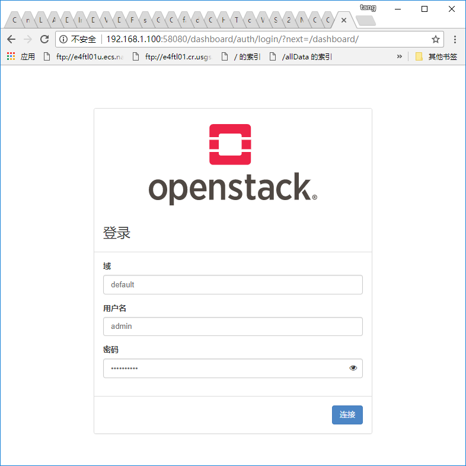

# OpenStack Pike Installation - Dashboard

## Table of content

控制节点
* [网络配置](#network)
* [SSH客户端排错](#ssh-trouble-shooting)
* [防火墙](#firewall)
* [NTP服务](#chrony)
* [Openstack Pike版本YUM仓库](#openstack-Repository)
* [Openstack 命令工具包](#openstack-client)
* [MariaDB数据库](#database)
* [RabbitMQ消息队列](#queue)
* [Memcached缓存](#cache)

## Controller Node

### Depoly

[Packages](https://docs.openstack.org/horizon/pike/install/install-rdo.html)
```
[vagrant@localhost ~]$ sudo yum install -y openstack-dashboard
Loaded plugins: fastestmirror
Loading mirror speeds from cached hostfile
 * base: mirrors.aliyun.com
 * extras: mirrors.btte.net
 * updates: mirrors.btte.net
Resolving Dependencies
--> Running transaction check
---> Package openstack-dashboard.noarch 1:12.0.0-2.el7 will be installed
--> Processing Dependency: python-django-horizon = 1:12.0.0-2.el7 for package: 1:openstack-dashboard-12.0.0-2.el7.noarch
--> Processing Dependency: python-scss >= 1.3.4 for package: 1:openstack-dashboard-12.0.0-2.el7.noarch
--> Processing Dependency: python-pymongo >= 3.0.2 for package: 1:openstack-dashboard-12.0.0-2.el7.noarch
--> Processing Dependency: python-heatclient >= 1.6.1 for package: 1:openstack-dashboard-12.0.0-2.el7.noarch
--> Processing Dependency: python-django-pyscss >= 2.0.2 for package: 1:openstack-dashboard-12.0.0-2.el7.noarch
--> Processing Dependency: python-django-openstack-auth >= 3.5.0 for package: 1:openstack-dashboard-12.0.0-2.el7.noarch
--> Processing Dependency: python-django-compressor >= 2.0 for package: 1:openstack-dashboard-12.0.0-2.el7.noarch
--> Processing Dependency: python-XStatic-roboto-fontface >= 0.5.0.0 for package: 1:openstack-dashboard-12.0.0-2.el7.noarch
--> Processing Dependency: python-XStatic-Bootstrap-SCSS >= 3.3.7.1 for package: 1:openstack-dashboard-12.0.0-2.el7.noarch
--> Processing Dependency: python-XStatic-Angular >= 1:1.3.7 for package: 1:openstack-dashboard-12.0.0-2.el7.noarch
--> Processing Dependency: fontawesome-fonts-web >= 4.1.0 for package: 1:openstack-dashboard-12.0.0-2.el7.noarch
--> Processing Dependency: python-semantic_version for package: 1:openstack-dashboard-12.0.0-2.el7.noarch
--> Processing Dependency: python-pint for package: 1:openstack-dashboard-12.0.0-2.el7.noarch
--> Processing Dependency: python-lesscpy for package: 1:openstack-dashboard-12.0.0-2.el7.noarch
--> Processing Dependency: python-django-babel for package: 1:openstack-dashboard-12.0.0-2.el7.noarch
--> Processing Dependency: python-django-appconf for package: 1:openstack-dashboard-12.0.0-2.el7.noarch
--> Processing Dependency: python-XStatic-tv4 for package: 1:openstack-dashboard-12.0.0-2.el7.noarch
--> Processing Dependency: python-XStatic-termjs for package: 1:openstack-dashboard-12.0.0-2.el7.noarch
--> Processing Dependency: python-XStatic-smart-table for package: 1:openstack-dashboard-12.0.0-2.el7.noarch
--> Processing Dependency: python-XStatic-objectpath for package: 1:openstack-dashboard-12.0.0-2.el7.noarch
--> Processing Dependency: python-XStatic-mdi for package: 1:openstack-dashboard-12.0.0-2.el7.noarch
--> Processing Dependency: python-XStatic-jquery-ui for package: 1:openstack-dashboard-12.0.0-2.el7.noarch
--> Processing Dependency: python-XStatic-jQuery for package: 1:openstack-dashboard-12.0.0-2.el7.noarch
--> Processing Dependency: python-XStatic-bootswatch for package: 1:openstack-dashboard-12.0.0-2.el7.noarch
--> Processing Dependency: python-XStatic-Spin for package: 1:openstack-dashboard-12.0.0-2.el7.noarch
--> Processing Dependency: python-XStatic-Rickshaw for package: 1:openstack-dashboard-12.0.0-2.el7.noarch
--> Processing Dependency: python-XStatic-Magic-Search for package: 1:openstack-dashboard-12.0.0-2.el7.noarch
--> Processing Dependency: python-XStatic-Jasmine for package: 1:openstack-dashboard-12.0.0-2.el7.noarch
--> Processing Dependency: python-XStatic-JSEncrypt for package: 1:openstack-dashboard-12.0.0-2.el7.noarch
--> Processing Dependency: python-XStatic-JQuery-quicksearch for package: 1:openstack-dashboard-12.0.0-2.el7.noarch
--> Processing Dependency: python-XStatic-JQuery-TableSorter for package: 1:openstack-dashboard-12.0.0-2.el7.noarch
--> Processing Dependency: python-XStatic-JQuery-Migrate for package: 1:openstack-dashboard-12.0.0-2.el7.noarch
--> Processing Dependency: python-XStatic-Hogan for package: 1:openstack-dashboard-12.0.0-2.el7.noarch
--> Processing Dependency: python-XStatic-Font-Awesome for package: 1:openstack-dashboard-12.0.0-2.el7.noarch
--> Processing Dependency: python-XStatic-D3 for package: 1:openstack-dashboard-12.0.0-2.el7.noarch
--> Processing Dependency: python-XStatic-Bootstrap-Datepicker for package: 1:openstack-dashboard-12.0.0-2.el7.noarch
--> Processing Dependency: python-XStatic-Angular-lrdragndrop for package: 1:openstack-dashboard-12.0.0-2.el7.noarch
--> Processing Dependency: python-XStatic-Angular-Schema-Form for package: 1:openstack-dashboard-12.0.0-2.el7.noarch
--> Processing Dependency: python-XStatic-Angular-Gettext for package: 1:openstack-dashboard-12.0.0-2.el7.noarch
--> Processing Dependency: python-XStatic-Angular-FileUpload for package: 1:openstack-dashboard-12.0.0-2.el7.noarch
--> Processing Dependency: python-XStatic-Angular-Bootstrap for package: 1:openstack-dashboard-12.0.0-2.el7.noarch
--> Processing Dependency: python-XStatic for package: 1:openstack-dashboard-12.0.0-2.el7.noarch
--> Running transaction check
---> Package fontawesome-fonts-web.noarch 0:4.4.0-1.el7 will be installed
--> Processing Dependency: fontawesome-fonts = 4.4.0-1.el7 for package: fontawesome-fonts-web-4.4.0-1.el7.noarch
---> Package python-XStatic-Angular-lrdragndrop.noarch 0:1.0.2.2-2.el7 will be installed
--> Processing Dependency: web-assets-filesystem for package: python-XStatic-Angular-lrdragndrop-1.0.2.2-2.el7.noarch
---> Package python-XStatic-Bootstrap-Datepicker.noarch 0:1.3.1.0-1.el7 will be installed
---> Package python-XStatic-Hogan.noarch 0:2.0.0.2-2.el7 will be installed
---> Package python-XStatic-JQuery-Migrate.noarch 0:1.2.1.1-2.el7 will be installed
---> Package python-XStatic-JQuery-TableSorter.noarch 0:2.14.5.1-2.el7 will be installed
---> Package python-XStatic-JQuery-quicksearch.noarch 0:2.0.3.1-2.el7 will be installed
---> Package python-XStatic-Magic-Search.noarch 0:0.2.0.1-2.el7 will be installed
---> Package python-XStatic-Rickshaw.noarch 0:1.5.0.0-4.el7 will be installed
---> Package python-XStatic-Spin.noarch 0:1.2.5.2-2.el7 will be installed
---> Package python-XStatic-jQuery.noarch 0:1.10.2.1-1.el7 will be installed
---> Package python-XStatic-jquery-ui.noarch 0:1.10.4.1-1.el7 will be installed
---> Package python-django-appconf.noarch 0:1.0.1-4.el7 will be installed
--> Processing Dependency: python-django for package: python-django-appconf-1.0.1-4.el7.noarch
---> Package python-django-compressor.noarch 0:2.0-1.el7 will be installed
--> Processing Dependency: python2-rjsmin for package: python-django-compressor-2.0-1.el7.noarch
--> Processing Dependency: python2-rcssmin for package: python-django-compressor-2.0-1.el7.noarch
--> Processing Dependency: python-versiontools for package: python-django-compressor-2.0-1.el7.noarch
---> Package python-django-horizon.noarch 1:12.0.0-2.el7 will be installed
---> Package python-django-pyscss.noarch 0:2.0.2-1.el7 will be installed
--> Processing Dependency: python-pathlib for package: python-django-pyscss-2.0.2-1.el7.noarch
---> Package python-lesscpy.noarch 0:0.9j-4.el7 will be installed
---> Package python-pint.noarch 0:0.6-2.el7 will be installed
---> Package python-pymongo.x86_64 0:3.0.3-1.el7 will be installed
--> Processing Dependency: python-bson = 3.0.3-1.el7 for package: python-pymongo-3.0.3-1.el7.x86_64
---> Package python-semantic_version.noarch 0:2.4.2-1.el7 will be installed
---> Package python2-XStatic.noarch 0:1.0.1-8.el7 will be installed
---> Package python2-XStatic-Angular.noarch 1:1.5.8.0-1.el7 will be installed
--> Processing Dependency: XStatic-Angular-common = 1:1.5.8.0-1.el7 for package: 1:python2-XStatic-Angular-1.5.8.0-1.el7.noarch
---> Package python2-XStatic-Angular-Bootstrap.noarch 0:2.2.0.0-1.el7 will be installed
--> Processing Dependency: xstatic-angular-bootstrap-common for package: python2-XStatic-Angular-Bootstrap-2.2.0.0-1.el7.noarch
---> Package python2-XStatic-Angular-FileUpload.noarch 0:12.0.4.0-1.el7 will be installed
--> Processing Dependency: xstatic-angular-fileupload-common for package: python2-XStatic-Angular-FileUpload-12.0.4.0-1.el7.noarch
---> Package python2-XStatic-Angular-Gettext.noarch 0:2.3.8.0-1.el7 will be installed
--> Processing Dependency: xstatic-angular-gettext-common for package: python2-XStatic-Angular-Gettext-2.3.8.0-1.el7.noarch
---> Package python2-XStatic-Angular-Schema-Form.noarch 0:0.8.13.0-0.1.pre_review.el7 will be installed
--> Processing Dependency: xstatic-angular-schema-form-common = 0.8.13.0-0.1.pre_review.el7 for package: python2-XStatic-Angular-Schema-Form-0.8.13.0-0.1.pre_review.el7.noarch
---> Package python2-XStatic-Bootstrap-SCSS.noarch 0:3.3.7.1-2.el7 will be installed
--> Processing Dependency: xstatic-bootstrap-scss-common for package: python2-XStatic-Bootstrap-SCSS-3.3.7.1-2.el7.noarch
---> Package python2-XStatic-D3.noarch 0:3.5.17.0-1.el7 will be installed
--> Processing Dependency: xstatic-d3-common for package: python2-XStatic-D3-3.5.17.0-1.el7.noarch
---> Package python2-XStatic-Font-Awesome.noarch 0:4.7.0.0-3.el7 will be installed
---> Package python2-XStatic-JSEncrypt.noarch 0:2.3.1.1-1.el7 will be installed
--> Processing Dependency: xstatic-jsencrypt-common for package: python2-XStatic-JSEncrypt-2.3.1.1-1.el7.noarch
---> Package python2-XStatic-Jasmine.noarch 0:2.4.1.1-1.el7 will be installed
--> Processing Dependency: xstatic-jasmine-common for package: python2-XStatic-Jasmine-2.4.1.1-1.el7.noarch
---> Package python2-XStatic-bootswatch.noarch 0:3.3.7.0-1.el7 will be installed
--> Processing Dependency: bootswatch-fonts = 3.3.7.0-1.el7 for package: python2-XStatic-bootswatch-3.3.7.0-1.el7.noarch
--> Processing Dependency: bootswatch-common = 3.3.7.0-1.el7 for package: python2-XStatic-bootswatch-3.3.7.0-1.el7.noarch
---> Package python2-XStatic-mdi.noarch 0:1.4.57.0-4.el7 will be installed
--> Processing Dependency: mdi-fonts = 1.4.57.0-4.el7 for package: python2-XStatic-mdi-1.4.57.0-4.el7.noarch
--> Processing Dependency: mdi-common = 1.4.57.0-4.el7 for package: python2-XStatic-mdi-1.4.57.0-4.el7.noarch
---> Package python2-XStatic-objectpath.noarch 0:1.2.1.0-0.1.pre_review.el7 will be installed
--> Processing Dependency: xstatic-objectpath-common = 1.2.1.0-0.1.pre_review.el7 for package: python2-XStatic-objectpath-1.2.1.0-0.1.pre_review.el7.noarch
---> Package python2-XStatic-roboto-fontface.noarch 0:0.5.0.0-1.el7 will be installed
--> Processing Dependency: roboto-fontface-fonts = 0.5.0.0-1.el7 for package: python2-XStatic-roboto-fontface-0.5.0.0-1.el7.noarch
--> Processing Dependency: roboto-fontface-common = 0.5.0.0-1.el7 for package: python2-XStatic-roboto-fontface-0.5.0.0-1.el7.noarch
---> Package python2-XStatic-smart-table.noarch 0:1.4.13.2-1.el7 will be installed
--> Processing Dependency: xstatic-smart-table-common for package: python2-XStatic-smart-table-1.4.13.2-1.el7.noarch
---> Package python2-XStatic-termjs.noarch 0:0.0.7.0-1.el7 will be installed
--> Processing Dependency: xstatic-termjs-common for package: python2-XStatic-termjs-0.0.7.0-1.el7.noarch
---> Package python2-XStatic-tv4.noarch 0:1.2.7.0-0.1.pre_review.el7 will be installed
--> Processing Dependency: xstatic-tv4-common = 1.2.7.0-0.1.pre_review.el7 for package: python2-XStatic-tv4-1.2.7.0-0.1.pre_review.el7.noarch
---> Package python2-django-babel.noarch 0:0.4.0-2.el7 will be installed
---> Package python2-django-openstack-auth.noarch 0:3.5.0-1.el7 will be installed
---> Package python2-heatclient.noarch 0:1.11.0-1.el7 will be installed
---> Package python2-scss.x86_64 0:1.3.4-6.el7 will be installed
--> Running transaction check
---> Package XStatic-Angular-common.noarch 1:1.5.8.0-1.el7 will be installed
---> Package bootswatch-common.noarch 0:3.3.7.0-1.el7 will be installed
---> Package bootswatch-fonts.noarch 0:3.3.7.0-1.el7 will be installed
--> Processing Dependency: fontpackages-filesystem for package: bootswatch-fonts-3.3.7.0-1.el7.noarch
---> Package fontawesome-fonts.noarch 0:4.4.0-1.el7 will be installed
---> Package mdi-common.noarch 0:1.4.57.0-4.el7 will be installed
---> Package mdi-fonts.noarch 0:1.4.57.0-4.el7 will be installed
---> Package python-bson.x86_64 0:3.0.3-1.el7 will be installed
---> Package python-django.noarch 0:1.8.14-1.el7 will be installed
--> Processing Dependency: python-django-bash-completion = 1.8.14-1.el7 for package: python-django-1.8.14-1.el7.noarch
---> Package python-pathlib.noarch 0:1.0.1-1.el7 will be installed
---> Package python-versiontools.noarch 0:1.9.1-4.el7 will be installed
---> Package python2-rcssmin.x86_64 0:1.0.6-2.el7 will be installed
---> Package python2-rjsmin.x86_64 0:1.0.12-2.el7 will be installed
---> Package roboto-fontface-common.noarch 0:0.5.0.0-1.el7 will be installed
---> Package roboto-fontface-fonts.noarch 0:0.5.0.0-1.el7 will be installed
---> Package web-assets-filesystem.noarch 0:5-1.el7 will be installed
---> Package xstatic-angular-bootstrap-common.noarch 0:2.2.0.0-1.el7 will be installed
---> Package xstatic-angular-fileupload-common.noarch 0:12.0.4.0-1.el7 will be installed
---> Package xstatic-angular-gettext-common.noarch 0:2.3.8.0-1.el7 will be installed
---> Package xstatic-angular-schema-form-common.noarch 0:0.8.13.0-0.1.pre_review.el7 will be installed
---> Package xstatic-bootstrap-scss-common.noarch 0:3.3.7.1-2.el7 will be installed
---> Package xstatic-d3-common.noarch 0:3.5.17.0-1.el7 will be installed
---> Package xstatic-jasmine-common.noarch 0:2.4.1.1-1.el7 will be installed
---> Package xstatic-jsencrypt-common.noarch 0:2.3.1.1-1.el7 will be installed
---> Package xstatic-objectpath-common.noarch 0:1.2.1.0-0.1.pre_review.el7 will be installed
---> Package xstatic-smart-table-common.noarch 0:1.4.13.2-1.el7 will be installed
---> Package xstatic-termjs-common.noarch 0:0.0.7.0-1.el7 will be installed
---> Package xstatic-tv4-common.noarch 0:1.2.7.0-0.1.pre_review.el7 will be installed
--> Running transaction check
---> Package fontpackages-filesystem.noarch 0:1.44-8.el7 will be installed
---> Package python-django-bash-completion.noarch 0:1.8.14-1.el7 will be installed
--> Finished Dependency Resolution

Dependencies Resolved

==================================================================================================================================================
 Package                                        Arch              Version                                  Repository                        Size
==================================================================================================================================================
Installing:
 openstack-dashboard                            noarch            1:12.0.0-2.el7                           centos-openstack-pike             11 M
Installing for dependencies:
 XStatic-Angular-common                         noarch            1:1.5.8.0-1.el7                          centos-openstack-pike            455 k
 bootswatch-common                              noarch            3.3.7.0-1.el7                            centos-openstack-pike            619 k
 bootswatch-fonts                               noarch            3.3.7.0-1.el7                            centos-openstack-pike            112 k
 fontawesome-fonts                              noarch            4.4.0-1.el7                              centos-openstack-pike            160 k
 fontawesome-fonts-web                          noarch            4.4.0-1.el7                              centos-openstack-pike            274 k
 fontpackages-filesystem                        noarch            1.44-8.el7                               base                             9.9 k
 mdi-common                                     noarch            1.4.57.0-4.el7                           centos-openstack-pike             36 k
 mdi-fonts                                      noarch            1.4.57.0-4.el7                           centos-openstack-pike            482 k
 python-XStatic-Angular-lrdragndrop             noarch            1.0.2.2-2.el7                            centos-openstack-pike            9.7 k
 python-XStatic-Bootstrap-Datepicker            noarch            1.3.1.0-1.el7                            centos-openstack-pike             41 k
 python-XStatic-Hogan                           noarch            2.0.0.2-2.el7                            centos-openstack-pike             12 k
 python-XStatic-JQuery-Migrate                  noarch            1.2.1.1-2.el7                            centos-openstack-pike             16 k
 python-XStatic-JQuery-TableSorter              noarch            2.14.5.1-2.el7                           centos-openstack-pike             24 k
 python-XStatic-JQuery-quicksearch              noarch            2.0.3.1-2.el7                            centos-openstack-pike             12 k
 python-XStatic-Magic-Search                    noarch            0.2.0.1-2.el7                            centos-openstack-pike             13 k
 python-XStatic-Rickshaw                        noarch            1.5.0.0-4.el7                            centos-openstack-pike             32 k
 python-XStatic-Spin                            noarch            1.2.5.2-2.el7                            centos-openstack-pike             10 k
 python-XStatic-jQuery                          noarch            1.10.2.1-1.el7                           centos-openstack-pike            112 k
 python-XStatic-jquery-ui                       noarch            1.10.4.1-1.el7                           centos-openstack-pike            327 k
 python-bson                                    x86_64            3.0.3-1.el7                              centos-openstack-pike            171 k
 python-django                                  noarch            1.8.14-1.el7                             centos-openstack-pike            3.5 M
 python-django-appconf                          noarch            1.0.1-4.el7                              centos-openstack-pike             88 k
 python-django-bash-completion                  noarch            1.8.14-1.el7                             centos-openstack-pike            8.4 k
 python-django-compressor                       noarch            2.0-1.el7                                centos-openstack-pike            169 k
 python-django-horizon                          noarch            1:12.0.0-2.el7                           centos-openstack-pike            697 k
 python-django-pyscss                           noarch            2.0.2-1.el7                              centos-openstack-pike             16 k
 python-lesscpy                                 noarch            0.9j-4.el7                               centos-openstack-pike             83 k
 python-pathlib                                 noarch            1.0.1-1.el7                              centos-openstack-pike            109 k
 python-pint                                    noarch            0.6-2.el7                                centos-openstack-pike            258 k
 python-pymongo                                 x86_64            3.0.3-1.el7                              centos-openstack-pike            304 k
 python-semantic_version                        noarch            2.4.2-1.el7                              centos-openstack-pike             22 k
 python-versiontools                            noarch            1.9.1-4.el7                              centos-openstack-pike             98 k
 python2-XStatic                                noarch            1.0.1-8.el7                              centos-openstack-pike            8.4 k
 python2-XStatic-Angular                        noarch            1:1.5.8.0-1.el7                          centos-openstack-pike             13 k
 python2-XStatic-Angular-Bootstrap              noarch            2.2.0.0-1.el7                            centos-openstack-pike            8.6 k
 python2-XStatic-Angular-FileUpload             noarch            12.0.4.0-1.el7                           centos-openstack-pike            8.8 k
 python2-XStatic-Angular-Gettext                noarch            2.3.8.0-1.el7                            centos-openstack-pike            8.3 k
 python2-XStatic-Angular-Schema-Form            noarch            0.8.13.0-0.1.pre_review.el7              centos-openstack-pike            8.8 k
 python2-XStatic-Bootstrap-SCSS                 noarch            3.3.7.1-2.el7                            centos-openstack-pike            9.3 k
 python2-XStatic-D3                             noarch            3.5.17.0-1.el7                           centos-openstack-pike            8.3 k
 python2-XStatic-Font-Awesome                   noarch            4.7.0.0-3.el7                            centos-openstack-pike             11 k
 python2-XStatic-JSEncrypt                      noarch            2.3.1.1-1.el7                            centos-openstack-pike            8.4 k
 python2-XStatic-Jasmine                        noarch            2.4.1.1-1.el7                            centos-openstack-pike            8.6 k
 python2-XStatic-bootswatch                     noarch            3.3.7.0-1.el7                            centos-openstack-pike             11 k
 python2-XStatic-mdi                            noarch            1.4.57.0-4.el7                           centos-openstack-pike             18 k
 python2-XStatic-objectpath                     noarch            1.2.1.0-0.1.pre_review.el7               centos-openstack-pike            8.6 k
 python2-XStatic-roboto-fontface                noarch            0.5.0.0-1.el7                            centos-openstack-pike            9.7 k
 python2-XStatic-smart-table                    noarch            1.4.13.2-1.el7                           centos-openstack-pike            8.8 k
 python2-XStatic-termjs                         noarch            0.0.7.0-1.el7                            centos-openstack-pike            8.6 k
 python2-XStatic-tv4                            noarch            1.2.7.0-0.1.pre_review.el7               centos-openstack-pike            8.2 k
 python2-django-babel                           noarch            0.4.0-2.el7                              centos-openstack-pike             77 k
 python2-django-openstack-auth                  noarch            3.5.0-1.el7                              centos-openstack-pike             74 k
 python2-heatclient                             noarch            1.11.0-1.el7                             centos-openstack-pike            160 k
 python2-rcssmin                                x86_64            1.0.6-2.el7                              centos-openstack-pike             25 k
 python2-rjsmin                                 x86_64            1.0.12-2.el7                             centos-openstack-pike             22 k
 python2-scss                                   x86_64            1.3.4-6.el7                              centos-openstack-pike            245 k
 roboto-fontface-common                         noarch            0.5.0.0-1.el7                            centos-openstack-pike             15 k
 roboto-fontface-fonts                          noarch            0.5.0.0-1.el7                            centos-openstack-pike            4.1 M
 web-assets-filesystem                          noarch            5-1.el7                                  centos-openstack-pike            4.1 k
 xstatic-angular-bootstrap-common               noarch            2.2.0.0-1.el7                            centos-openstack-pike             56 k
 xstatic-angular-fileupload-common              noarch            12.0.4.0-1.el7                           centos-openstack-pike            147 k
 xstatic-angular-gettext-common                 noarch            2.3.8.0-1.el7                            centos-openstack-pike             12 k
 xstatic-angular-schema-form-common             noarch            0.8.13.0-0.1.pre_review.el7              centos-openstack-pike             40 k
 xstatic-bootstrap-scss-common                  noarch            3.3.7.1-2.el7                            centos-openstack-pike            195 k
 xstatic-d3-common                              noarch            3.5.17.0-1.el7                           centos-openstack-pike             73 k
 xstatic-jasmine-common                         noarch            2.4.1.1-1.el7                            centos-openstack-pike             38 k
 xstatic-jsencrypt-common                       noarch            2.3.1.1-1.el7                            centos-openstack-pike             34 k
 xstatic-objectpath-common                      noarch            1.2.1.0-0.1.pre_review.el7               centos-openstack-pike            5.7 k
 xstatic-smart-table-common                     noarch            1.4.13.2-1.el7                           centos-openstack-pike             14 k
 xstatic-termjs-common                          noarch            0.0.7.0-1.el7                            centos-openstack-pike             37 k
 xstatic-tv4-common                             noarch            1.2.7.0-0.1.pre_review.el7               centos-openstack-pike             23 k

Transaction Summary
==================================================================================================================================================
Install  1 Package (+71 Dependent packages)

Total download size: 25 M
Installed size: 117 M
Downloading packages:
(1/72): XStatic-Angular-common-1.5.8.0-1.el7.noarch.rpm                                                                    | 455 kB  00:00:06     
(2/72): bootswatch-common-3.3.7.0-1.el7.noarch.rpm                                                                         | 619 kB  00:00:07     
(3/72): bootswatch-fonts-3.3.7.0-1.el7.noarch.rpm                                                                          | 112 kB  00:00:00     
(4/72): fontawesome-fonts-4.4.0-1.el7.noarch.rpm                                                                           | 160 kB  00:00:01     
(5/72): mdi-common-1.4.57.0-4.el7.noarch.rpm                                                                               |  36 kB  00:00:00     
(6/72): fontawesome-fonts-web-4.4.0-1.el7.noarch.rpm                                                                       | 274 kB  00:00:02     
(7/72): mdi-fonts-1.4.57.0-4.el7.noarch.rpm                                                                                | 482 kB  00:00:01     
(8/72): fontpackages-filesystem-1.44-8.el7.noarch.rpm                                                                      | 9.9 kB  00:00:02     
(9/72): python-XStatic-Angular-lrdragndrop-1.0.2.2-2.el7.noarch.rpm                                                        | 9.7 kB  00:00:00     
(10/72): python-XStatic-Bootstrap-Datepicker-1.3.1.0-1.el7.noarch.rpm                                                      |  41 kB  00:00:00     
(11/72): python-XStatic-Hogan-2.0.0.2-2.el7.noarch.rpm                                                                     |  12 kB  00:00:00     
(12/72): python-XStatic-JQuery-Migrate-1.2.1.1-2.el7.noarch.rpm                                                            |  16 kB  00:00:00     
(13/72): python-XStatic-JQuery-TableSorter-2.14.5.1-2.el7.noarch.rpm                                                       |  24 kB  00:00:00     
(14/72): python-XStatic-JQuery-quicksearch-2.0.3.1-2.el7.noarch.rpm                                                        |  12 kB  00:00:00     
(15/72): python-XStatic-Magic-Search-0.2.0.1-2.el7.noarch.rpm                                                              |  13 kB  00:00:00     
(16/72): python-XStatic-Rickshaw-1.5.0.0-4.el7.noarch.rpm                                                                  |  32 kB  00:00:00     
(17/72): python-XStatic-Spin-1.2.5.2-2.el7.noarch.rpm                                                                      |  10 kB  00:00:00     
(18/72): python-XStatic-jQuery-1.10.2.1-1.el7.noarch.rpm                                                                   | 112 kB  00:00:00     
(19/72): python-XStatic-jquery-ui-1.10.4.1-1.el7.noarch.rpm                                                                | 327 kB  00:00:00     
(20/72): python-bson-3.0.3-1.el7.x86_64.rpm                                                                                | 171 kB  00:00:00     
(21/72): python-django-1.8.14-1.el7.noarch.rpm                                                                             | 3.5 MB  00:00:08     
(22/72): python-django-appconf-1.0.1-4.el7.noarch.rpm                                                                      |  88 kB  00:00:00     
(23/72): python-django-bash-completion-1.8.14-1.el7.noarch.rpm                                                             | 8.4 kB  00:00:00     
(24/72): python-django-compressor-2.0-1.el7.noarch.rpm                                                                     | 169 kB  00:00:00     
(25/72): python-django-horizon-12.0.0-2.el7.noarch.rpm                                                                     | 697 kB  00:00:01     
(26/72): python-django-pyscss-2.0.2-1.el7.noarch.rpm                                                                       |  16 kB  00:00:00     
(27/72): python-lesscpy-0.9j-4.el7.noarch.rpm                                                                              |  83 kB  00:00:00     
(28/72): python-pathlib-1.0.1-1.el7.noarch.rpm                                                                             | 109 kB  00:00:00     
(29/72): python-pint-0.6-2.el7.noarch.rpm                                                                                  | 258 kB  00:00:00     
(30/72): python-pymongo-3.0.3-1.el7.x86_64.rpm                                                                             | 304 kB  00:00:00     
(31/72): python-semantic_version-2.4.2-1.el7.noarch.rpm                                                                    |  22 kB  00:00:00     
(32/72): python-versiontools-1.9.1-4.el7.noarch.rpm                                                                        |  98 kB  00:00:00     
(33/72): python2-XStatic-1.0.1-8.el7.noarch.rpm                                                                            | 8.4 kB  00:00:00     
(34/72): python2-XStatic-Angular-1.5.8.0-1.el7.noarch.rpm                                                                  |  13 kB  00:00:00     
(35/72): python2-XStatic-Angular-Bootstrap-2.2.0.0-1.el7.noarch.rpm                                                        | 8.6 kB  00:00:00     
(36/72): python2-XStatic-Angular-FileUpload-12.0.4.0-1.el7.noarch.rpm                                                      | 8.8 kB  00:00:00     
(37/72): python2-XStatic-Angular-Gettext-2.3.8.0-1.el7.noarch.rpm                                                          | 8.3 kB  00:00:00     
(38/72): python2-XStatic-Angular-Schema-Form-0.8.13.0-0.1.pre_review.el7.noarch.rpm                                        | 8.8 kB  00:00:00     
(39/72): python2-XStatic-Bootstrap-SCSS-3.3.7.1-2.el7.noarch.rpm                                                           | 9.3 kB  00:00:00     
(40/72): python2-XStatic-D3-3.5.17.0-1.el7.noarch.rpm                                                                      | 8.3 kB  00:00:00     
(41/72): python2-XStatic-Font-Awesome-4.7.0.0-3.el7.noarch.rpm                                                             |  11 kB  00:00:00     
(42/72): python2-XStatic-JSEncrypt-2.3.1.1-1.el7.noarch.rpm                                                                | 8.4 kB  00:00:00     
(43/72): python2-XStatic-Jasmine-2.4.1.1-1.el7.noarch.rpm                                                                  | 8.6 kB  00:00:00     
(44/72): python2-XStatic-bootswatch-3.3.7.0-1.el7.noarch.rpm                                                               |  11 kB  00:00:00     
(45/72): python2-XStatic-mdi-1.4.57.0-4.el7.noarch.rpm                                                                     |  18 kB  00:00:00     
(46/72): python2-XStatic-objectpath-1.2.1.0-0.1.pre_review.el7.noarch.rpm                                                  | 8.6 kB  00:00:00     
(47/72): python2-XStatic-roboto-fontface-0.5.0.0-1.el7.noarch.rpm                                                          | 9.7 kB  00:00:00     
(48/72): python2-XStatic-smart-table-1.4.13.2-1.el7.noarch.rpm                                                             | 8.8 kB  00:00:00     
(49/72): python2-XStatic-termjs-0.0.7.0-1.el7.noarch.rpm                                                                   | 8.6 kB  00:00:00     
(50/72): python2-XStatic-tv4-1.2.7.0-0.1.pre_review.el7.noarch.rpm                                                         | 8.2 kB  00:00:00     
(51/72): python2-django-babel-0.4.0-2.el7.noarch.rpm                                                                       |  77 kB  00:00:00     
(52/72): python2-django-openstack-auth-3.5.0-1.el7.noarch.rpm                                                              |  74 kB  00:00:00     
(53/72): python2-heatclient-1.11.0-1.el7.noarch.rpm                                                                        | 160 kB  00:00:00     
(54/72): python2-rcssmin-1.0.6-2.el7.x86_64.rpm                                                                            |  25 kB  00:00:00     
(55/72): python2-rjsmin-1.0.12-2.el7.x86_64.rpm                                                                            |  22 kB  00:00:00     
(56/72): python2-scss-1.3.4-6.el7.x86_64.rpm                                                                               | 245 kB  00:00:00     
(57/72): roboto-fontface-common-0.5.0.0-1.el7.noarch.rpm                                                                   |  15 kB  00:00:00     
(58/72): roboto-fontface-fonts-0.5.0.0-1.el7.noarch.rpm                                                                    | 4.1 MB  00:00:09     
(59/72): web-assets-filesystem-5-1.el7.noarch.rpm                                                                          | 4.1 kB  00:00:00     
(60/72): xstatic-angular-bootstrap-common-2.2.0.0-1.el7.noarch.rpm                                                         |  56 kB  00:00:00     
(61/72): xstatic-angular-fileupload-common-12.0.4.0-1.el7.noarch.rpm                                                       | 147 kB  00:00:00     
(62/72): xstatic-angular-gettext-common-2.3.8.0-1.el7.noarch.rpm                                                           |  12 kB  00:00:00     
(63/72): xstatic-angular-schema-form-common-0.8.13.0-0.1.pre_review.el7.noarch.rpm                                         |  40 kB  00:00:00     
(64/72): xstatic-bootstrap-scss-common-3.3.7.1-2.el7.noarch.rpm                                                            | 195 kB  00:00:00     
(65/72): xstatic-d3-common-3.5.17.0-1.el7.noarch.rpm                                                                       |  73 kB  00:00:00     
(66/72): xstatic-jasmine-common-2.4.1.1-1.el7.noarch.rpm                                                                   |  38 kB  00:00:00     
(67/72): xstatic-jsencrypt-common-2.3.1.1-1.el7.noarch.rpm                                                                 |  34 kB  00:00:00     
(68/72): xstatic-objectpath-common-1.2.1.0-0.1.pre_review.el7.noarch.rpm                                                   | 5.7 kB  00:00:00     
(69/72): xstatic-smart-table-common-1.4.13.2-1.el7.noarch.rpm                                                              |  14 kB  00:00:00     
(70/72): xstatic-termjs-common-0.0.7.0-1.el7.noarch.rpm                                                                    |  37 kB  00:00:00     
(71/72): xstatic-tv4-common-1.2.7.0-0.1.pre_review.el7.noarch.rpm                                                          |  23 kB  00:00:00     
(72/72): openstack-dashboard-12.0.0-2.el7.noarch.rpm                                                                       |  11 MB  00:01:15     
--------------------------------------------------------------------------------------------------------------------------------------------------
Total                                                                                                             303 kB/s |  25 MB  00:01:25     
Running transaction check
Running transaction test
Transaction test succeeded
Running transaction
  Installing : python2-XStatic-1.0.1-8.el7.noarch                                                                                            1/72 
  Installing : web-assets-filesystem-5-1.el7.noarch                                                                                          2/72 
  Installing : fontpackages-filesystem-1.44-8.el7.noarch                                                                                     3/72 
  Installing : python2-scss-1.3.4-6.el7.x86_64                                                                                               4/72 
  Installing : bootswatch-fonts-3.3.7.0-1.el7.noarch                                                                                         5/72 
  Installing : roboto-fontface-fonts-0.5.0.0-1.el7.noarch                                                                                    6/72 
  Installing : mdi-fonts-1.4.57.0-4.el7.noarch                                                                                               7/72 
  Installing : fontawesome-fonts-4.4.0-1.el7.noarch                                                                                          8/72 
  Installing : fontawesome-fonts-web-4.4.0-1.el7.noarch                                                                                      9/72 
  Installing : python-XStatic-Angular-lrdragndrop-1.0.2.2-2.el7.noarch                                                                      10/72 
  Installing : xstatic-angular-gettext-common-2.3.8.0-1.el7.noarch                                                                          11/72 
  Installing : python2-XStatic-Angular-Gettext-2.3.8.0-1.el7.noarch                                                                         12/72 
  Installing : xstatic-jasmine-common-2.4.1.1-1.el7.noarch                                                                                  13/72 
  Installing : python2-XStatic-Jasmine-2.4.1.1-1.el7.noarch                                                                                 14/72 
  Installing : mdi-common-1.4.57.0-4.el7.noarch                                                                                             15/72 
  Installing : python2-XStatic-mdi-1.4.57.0-4.el7.noarch                                                                                    16/72 
  Installing : python-XStatic-Hogan-2.0.0.2-2.el7.noarch                                                                                    17/72 
  Installing : xstatic-d3-common-3.5.17.0-1.el7.noarch                                                                                      18/72 
  Installing : python2-XStatic-D3-3.5.17.0-1.el7.noarch                                                                                     19/72 
  Installing : bootswatch-common-3.3.7.0-1.el7.noarch                                                                                       20/72 
  Installing : python2-XStatic-bootswatch-3.3.7.0-1.el7.noarch                                                                              21/72 
  Installing : roboto-fontface-common-0.5.0.0-1.el7.noarch                                                                                  22/72 
  Installing : python2-XStatic-roboto-fontface-0.5.0.0-1.el7.noarch                                                                         23/72 
  Installing : xstatic-tv4-common-1.2.7.0-0.1.pre_review.el7.noarch                                                                         24/72 
  Installing : python2-XStatic-tv4-1.2.7.0-0.1.pre_review.el7.noarch                                                                        25/72 
  Installing : python-XStatic-Rickshaw-1.5.0.0-4.el7.noarch                                                                                 26/72 
  Installing : python-XStatic-Spin-1.2.5.2-2.el7.noarch                                                                                     27/72 
  Installing : python-XStatic-JQuery-Migrate-1.2.1.1-2.el7.noarch                                                                           28/72 
  Installing : 1:XStatic-Angular-common-1.5.8.0-1.el7.noarch                                                                                29/72 
  Installing : 1:python2-XStatic-Angular-1.5.8.0-1.el7.noarch                                                                               30/72 
  Installing : python-XStatic-JQuery-TableSorter-2.14.5.1-2.el7.noarch                                                                      31/72 
  Installing : xstatic-bootstrap-scss-common-3.3.7.1-2.el7.noarch                                                                           32/72 
  Installing : python2-XStatic-Bootstrap-SCSS-3.3.7.1-2.el7.noarch                                                                          33/72 
  Installing : python-XStatic-JQuery-quicksearch-2.0.3.1-2.el7.noarch                                                                       34/72 
  Installing : python-XStatic-Magic-Search-0.2.0.1-2.el7.noarch                                                                             35/72 
  Installing : xstatic-termjs-common-0.0.7.0-1.el7.noarch                                                                                   36/72 
  Installing : python2-XStatic-termjs-0.0.7.0-1.el7.noarch                                                                                  37/72 
  Installing : python-XStatic-Bootstrap-Datepicker-1.3.1.0-1.el7.noarch                                                                     38/72 
  Installing : python-XStatic-jquery-ui-1.10.4.1-1.el7.noarch                                                                               39/72 
  Installing : xstatic-angular-fileupload-common-12.0.4.0-1.el7.noarch                                                                      40/72 
  Installing : python2-XStatic-Angular-FileUpload-12.0.4.0-1.el7.noarch                                                                     41/72 
  Installing : xstatic-angular-bootstrap-common-2.2.0.0-1.el7.noarch                                                                        42/72 
  Installing : python2-XStatic-Angular-Bootstrap-2.2.0.0-1.el7.noarch                                                                       43/72 
  Installing : xstatic-angular-schema-form-common-0.8.13.0-0.1.pre_review.el7.noarch                                                        44/72 
  Installing : python2-XStatic-Angular-Schema-Form-0.8.13.0-0.1.pre_review.el7.noarch                                                       45/72 
  Installing : xstatic-jsencrypt-common-2.3.1.1-1.el7.noarch                                                                                46/72 
  Installing : python2-XStatic-JSEncrypt-2.3.1.1-1.el7.noarch                                                                               47/72 
  Installing : xstatic-smart-table-common-1.4.13.2-1.el7.noarch                                                                             48/72 
  Installing : python2-XStatic-smart-table-1.4.13.2-1.el7.noarch                                                                            49/72 
  Installing : xstatic-objectpath-common-1.2.1.0-0.1.pre_review.el7.noarch                                                                  50/72 
  Installing : python2-XStatic-objectpath-1.2.1.0-0.1.pre_review.el7.noarch                                                                 51/72 
  Installing : python2-XStatic-Font-Awesome-4.7.0.0-3.el7.noarch                                                                            52/72 
  Installing : python-XStatic-jQuery-1.10.2.1-1.el7.noarch                                                                                  53/72 
  Installing : python-bson-3.0.3-1.el7.x86_64                                                                                               54/72 
  Installing : python-pymongo-3.0.3-1.el7.x86_64                                                                                            55/72 
  Installing : python2-rcssmin-1.0.6-2.el7.x86_64                                                                                           56/72 
  Installing : python-semantic_version-2.4.2-1.el7.noarch                                                                                   57/72 
  Installing : python-pathlib-1.0.1-1.el7.noarch                                                                                            58/72 
  Installing : python-versiontools-1.9.1-4.el7.noarch                                                                                       59/72 
  Installing : python-pint-0.6-2.el7.noarch                                                                                                 60/72 
  Installing : python2-heatclient-1.11.0-1.el7.noarch                                                                                       61/72 
  Installing : python-django-bash-completion-1.8.14-1.el7.noarch                                                                            62/72 
  Installing : python-django-1.8.14-1.el7.noarch                                                                                            63/72 
  Installing : python-django-appconf-1.0.1-4.el7.noarch                                                                                     64/72 
  Installing : 1:python-django-horizon-12.0.0-2.el7.noarch                                                                                  65/72 
  Installing : python-django-pyscss-2.0.2-1.el7.noarch                                                                                      66/72 
  Installing : python2-django-babel-0.4.0-2.el7.noarch                                                                                      67/72 
  Installing : python2-django-openstack-auth-3.5.0-1.el7.noarch                                                                             68/72 
  Installing : python-lesscpy-0.9j-4.el7.noarch                                                                                             69/72 
  Installing : python2-rjsmin-1.0.12-2.el7.x86_64                                                                                           70/72 
  Installing : python-django-compressor-2.0-1.el7.noarch                                                                                    71/72 
  Installing : 1:openstack-dashboard-12.0.0-2.el7.noarch                                                                                    72/72 
  Verifying  : python2-scss-1.3.4-6.el7.x86_64                                                                                               1/72 
  Verifying  : python2-XStatic-Jasmine-2.4.1.1-1.el7.noarch                                                                                  2/72 
  Verifying  : python2-rjsmin-1.0.12-2.el7.x86_64                                                                                            3/72 
  Verifying  : python-lesscpy-0.9j-4.el7.noarch                                                                                              4/72 
  Verifying  : python-pymongo-3.0.3-1.el7.x86_64                                                                                             5/72 
  Verifying  : python2-XStatic-mdi-1.4.57.0-4.el7.noarch                                                                                     6/72 
  Verifying  : python-XStatic-Angular-lrdragndrop-1.0.2.2-2.el7.noarch                                                                       7/72 
  Verifying  : xstatic-angular-gettext-common-2.3.8.0-1.el7.noarch                                                                           8/72 
  Verifying  : xstatic-jasmine-common-2.4.1.1-1.el7.noarch                                                                                   9/72 
  Verifying  : mdi-common-1.4.57.0-4.el7.noarch                                                                                             10/72 
  Verifying  : python2-XStatic-Bootstrap-SCSS-3.3.7.1-2.el7.noarch                                                                          11/72 
  Verifying  : python2-XStatic-Angular-Bootstrap-2.2.0.0-1.el7.noarch                                                                       12/72 
  Verifying  : python-django-compressor-2.0-1.el7.noarch                                                                                    13/72 
  Verifying  : python-XStatic-Hogan-2.0.0.2-2.el7.noarch                                                                                    14/72 
  Verifying  : python-django-1.8.14-1.el7.noarch                                                                                            15/72 
  Verifying  : python2-XStatic-smart-table-1.4.13.2-1.el7.noarch                                                                            16/72 
  Verifying  : xstatic-d3-common-3.5.17.0-1.el7.noarch                                                                                      17/72 
  Verifying  : python-django-bash-completion-1.8.14-1.el7.noarch                                                                            18/72 
  Verifying  : 1:openstack-dashboard-12.0.0-2.el7.noarch                                                                                    19/72 
  Verifying  : python2-heatclient-1.11.0-1.el7.noarch                                                                                       20/72 
  Verifying  : bootswatch-common-3.3.7.0-1.el7.noarch                                                                                       21/72 
  Verifying  : roboto-fontface-common-0.5.0.0-1.el7.noarch                                                                                  22/72 
  Verifying  : bootswatch-fonts-3.3.7.0-1.el7.noarch                                                                                        23/72 
  Verifying  : python2-XStatic-Angular-Schema-Form-0.8.13.0-0.1.pre_review.el7.noarch                                                       24/72 
  Verifying  : xstatic-tv4-common-1.2.7.0-0.1.pre_review.el7.noarch                                                                         25/72 
  Verifying  : python-XStatic-Rickshaw-1.5.0.0-4.el7.noarch                                                                                 26/72 
  Verifying  : python2-XStatic-Font-Awesome-4.7.0.0-3.el7.noarch                                                                            27/72 
  Verifying  : python2-XStatic-Angular-FileUpload-12.0.4.0-1.el7.noarch                                                                     28/72 
  Verifying  : python2-XStatic-roboto-fontface-0.5.0.0-1.el7.noarch                                                                         29/72 
  Verifying  : 1:python2-XStatic-Angular-1.5.8.0-1.el7.noarch                                                                               30/72 
  Verifying  : python-XStatic-Spin-1.2.5.2-2.el7.noarch                                                                                     31/72 
  Verifying  : 1:python-django-horizon-12.0.0-2.el7.noarch                                                                                  32/72 
  Verifying  : python2-XStatic-D3-3.5.17.0-1.el7.noarch                                                                                     33/72 
  Verifying  : python-XStatic-JQuery-Migrate-1.2.1.1-2.el7.noarch                                                                           34/72 
  Verifying  : 1:XStatic-Angular-common-1.5.8.0-1.el7.noarch                                                                                35/72 
  Verifying  : roboto-fontface-fonts-0.5.0.0-1.el7.noarch                                                                                   36/72 
  Verifying  : mdi-fonts-1.4.57.0-4.el7.noarch                                                                                              37/72 
  Verifying  : python-pint-0.6-2.el7.noarch                                                                                                 38/72 
  Verifying  : python-XStatic-jQuery-1.10.2.1-1.el7.noarch                                                                                  39/72 
  Verifying  : python-XStatic-JQuery-TableSorter-2.14.5.1-2.el7.noarch                                                                      40/72 
  Verifying  : xstatic-bootstrap-scss-common-3.3.7.1-2.el7.noarch                                                                           41/72 
  Verifying  : python-XStatic-JQuery-quicksearch-2.0.3.1-2.el7.noarch                                                                       42/72 
  Verifying  : python-XStatic-Magic-Search-0.2.0.1-2.el7.noarch                                                                             43/72 
  Verifying  : python-django-pyscss-2.0.2-1.el7.noarch                                                                                      44/72 
  Verifying  : xstatic-termjs-common-0.0.7.0-1.el7.noarch                                                                                   45/72 
  Verifying  : python-XStatic-Bootstrap-Datepicker-1.3.1.0-1.el7.noarch                                                                     46/72 
  Verifying  : python-XStatic-jquery-ui-1.10.4.1-1.el7.noarch                                                                               47/72 
  Verifying  : fontawesome-fonts-4.4.0-1.el7.noarch                                                                                         48/72 
  Verifying  : python-versiontools-1.9.1-4.el7.noarch                                                                                       49/72 
  Verifying  : xstatic-angular-fileupload-common-12.0.4.0-1.el7.noarch                                                                      50/72 
  Verifying  : python2-XStatic-tv4-1.2.7.0-0.1.pre_review.el7.noarch                                                                        51/72 
  Verifying  : python-pathlib-1.0.1-1.el7.noarch                                                                                            52/72 
  Verifying  : xstatic-angular-bootstrap-common-2.2.0.0-1.el7.noarch                                                                        53/72 
  Verifying  : python2-XStatic-termjs-0.0.7.0-1.el7.noarch                                                                                  54/72 
  Verifying  : python-semantic_version-2.4.2-1.el7.noarch                                                                                   55/72 
  Verifying  : xstatic-angular-schema-form-common-0.8.13.0-0.1.pre_review.el7.noarch                                                        56/72 
  Verifying  : python2-XStatic-objectpath-1.2.1.0-0.1.pre_review.el7.noarch                                                                 57/72 
  Verifying  : python-django-appconf-1.0.1-4.el7.noarch                                                                                     58/72 
  Verifying  : xstatic-jsencrypt-common-2.3.1.1-1.el7.noarch                                                                                59/72 
  Verifying  : python2-XStatic-JSEncrypt-2.3.1.1-1.el7.noarch                                                                               60/72 
  Verifying  : python2-XStatic-Angular-Gettext-2.3.8.0-1.el7.noarch                                                                         61/72 
  Verifying  : python2-rcssmin-1.0.6-2.el7.x86_64                                                                                           62/72 
  Verifying  : python2-django-babel-0.4.0-2.el7.noarch                                                                                      63/72 
  Verifying  : xstatic-smart-table-common-1.4.13.2-1.el7.noarch                                                                             64/72 
  Verifying  : python2-XStatic-bootswatch-3.3.7.0-1.el7.noarch                                                                              65/72 
  Verifying  : fontpackages-filesystem-1.44-8.el7.noarch                                                                                    66/72 
  Verifying  : web-assets-filesystem-5-1.el7.noarch                                                                                         67/72 
  Verifying  : xstatic-objectpath-common-1.2.1.0-0.1.pre_review.el7.noarch                                                                  68/72 
  Verifying  : python2-django-openstack-auth-3.5.0-1.el7.noarch                                                                             69/72 
  Verifying  : python2-XStatic-1.0.1-8.el7.noarch                                                                                           70/72 
  Verifying  : python-bson-3.0.3-1.el7.x86_64                                                                                               71/72 
  Verifying  : fontawesome-fonts-web-4.4.0-1.el7.noarch                                                                                     72/72 

Installed:
  openstack-dashboard.noarch 1:12.0.0-2.el7                                                                                                       

Dependency Installed:
  XStatic-Angular-common.noarch 1:1.5.8.0-1.el7                                                                                                   
  bootswatch-common.noarch 0:3.3.7.0-1.el7                                                                                                        
  bootswatch-fonts.noarch 0:3.3.7.0-1.el7                                                                                                         
  fontawesome-fonts.noarch 0:4.4.0-1.el7                                                                                                          
  fontawesome-fonts-web.noarch 0:4.4.0-1.el7                                                                                                      
  fontpackages-filesystem.noarch 0:1.44-8.el7                                                                                                     
  mdi-common.noarch 0:1.4.57.0-4.el7                                                                                                              
  mdi-fonts.noarch 0:1.4.57.0-4.el7                                                                                                               
  python-XStatic-Angular-lrdragndrop.noarch 0:1.0.2.2-2.el7                                                                                       
  python-XStatic-Bootstrap-Datepicker.noarch 0:1.3.1.0-1.el7                                                                                      
  python-XStatic-Hogan.noarch 0:2.0.0.2-2.el7                                                                                                     
  python-XStatic-JQuery-Migrate.noarch 0:1.2.1.1-2.el7                                                                                            
  python-XStatic-JQuery-TableSorter.noarch 0:2.14.5.1-2.el7                                                                                       
  python-XStatic-JQuery-quicksearch.noarch 0:2.0.3.1-2.el7                                                                                        
  python-XStatic-Magic-Search.noarch 0:0.2.0.1-2.el7                                                                                              
  python-XStatic-Rickshaw.noarch 0:1.5.0.0-4.el7                                                                                                  
  python-XStatic-Spin.noarch 0:1.2.5.2-2.el7                                                                                                      
  python-XStatic-jQuery.noarch 0:1.10.2.1-1.el7                                                                                                   
  python-XStatic-jquery-ui.noarch 0:1.10.4.1-1.el7                                                                                                
  python-bson.x86_64 0:3.0.3-1.el7                                                                                                                
  python-django.noarch 0:1.8.14-1.el7                                                                                                             
  python-django-appconf.noarch 0:1.0.1-4.el7                                                                                                      
  python-django-bash-completion.noarch 0:1.8.14-1.el7                                                                                             
  python-django-compressor.noarch 0:2.0-1.el7                                                                                                     
  python-django-horizon.noarch 1:12.0.0-2.el7                                                                                                     
  python-django-pyscss.noarch 0:2.0.2-1.el7                                                                                                       
  python-lesscpy.noarch 0:0.9j-4.el7                                                                                                              
  python-pathlib.noarch 0:1.0.1-1.el7                                                                                                             
  python-pint.noarch 0:0.6-2.el7                                                                                                                  
  python-pymongo.x86_64 0:3.0.3-1.el7                                                                                                             
  python-semantic_version.noarch 0:2.4.2-1.el7                                                                                                    
  python-versiontools.noarch 0:1.9.1-4.el7                                                                                                        
  python2-XStatic.noarch 0:1.0.1-8.el7                                                                                                            
  python2-XStatic-Angular.noarch 1:1.5.8.0-1.el7                                                                                                  
  python2-XStatic-Angular-Bootstrap.noarch 0:2.2.0.0-1.el7                                                                                        
  python2-XStatic-Angular-FileUpload.noarch 0:12.0.4.0-1.el7                                                                                      
  python2-XStatic-Angular-Gettext.noarch 0:2.3.8.0-1.el7                                                                                          
  python2-XStatic-Angular-Schema-Form.noarch 0:0.8.13.0-0.1.pre_review.el7                                                                        
  python2-XStatic-Bootstrap-SCSS.noarch 0:3.3.7.1-2.el7                                                                                           
  python2-XStatic-D3.noarch 0:3.5.17.0-1.el7                                                                                                      
  python2-XStatic-Font-Awesome.noarch 0:4.7.0.0-3.el7                                                                                             
  python2-XStatic-JSEncrypt.noarch 0:2.3.1.1-1.el7                                                                                                
  python2-XStatic-Jasmine.noarch 0:2.4.1.1-1.el7                                                                                                  
  python2-XStatic-bootswatch.noarch 0:3.3.7.0-1.el7                                                                                               
  python2-XStatic-mdi.noarch 0:1.4.57.0-4.el7                                                                                                     
  python2-XStatic-objectpath.noarch 0:1.2.1.0-0.1.pre_review.el7                                                                                  
  python2-XStatic-roboto-fontface.noarch 0:0.5.0.0-1.el7                                                                                          
  python2-XStatic-smart-table.noarch 0:1.4.13.2-1.el7                                                                                             
  python2-XStatic-termjs.noarch 0:0.0.7.0-1.el7                                                                                                   
  python2-XStatic-tv4.noarch 0:1.2.7.0-0.1.pre_review.el7                                                                                         
  python2-django-babel.noarch 0:0.4.0-2.el7                                                                                                       
  python2-django-openstack-auth.noarch 0:3.5.0-1.el7                                                                                              
  python2-heatclient.noarch 0:1.11.0-1.el7                                                                                                        
  python2-rcssmin.x86_64 0:1.0.6-2.el7                                                                                                            
  python2-rjsmin.x86_64 0:1.0.12-2.el7                                                                                                            
  python2-scss.x86_64 0:1.3.4-6.el7                                                                                                               
  roboto-fontface-common.noarch 0:0.5.0.0-1.el7                                                                                                   
  roboto-fontface-fonts.noarch 0:0.5.0.0-1.el7                                                                                                    
  web-assets-filesystem.noarch 0:5-1.el7                                                                                                          
  xstatic-angular-bootstrap-common.noarch 0:2.2.0.0-1.el7                                                                                         
  xstatic-angular-fileupload-common.noarch 0:12.0.4.0-1.el7                                                                                       
  xstatic-angular-gettext-common.noarch 0:2.3.8.0-1.el7                                                                                           
  xstatic-angular-schema-form-common.noarch 0:0.8.13.0-0.1.pre_review.el7                                                                         
  xstatic-bootstrap-scss-common.noarch 0:3.3.7.1-2.el7                                                                                            
  xstatic-d3-common.noarch 0:3.5.17.0-1.el7                                                                                                       
  xstatic-jasmine-common.noarch 0:2.4.1.1-1.el7                                                                                                   
  xstatic-jsencrypt-common.noarch 0:2.3.1.1-1.el7                                                                                                 
  xstatic-objectpath-common.noarch 0:1.2.1.0-0.1.pre_review.el7                                                                                   
  xstatic-smart-table-common.noarch 0:1.4.13.2-1.el7                                                                                              
  xstatic-termjs-common.noarch 0:0.0.7.0-1.el7                                                                                                    
  xstatic-tv4-common.noarch 0:1.2.7.0-0.1.pre_review.el7                                                                                          

Complete!
```

### Configure

__local_settings__

* Backup
```
[vagrant@localhost ~]$ sudo cp /etc/openstack-dashboard/local_settings etc0x2Fopenstack-dashboard0x2Flocal_settings
```

* Sed
```
[vagrant@localhost ~]$ sudo sed 's/^\(OPENSTACK_HOST =.*\)/#\1\nOPENSTACK_HOST = "${controller_name}"/;s/^\(ALLOWED_HOSTS = .*\)$/#\1\nALLOWED_HOSTS = ${allowed_hosts}/;s%^\(OPENSTACK_KEYSTONE_URL =.*\)$%#\1\nOPENSTACK_KEYSTONE_URL = "http://\%s:5000/v3" \% OPENSTACK_HOST%;s/#OPENSTACK_KEYSTONE_MULTIDOMAIN_SUPPORT =.*/&\nOPENSTACK_KEYSTONE_MULTIDOMAIN_SUPPORT = True/;s/#OPENSTACK_API_VERSIONS =.*/OPENSTACK_API_VERSIONS = {\n    "identity": 3,\n    "image": 2,\n    "volume": 2,\n}\n&/;s/#OPENSTACK_KEYSTONE_DEFAULT_DOMAIN =.*/&\nOPENSTACK_KEYSTONE_DEFAULT_DOMAIN = "Default"/;s/^\(OPENSTACK_KEYSTONE_DEFAULT_ROLE =.*\)$/#\1\nOPENSTACK_KEYSTONE_DEFAULT_ROLE = "user"/' etc0x2Fopenstack-dashboard0x2Flocal_settings | env controller_name=controller-10-64-33-64 allowed_hosts="['*']" envsubst > local_settings 
```

* Vi
```
SESSION_ENGINE = 'django.contrib.sessions.backends.cache'

CACHES = {
    'default': {
        'BACKEND': 'django.core.cache.backends.memcached.MemcachedCache',
        'LOCATION': '10.64.33.64:11211',
    },
}

#CACHES = {
#    'default': {
#        'BACKEND': 'django.core.cache.backends.locmem.LocMemCache',
#    },
#}
```

* Vi
```
OPENSTACK_NEUTRON_NETWORK = {
    #'enable_router': True,
    'enable_router': False,
    #'enable_quotas': True,
    'enable_quotas': False,
    'enable_ipv6': True,
    'enable_distributed_router': False,
    'enable_ha_router': False,
    'enable_firewall': False,
    'enable_vpn': False,
    #'enable_fip_topology_check': True,
    'enable_fip_topology_check': False,
```

Modify
```
[vagrant@localhost ~]$ sudo cp local_settings /etc/openstack-dashboard/
```

### Start

httpd
```
[vagrant@localhost ~]$ sudo systemctl restart httpd.service
Job for httpd.service failed because the control process exited with error code. See "systemctl status httpd.service" and "journalctl -xe" for details.
```

trouble shooting
```
[vagrant@localhost ~]$ sudo systemctl -l status httpd.service
● httpd.service - The Apache HTTP Server
   Loaded: loaded (/usr/lib/systemd/system/httpd.service; enabled; vendor preset: disabled)
  Drop-In: /usr/lib/systemd/system/httpd.service.d
           └─openstack-dashboard.conf
   Active: failed (Result: exit-code) since Sun 2017-10-22 01:42:27 UTC; 1min 4s ago
     Docs: man:httpd(8)
           man:apachectl(8)
  Process: 11427 ExecStop=/bin/kill -WINCH ${MAINPID} (code=exited, status=0/SUCCESS)
  Process: 11448 ExecStartPre=/usr/bin/python /usr/share/openstack-dashboard/manage.py collectstatic --noinput --clear -v0 (code=exited, status=1/FAILURE)
 Main PID: 897 (code=exited, status=0/SUCCESS)

Oct 22 01:42:27 localhost.localdomain python[11448]: File "/usr/share/openstack-dashboard/openstack_dashboard/settings.py", line 342, in <module>
Oct 22 01:42:27 localhost.localdomain python[11448]: from local.local_settings import *  # noqa: F403,H303
Oct 22 01:42:27 localhost.localdomain python[11448]: File "/usr/share/openstack-dashboard/openstack_dashboard/local/local_settings.py", line 172
Oct 22 01:42:27 localhost.localdomain python[11448]: 'LOCATION": '10.64.33.64:11211',
Oct 22 01:42:27 localhost.localdomain python[11448]: ^
Oct 22 01:42:27 localhost.localdomain python[11448]: SyntaxError: invalid syntax
Oct 22 01:42:27 localhost.localdomain systemd[1]: httpd.service: control process exited, code=exited status=1
Oct 22 01:42:27 localhost.localdomain systemd[1]: Failed to start The Apache HTTP Server.
Oct 22 01:42:27 localhost.localdomain systemd[1]: Unit httpd.service entered failed state.
Oct 22 01:42:27 localhost.localdomain systemd[1]: httpd.service failed.
```

Error
```
[vagrant@localhost ~]$ sudo tail /var/log/httpd/error_log
[Sun Oct 22 02:07:45.052797 2017] [:error] [pid 2288] [remote 10.0.2.2:72] Traceback (most recent call last):
[Sun Oct 22 02:07:45.052817 2017] [:error] [pid 2288] [remote 10.0.2.2:72]   File "/usr/lib/python2.7/site-packages/django/core/handlers/wsgi.py", line 170, in __call__
[Sun Oct 22 02:07:45.052842 2017] [:error] [pid 2288] [remote 10.0.2.2:72]     self.load_middleware()
[Sun Oct 22 02:07:45.052847 2017] [:error] [pid 2288] [remote 10.0.2.2:72]   File "/usr/lib/python2.7/site-packages/django/core/handlers/base.py", line 52, in load_middleware
[Sun Oct 22 02:07:45.052854 2017] [:error] [pid 2288] [remote 10.0.2.2:72]     mw_instance = mw_class()
[Sun Oct 22 02:07:45.052858 2017] [:error] [pid 2288] [remote 10.0.2.2:72]   File "/usr/lib/python2.7/site-packages/django/contrib/sessions/middleware.py", line 11, in __init__
[Sun Oct 22 02:07:45.052865 2017] [:error] [pid 2288] [remote 10.0.2.2:72]     engine = import_module(settings.SESSION_ENGINE)
[Sun Oct 22 02:07:45.052868 2017] [:error] [pid 2288] [remote 10.0.2.2:72]   File "/usr/lib64/python2.7/importlib/__init__.py", line 37, in import_module
[Sun Oct 22 02:07:45.052875 2017] [:error] [pid 2288] [remote 10.0.2.2:72]     __import__(name)
[Sun Oct 22 02:07:45.052888 2017] [:error] [pid 2288] [remote 10.0.2.2:72] ImportError: No module named bachends.cache
```
Misstake 'bachends'

Validate
```
[vagrant@localhost ~]$ sudo systemctl -l status httpd.service
● httpd.service - The Apache HTTP Server
   Loaded: loaded (/usr/lib/systemd/system/httpd.service; enabled; vendor preset: disabled)
  Drop-In: /usr/lib/systemd/system/httpd.service.d
           └─openstack-dashboard.conf
   Active: active (running) since Sun 2017-10-22 01:45:05 UTC; 4s ago
     Docs: man:httpd(8)
           man:apachectl(8)
  Process: 11427 ExecStop=/bin/kill -WINCH ${MAINPID} (code=exited, status=0/SUCCESS)
  Process: 11533 ExecStartPre=/usr/bin/python /usr/share/openstack-dashboard/manage.py compress --force -v0 (code=exited, status=0/SUCCESS)
  Process: 11516 ExecStartPre=/usr/bin/python /usr/share/openstack-dashboard/manage.py collectstatic --noinput --clear -v0 (code=exited, status=0/SUCCESS)
 Main PID: 11556 (httpd)
   Status: "Processing requests..."
   CGroup: /system.slice/httpd.service
           ├─11556 /usr/sbin/httpd -DFOREGROUND
           ├─11559 /usr/sbin/httpd -DFOREGROUND
           ├─11560 /usr/sbin/httpd -DFOREGROUND
           ├─11561 /usr/sbin/httpd -DFOREGROUND
           ├─11562 /usr/sbin/httpd -DFOREGROUND
           ├─11563 (wsgi:keystone- -DFOREGROUND
           ├─11564 (wsgi:keystone- -DFOREGROUND
           ├─11565 (wsgi:keystone- -DFOREGROUND
           ├─11566 (wsgi:keystone- -DFOREGROUND
           ├─11567 (wsgi:keystone- -DFOREGROUND
           ├─11568 (wsgi:keystone- -DFOREGROUND
           ├─11569 (wsgi:keystone- -DFOREGROUND
           ├─11570 (wsgi:keystone- -DFOREGROUND
           ├─11571 (wsgi:keystone- -DFOREGROUND
           ├─11572 (wsgi:keystone- -DFOREGROUND
           ├─11573 /usr/sbin/httpd -DFOREGROUND
           ├─11574 /usr/sbin/httpd -DFOREGROUND
           ├─11575 /usr/sbin/httpd -DFOREGROUND
           ├─11576 /usr/sbin/httpd -DFOREGROUND
           └─11577 /usr/sbin/httpd -DFOREGROUND

Oct 22 01:44:47 localhost.localdomain systemd[1]: Starting The Apache HTTP Server...
Oct 22 01:45:05 localhost.localdomain python[11533]: Compressing... done
Oct 22 01:45:05 localhost.localdomain python[11533]: Compressed 6 block(s) from 3 template(s) for 2 context(s).
Oct 22 01:45:05 localhost.localdomain systemd[1]: Started The Apache HTTP Server.
```

mecached
```
[vagrant@localhost ~]$ sudo systemctl restart memcached.service
```

Validate
```
[vagrant@localhost ~]$ sudo systemctl -l status memcached.service
● memcached.service - memcached daemon
   Loaded: loaded (/usr/lib/systemd/system/memcached.service; enabled; vendor preset: disabled)
   Active: active (running) since Sun 2017-10-22 01:45:54 UTC; 22s ago
 Main PID: 11656 (memcached)
   CGroup: /system.slice/memcached.service
           └─11656 /usr/bin/memcached -p 11211 -u memcached -m 64 -c 1024 -l 127.0.0.1,::1,10.64.33.64

Oct 22 01:45:54 localhost.localdomain systemd[1]: Started memcached daemon.
Oct 22 01:45:54 localhost.localdomain systemd[1]: Starting memcached daemon...
```

### Verifying

wsgi
```
[vagrant@localhost ~]$ head /etc/httpd/conf.d/openstack-dashboard.conf 
WSGIDaemonProcess dashboard
WSGIProcessGroup dashboard
WSGISocketPrefix run/wsgi

WSGIScriptAlias /dashboard /usr/share/openstack-dashboard/openstack_dashboard/wsgi/django.wsgi
Alias /dashboard/static /usr/share/openstack-dashboard/static

<Directory /usr/share/openstack-dashboard/openstack_dashboard/wsgi>
  Options All
  AllowOverride All
[vagrant@localhost ~]$ cat /etc/httpd/conf.d/openstack-dashboard.conf 
WSGIDaemonProcess dashboard
WSGIProcessGroup dashboard
WSGISocketPrefix run/wsgi

WSGIScriptAlias /dashboard /usr/share/openstack-dashboard/openstack_dashboard/wsgi/django.wsgi
Alias /dashboard/static /usr/share/openstack-dashboard/static

<Directory /usr/share/openstack-dashboard/openstack_dashboard/wsgi>
  Options All
  AllowOverride All
  Require all granted
</Directory>

<Directory /usr/share/openstack-dashboard/static>
  Options All
  AllowOverride All
  Require all granted
</Directory>
```



curl
```
[vagrant@localhost ~]$ curl -jkSL http://localhost/dashboard


<!DOCTYPE html>
<html>
  <head>
    <meta content='IE=edge' http-equiv='X-UA-Compatible' />
    <meta content='text/html; charset=utf-8' http-equiv='Content-Type' />
    <meta name="viewport" content="width=device-width, initial-scale=1">
    
    <title>Login - OpenStack Dashboard</title>
    
    
      


<link rel="stylesheet" href="/dashboard/static/dashboard/css/34f8a8f8d5e5.css" type="text/css" media="screen" />


<link rel="stylesheet" href="/dashboard/static/dashboard/css/79ebfb96924c.css" type="text/css" />


<link rel="shortcut icon" href="/dashboard/static/dashboard/img/favicon.ico"/>
<link rel="apple-touch-icon" sizes="180x180" href="/dashboard/static/dashboard/img/apple-touch-icon.png" />
<link rel="mask-icon" href="/dashboard/static/dashboard/img/safari-pinned-tab.svg" color="#5bbad5" />

    
    
  <style id="anti-clickjack">body{display:none !important;}</style>

  <script type='text/javascript' charset="utf-8">
    if (self === top) {
      var antiClickjack = document.getElementById("anti-clickjack");
      antiClickjack.parentNode.removeChild(antiClickjack);
    } else {
      top.location = self.location;
    }
  </script>


    


<script type="text/javascript" src="/dashboard/static/dashboard/js/b5e88d434bd1.js"></script>

<script type='text/javascript' charset='utf-8'>
  (function (global) {
    'use strict';

    // make translation info available on client
    horizon.languageCode = 'en';
    horizon.languageBidi = 'False';
    horizon.datepickerLocale = 'en';

    /* Load angular modules extensions list before we include angular/horizon.js */
    global.horizonPlugInModules = ['horizon.dashboard.project', 'horizon.dashboard.identity'];

    /* Storage for backend configuration variables which the frontend
     * should be aware of.
     */
    var conf = horizon.conf;
    conf.static_url = "/dashboard/static/";
    conf.ajax = {
      queue_limit: 10
    };
    conf.auto_fade_alerts = {
      delay: 3000,
      fade_duration: 1500,
      types: ['alert-success', 'alert-info']
    };
    conf.disable_password_reveal =
      false;

  })(this);
</script>

    <script type="text/javascript" charset="utf-8">
  /*
    Added so that we can append Horizon scoped JS events to
    the DOM load events without running in to the "horizon"
    name-space not currently being defined since we load the
    scripts at the bottom of the page.
  */
  var addHorizonLoadEvent = function(func) {
    var old_onload = window.onload;

    if (typeof window.onload != 'function') {
      window.onload = func;
    } else {
      window.onload = function() {
        old_onload();
        func();
      }
    }
  }
</script>

    
     
  </head>
  <body id="splash" ng-app='horizon.app' ng-strict-di>
    <noscript>
      <div class="alert alert-danger text-center javascript-disabled">
        This application requires JavaScript to be enabled in your web browser.
      </div>
    </noscript>
    
  


  


  <div class="container login">
    <div class="row">
      <div class="col-xs-11 col-sm-8 col-md-6 col-lg-5 horizontal-center">
        
<form id="" class="ng-pristine ng-valid ng-scope"
      method="POST"
      action="/dashboard/auth/login/"
      autocomplete="off"
      ng-controller="hzLoginController">
  <input type='hidden' name='csrfmiddlewaretoken' value='dWs48FJo8DAF5yQSSXoVUxzm2zagQOW1' />


  <div class="panel panel-default">

    <div class="panel-heading">
    
  

<div class="text-center">
  
</div>

  
      <h3 class="login-title">
        Log in
      </h3>
    

    </div>

    <div class="panel-body">
    
      
      
        <div class="fake_credentials" style="display: none">
          <input type="text" name="fake_email" value="" />
          <input type="password" name="fake_password" value="" />
        </div>
      
      


<div class="help_text alert alert-info">
  
    If you are not sure which authentication method to use, contact your administrator.
  
</div>

      <fieldset hz-login-finder>
        
        
        
          <input type="hidden" name="next" value="/dashboard/" />
        
        
  <input id="id_region" name="region" type="hidden" value="http://controller-10-64-33-64:5000/v3" />


  

<div class="form-group ">
  
    
      <label class="control-label  " for="id_domain">
          <span class="field-label">Domain</span></label>
      <span class="hz-icon-required fa fa-asterisk"></span>


    

    <div class=" ">
      
      
        
          <input autofocus="autofocus" class="form-control" id="id_domain" name="domain" type="text" />
        
      
      
    </div>
  
  
</div>


  

<div class="form-group ">
  
    
      <label class="control-label  " for="id_username">
          <span class="field-label">User Name</span></label>
      <span class="hz-icon-required fa fa-asterisk"></span>


    

    <div class=" ">
      
      
        
          <input class="form-control" id="id_username" name="username" type="text" />
        
      
      
    </div>
  
  
</div>


  

<div class="form-group ">
  
    
      <label class="control-label  " for="id_password">
          <span class="field-label">Password</span></label>
      <span class="hz-icon-required fa fa-asterisk"></span>


    

    <div class=" ">
      
      
        
          <input class="form-control" id="id_password" name="password" type="password" />
        
      
      
    </div>
  
  
</div>


      </fieldset>
    
    </div>

    <div class="panel-footer">
      
        <button id="loginBtn" type="submit" class="btn btn-primary pull-right">
          <span ng-show="auth_type==='credentials'">Sign In</span>
          <span ng-hide="auth_type==='credentials'" ng-cloak>Connect</span>
        </button>
        <div class="clearfix"></div>
      
    </div>
  </div>


      
</form>

      </div>
    </div>
  </div>


    <div id="footer">
      
  


    </div>
    
      


<script type="text/javascript" src="/dashboard/i18n/js/horizon+openstack_dashboard/"></script>


<script type="text/javascript" src="/dashboard/static/dashboard/js/4fe8c20826af.js"></script>

<script type="text/javascript" src="/dashboard/static/dashboard/js/9ef655b80bce.js"></script>


<script type="text/html" id="modal_template"><div class="modal" data-backdrop="{{modal_backdrop}}"><div class="modal-dialog"><div class="modal-content"><div class='modal-header'><a class='close' data-dismiss='modal' href="#"><span class="fa fa-times"></span></a><h3 class="modal-title">{{title}}</h3></div><div class='modal-body'>
        {{{body}}}
      </div><div class='modal-footer'><a href='#' class='btn btn-default cancel' data-dismiss='modal'>{{cancel}}</a><a href='#' class='btn btn-primary'>{{confirm}}</a></div></div></div></div></script>

<script type="text/html" id="empty_row_template"><tr class="odd empty"><td colspan="{{colspan}}">{{no_items_label}}</td></tr></script>

<script type="text/html" id="alert_message_template"><div class="alert alert-dismissable fade in alert-{{type}}"><a class="close" data-dismiss="alert" href="#"><span class="fa fa-times"></span></a><p><strong>{{type_display}}</strong>
    {{#safe}}
      {{{message}}}
    {{/safe}}
    {{^safe}}
      {{message}}
    {{/safe}}
  </p></div></script>

<script type="text/html" id="loader-modal"><div class="modal loading"><div class="modal-dialog modal-xs"><div class="modal-content"><div class="modal-body"><span class="loader fa fa-spinner fa-spin fa-5x text-center"></span><div class="loader-caption h4 text-center">{{text}}&hellip;</div></div></div></div></div></script>

<script type="text/html" id="loader-inline"><div class="loader-inline"><span class="loader fa fa-spinner fa-spin fa-4x text-center"></span><div class="loader-caption h4 text-center">{{text}}&hellip;</div></div></script>

<script type="text/html" id="membership_template"><ul class="nav nav-pills btn-group btn-group-sm"><li class="member" data-{{step_slug}}-id="{{data_id}}"><span class="display_name">{{display_name}}</span></li><li class="active"><a class="btn btn-primary" href="#add_remove">{{text}}</a></li><li class="dropdown role_options"><a class="dropdown-toggle btn btn-default" data-toggle="dropdown" href="#"><span class="roles_display">{{roles_label}}</span><span class="fa fa-caret-down"></span></a><ul class="dropdown-menu dropdown-menu-right role_dropdown">
      {{#roles}}
      <li data-role-id="{{role_id}}"><a target="_blank"><span class="fa fa-check"></span>
          {{role_name}}
        </a></li>
      {{/roles}}
    </ul></li></ul></script>

<script type="text/html" id="confirm_modal"><div class="confirm-wrapper"><span class="confirm-list">
      You have selected: {{selection}}. 
    </span><span class="confirm-text">Please confirm your selection. </span><span class="confirm-help">{{help}}</span></div></script>

<script type="text/html" id="progress-modal"><div class="modal loading"><div class="modal-dialog modal-sm"><div class="modal-content"><div class="modal-body"><div class="modal-progress-loader"><div class="progress-text"><div class="progress"><div class="progress-bar " role="progressbar" aria-valuenow="0" aria-valuemin="0" aria-valuemax="100" style="width: 0%;"></div></div><span class="progress-bar-text">0%</span></div><div class="progress-label text-center h4">{{text}}</div></div></div></div></div></div></script>


<script>
  // Call init on DOM ready.
  $(document).ready(horizon.init);
</script>

    
    <div id="modal_wrapper"></div>
  </body>
</html>
```

