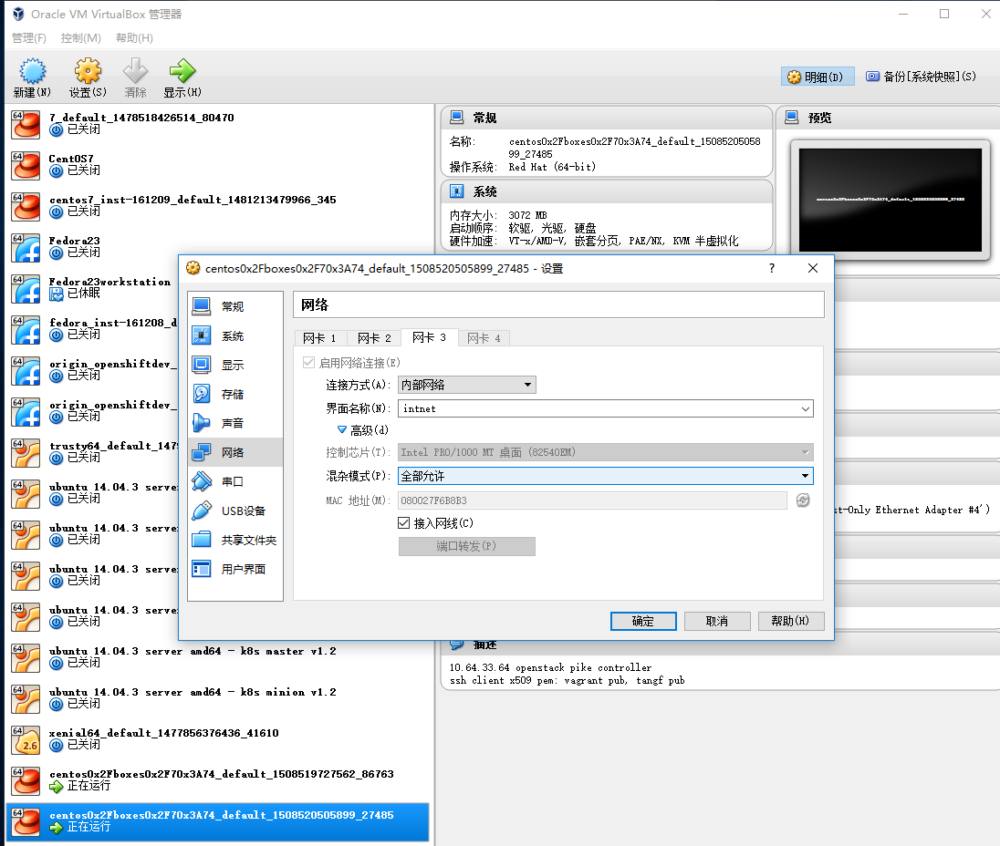

# OpenStack Pike Installation － 创建虚拟机步骤

## Table of contents

控制节点
* 确认环境
* [套餐](#flavor)
* [公私钥](#keypair)
* [安全组](#security-grup)
* [准备虚拟网络](#dhcp-networking)
* [创建虚拟网络](#provider-network)
* [创建虚拟机](#launch)

计算节点
* [iproute2调试](#vm-networking)
* [arp和virsh调试][#debug]

虚拟机如何从DHCP服务器正常获取IP地址
* [在VirtualBox中开启混杂模式](#promiscuous)

## Controller

参考[Launch an instance](https://docs.openstack.org/install-guide/launch-instance.html)
```
[vagrant@controller-10-64-33-64 ~]$ . admin-openrc 
```

### 确认环境

Nova services
```
[vagrant@controller-10-64-33-64 ~]$ openstack compute service list
+----+------------------+------------------------+----------+---------+-------+----------------------------+
| ID | Binary           | Host                   | Zone     | Status  | State | Updated At                 |
+----+------------------+------------------------+----------+---------+-------+----------------------------+
|  7 | nova-compute     | compute-10-64-33-65    | nova     | enabled | up    | 2017-10-28T09:00:01.000000 |
|  8 | nova-consoleauth | controller-10-64-33-64 | internal | enabled | up    | 2017-10-28T09:00:00.000000 |
|  9 | nova-conductor   | controller-10-64-33-64 | internal | enabled | up    | 2017-10-28T09:00:08.000000 |
| 10 | nova-scheduler   | controller-10-64-33-64 | internal | enabled | up    | 2017-10-28T09:00:08.000000 |
+----+------------------+------------------------+----------+---------+-------+----------------------------+
```

Nova Controller
```
[vagrant@controller-10-64-33-64 ~]$ sudo nova-status upgrade check
+---------------------------+
| Upgrade Check Results     |
+---------------------------+
| Check: Cells v2           |
| Result: Success           |
| Details: None             |
+---------------------------+
| Check: Placement API      |
| Result: Success           |
| Details: None             |
+---------------------------+
| Check: Resource Providers |
| Result: Success           |
| Details: None             |
+---------------------------+
```

Neutron controller
```
[vagrant@controller-10-64-33-64 ~]$ openstack network agent list
+--------------------------------------+--------------------+------------------------+-------------------+-------+-------+---------------------------+
| ID                                   | Agent Type         | Host                   | Availability Zone | Alive | State | Binary                    |
+--------------------------------------+--------------------+------------------------+-------------------+-------+-------+---------------------------+
| 321066aa-bf65-4c43-9b3a-9994d97530b7 | Metadata agent     | controller-10-64-33-64 | None              | :-)   | UP    | neutron-metadata-agent    |
| 5ac11672-2f43-4504-a0c5-07d43f24b818 | DHCP agent         | controller-10-64-33-64 | nova              | :-)   | UP    | neutron-dhcp-agent        |
| a69362b5-9511-4e37-9c98-75babbf5ca2f | Linux bridge agent | compute-10-64-33-65    | None              | :-)   | UP    | neutron-linuxbridge-agent |
| b6e0c38b-fa23-4ad8-b42f-280aa600783d | Linux bridge agent | controller-10-64-33-64 | None              | :-)   | UP    | neutron-linuxbridge-agent |
+--------------------------------------+--------------------+------------------------+-------------------+-------+-------+---------------------------+
```

### Flavor

create
```
[vagrant@controller-10-64-33-64 ~]$ openstack flavor create --id 0 --vcpus 1 --ram 64 --disk 1 m1.nano
+----------------------------+---------+
| Field                      | Value   |
+----------------------------+---------+
| OS-FLV-DISABLED:disabled   | False   |
| OS-FLV-EXT-DATA:ephemeral  | 0       |
| disk                       | 1       |
| id                         | 0       |
| name                       | m1.nano |
| os-flavor-access:is_public | True    |
| properties                 |         |
| ram                        | 64      |
| rxtx_factor                | 1.0     |
| swap                       |         |
| vcpus                      | 1       |
+----------------------------+---------+
```

### Keypair

参考 https://docs.openstack.org/install-guide/launch-instance.html#generate-a-key-pair
```
[vagrant@controller-10-64-33-64 ~]$ openstack keypair list
```

### Security Group

Default
```
[vagrant@controller-10-64-33-64 ~]$ openstack security group list
+--------------------------------------+---------+------------------------+----------------------------------+
| ID                                   | Name    | Description            | Project                          |
+--------------------------------------+---------+------------------------+----------------------------------+
| a29a8bda-173d-4785-802f-fdb4e2a19664 | default | Default security group | a0be38aef8c74d4abca3e4e100ee7910 |
+--------------------------------------+---------+------------------------+----------------------------------+
```

```
[vagrant@controller-10-64-33-64 ~]$ openstack security group rule list --long default
+--------------------------------------+-------------+----------+------------+-----------+-----------+--------------------------------------+
| ID                                   | IP Protocol | IP Range | Port Range | Direction | Ethertype | Remote Security Group                |
+--------------------------------------+-------------+----------+------------+-----------+-----------+--------------------------------------+
| 40484746-2f04-4d5a-88f8-7f9a99370fab | None        | None     |            | ingress   | IPv4      | a29a8bda-173d-4785-802f-fdb4e2a19664 |
| 56745761-72d9-4df4-8951-9d0813cf3d89 | None        | None     |            | ingress   | IPv6      | a29a8bda-173d-4785-802f-fdb4e2a19664 |
| af5511c6-f631-48cc-8312-33fc931d84b1 | None        | None     |            | egress    | IPv4      | None                                 |
| b47af435-ca45-434f-aff7-7f47d7ac196a | None        | None     |            | egress    | IPv6      | None                                 |
+--------------------------------------+-------------+----------+------------+-----------+-----------+--------------------------------------+
```

ICMP
```
[vagrant@controller-10-64-33-64 ~]$ openstack security group rule create --proto icmp default
+-------------------+--------------------------------------+
| Field             | Value                                |
+-------------------+--------------------------------------+
| created_at        | 2017-10-28T10:04:41Z                 |
| description       |                                      |
| direction         | ingress                              |
| ether_type        | IPv4                                 |
| id                | b6475d58-130c-429f-ad44-55b56d65acfa |
| name              | None                                 |
| port_range_max    | None                                 |
| port_range_min    | None                                 |
| project_id        | a0be38aef8c74d4abca3e4e100ee7910     |
| protocol          | icmp                                 |
| remote_group_id   | None                                 |
| remote_ip_prefix  | 0.0.0.0/0                            |
| revision_number   | 0                                    |
| security_group_id | a29a8bda-173d-4785-802f-fdb4e2a19664 |
| updated_at        | 2017-10-28T10:04:41Z                 |
+-------------------+--------------------------------------+
```

SSH
```
[vagrant@controller-10-64-33-64 ~]$ openstack security group rule create --proto tcp --dst-port 22 default
+-------------------+--------------------------------------+
| Field             | Value                                |
+-------------------+--------------------------------------+
| created_at        | 2017-10-28T10:05:23Z                 |
| description       |                                      |
| direction         | ingress                              |
| ether_type        | IPv4                                 |
| id                | 5eeffc99-708a-401a-951b-4092d7a8506f |
| name              | None                                 |
| port_range_max    | 22                                   |
| port_range_min    | 22                                   |
| project_id        | a0be38aef8c74d4abca3e4e100ee7910     |
| protocol          | tcp                                  |
| remote_group_id   | None                                 |
| remote_ip_prefix  | 0.0.0.0/0                            |
| revision_number   | 0                                    |
| security_group_id | a29a8bda-173d-4785-802f-fdb4e2a19664 |
| updated_at        | 2017-10-28T10:05:23Z                 |
+-------------------+--------------------------------------+
```

### Image

Cirros
```
[vagrant@controller-10-64-33-64 ~]$ openstack image list
+--------------------------------------+--------+--------+
| ID                                   | Name   | Status |
+--------------------------------------+--------+--------+
| 40d37d6a-2dba-4323-b648-e806f3acb857 | cirros | active |
+--------------------------------------+--------+--------+
```

### DHCP Networking

混杂（promiscuous）模式?

controller node
```
[vagrant@controller-10-64-33-64 ~]$ sudo ls /etc/sysconfig/network-scripts/ifcfg-*
/etc/sysconfig/network-scripts/ifcfg-eth0  /etc/sysconfig/network-scripts/ifcfg-lo
/etc/sysconfig/network-scripts/ifcfg-eth2  /etc/sysconfig/network-scripts/ifcfg-Wired_connection_1
[vagrant@controller-10-64-33-64 ~]$ sudo cat /etc/sysconfig/network-scripts/ifcfg-eth2
DEVICE=eth2
TYPE=Ethernet
ONBOOT=yes
BOOTPROTO=none
[vagrant@controller-10-64-33-64 ~]$ sudo nmcli c load /etc/sysconfig/network-scripts/ifcfg-eth2
[vagrant@controller-10-64-33-64 ~]$ sudo nmcli c reload
[vagrant@controller-10-64-33-64 ~]$ sudo nmcli c show
NAME                UUID                                  TYPE            DEVICE 
System eth0         5fb06bd0-0bb0-7ffb-45f1-d6edd65f3e03  802-3-ethernet  eth0   
System eth2         3a73717e-65ab-93e8-b518-24f5af32dc0d  802-3-ethernet  eth2   
Wired connection 1  3c55af49-6222-3b6b-b91d-eb1b82b6005e  802-3-ethernet  eth1   
[vagrant@controller-10-64-33-64 ~]$ sudo nmcli d status
DEVICE  TYPE      STATE      CONNECTION         
eth0    ethernet  connected  System eth0        
eth1    ethernet  connected  Wired connection 1 
eth2    ethernet  connected  System eth2        
lo      loopback  unmanaged  --                 
```

```
[vagrant@controller-10-64-33-64 ~]$ ip a show eth2
4: eth2: <BROADCAST,MULTICAST,UP,LOWER_UP> mtu 1500 qdisc pfifo_fast state UP qlen 1000
    link/ether 08:00:27:f6:b8:b3 brd ff:ff:ff:ff:ff:ff
    inet6 fe80::a00:27ff:fef6:b8b3/64 scope link 
       valid_lft forever preferred_lft forever
```

compute node
```
[vagrant@compute-10-64-33-65 ~]$ sudo nmcli d set eth2 managed no
[vagrant@compute-10-64-33-65 ~]$ sudo nmcli d status
DEVICE  TYPE      STATE      CONNECTION         
eth0    ethernet  connected  System eth0        
eth1    ethernet  connected  Wired connection 1 
eth2    ethernet  unmanaged  --                 
lo      loopback  unmanaged  --                 
[vagrant@compute-10-64-33-65 ~]$ sudo nmcli c show
NAME                UUID                                  TYPE            DEVICE 
System eth0         5fb06bd0-0bb0-7ffb-45f1-d6edd65f3e03  802-3-ethernet  eth0   
Wired connection 1  0ab4e0ff-f77e-3886-9ba9-1838e4120850  802-3-ethernet  eth1   
System eth2         3a73717e-65ab-93e8-b518-24f5af32dc0d  802-3-ethernet  --     
[vagrant@compute-10-64-33-65 ~]$ sudo nmcli d set eth2 autoconnect yes
[vagrant@compute-10-64-33-65 ~]$ sudo nmcli d 
DEVICE  TYPE      STATE      CONNECTION         
eth0    ethernet  connected  System eth0        
eth1    ethernet  connected  Wired connection 1 
eth2    ethernet  unmanaged  --                 
lo      loopback  unmanaged  --                 
[vagrant@compute-10-64-33-65 ~]$ sudo nmcli c
NAME                UUID                                  TYPE            DEVICE 
System eth0         5fb06bd0-0bb0-7ffb-45f1-d6edd65f3e03  802-3-ethernet  eth0   
Wired connection 1  0ab4e0ff-f77e-3886-9ba9-1838e4120850  802-3-ethernet  eth1   
System eth2         3a73717e-65ab-93e8-b518-24f5af32dc0d  802-3-ethernet  --     
```

### Provider Network

Create (参考 https://docs.openstack.org/install-guide/launch-instance-networks-provider.html)
```
[vagrant@controller-10-64-33-64 ~]$ sudo cat /etc/neutron/plugin.ini | egrep '^[^#]'
[DEFAULT]
[ml2]
type_drivers=flat,vlan
tenant_network_types=
mechanism_drivers=linuxbridge
extension_drivers=port_security
[ml2_type_flat]
flat_networks=provider
[ml2_type_geneve]
[ml2_type_gre]
[ml2_type_vlan]
[ml2_type_vxlan]
[securitygroup]
enable_ipset=true
```

通过默认路由可达桥接网络的VirtualBox主机和网关，但不在L2内
```
[vagrant@controller-10-64-33-64 ~]$ ip r
default via 10.0.2.2 dev eth0 proto static metric 100 
10.0.2.0/24 dev eth0 proto kernel scope link src 10.0.2.15 metric 100 
10.64.33.0/24 dev eth1 proto kernel scope link src 10.64.33.64 metric 100 
[vagrant@controller-10-64-33-64 ~]$ ping -c3 192.168.1.1
PING 192.168.1.1 (192.168.1.1) 56(84) bytes of data.
64 bytes from 192.168.1.1: icmp_seq=1 ttl=63 time=2.57 ms
64 bytes from 192.168.1.1: icmp_seq=2 ttl=63 time=1.71 ms
64 bytes from 192.168.1.1: icmp_seq=3 ttl=63 time=1.67 ms

--- 192.168.1.1 ping statistics ---
3 packets transmitted, 3 received, 0% packet loss, time 2004ms
rtt min/avg/max/mdev = 1.672/1.984/2.570/0.416 ms
[vagrant@controller-10-64-33-64 ~]$ ping -c3 192.168.1.100
PING 192.168.1.100 (192.168.1.100) 56(84) bytes of data.
64 bytes from 192.168.1.100: icmp_seq=1 ttl=127 time=1.46 ms
64 bytes from 192.168.1.100: icmp_seq=2 ttl=127 time=1.15 ms
64 bytes from 192.168.1.100: icmp_seq=3 ttl=127 time=1.02 ms

--- 192.168.1.100 ping statistics ---
3 packets transmitted, 3 received, 0% packet loss, time 2002ms
rtt min/avg/max/mdev = 1.027/1.215/1.467/0.185 ms
[vagrant@controller-10-64-33-64 ~]$ arp -n
Address                  HWtype  HWaddress           Flags Mask            Iface
10.64.33.1               ether   0a:00:27:00:00:17   C                     eth1
10.0.2.2                 ether   52:54:00:12:35:02   C                     eth0
10.64.33.65              ether   08:00:27:b4:e4:88   C                     eth1
10.0.2.3                 ether   52:54:00:12:35:03   C                     eth0
```

```
[vagrant@controller-10-64-33-64 ~]$ openstack network create --share --external --provider-physical-network provider --provider-network-type flat provider1
+---------------------------+--------------------------------------+
| Field                     | Value                                |
+---------------------------+--------------------------------------+
| admin_state_up            | UP                                   |
| availability_zone_hints   |                                      |
| availability_zones        |                                      |
| created_at                | 2017-10-29T00:38:09Z                 |
| description               |                                      |
| dns_domain                | None                                 |
| id                        | 59fe11c2-2131-4a9b-b708-e855c3c6ac25 |
| ipv4_address_scope        | None                                 |
| ipv6_address_scope        | None                                 |
| is_default                | None                                 |
| is_vlan_transparent       | None                                 |
| mtu                       | 1500                                 |
| name                      | provider1                            |
| port_security_enabled     | True                                 |
| project_id                | a0be38aef8c74d4abca3e4e100ee7910     |
| provider:network_type     | flat                                 |
| provider:physical_network | provider                             |
| provider:segmentation_id  | None                                 |
| qos_policy_id             | None                                 |
| revision_number           | 3                                    |
| router:external           | External                             |
| segments                  | None                                 |
| shared                    | True                                 |
| status                    | ACTIVE                               |
| subnets                   |                                      |
| tags                      |                                      |
| updated_at                | 2017-10-29T00:38:09Z                 |
+---------------------------+--------------------------------------+
```

```
[vagrant@controller-10-64-33-64 ~]$ openstack subnet create --network provider1 --allocation-pool start=192.168.31.140,end=192.168.31.190 --gateway none --subnet-range 192.168.31.128/26 provider1-subnet1
+-------------------------+--------------------------------------+
| Field                   | Value                                |
+-------------------------+--------------------------------------+
| allocation_pools        | 192.168.31.140-192.168.31.190        |
| cidr                    | 192.168.31.128/26                    |
| created_at              | 2017-10-29T11:12:36Z                 |
| description             |                                      |
| dns_nameservers         |                                      |
| enable_dhcp             | True                                 |
| gateway_ip              | None                                 |
| host_routes             |                                      |
| id                      | dac2bd1c-6c38-48ee-bdc8-472a63f78553 |
| ip_version              | 4                                    |
| ipv6_address_mode       | None                                 |
| ipv6_ra_mode            | None                                 |
| name                    | provider1-subnet1                    |
| network_id              | 59fe11c2-2131-4a9b-b708-e855c3c6ac25 |
| project_id              | a0be38aef8c74d4abca3e4e100ee7910     |
| revision_number         | 0                                    |
| segment_id              | None                                 |
| service_types           |                                      |
| subnetpool_id           | None                                 |
| tags                    |                                      |
| updated_at              | 2017-10-29T11:12:36Z                 |
| use_default_subnet_pool | None                                 |
+-------------------------+--------------------------------------+
```

```
[vagrant@controller-10-64-33-64 ~]$ ps -ef | grep dns
nobody    2885     1  0 11:12 ?        00:00:00 dnsmasq --no-hosts --no-resolv --strict-order --except-interface=lo --pid-file=/var/lib/neutron/dhcp/59fe11c2-2131-4a9b-b708-e855c3c6ac25/pid --dhcp-hostsfile=/var/lib/neutron/dhcp/59fe11c2-2131-4a9b-b708-e855c3c6ac25/host --addn-hosts=/var/lib/neutron/dhcp/59fe11c2-2131-4a9b-b708-e855c3c6ac25/addn_hosts --dhcp-optsfile=/var/lib/neutron/dhcp/59fe11c2-2131-4a9b-b708-e855c3c6ac25/opts --dhcp-leasefile=/var/lib/neutron/dhcp/59fe11c2-2131-4a9b-b708-e855c3c6ac25/leases --dhcp-match=set:ipxe,175 --bind-interfaces --interface=ns-c4715845-e1 --dhcp-range=set:tag0,192.168.31.128,static,255.255.255.192,86400s --dhcp-option-force=option:mtu,1500 --dhcp-lease-max=64 --conf-file= --domain=openstacklocal
vagrant  27395 24923  0 01:34 pts/0    00:00:00 grep --color=auto dns
```

```
[vagrant@controller-10-64-33-64 ~]$ brctl show
bridge name	bridge id		STP enabled	interfaces
brq59fe11c2-21		8000.080027f6b8b3	no		eth2
							tapc4715845-e1
```

```
[vagrant@controller-10-64-33-64 ~]$ ip a show brq59fe11c2-21
13: brq59fe11c2-21: <BROADCAST,MULTICAST,UP,LOWER_UP> mtu 1500 qdisc noqueue state UP qlen 1000
    link/ether 08:00:27:f6:b8:b3 brd ff:ff:ff:ff:ff:ff
    inet6 fe80::a064:c9ff:fedf:25b4/64 scope link 
       valid_lft forever preferred_lft forever
```

```
[vagrant@controller-10-64-33-64 ~]$ ip a show tapc4715845-e1
8: tapc4715845-e1@if2: <BROADCAST,MULTICAST,UP,LOWER_UP> mtu 1500 qdisc noqueue master brq59fe11c2-21 state UP qlen 1000
    link/ether 02:8f:da:26:d4:73 brd ff:ff:ff:ff:ff:ff link-netnsid 0
```

```
[vagrant@controller-10-64-33-64 ~]$ ip netns
qdhcp-59fe11c2-2131-4a9b-b708-e855c3c6ac25 (id: 0)
```

```
[vagrant@controller-10-64-33-64 ~]$ sudo ip netns exec qdhcp-59fe11c2-2131-4a9b-b708-e855c3c6ac25 ip a
1: lo: <LOOPBACK,UP,LOWER_UP> mtu 65536 qdisc noqueue state UNKNOWN qlen 1
    link/loopback 00:00:00:00:00:00 brd 00:00:00:00:00:00
    inet 127.0.0.1/8 scope host lo
       valid_lft forever preferred_lft forever
    inet6 ::1/128 scope host 
       valid_lft forever preferred_lft forever
2: ns-c4715845-e1@if8: <BROADCAST,MULTICAST,UP,LOWER_UP> mtu 1500 qdisc noqueue state UP qlen 1000
    link/ether fa:16:3e:86:51:96 brd ff:ff:ff:ff:ff:ff link-netnsid 0
    inet 192.168.31.140/26 brd 192.168.31.191 scope global ns-c4715845-e1
       valid_lft forever preferred_lft forever
    inet 169.254.169.254/16 brd 169.254.255.255 scope global ns-c4715845-e1
       valid_lft forever preferred_lft forever
    inet6 fe80::f816:3eff:fe86:5196/64 scope link 
       valid_lft forever preferred_lft forever
```

```
[vagrant@controller-10-64-33-64 ~]$ sudo ip netns exec qdhcp-59fe11c2-2131-4a9b-b708-e855c3c6ac25 ip r
169.254.0.0/16 dev ns-c4715845-e1 proto kernel scope link src 169.254.169.254 
192.168.31.128/26 dev ns-c4715845-e1 proto kernel scope link src 192.168.31.140 
```

由于没有路由
```
[vagrant@controller-10-64-33-64 ~]$ ping -c3 192.168.31.140
PING 192.168.31.140 (192.168.31.140) 56(84) bytes of data.

--- 192.168.31.140 ping statistics ---
3 packets transmitted, 0 received, 100% packet loss, time 1999ms

```

为bridge配置ip地址作为provider网关
```
[vagrant@controller-10-64-33-64 ~]$ sudo ip a add 192.168.31.1/24 dev brq59fe11c2-21
```

Or
```
[vagrant@controller-10-64-33-64 ~]$ sudo ip r add 192.168.31.0/24 dev brq59fe11c2-21
```

```
[vagrant@controller-10-64-33-64 ~]$ ip r
default via 10.0.2.2 dev eth0 proto static metric 100 
10.0.2.0/24 dev eth0 proto kernel scope link src 10.0.2.15 metric 100 
10.64.33.0/24 dev eth1 proto kernel scope link src 10.64.33.64 metric 100 
192.168.31.0/24 dev brq59fe11c2-21 proto kernel scope link src 192.168.31.1 
```

### Launch

Networking
```
[vagrant@controller-10-64-33-64 ~]$ openstack network list
+--------------------------------------+-----------+--------------------------------------+
| ID                                   | Name      | Subnets                              |
+--------------------------------------+-----------+--------------------------------------+
| 59fe11c2-2131-4a9b-b708-e855c3c6ac25 | provider1 | 90315432-195b-4334-8094-1f0228093c16 |
+--------------------------------------+-----------+--------------------------------------+
```

```
[vagrant@controller-10-64-33-64 ~]$ openstack subnet list
+--------------------------------------+-----------------+--------------------------------------+------------------+
| ID                                   | Name            | Network                              | Subnet           |
+--------------------------------------+-----------------+--------------------------------------+------------------+
| 90315432-195b-4334-8094-1f0228093c16 | provider1subnet | 59fe11c2-2131-4a9b-b708-e855c3c6ac25 | 192.168.31.64/27 |
+--------------------------------------+-----------------+--------------------------------------+------------------+
```

参考 https://docs.openstack.org/install-guide/launch-instance-provider.html
```
[vagrant@controller-10-64-33-64 ~]$ openstack server create --flavor m1.nano --image cirros --nic net-id=provider1 --security-group default cirros1-subnet1
+-------------------------------------+-----------------------------------------------+
| Field                               | Value                                         |
+-------------------------------------+-----------------------------------------------+
| OS-DCF:diskConfig                   | MANUAL                                        |
| OS-EXT-AZ:availability_zone         |                                               |
| OS-EXT-SRV-ATTR:host                | None                                          |
| OS-EXT-SRV-ATTR:hypervisor_hostname | None                                          |
| OS-EXT-SRV-ATTR:instance_name       |                                               |
| OS-EXT-STS:power_state              | NOSTATE                                       |
| OS-EXT-STS:task_state               | scheduling                                    |
| OS-EXT-STS:vm_state                 | building                                      |
| OS-SRV-USG:launched_at              | None                                          |
| OS-SRV-USG:terminated_at            | None                                          |
| accessIPv4                          |                                               |
| accessIPv6                          |                                               |
| addresses                           |                                               |
| adminPass                           | Pya3pB5tdFgy                                  |
| config_drive                        |                                               |
| created                             | 2017-10-29T11:37:19Z                          |
| flavor                              | m1.nano (0)                                   |
| hostId                              |                                               |
| id                                  | 3988a99e-42a3-4cd2-b02d-d016e8601195          |
| image                               | cirros (40d37d6a-2dba-4323-b648-e806f3acb857) |
| key_name                            | None                                          |
| name                                | cirros1-subnet1                               |
| progress                            | 0                                             |
| project_id                          | a0be38aef8c74d4abca3e4e100ee7910              |
| properties                          |                                               |
| security_groups                     | name='a29a8bda-173d-4785-802f-fdb4e2a19664'   |
| status                              | BUILD                                         |
| updated                             | 2017-10-29T11:37:20Z                          |
| user_id                             | 44e6ee1df8ae436986d2d50f7b358aa0              |
| volumes_attached                    |                                               |
+-------------------------------------+-----------------------------------------------+
```

```
[vagrant@controller-10-64-33-64 ~]$ openstack server list
+--------------------------------------+-----------------+--------+--------------------------+--------+---------+
| ID                                   | Name            | Status | Networks                 | Image  | Flavor  |
+--------------------------------------+-----------------+--------+--------------------------+--------+---------+
| 3988a99e-42a3-4cd2-b02d-d016e8601195 | cirros1-subnet1 | BUILD  | provider1=192.168.31.144 | cirros | m1.nano |
+--------------------------------------+-----------------+--------+--------------------------+--------+---------+
```

vnc
```
[vagrant@controller-10-64-33-64 ~]$ openstack console url show cirros1-subnet1
+-------+----------------------------------------------------------------------------------+
| Field | Value                                                                            |
+-------+----------------------------------------------------------------------------------+
| type  | novnc                                                                            |
| url   | http://10.64.33.64:6080/vnc_auto.html?token=82037e06-f393-4a2a-9641-ee79bb3c88af |
+-------+----------------------------------------------------------------------------------+
```

### Trial
```
[vagrant@controller-10-64-33-64 ~]$ sudo ip netns exec qdhcp-59fe11c2-2131-4a9b-b708-e855c3c6ac25 ping -c3 192.168.31.144
PING 192.168.31.144 (192.168.31.144) 56(84) bytes of data.
From 192.168.31.140 icmp_seq=1 Destination Host Unreachable
From 192.168.31.140 icmp_seq=2 Destination Host Unreachable
From 192.168.31.140 icmp_seq=3 Destination Host Unreachable

--- 192.168.31.144 ping statistics ---
3 packets transmitted, 0 received, +3 errors, 100% packet loss, time 1999ms
pipe 3
```

```
[vagrant@controller-10-64-33-64 ~]$ ping -c3 192.168.31.144
PING 192.168.31.144 (192.168.31.144) 56(84) bytes of data.

--- 192.168.31.144 ping statistics ---
3 packets transmitted, 0 received, 100% packet loss, time 2000ms

```

```
[vagrant@controller-10-64-33-64 ~]$ arping -I brq59fe11c2-21 -c3 192.168.31.70
ARPING 192.168.31.70 from 192.168.31.1 brq59fe11c2-21
Unicast reply from 192.168.31.70 [FA:16:3E:19:F7:3B]  0.719ms
Unicast reply from 192.168.31.70 [FA:16:3E:19:F7:3B]  0.546ms
Unicast reply from 192.168.31.70 [FA:16:3E:19:F7:3B]  0.570ms
Sent 3 probes (1 broadcast(s))
Received 3 response(s)
```

```
[vagrant@controller-10-64-33-64 ~]$ arp -n
Address                  HWtype  HWaddress           Flags Mask            Iface
10.64.33.1               ether   0a:00:27:00:00:17   C                     eth1
169.254.169.254          ether   fa:16:3e:19:f7:3b   C                     brq59fe11c2-21
10.0.2.2                 ether   52:54:00:12:35:02   C                     eth0
10.0.2.3                 ether   52:54:00:12:35:03   C                     eth0
192.168.31.70            ether   fa:16:3e:19:f7:3b   C                     brq59fe11c2-21
10.64.33.65              ether   08:00:27:b4:e4:88   C                     eth1
```

现在可到达netns了
```
[vagrant@controller-10-64-33-64 ~]$ ping -c3 192.168.31.70
PING 192.168.31.70 (192.168.31.70) 56(84) bytes of data.
64 bytes from 192.168.31.70: icmp_seq=1 ttl=64 time=0.058 ms
64 bytes from 192.168.31.70: icmp_seq=2 ttl=64 time=0.084 ms
64 bytes from 192.168.31.70: icmp_seq=3 ttl=64 time=0.088 ms

--- 192.168.31.70 ping statistics ---
3 packets transmitted, 3 received, 0% packet loss, time 1999ms
rtt min/avg/max/mdev = 0.058/0.076/0.088/0.016 ms
```

```
[vagrant@controller-10-64-33-64 ~]$ sudo ip netns exec qdhcp-59fe11c2-2131-4a9b-b708-e855c3c6ac25 arping -c3 192.168.31.1
ARPING 192.168.31.1 from 169.254.169.254 ns-8e7ff5b5-3f
Unicast reply from 192.168.31.1 [08:00:27:F6:B8:B3]  0.840ms
Unicast reply from 192.168.31.1 [08:00:27:F6:B8:B3]  0.569ms
Unicast reply from 192.168.31.1 [08:00:27:F6:B8:B3]  0.570ms
Sent 3 probes (1 broadcast(s))
Received 3 response(s)
```

```
[vagrant@controller-10-64-33-64 ~]$ sudo ip netns exec qdhcp-59fe11c2-2131-4a9b-b708-e855c3c6ac25 arp -n
Address                  HWtype  HWaddress           Flags Mask            Iface
192.168.31.1             ether   08:00:27:f6:b8:b3   C                     ns-8e7ff5b5-3f
```

等下在计算节点上也需要手动检查网络


## Compute

### VM networking

Environment
```
[vagrant@compute-10-64-33-65 ~]$ ls /var/lib/nova/instances/
90e44b5b-31d1-49f6-84ae-db0d85fdae7a  _base  compute_nodes  locks
```

```
[vagrant@compute-10-64-33-65 ~]$ brctl show
bridge name	bridge id		STP enabled	interfaces
brq59fe11c2-21		8000.0800275b61bc	no		eth2
							tap14d72434-b8
```

```
[vagrant@compute-10-64-33-65 ~]$ ip a show brq59fe11c2-21
7: brq59fe11c2-21: <BROADCAST,MULTICAST,UP,LOWER_UP> mtu 1500 qdisc noqueue state UP qlen 1000
    link/ether 08:00:27:5b:61:bc brd ff:ff:ff:ff:ff:ff
```

```
[vagrant@compute-10-64-33-65 ~]$ ip a show tap14d72434-b8
8: tap14d72434-b8: <BROADCAST,MULTICAST,UP,LOWER_UP> mtu 1500 qdisc pfifo_fast master brq59fe11c2-21 state UNKNOWN qlen 1000
    link/ether fe:16:3e:cd:96:47 brd ff:ff:ff:ff:ff:ff
    inet6 fe80::fc16:3eff:fecd:9647/64 scope link 
       valid_lft forever preferred_lft forever

```

```
[vagrant@compute-10-64-33-65 ~]$ sudo nmcli d
DEVICE          TYPE      STATE      CONNECTION         
brq59fe11c2-21  bridge    connected  brq59fe11c2-21     
eth0            ethernet  connected  System eth0        
eth1            ethernet  connected  Wired connection 1 
eth2            ethernet  connected  System eth2        
tap14d72434-b8  tun       connected  tap14d72434-b8     
lo              loopback  unmanaged  --                 
```

```
[vagrant@compute-10-64-33-65 ~]$ sudo nmcli d set eth2 managed no
[vagrant@compute-10-64-33-65 ~]$ sudo nmcli d set brq59fe11c2-21 managed no
[vagrant@compute-10-64-33-65 ~]$ sudo nmcli d set tap14d72434-b8 managed no
```

```
[vagrant@compute-10-64-33-65 ~]$ sudo ip a add 192.168.31.5/24 dev brq59fe11c2-21
[vagrant@compute-10-64-33-65 ~]$ sudo ip r add 192.168.31.0/24 dev brq59fe11c2-21
```

```
[vagrant@compute-10-64-33-65 ~]$ arping -I brq59fe11c2-21 -c3 192.168.31.1
ARPING 192.168.31.1 from 192.168.31.5 brq59fe11c2-21
Unicast reply from 192.168.31.1 [08:00:27:F6:B8:B3]  2.200ms
Unicast reply from 192.168.31.1 [08:00:27:F6:B8:B3]  0.722ms
Unicast reply from 192.168.31.1 [08:00:27:F6:B8:B3]  1.104ms
Sent 3 probes (1 broadcast(s))
Received 3 response(s)
[vagrant@compute-10-64-33-65 ~]$ arping -I brq59fe11c2-21 -c3 192.168.31.70
ARPING 192.168.31.70 from 192.168.31.5 brq59fe11c2-21
Unicast reply from 192.168.31.70 [FA:16:3E:19:F7:3B]  2.275ms
Sent 3 probes (1 broadcast(s))
Received 1 response(s)
[vagrant@compute-10-64-33-65 ~]$ arp -n
Address                  HWtype  HWaddress           Flags Mask            Iface
10.0.2.3                 ether   52:54:00:12:35:03   C                     eth0
192.168.31.70            ether   fa:16:3e:19:f7:3b   C                     brq59fe11c2-21
10.0.2.2                 ether   52:54:00:12:35:02   C                     eth0
192.168.31.1             ether   08:00:27:f6:b8:b3   C                     brq59fe11c2-21
192.168.31.74                    (incomplete)                              brq59fe11c2-21
10.64.33.1               ether   0a:00:27:00:00:17   C                     eth1
10.64.33.64              ether   08:00:27:68:ae:d9   C                     eth1
```

### debug

virsh
```
[vagrant@compute-10-64-33-65 ~]$ sudo virsh list
 Id    Name                           State
----------------------------------------------------
 2     instance-00000002              running
[vagrant@compute-10-64-33-65 ~]$ sudo virsh domiflist 2
Interface  Type       Source     Model       MAC
-------------------------------------------------------
tap14d72434-b8 bridge     brq59fe11c2-21 virtio      fa:16:3e:cd:96:47

[vagrant@compute-10-64-33-65 ~]$ sudo virsh domifaddr 2
 Name       MAC address          Protocol     Address
-------------------------------------------------------------------------------

[vagrant@compute-10-64-33-65 ~]$ sudo virsh domstate 2
running

[vagrant@compute-10-64-33-65 ~]$ sudo virsh domstats 2
Domain: 'instance-00000002'
  state.state=1
  state.reason=5
  cpu.time=95448760595
  cpu.user=30790000000
  cpu.system=1600000000
  balloon.current=65536
  balloon.maximum=65536
  balloon.last-update=0
  balloon.rss=233920
  vcpu.current=1
  vcpu.maximum=1
  net.count=1
  net.0.name=tap14d72434-b8
  net.0.rx.bytes=2058
  net.0.rx.pkts=39
  net.0.rx.errs=0
  net.0.rx.drop=0
  net.0.tx.bytes=2928
  net.0.tx.pkts=18
  net.0.tx.errs=0
  net.0.tx.drop=0
  block.count=1
  block.0.name=vda
  block.0.path=/var/lib/nova/instances/90e44b5b-31d1-49f6-84ae-db0d85fdae7a/disk
  block.0.rd.reqs=1997
  block.0.rd.bytes=40820736
  block.0.rd.times=12570091638
  block.0.wr.reqs=200
  block.0.wr.bytes=555008
  block.0.wr.times=1859711706
  block.0.fl.reqs=33
  block.0.fl.times=23235572
  block.0.allocation=2097152
  block.0.capacity=1073741824
  block.0.physical=2101248

```

按Eenter登录
```
[vagrant@compute-10-64-33-65 ~]$ sudo virsh console 2
Connected to domain instance-00000002
Escape character is ^]


login as 'cirros' user. default password: 'cubswin:)'. use 'sudo' for root.
cirros login: cirros
Password: 
$ ip a
1: lo: <LOOPBACK,UP,LOWER_UP> mtu 16436 qdisc noqueue 
    link/loopback 00:00:00:00:00:00 brd 00:00:00:00:00:00
    inet 127.0.0.1/8 scope host lo
    inet6 ::1/128 scope host 
       valid_lft forever preferred_lft forever
2: eth0: <BROADCAST,MULTICAST,UP,LOWER_UP> mtu 1500 qdisc pfifo_fast qlen 1000
    link/ether fa:16:3e:cd:96:47 brd ff:ff:ff:ff:ff:ff
    inet6 fe80::f816:3eff:fecd:9647/64 scope link 
       valid_lft forever preferred_lft forever
```

```
$ sudo cat /etc/network/interfaces
# Configure Loopback
auto lo
iface lo inet loopback

auto eth0
iface eth0 inet dhcp
```

```
$ sudo ip a add 192.168.31.74/27 dev eth0
```

```
$ sudo arping -c3 -I eth0 192.168.31.5
ARPING to 192.168.31.5 from 192.168.31.74 via eth0
Unicast reply from 192.168.31.5 [8:0:27:5b:61:bc] 1.065ms
Unicast reply from 192.168.31.5 [8:0:27:5b:61:bc] 0.378ms
Unicast reply from 192.168.31.5 [8:0:27:5b:61:bc] 1.476ms
Sent 3 probe(s) (1 broadcast(s))
Received 3 reply (0 request(s), 0 broadcast(s))
```

```
$ sudo ip r add default dev eth0
```

提示按ctrl-]退出
```
[vagrant@compute-10-64-33-65 ~]$ sudo arping -I brq59fe11c2-21 -c3 192.168.31.74
ARPING 192.168.31.74 from 192.168.31.5 brq59fe11c2-21
Unicast reply from 192.168.31.74 [FA:16:3E:CD:96:47]  0.939ms
Unicast reply from 192.168.31.74 [FA:16:3E:CD:96:47]  1.450ms
Unicast reply from 192.168.31.74 [FA:16:3E:CD:96:47]  0.763ms
Sent 3 probes (1 broadcast(s))
Received 3 response(s)
```

```
[vagrant@compute-10-64-33-65 ~]$ ssh cirros@192.168.31.74
The authenticity of host '192.168.31.74 (192.168.31.74)' can't be established.
RSA key fingerprint is SHA256:qd2kmEg0QvozmNOvQTSKKw1RYp70pNhKkGBun5V0vo0.
RSA key fingerprint is MD5:d5:7c:3d:15:7a:fc:22:e5:b8:04:21:a2:d1:1c:be:7d.
Are you sure you want to continue connecting (yes/no)? yes
Warning: Permanently added '192.168.31.74' (RSA) to the list of known hosts.
cirros@192.168.31.74's password: 
```

### scenario

re-create Bridged Network Subnet
```
[vagrant@controller-10-64-33-64 ~]$ openstack subnet create --network provider1 --no-dhcp --allocation-pool start=192.168.1.224,end=192.168.1.239 --dns-nameserver 8.8.4.4 --gateway 192.168.1.1 --subnet-range 192.168.1.0/24 provider1subnet1
+-------------------------+--------------------------------------+
| Field                   | Value                                |
+-------------------------+--------------------------------------+
| allocation_pools        | 192.168.1.224-192.168.1.239          |
| cidr                    | 192.168.1.0/24                       |
| created_at              | 2017-10-29T07:02:33Z                 |
| description             |                                      |
| dns_nameservers         | 8.8.4.4                              |
| enable_dhcp             | False                                |
| gateway_ip              | 192.168.1.1                          |
| host_routes             |                                      |
| id                      | 8e4f5983-1025-4cc2-9793-e553ef5d09a1 |
| ip_version              | 4                                    |
| ipv6_address_mode       | None                                 |
| ipv6_ra_mode            | None                                 |
| name                    | provider1subnet1                     |
| network_id              | 59fe11c2-2131-4a9b-b708-e855c3c6ac25 |
| project_id              | a0be38aef8c74d4abca3e4e100ee7910     |
| revision_number         | 0                                    |
| segment_id              | None                                 |
| service_types           |                                      |
| subnetpool_id           | None                                 |
| tags                    |                                      |
| updated_at              | 2017-10-29T07:02:33Z                 |
| use_default_subnet_pool | None                                 |
+-------------------------+--------------------------------------+
```

Trial
```
[vagrant@controller-10-64-33-64 ~]$ sudo systemctl restart neutron-linuxbridge-agent.service
[vagrant@controller-10-64-33-64 ~]$ sudo ps -ef | grep dns
vagrant   3667  2345  0 07:06 pts/0    00:00:00 grep --color=auto dns
[vagrant@controller-10-64-33-64 ~]$ ip netns
[vagrant@controller-10-64-33-64 ~]$ sudo nmcli c
NAME                UUID                                  TYPE            DEVICE         
System eth0         5fb06bd0-0bb0-7ffb-45f1-d6edd65f3e03  802-3-ethernet  eth0           
System eth2         3a73717e-65ab-93e8-b518-24f5af32dc0d  802-3-ethernet  eth2           
Wired connection 1  3c55af49-6222-3b6b-b91d-eb1b82b6005e  802-3-ethernet  eth1           
[vagrant@controller-10-64-33-64 ~]$ sudo systemctl restart neutron-linuxbridge-agent.service
[vagrant@controller-10-64-33-64 ~]$ sudo nmcli c
NAME                UUID                                  TYPE            DEVICE         
System eth0         5fb06bd0-0bb0-7ffb-45f1-d6edd65f3e03  802-3-ethernet  eth0           
System eth2         3a73717e-65ab-93e8-b518-24f5af32dc0d  802-3-ethernet  eth2           
Wired connection 1  3c55af49-6222-3b6b-b91d-eb1b82b6005e  802-3-ethernet  eth1           
[vagrant@controller-10-64-33-64 ~]$ brctl show
bridge name	bridge id		STP enabled	interfaces
```

Launch
```
[vagrant@controller-10-64-33-64 ~]$ openstack server create --flavor m1.nano --image cirros --nic net-id=provider1 --security-group default cirros1-subnet1
+-------------------------------------+-----------------------------------------------+
| Field                               | Value                                         |
+-------------------------------------+-----------------------------------------------+
| OS-DCF:diskConfig                   | MANUAL                                        |
| OS-EXT-AZ:availability_zone         |                                               |
| OS-EXT-SRV-ATTR:host                | None                                          |
| OS-EXT-SRV-ATTR:hypervisor_hostname | None                                          |
| OS-EXT-SRV-ATTR:instance_name       |                                               |
| OS-EXT-STS:power_state              | NOSTATE                                       |
| OS-EXT-STS:task_state               | scheduling                                    |
| OS-EXT-STS:vm_state                 | building                                      |
| OS-SRV-USG:launched_at              | None                                          |
| OS-SRV-USG:terminated_at            | None                                          |
| accessIPv4                          |                                               |
| accessIPv6                          |                                               |
| addresses                           |                                               |
| adminPass                           | o85cEeRkLKfi                                  |
| config_drive                        |                                               |
| created                             | 2017-10-29T07:12:14Z                          |
| flavor                              | m1.nano (0)                                   |
| hostId                              |                                               |
| id                                  | bcf57543-98f2-49e9-a085-44296b6bb0d9          |
| image                               | cirros (40d37d6a-2dba-4323-b648-e806f3acb857) |
| key_name                            | None                                          |
| name                                | cirros1-subnet1                               |
| progress                            | 0                                             |
| project_id                          | a0be38aef8c74d4abca3e4e100ee7910              |
| properties                          |                                               |
| security_groups                     | name='a29a8bda-173d-4785-802f-fdb4e2a19664'   |
| status                              | BUILD                                         |
| updated                             | 2017-10-29T07:12:14Z                          |
| user_id                             | 44e6ee1df8ae436986d2d50f7b358aa0              |
| volumes_attached                    |                                               |
+-------------------------------------+-----------------------------------------------+
```

```
[vagrant@controller-10-64-33-64 ~]$ openstack server show cirros1-subnet1
+-------------------------------------+----------------------------------------------------------+
| Field                               | Value                                                    |
+-------------------------------------+----------------------------------------------------------+
| OS-DCF:diskConfig                   | MANUAL                                                   |
| OS-EXT-AZ:availability_zone         | nova                                                     |
| OS-EXT-SRV-ATTR:host                | compute-10-64-33-65                                      |
| OS-EXT-SRV-ATTR:hypervisor_hostname | compute-10-64-33-65                                      |
| OS-EXT-SRV-ATTR:instance_name       | instance-00000004                                        |
| OS-EXT-STS:power_state              | Running                                                  |
| OS-EXT-STS:task_state               | None                                                     |
| OS-EXT-STS:vm_state                 | active                                                   |
| OS-SRV-USG:launched_at              | 2017-10-29T07:12:25.000000                               |
| OS-SRV-USG:terminated_at            | None                                                     |
| accessIPv4                          |                                                          |
| accessIPv6                          |                                                          |
| addresses                           | provider1=192.168.1.227                                  |
| config_drive                        |                                                          |
| created                             | 2017-10-29T07:12:14Z                                     |
| flavor                              | m1.nano (0)                                              |
| hostId                              | d125e66fc7aad7dd5517475e65a1190e1e9dcd68c44ddc8bc507eb50 |
| id                                  | bcf57543-98f2-49e9-a085-44296b6bb0d9                     |
| image                               | cirros (40d37d6a-2dba-4323-b648-e806f3acb857)            |
| key_name                            | None                                                     |
| name                                | cirros1-subnet1                                          |
| progress                            | 0                                                        |
| project_id                          | a0be38aef8c74d4abca3e4e100ee7910                         |
| properties                          |                                                          |
| security_groups                     | name='default'                                           |
| status                              | ACTIVE                                                   |
| updated                             | 2017-10-29T07:12:25Z                                     |
| user_id                             | 44e6ee1df8ae436986d2d50f7b358aa0                         |
| volumes_attached                    |                                                          |
+-------------------------------------+----------------------------------------------------------+
```

Compute node
```
[vagrant@compute-10-64-33-65 ~]$ brctl show
bridge name	bridge id		STP enabled	interfaces
brq59fe11c2-21		8000.0800275b61bc	no		eth2
							tap66fe3745-86
[vagrant@compute-10-64-33-65 ~]$ ip a show brq59fe11c2-21
7: brq59fe11c2-21: <BROADCAST,MULTICAST,UP,LOWER_UP> mtu 1500 qdisc noqueue state UP qlen 1000
    link/ether 08:00:27:5b:61:bc brd ff:ff:ff:ff:ff:ff
[vagrant@compute-10-64-33-65 ~]$ nmcli d
DEVICE          TYPE      STATE         CONNECTION         
eth0            ethernet  connected     System eth0        
eth1            ethernet  connected     Wired connection 1 
tap66fe3745-86  tun       disconnected  --                 
brq59fe11c2-21  bridge    unmanaged     --                 
eth2            ethernet  unmanaged     --                 
lo              loopback  unmanaged     --                 
```

Trial
```
[vagrant@compute-10-64-33-65 ~]$ sudo systemctl restart neutron-linuxbridge-agent.service
[vagrant@compute-10-64-33-65 ~]$ sudo systemctl restart openstack-nova-compute.service
```

Host route
```
[vagrant@compute-10-64-33-65 ~]$ sudo ip a add 192.168.1.65/24 dev brq59fe11c2-21
[vagrant@compute-10-64-33-65 ~]$ ip a show brq59fe11c2-21
7: brq59fe11c2-21: <BROADCAST,MULTICAST,UP,LOWER_UP> mtu 1500 qdisc noqueue state UP qlen 1000
    link/ether 08:00:27:5b:61:bc brd ff:ff:ff:ff:ff:ff
    inet 192.168.1.65/24 scope global brq59fe11c2-21
       valid_lft forever preferred_lft forever
[vagrant@compute-10-64-33-65 ~]$ ip r
default via 10.0.2.2 dev eth0 proto static metric 100 
10.0.2.0/24 dev eth0 proto kernel scope link src 10.0.2.15 metric 100 
10.64.33.0/24 dev eth1 proto kernel scope link src 10.64.33.65 metric 100 
192.168.1.0/24 dev brq59fe11c2-21 proto kernel scope link src 192.168.1.65 
[vagrant@compute-10-64-33-65 ~]$ arping -c3 192.168.1.100 -I brq59fe11c2-21
ARPING 192.168.1.100 from 192.168.1.65 brq59fe11c2-21
Sent 3 probes (3 broadcast(s))
Received 0 response(s)
[vagrant@compute-10-64-33-65 ~]$ arping -c3 192.168.1.1 -I brq59fe11c2-21
ARPING 192.168.1.1 from 192.168.1.65 brq59fe11c2-21
Sent 3 probes (3 broadcast(s))
Received 0 response(s)
```

## 运行

### promiscuous

由于本实现环境在virtual box下进行，eth2必须允许混杂模式（promiscuous）


重启controller节点, 启动之前创建的cirros
```
tangf@DESKTOP-H68OQDV ~
$ ssh vagrant@10.64.33.64
Last login: Tue Nov 14 20:34:34 2017 from 10.64.33.1
[vagrant@controller-10-64-33-64 ~]$ . admin-openrc 
[vagrant@controller-10-64-33-64 ~]$ openstack server list
+--------------------------------------+-----------------+---------+--------------------------+--------+---------+
| ID                                   | Name            | Status  | Networks                 | Image  | Flavor  |
+--------------------------------------+-----------------+---------+--------------------------+--------+---------+
| 3988a99e-42a3-4cd2-b02d-d016e8601195 | cirros1-subnet1 | SHUTOFF | provider1=192.168.31.144 | cirros | m1.nano |
+--------------------------------------+-----------------+---------+--------------------------+--------+---------+
[vagrant@controller-10-64-33-64 ~]$ openstack server start cirros1-subnet1
```

重启compute节点, 在openstack server start...命令后立即使用virsh
```
tangf@DESKTOP-H68OQDV ~
$ ssh -p 2522 vagrant@127.0.0.1
Last login: Tue Nov 14 20:31:38 2017 from 10.0.2.2
[vagrant@compute-10-64-33-65 ~]$ ip a
1: lo: <LOOPBACK,UP,LOWER_UP> mtu 65536 qdisc noqueue state UNKNOWN qlen 1
    link/loopback 00:00:00:00:00:00 brd 00:00:00:00:00:00
    inet 127.0.0.1/8 scope host lo
       valid_lft forever preferred_lft forever
    inet6 ::1/128 scope host 
       valid_lft forever preferred_lft forever
2: eth0: <BROADCAST,MULTICAST,UP,LOWER_UP> mtu 1500 qdisc pfifo_fast state UP qlen 1000
    link/ether 08:00:27:65:31:84 brd ff:ff:ff:ff:ff:ff
    inet 10.0.2.15/24 brd 10.0.2.255 scope global dynamic eth0
       valid_lft 86252sec preferred_lft 86252sec
    inet6 fe80::a00:27ff:fe65:3184/64 scope link 
       valid_lft forever preferred_lft forever
3: eth1: <BROADCAST,MULTICAST,UP,LOWER_UP> mtu 1500 qdisc pfifo_fast state UP qlen 1000
    link/ether 08:00:27:b4:e4:88 brd ff:ff:ff:ff:ff:ff
    inet 10.64.33.65/24 brd 10.64.33.255 scope global eth1
       valid_lft forever preferred_lft forever
    inet6 fe80::a00:27ff:feb4:e488/64 scope link 
       valid_lft forever preferred_lft forever
4: eth2: <BROADCAST,MULTICAST,UP,LOWER_UP> mtu 1500 qdisc pfifo_fast master brq59fe11c2-21 state UP qlen 1000
    link/ether 08:00:27:ec:96:c2 brd ff:ff:ff:ff:ff:ff
    inet6 fe80::a00:27ff:feec:96c2/64 scope link 
       valid_lft forever preferred_lft forever
5: brq59fe11c2-21: <BROADCAST,MULTICAST,UP,LOWER_UP> mtu 1500 qdisc noqueue state UP qlen 1000
    link/ether 08:00:27:ec:96:c2 brd ff:ff:ff:ff:ff:ff
    inet6 fe80::a00:27ff:feec:96c2/64 scope link 
       valid_lft forever preferred_lft forever
[vagrant@compute-10-64-33-65 ~]$ sudo virsh list
 Id    Name                           State
----------------------------------------------------
 1     instance-00000005              running

[vagrant@compute-10-64-33-65 ~]$ sudo virsh console 1
Connected to domain instance-00000005
Escape character is ^]
no results found for mode=local. up 3.72. searched: nocloud configdrive ec2
Starting network...
udhcpc (v1.20.1) started
Sending discover...
Sending select for 192.168.31.144...
Lease of 192.168.31.144 obtained, lease time 86400
cirros-ds 'net' up at 4.38
checking http://169.254.169.254/2009-04-04/instance-id
successful after 1/20 tries: up 4.51. iid=i-00000005
failed to get http://169.254.169.254/2009-04-04/meta-data/public-keys
warning: no ec2 metadata for public-keys
failed to get http://169.254.169.254/2009-04-04/user-data
warning: no ec2 metadata for user-data
found datasource (ec2, net)
Top of dropbear init script
Starting dropbear sshd: WARN: generating key of type ecdsa failed!
OK
/run/cirros/datasource/data/user-data was not '#!' or executable
=== system information ===
Platform: RDO OpenStack Compute
Container: none
Arch: x86_64
CPU(s): 1 @ 3392.162 MHz
Cores/Sockets/Threads: 1/1/1
Virt-type: AMD-V
RAM Size: 49MB
Disks:
NAME MAJ:MIN       SIZE LABEL         MOUNTPOINT
vda  253:0   1073741824               
vda1 253:1   1061061120 cirros-rootfs /
=== sshd host keys ===
-----BEGIN SSH HOST KEY KEYS-----
ssh-rsa AAAAB3NzaC1yc2EAAAADAQABAAAAgln8v5wTfblSJISzt7a5qW86pdQINBwceWwDVKdxF0O6KDstwBgbCZpg9PS2X8gEM2wpnCtzLkZcP+jMJCoFuwyQQWG8ZX7fFcyQJs8E7q8iZAMDHTHuvlV2UDknxwR52TM+AnAhelwd1xczej2+05NgKXggqNj7ZNre9ddgisBR7zM= root@cirros1-subnet1
ssh-dss AAAAB3NzaC1kc3MAAACBAL3bJ4WVn1N5nnKVKdhQf4z48Moki88rcC0lDP0bz3enDPAwIXMJ7M44KrAqSwVaoNTgbPr3ixqx3URnVbJTp8zXXPbUKeqqXNFY+d5XsV4QewnBdg9jbKyTzwTktwE7dxW5deYbPnLwOcpNfVVr9nDcJMwVmbb4HBhAsWGZQabPAAAAFQDlZKPgE9DYrAfjFh/e2N7gsi7FyQAAAIARgzQeu+FuP4JP2KTEL3ZoyBTNsDwelaVjZ+r0TQuwEcw9lOBp9RQ+N3/LK2jzzzKwRgW511kNkVz3IkRiMh7F9r9OPwJEwxscmtmmTyh3qEr6ypNsNWs6mJWGEnQ3/aBF1qqvkh2CMG4H4VkDucNkCq6pakmPcIqktJ4N2UmGeAAAAIAJQ/W5gRy3HeMLGkilxLrXlhOvMGAcaKtEogTnkExMpZqN+hamAPwp/ppzJBipKT5fYVnVJxAfrGmVz1FJjliJnX+R4d6Xp/OJTTL7c4QtalgNqgHovBGdvwB+fNwMErRJmDe66kw3eomVtOiNMXYpt30rWM8BrfpC8KgTss8AXw== root@cirros1-subnet1
-----END SSH HOST KEY KEYS-----
=== network info ===
if-info: lo,up,127.0.0.1,8,::1
if-info: eth0,up,192.168.31.144,26,fe80::f816:3eff:fe42:d9d6
ip-route:169.254.169.254 via 192.168.31.140 dev eth0 
ip-route:192.168.31.128/26 dev eth0  src 192.168.31.144 
=== datasource: ec2 net ===
instance-id: i-00000005
name: N/A
availability-zone: nova
local-hostname: cirros1-subnet1.novalocal
launch-index: 0
=== cirros: current=0.3.5 uptime=10.57 ===
=== pinging gateway failed, debugging connection ===
############ debug start ##############
### /etc/init.d/sshd start
Top of dropbear init script
Starting dropbear sshd: remove-dropbear-host-keys already run per instance
WARN: generating key of type ecdsa failed!
FAIL
### ifconfig -a
eth0      Link encap:Ethernet  HWaddr FA:16:3E:42:D9:D6  
          inet addr:192.168.31.144  Bcast:192.168.31.191  Mask:255.255.255.192
          inet6 addr: fe80::f816:3eff:fe42:d9d6/64 Scope:Link
          UP BROADCAST RUNNING MULTICAST  MTU:1500  Metric:1
          RX packets:56 errors:0 dropped:0 overruns:0 frame:0
          TX packets:97 errors:0 dropped:0 overruns:0 carrier:0
          collisions:0 txqueuelen:1000 
          RX bytes:6723 (6.5 KiB)  TX bytes:9766 (9.5 KiB)

lo        Link encap:Local Loopback  
          inet addr:127.0.0.1  Mask:255.0.0.0
          inet6 addr: ::1/128 Scope:Host
          UP LOOPBACK RUNNING  MTU:16436  Metric:1
          RX packets:0 errors:0 dropped:0 overruns:0 frame:0
          TX packets:0 errors:0 dropped:0 overruns:0 carrier:0
          collisions:0 txqueuelen:0 
          RX bytes:0 (0.0 B)  TX bytes:0 (0.0 B)

### route -n
Kernel IP routing table
Destination     Gateway         Genmask         Flags Metric Ref    Use Iface
169.254.169.254 192.168.31.140  255.255.255.255 UGH   0      0        0 eth0
192.168.31.128  0.0.0.0         255.255.255.192 U     0      0        0 eth0
### cat /etc/resolv.conf
search openstacklocal
nameserver 192.168.31.140
### gateway not found
### pinging nameservers
#### ping -c 5 192.168.31.140
PING 192.168.31.140 (192.168.31.140): 56 data bytes
64 bytes from 192.168.31.140: seq=0 ttl=64 time=21.901 ms
64 bytes from 192.168.31.140: seq=1 ttl=64 time=9.512 ms
64 bytes from 192.168.31.140: seq=2 ttl=64 time=2.792 ms
64 bytes from 192.168.31.140: seq=3 ttl=64 time=2.459 ms
64 bytes from 192.168.31.140: seq=4 ttl=64 time=2.962 ms

--- 192.168.31.140 ping statistics ---
5 packets transmitted, 5 packets received, 0% packet loss
round-trip min/avg/max = 2.459/7.925/21.901 ms
### uname -a
Linux cirros1-subnet1 3.2.0-80-virtual #116-Ubuntu SMP Mon Mar 23 17:28:52 UTC 2015 x86_64 GNU/Linux
### lsmod
Module                  Size  Used by    Not tainted
nls_iso8859_1          12713  0 
nls_cp437              16991  0 
vfat                   17585  0 
fat                    61512  1 vfat
isofs                  40259  0 
ip_tables              27473  0 
x_tables               29891  1 ip_tables
pcnet32                42119  0 
8139cp                 27360  0 
ne2k_pci               13691  0 
8390                   18856  1 ne2k_pci
e1000                 108589  0 
acpiphp                24231  0 
### dmesg | tail
[    2.992336] acpiphp: Slot [29] registered
[    2.992336] acpiphp: Slot [30] registered
[    2.992336] acpiphp: Slot [31] registered
[    3.028432] e1000: Intel(R) PRO/1000 Network Driver - version 7.3.21-k8-NAPI
[    3.028432] e1000: Copyright (c) 1999-2006 Intel Corporation.
[    3.051253] ne2k-pci.c:v1.03 9/22/2003 D. Becker/P. Gortmaker
[    3.069179] 8139cp: 8139cp: 10/100 PCI Ethernet driver v1.3 (Mar 22, 2004)
[    3.097224] pcnet32: pcnet32.c:v1.35 21.Apr.2008 tsbogend@alpha.franken.de
[    3.120074] ip_tables: (C) 2000-2006 Netfilter Core Team
[   14.658138] eth0: no IPv6 routers present
### tail -n 25 /var/log/messages
Nov 14 21:18:38 cirros kern.info kernel: [    2.992336] acpiphp: Slot [16] registered
Nov 14 21:18:38 cirros kern.info kernel: [    2.992336] acpiphp: Slot [17] registered
Nov 14 21:18:38 cirros kern.info kernel: [    2.992336] acpiphp: Slot [18] registered
Nov 14 21:18:38 cirros kern.info kernel: [    2.992336] acpiphp: Slot [19] registered
Nov 14 21:18:38 cirros kern.info kernel: [    2.992336] acpiphp: Slot [20] registered
Nov 14 21:18:38 cirros kern.info kernel: [    2.992336] acpiphp: Slot [21] registered
Nov 14 21:18:38 cirros kern.info kernel: [    2.992336] acpiphp: Slot [22] registered
Nov 14 21:18:38 cirros kern.info kernel: [    2.992336] acpiphp: Slot [23] registered
Nov 14 21:18:38 cirros kern.info kernel: [    2.992336] acpiphp: Slot [24] registered
Nov 14 21:18:38 cirros kern.info kernel: [    2.992336] acpiphp: Slot [25] registered
Nov 14 21:18:38 cirros kern.info kernel: [    2.992336] acpiphp: Slot [26] registered
Nov 14 21:18:38 cirros kern.info kernel: [    2.992336] acpiphp: Slot [27] registered
Nov 14 21:18:38 cirros kern.info kernel: [    2.992336] acpiphp: Slot [28] registered
Nov 14 21:18:38 cirros kern.info kernel: [    2.992336] acpiphp: Slot [29] registered
Nov 14 21:18:38 cirros kern.info kernel: [    2.992336] acpiphp: Slot [30] registered
Nov 14 21:18:38 cirros kern.info kernel: [    2.992336] acpiphp: Slot [31] registered
Nov 14 21:18:38 cirros kern.info kernel: [    3.028432] e1000: Intel(R) PRO/1000 Network Driver - version 7.3.21-k8-NAPI
Nov 14 21:18:38 cirros kern.info kernel: [    3.028432] e1000: Copyright (c) 1999-2006 Intel Corporation.
Nov 14 21:18:38 cirros kern.info kernel: [    3.051253] ne2k-pci.c:v1.03 9/22/2003 D. Becker/P. Gortmaker
Nov 14 21:18:38 cirros kern.info kernel: [    3.069179] 8139cp: 8139cp: 10/100 PCI Ethernet driver v1.3 (Mar 22, 2004)
Nov 14 21:18:38 cirros kern.info kernel: [    3.097224] pcnet32: pcnet32.c:v1.35 21.Apr.2008 tsbogend@alpha.franken.de
Nov 14 21:18:38 cirros kern.info kernel: [    3.120074] ip_tables: (C) 2000-2006 Netfilter Core Team
Nov 14 21:18:42 cirros auth.notice su: + /dev/console root:cirros
Nov 14 21:18:44 cirros authpriv.info dropbear[284]: Running in background
Nov 14 21:18:49 cirros kern.debug kernel: [   14.658138] eth0: no IPv6 routers present
############ debug end   ##############
  ____               ____  ____
 / __/ __ ____ ____ / __ \/ __/
/ /__ / // __// __// /_/ /\ \ 
\___//_//_/  /_/   \____/___/ 
   http://cirros-cloud.net


login as 'cirros' user. default password: 'cubswin:)'. use 'sudo' for root.
cirros1-subnet1 login: cirros
Password: 
$ ip a show eth0
2: eth0: <BROADCAST,MULTICAST,UP,LOWER_UP> mtu 1500 qdisc pfifo_fast qlen 1000
    link/ether fa:16:3e:42:d9:d6 brd ff:ff:ff:ff:ff:ff
    inet 192.168.31.144/26 brd 192.168.31.191 scope global eth0
    inet6 fe80::f816:3eff:fe42:d9d6/64 scope link 
       valid_lft forever preferred_lft forever
$ exit

login as 'cirros' user. default password: 'cubswin:)'. use 'sudo' for root.
cirros1-subnet1 login: 
```
按ctrl-]返回主机终端模式